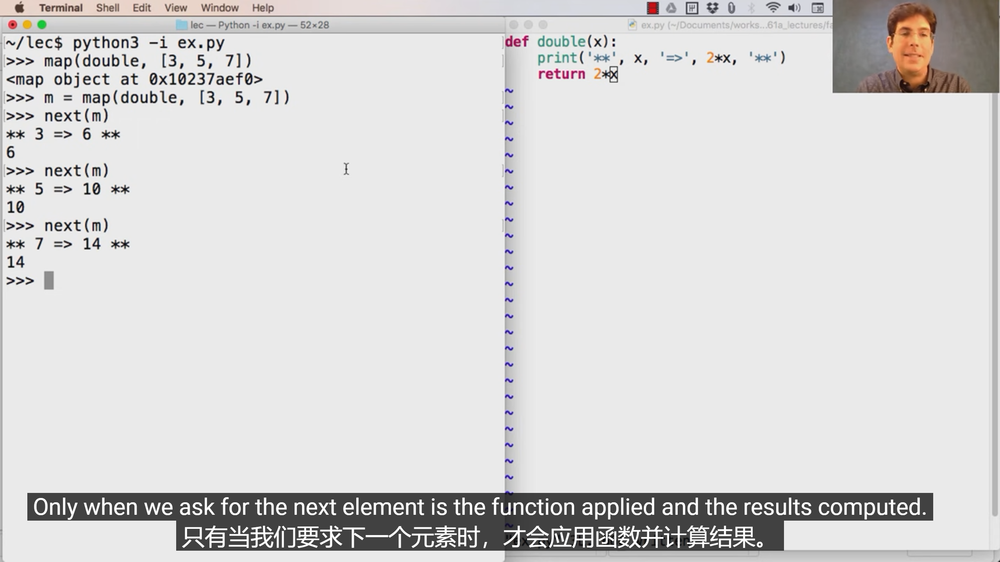

* python中的list可以存放不同类型的元素

* in 是一个运算符，可以用于判断list中是否含有某元素，但是它只能查找单个元素，不能查找子序列，也不能查找嵌套后的元素

  eg: a =[1,[[1,2]],3,4]

  \>>> [1,2] in a

  False

  \>>>[3,4] in a

  False

* range(m , n)左闭右开包含m不包含n

* 函数中的默认参数不是每次call都更新的，他是函数的一部分（近似static）

  

* python执行函数分三步：

  先评估function

  再评估operand

  最后call function
  
* python中不可以更改非本地变量，没有声明nonlocal，赋值语句默认左侧是本地变量

  一个处理方法是把这个变量变成单元素列表，就可以改变了

* 使用迭代器的时候，列表或者字典的大小不能改变，改变key对应的value或者key，不改变item的数量则可以

* 迭代器用一次for循环遍历到结尾，就没有元素了：

  

* Lazy computation：

  

* python和别的函数不同之处，python实例名.属性进行**赋值操作**，只能改变实例变量，但是可以通过这个寻找到类变量

  

* 多态函数，repr和str

   

* python中的特殊函数

  