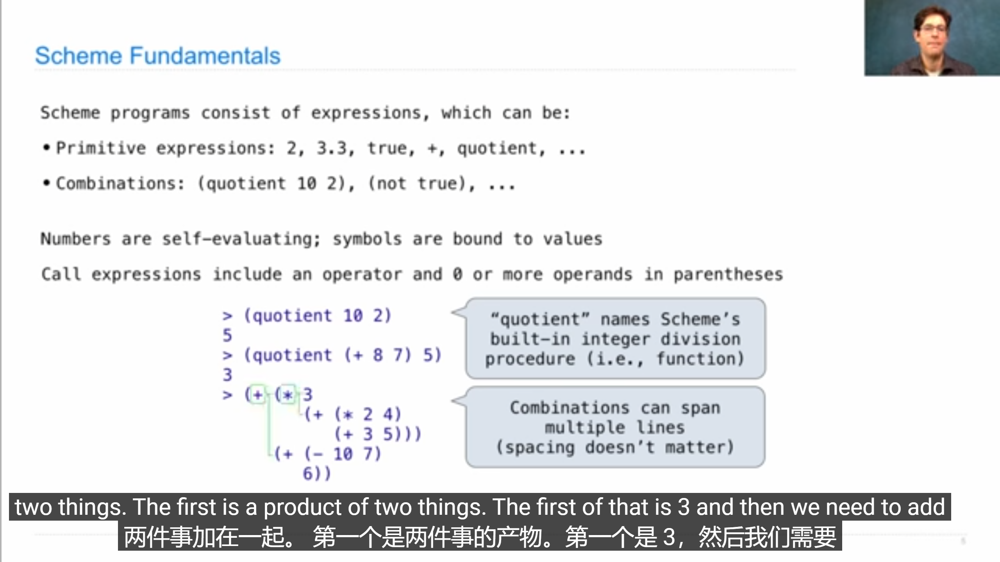
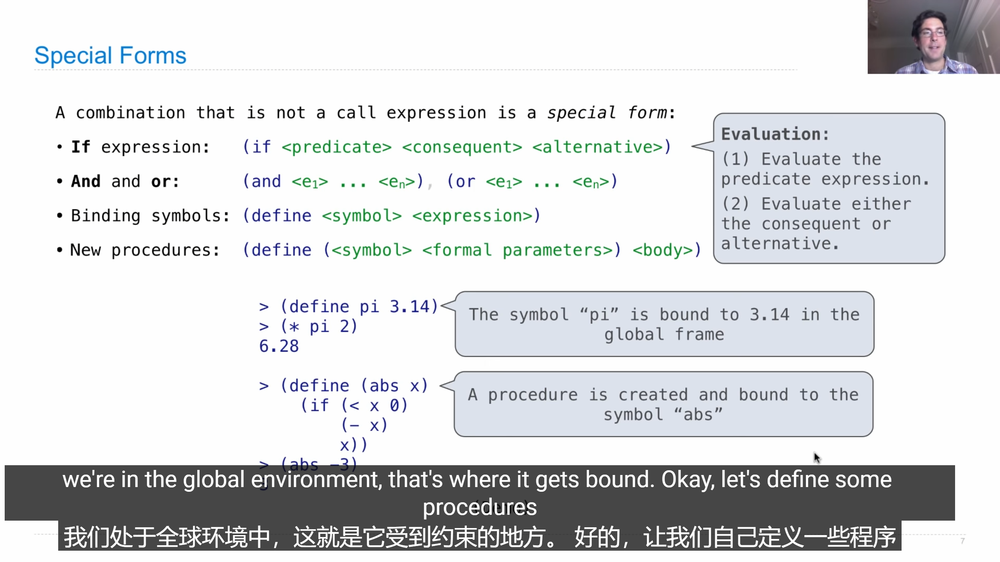
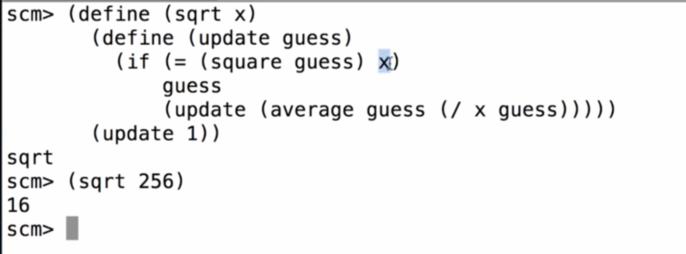
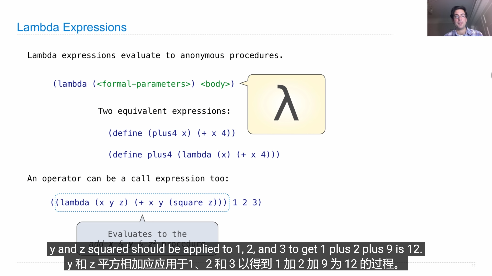
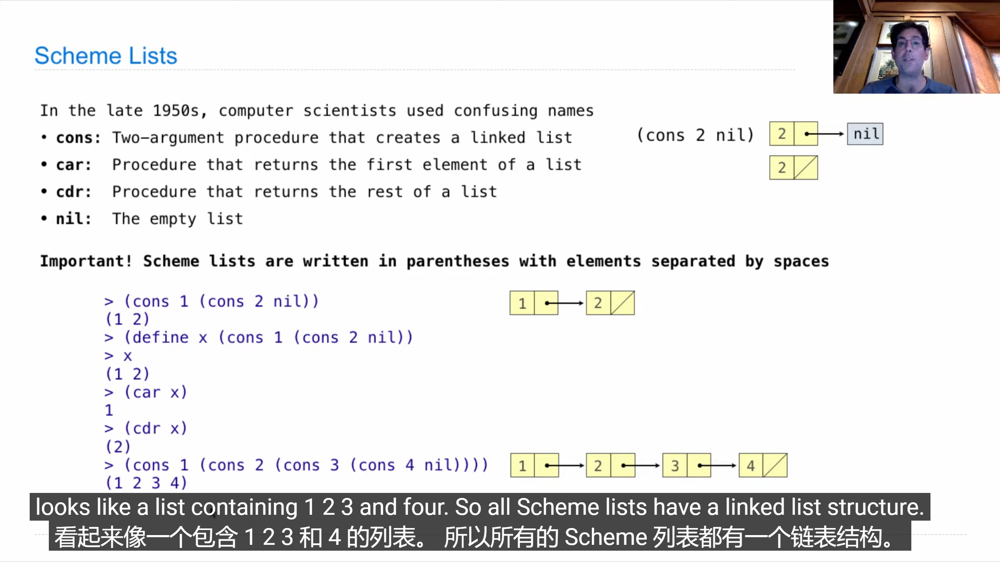
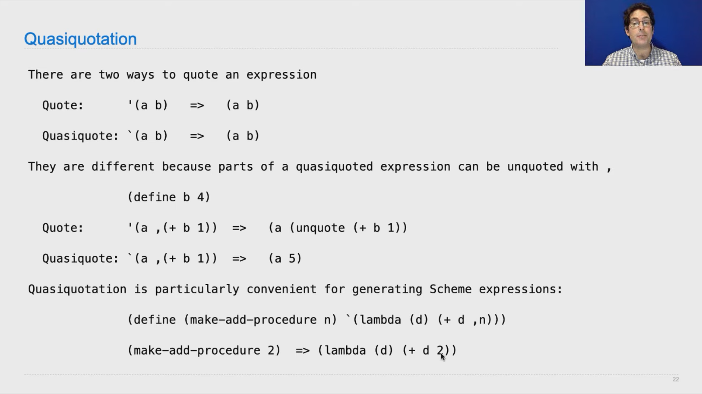
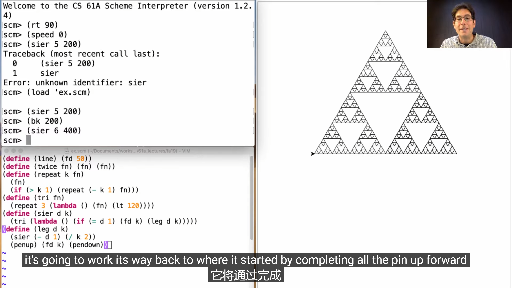
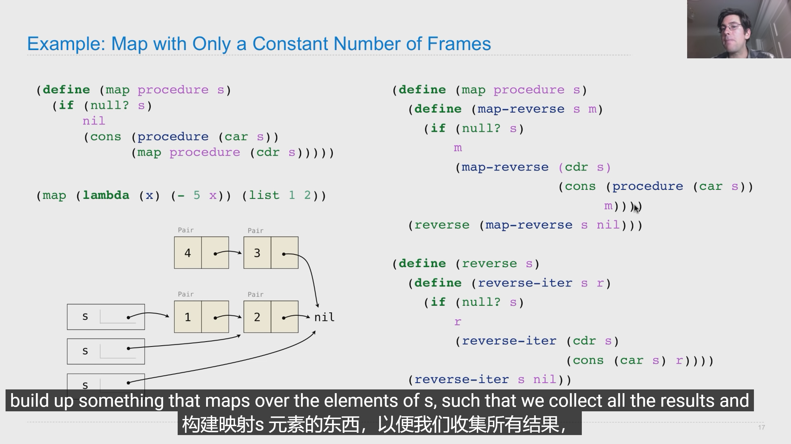

## 调用表达式

* 运算符和运算变量同在一个括号下面，有点像前缀表达式

  

* 一个运算符可以用很多次

  eg:

  (+ 1 2 3 4)

  10

## 特殊形式

 

## Lambda Expressions

### Lists

scheme中的list就像是python中的link list，它的结构是链表的，但是显示出来的是list形式

### Symbolic Programming

* 引用只需要在变量名前面加一个单引号 eg： ‘a或者加一个键盘左上角的·

* 解引用：在变量名之前加一个逗号，只能用于准引用（键盘左上角的）

  

* 对list 进行引用会得到list本身

  eg：

  ’（a 1）

  (a 1)

## Map and Reduce

