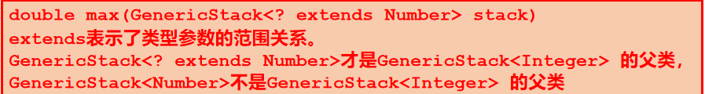

## 基本语法

* 4.3中规范字符串和常量池，区分字符串在常量池还是在堆里面
* String类对象的内容不可用修改，但是可以改变引用对象
* StringBuilder修改缓冲区是同步的，适合多线程，StringBuilder和StringBuffer都可以修改内容
* 可变内容字符串才有的reverse！只有String类可以直接用等号初始化，可变字符串只能乖乖new！
* 增强的for循环：`for(elementType value:ArrayRefVar)`
* **方法里面不能定义静态变量，静态方法能用但也不能定义！**
* super调用父类**实例方法**
* 调用方法内部对**基本数据类型**形参修改不影响实参，对象类型的参数是引用调用则可以修改
* 方法重载：方法名称相同，形参列表不同（仅返回类型不同不是合法重载，形参列表不含返回值）
* **声明数组引用变量并不分配数组内存空间，只有new实例化数组才分配数组内存空间**
* 使用赋值语句不能直接实现数组赋值，知识将两个数组引用变量指向同一个数组对象（**浅拷贝赋值**）

* 复制数组方法：
  1. 循环复制每个元素
  2. System.arraycopy方法：要求两个数组预实例化
  3. 用数组的clone方法：**被复制的数组变量可以没有实例化**
* String，Integer这样的对象虽然是引用类型，**但是它们内容不可更改**，所以作为参数传递也不会被方法修改

## 对象和类

* 匿名对象也可以访问**实例/静态**成员

* package必须在第一行，前面注释空行都不能有

* final修饰**实例/静态方法**，表示改方法不能被子类**覆盖/隐藏**，构造函数不能是final

* 方法覆盖和隐藏：父类和子类之间，相同的方法名字，参数列表，返回类型

  方法覆盖：实例方法

  方法隐藏：静态方法

  方法重载：同一个类或者父类子类中，方法名字相同，参数列表不同

* 静态方法没有多态性

* 子类类体中可以访问从父类继承而来的protected成员，但是如果子类和父类不在同一个包中，子类里面不能访问另外父类实例（非继承）的protected成员

* **访问控制针对的是类型而非对象级别**？

* this引用可以调用当前类的其他构造函数，需防止递归调用，同时必须是构造函数的第一条语句

## 继承和多态

* 实例初始化块先于构造函数执行
* 定义带参构造函数后，不会再自动加上无参构造函数，要自己定义
* **实例方法具有多态性，类的变量和静态方法没有多态性**
* 被隐藏的变量和静态方法可以再通过强制类型转换再发现，被覆盖的就不行了
* 数组的clone是深拷贝，直接“=”赋值是浅拷贝，引用类型成员必须调用clone方法才能实现深拷贝
* 多态性允许方法使用更通用的类作为参数类型
* 父类到子类必须强制类型转换

## 异常处理和文本I/O

* 抛出异常方法
  1. throw语句直接抛出异常
  2. 执行语句或者调用另一个方法时，被调用方法间接抛出的异常
* 方法头使用throws子句表示可能抛出异常，即方法内部没有处理掉的异常就要声明

* 方法内部处理了所有异常，就可以不用加throws声明，调用改方法时，因为没有异常声明，所以调用者也不用try/catch
* 不管同层catch如何，最后都会执行finally

## 抽象类和接口

* 接口中定义的方法自动是抽象的，可以省略abstract
* 只有实例方法可以声明为抽象方法
* 抽象类的父类可以是具体类
* 接口是**公共静态常量（public static final）和公共抽象实例方法(public abstract)**的集合，
  * 不能定义构造函数
  * 接口间可以多继承，类可以implements多个接口
  * 和抽象类一样不可以new

## 内部类和lambda表达式

* 内部类一般仅为其外部类使用
* 内部类不能定义在方法中

## 泛型

* 如何获取Class对象
  1. 类名.class获取类对应的Class对象
  2. Class.forName方法，是Class类的静态方法
  3. 获得对象引用o,通过o.getClass()方法获取这个对象的类型的Class对象（**getClass返回的是运行时类型**）

* 对于类型参数，编译器检测不看继承关系

* **泛型类型的参数类型必须是引用类型**

* 声明泛型方法，类型参数<E>置于返回类型之前

* 通配泛型

  

* **数组具有协变性：A是B的父类，A[]就是B[]的父类**

* 泛型容器没有协变性

* 泛型类所有实例类型在运行时共享原始类型
* instance of 是运行时类型检查

## 多线程和并行程序设计

定义线程方法：

1. ```
   public Thread (Runnable target)
   ```

2. 继承Thread类，然后 Thread thread1 = new CustomThread();

* 用synchronized关键字 ，还可利用加锁同步临界区
* 在上了锁的临界区里面，sleep方法不会释放锁
* 有await，就要有 signal()或者signalAll()，要不然一直等

* await要使用循环while而不能使用条件if 
* 信号量就是一个有计数器的锁