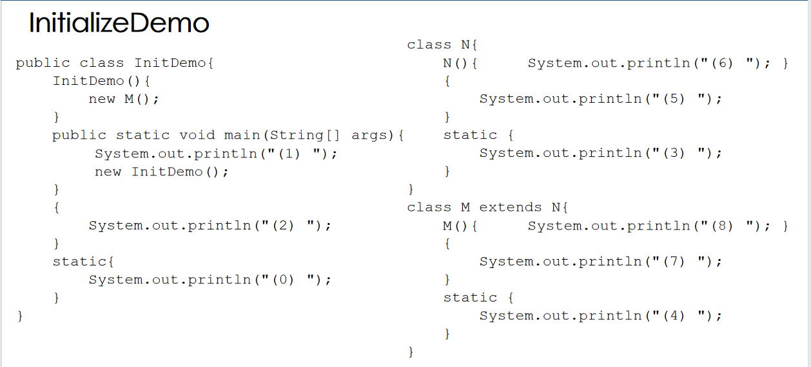
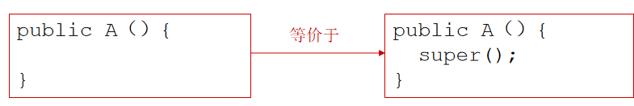
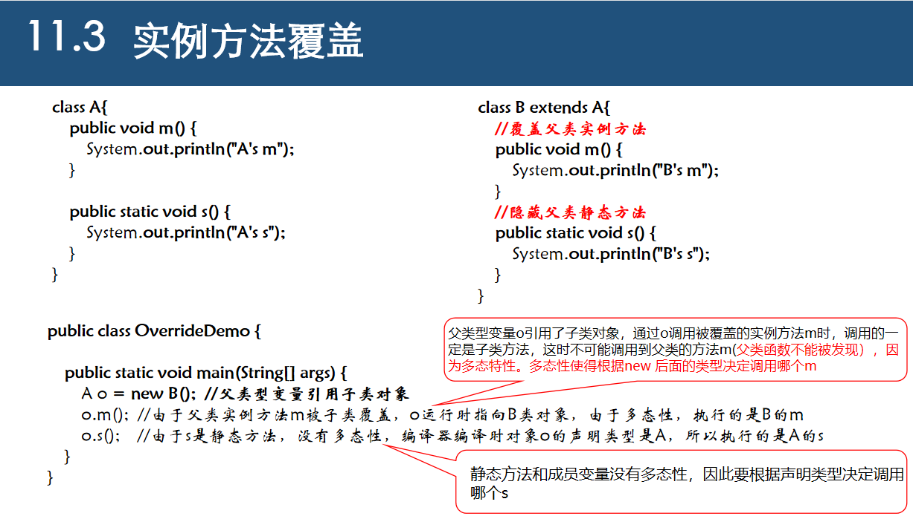
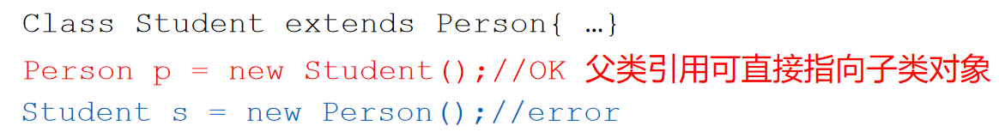
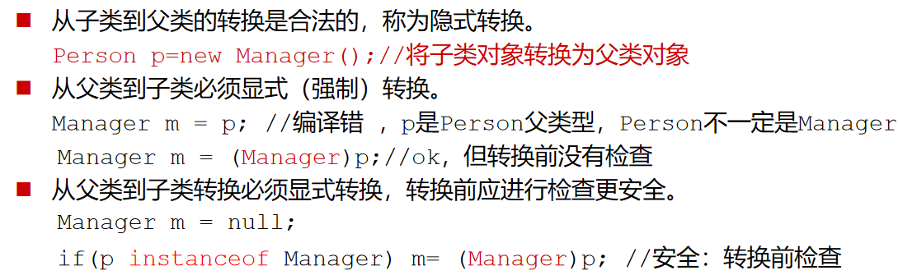

* 如果父类是Object，则extends部分可省略（前面的示例代码里，每个的父类都是Object）
* Java都是公有继承，父类成员被继承到子类，访问权限不变
* Java不支持多重继承

### 实例初始化模块

* 实例初始化模块（instance initialization block，IIB）是一个用**大括号括住的语句块**，**直接嵌套于类体中，不在方法内**。	

* **实例初始化模块先于构造函数执行**

* 作用：

  如果**多个构造方法共享一段代码**，并且每个构造方法不会调用其他构造方法，那么可以把这段**公共代码放在初始化模块**中。

  截获异常。

* 一个类可以有多个初始化模块，模块按照在类中出现的顺序执行

> 内部类：在函数中定义的类
>
> 匿名类：没有定义名字的类

* 实例初始化模块最重要的作用是当我们需要写一个内部匿名类时：匿名类不可能有构造函数，这时可以用实例初始化块来初始化数据成员

### 静态初始化块

* 静态初始化模块是由static修饰的初始化模块{}，只能访问类的静态成员，并且**在JVM的Class Loader将类装入内存时调用**。

  > （类的装入和类的实例化是两个不同步骤，首先是将类装入内存，然后再实例化类的对象）。

* 直接定义静态变量相当于静态初始化块，实例初始化块同理

初始化模块执行顺序：

1. **第一次使用类的时候装入类**

   * **父类没装先装父类**，递归至祖先都装完

   * 装入类时静态数据成员和静态初始化模块按出现顺序执行

2. **实例化类的对象**
   * **递归构造父类对象**，直至祖先类都构造完毕
   * 构造类的对象，按类中出现的次序执行实例数据成员的初始化和实例初始化模块
   * 执行构造函数函数体

理解静态初始化块和实例初始化块重要例子：

### super关键字

* 父类构造函数在子类构造函数之前执行。在任何情况下，构造一个类的实例时，会沿着继承链调用所有父类的构造方法，这叫**构造方法链**

* 如果子类中没有显式地调用父类的构造函数，那么将自动调用父类不带参数的构造函数，因为编译器会偷偷地在子类构造函数第一条语句前加上super() ；

  

* super不能用于静态上下文（即静态方法和静态初始化块里不能使用super），this也不能用于静态上下文

* 不支持super.super.p()这样的super链

> 如果一个类定义了带参数的构造函数，一定别忘了定义一个无参的构造函数，原因是：由于系统不会再自动加上无参构造函数，就造成该类没有无参构造函数。不然像super就找不到父类的不带参构造函数。

### 实例方法覆盖

* 编译的时候看的是声明类型，程序运行的时候会自动根据new的类型改变入口，称之为**多态性**

### Object中的方法

clone：

* 要实现一个类的clone方法，首先这个类需要实现Cloneable接口，否则会抛出CloneNotSupportedException异常

  Clone方法不带参数，返回Object，同时可能会抛出CloneNotSupportedException异常.

* 要公有覆盖clone方法，即Object类里clone方法是保护的，子类覆盖这个方法时应该提升为public

* 克隆的深度：要克隆的对象可能包含基本类型数值成员或引用类型变量成员，对于基本类型数值成员使用=赋值即可，对于引用类型成员则需要进一步嵌套调用该成员的克隆方法进行赋值。
* 数组的克隆就是深拷贝

### 多态性、动态绑定和对象的强制类型转换

* 每个子类的实例都是父类的实例（子类对象ISA父类），但反过来不成立

  

#### 多态

多态：通过引用变量调用**实例函数**时，根据所引用的**实际对象的类型**，执行该类型的相应实例方法，从而表现出不同的行为称为多态。通过继承时覆盖父类的实例方法实现多态。多态实现的原理：在运行时**根据引用变量指向对象的实际类型**，重新计算调用方法的入口地址（**晚期绑定**）。

* 父类变量引用子类对象，可视为将子类对象转换为父类（不需强制类型转换）。

* 类型转换(type casting)可以将一个对象的类型转换成继承链中的另一种类型。

  

  **编译器在编译时只能根据变量p的声明类型（Person）来类型检查！！！**

  所以在进行类型转换之前，最好加一个 instanceof 来检查一下指向对象是否是一个类的实例

* 重载发生在编译时(Compile time)，编译时编译器根据实参比对重载方法的形参找到最合适的**方法**。

* 多态发生在运行(Run time)时，运行时JVM根据变量所引用的对象的真正类型来找到最合适的**实例方法**。

* 重载：早期绑定 多态：晚期绑定 绑定：程序找到函数入口的过程

* **对象访问运算符(.)优先于类型转换运算符**。使用括号保证在(.)运算符之前转换