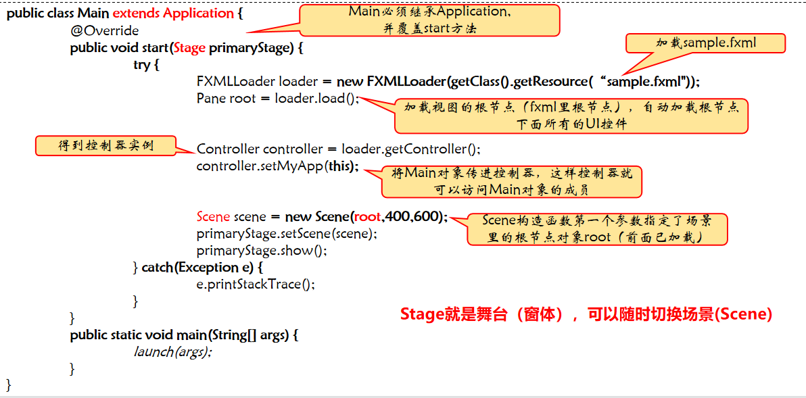
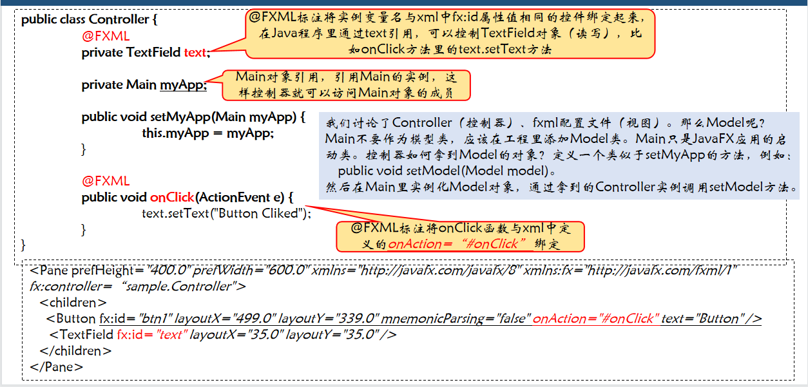
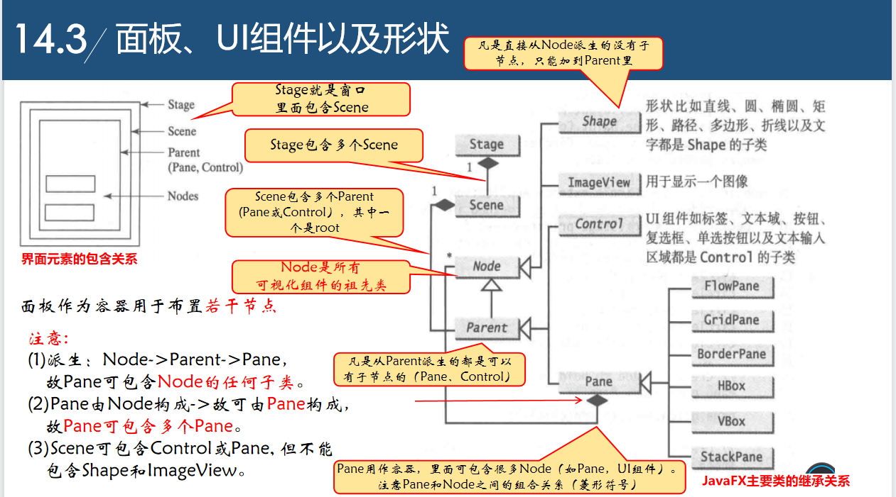
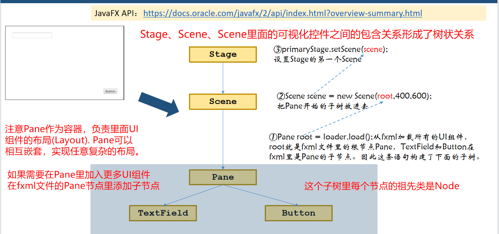
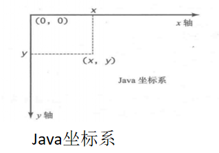
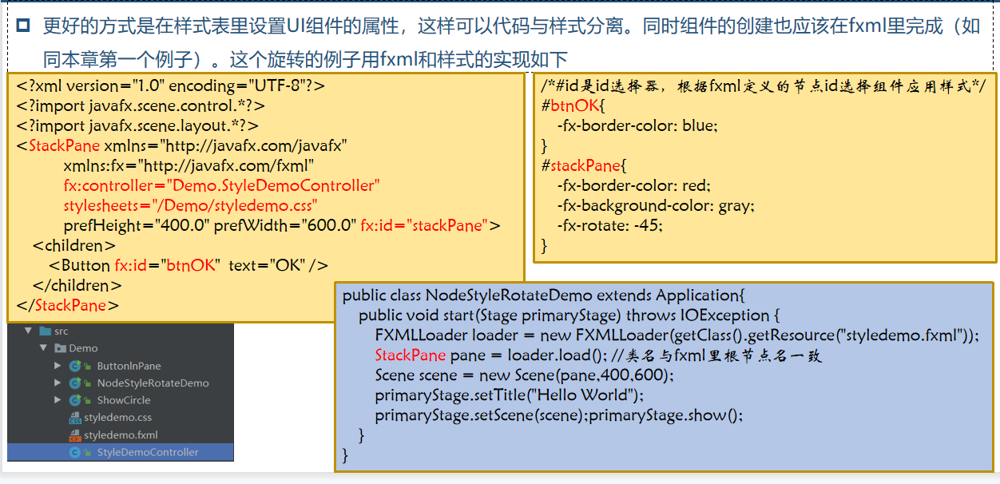
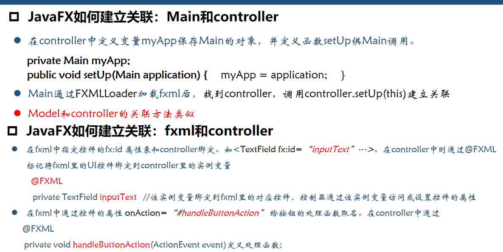

## Main

* 首先要加载xml视图配置文件
* 然后加载视图根节点，自动加载根节点下面所有的UI控件
* 得到控制器实例
* stage是窗口，窗口内容是scene

## Controller

## 面板,UI组件及其形状

* java程序ui中的坐标系：

## Node

* Node类是所有UI组件的父类

## 节点的通用属性和方法

1. 在Java程序里面定义样式，不方便美工修改

2. 在样式表里设置UI组件属性，代码与样式分离，组件创建也应该在fxml里面完成

   

> 设计JavaFX UI界面可以使用设计工具SceneBuilder：https://gluonhq.com/products/scene-builder/

## 布局面板Pane

> 一个UI界面设计难点：完成组件排版后，由于用户改变窗口大小导致排版改变。难以构建仍和窗口大小都完美的组件排版。

**stage-->scene-->pane**

## JavaFX使用注意事项

* JavaFX开发策略：Main和controller关联， fxml界面和controller关联，Model和controller关联

