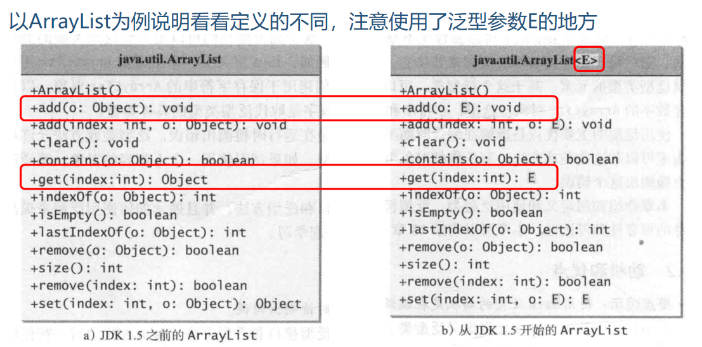
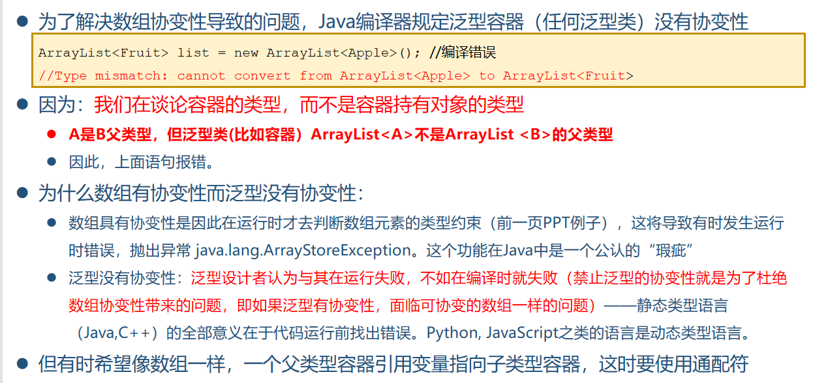

* **注意对于类型参数，编译器检测时不看继承关系**
* RTTI：运行时类型识别
* 类型信息是通过Class类（类名为Class的类）的对象表示的，Java利用Class对象来执行RTTI
* 每个类都有一个对应的Class对象，每当编写并编译了一个类，就会产生一个Class对象，这个对象当JVM加载这个类时就产生了。

如何获取Class对象：

1. Class.forname()

2. 利用类字面常量：类名.class。

   相比Class.forName方法，这种方法更安全，在编译时就会被检查，因此不需要放在Try/Catch块里

   Class.forName会引起类的静态初始化块的执行，T.class不会引起类的静态初始化块的执行

3. 通过对象。如果获得一个对象的引用o，通过o.getClass()方法获得这个对象的类型的Class对象

### 反射

利用Class对象我们可以在运行时动态地创建对象，调用对象的方法

## 动机和优点

有了泛型机制，程序员的责任（保证类型一致性，例如用instanceOf检查也是程序员的责任）变成了编译器的责任。这就是引入泛型机制的优点

eg：comparable<T>必须和同为T的参数类型进行比较

> ArrayList可视为一个可以自动增长的数组

* 类型实参传递给类型形参E是发生在编译时（不是运行时），编译时编译器用实参代替E进行类型检查
* GenericStack<E>构造函数形式是擦除参数类型后的GenericStack( ),不是GenericStack<>();
* 泛型类或者泛型接口的一个实例类型，可以作为其它类的父类或者类要实现的接口

## 泛型方法

* 声明泛型方法，将类型参数<E>置于返回类型之前方法的类型参数可以作为形参类型，方法返回类型，也可以用在方法体内其他类型可以用的地方
* 在定义泛型类、泛型接口、泛型方法时，可以将类型参数指定为另外一种类型（或泛型）的子类型（用extends），这样的类型参数称之为受限的（bounded）

>注意:
>
>类型参数放置的位置，应放在方法的返回类型之前(定义泛型方法)或者类名之后（定义泛型类时）
>
>在指定受限的类型参数时，不管是继承父类还是实现接口，都用extends

## 原始类型和向后兼容

* 没有指定具体类型实参的泛型类和泛型接口称为原始类型（raw type）。如：
  GenericStack stack = new GenericStack( ); 等价于
  GenericStatck<Object> stack = new GenericStack<Object>( );
  这种不带类型参数的泛型类或泛型接口称为原始类型。使用原始类型可以向后兼容Java的早期版本。如Comparable类型. 

## 通配泛型

* Integer是Number的子类，但是GenericStack<Integer>并不是GenericStack<Number>的子类。
  原因：**泛型集合类型没有协变性**

* double max(GenericStack<? extends Number> stack)
  extends表示了类型参数的范围关系。 
  GenericStack<? extends Number>才是GenericStack<Integer> 的父类， GenericStack<Number>不是GenericStack<Integer> 的父类

* 三种形式：

  * ？ , 非受限通配，等价于 ? extends Object，注意
    GenericStack<?>不是原始类型， GenericStack是原始类型
  * ？ extends T, 受限通配,表示T或者T的子类，上界通配符，T定义了类型上限
  * ? super T，下限通配，表示T或者T的父类型，下界通配符，T定义了类型下限

  >数组的协变性是指：如果类A是类B的父类，那么A[]就是B[]的父类。
  >
  >编译的时候看声明类型，运行的时候看具体引用类型

  

* 带<? extends>类型通配符的泛型类不能往里存内容（不能set），只能读取（只能get），实际更有意义的是作为方法参数：该方法接受一个放好对象的容器，然后在方法里只是逐个取出元素进行处理
* <? spuer T>泛型类和采用？extends的泛型类正好相反：只能存T及其子类型的数据，获取数据至少部分失效（编译器解释成Object）
