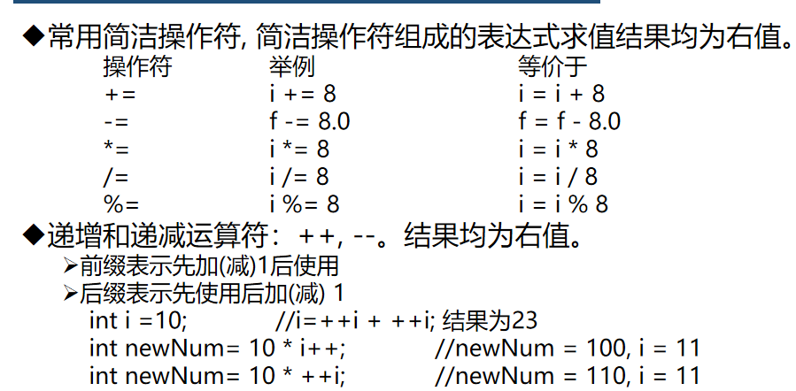
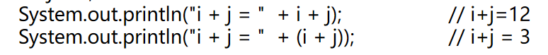
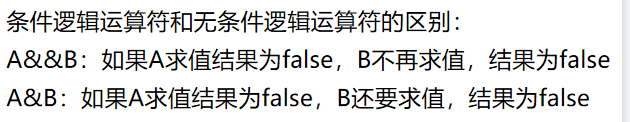

* Java标识符可以以**美元符号（＄），字母，下划线**开头（数字不行！），或组成标识符名称，java大小写敏感

* constant可以修改，常量变量名建议用全大写

* 局部变量使用前必须赋值

* Java求余可以是**实数**

* 无后缀小数表示**double**类型

* ++，--均为右值

  

* 小范围->大范围：自动转换；大范围->小范围：强制转换

* **字符串可以有零个字符**

  

* java中if条件判断必须是**Boolean的表达式**

  

* 一个java**文件**里面只能有一个public类，因为public类名字和文件名一致