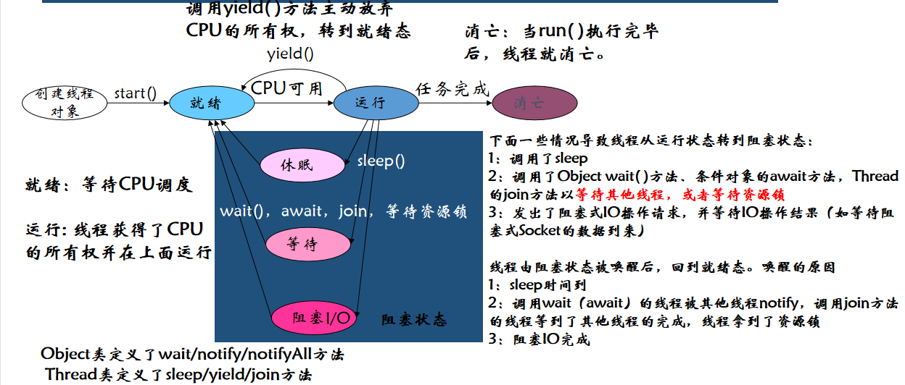
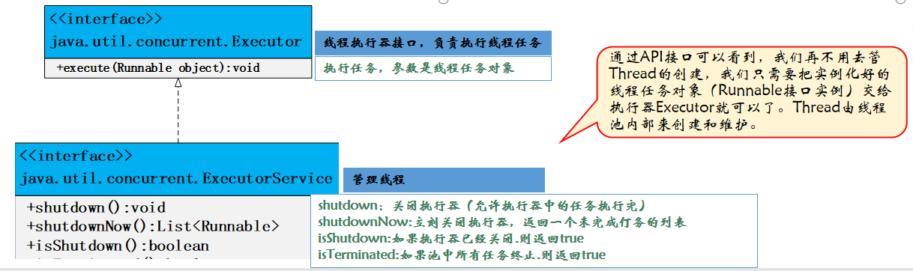
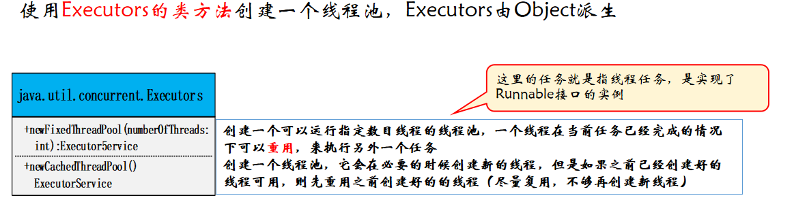
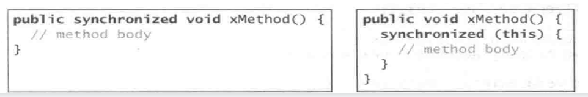

## 30.2 Runuable接口和线程类Thread

* runuable种就一个run方法
* thread.start()自动执行task.run

* 阻塞式I/O：同步，等待读取
* 非阻塞式I/O：异步，请求后挂起，把CPU让给别人处理其他事情，直至I/O完成

* Runnable接口实例定义了线程任务，即线程要执行的逻辑。一个线程任务必须通过线程对象来执行
* Thread是对线程状态进行管理
* Java的线程调度是抢占式的，这表示调度机制会周期性地中断线程，将上下文切换到另外一个线程；从而为每个线程都提供时间片

### join方法

* join方法的作用：在A线程中调用了B线程（对象）的join()方法时，表示A线程放弃控制权（被阻塞了），只有当B线程执行完毕时，A线程才被唤醒继续执行。

## 30.3 线程池

* 由于要为每一个线程任务创建一个线程（Thread对象），对于有大量线程任务的场景就不够高效，所以需要线程池

> 每个线程任务run完之后，Thread对象就消亡
>
> 分清线程任务和Thread对象的区别！！！runuable接口定义线程任务。

* 线程池**适合大量线程任务的并发执行**。线程池通过有效管理线程、**“复用” 线程**来提高性能. 

* 从JDK 1.5 开始使用Executor接口（执行器）来执行线程池中的任务，Executor的子接口ExecutorService管理和控制任务

  

> 区分任务和线程
>
> 任务：
>
> * 任务是实现了Runnable接口的类的实例
> * 任务逻辑由run方法实现
>
> 线程：
>
> * Thread类的实例，**任务的运行载体**
> * 任务必须通过线程运行

## 30.4 线程同步

### synchronized关键字

当一个方法被synchronized修饰，这个方法就是原子的（一个线程开始执行这个方法，就不可中断），称之为**同步方法**

synchronized可用于同步方法，也可以用于同步语句块

* 对于synchronized实例方法，是对调用该方法的对象（this对象）加锁
* 对于synchronized静态方法，是对拥有这个静态方法的类加锁（其实是对这个类的class对象加锁）

同步语句块：

* synchronized (expr) {   statements;  }  表达式expr求值结果必须是一个对象的引用，因此可以通过**对任何对象加锁**来同步语句块，用这个对象是否被加锁来指示线程是否可以执行该语句块。

任何同步的**实例方法**都可以转换为同步语句块

### 加锁同步

* 可重入锁：如果一个线程已经获得了锁，它还可以再次获取该锁而不会死锁，那么我们就称该锁为可重入锁

>synchronized隐式支持重入性

### 同步场景

* 假设一个类有多个用synchronized修饰的同步实例方法，如果多个线程访问这个类的同一个对象，当一个线程获得了该对象锁进入到其中一个同步方法时，**这把锁会锁住这个对象所有的同步实例方法,而非仅仅锁一个方法**
* 假设一个类有多个用synchronized修饰的同步实例方法，如果多个线程访问这个类的不同对象，那么**不同对象的synchronized锁不一样**，**每个对象的锁只能对访问该对象的线程同步**
* 如果采用Lock锁进行同步，一旦Lock锁被一个线程获得，那么被**这把锁控制的所有临界区都被上锁**，这时所有其他访问这些临界区的线程都被阻塞。
* 如果一个类采用Lock锁对临界区上锁，而且这个Lock锁也是该类的实例成员（见ResourceWithLock的里的lock对象定义），那么这个**类的二个实例的Lock锁就是不同的锁**

总结：

* 如果采用synchronized关键字对类 A的**实例方法进行同步控制**，这时等价于synchronized(this){ }，一旦一个线程进入类A的对象o的synchronized实例方法，对象o被加锁，对象o所有的synchronized实例方法都被锁住，从而阻塞了要访问对象o的synchronized实例方法的线程，但是与访问A类其它对象的线程无关

* 如果采用synchronized关键字对类 A的**静态方法进行同步控制**，这时等价于synchronized(**A.class**){ }，一旦一个线程进入A的一个静态同步方法，A所有的静态同步方法都被锁（这个**锁是类级别的锁**）

### 线程协作

* 线程之间的相互协作：可通过Condition对象的await/signal/signalAll来完成

  **使用循环while而不能使用条件if**

  有await，就要有 signal()或者signalAll()，要不然一直等

  **await会释放当前持有的锁**

> 线程池如何维持一个Thread？
>
> 在Thread的run方法里面用while true里面await等待task提交，task不为null则将具体线程任务放入Thread

## 30.5 信号量

* 信号量用来**限制访问一个共享资源的线程数**，是一个**有计数器的锁**	

  线程acquire获取许可进入临界区，信号量-1，release离开临界区信号量+1

* 信号量为1就相当于一个互斥锁

### 避免死锁

* 可以采用正确的资源排序来避免死锁：给每一个需要上锁的对象指定一个顺序，确保每个线程都按这个顺序来获取锁

## 30.6 同步集合 Synchronized Collection

* Java集合框架 包括：List 、Set 、Map**接口**及其具体子类，都**不是线程安全**的。
* 上述的集合迭代器对象只能用一次，没法reset，要再用再整一个
* 集合框架中的类不是线程安全的， 可通过为访问集合的代码临界区**加锁或者同步等方式来保护集合中的数据**
* **Collections类**提供6个静态方法来将集合转成**同步版本**（即线程安全的版本），但是这些版本的类的**迭代器不是线程安全**，迭代器必须同步：synchronized(要迭代的集合对象）{ // 迭代}

> Springboot通过把送进去的变量和线程ID组合成hashmap来满足同步，通过耗费内存来实现线程安全