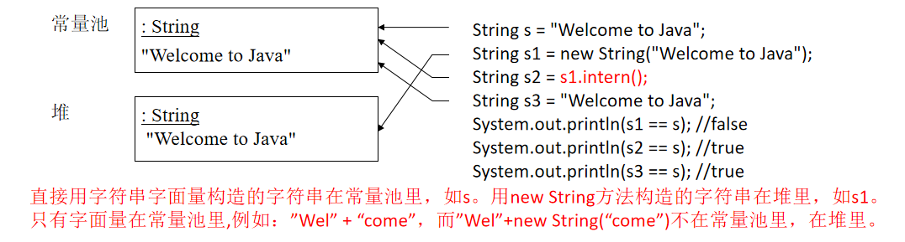

* 由于字符串是不可变的，为了提高效率和节省内存，Java中的字符串字面值维护在字符串常量池中）。这样的字符串称为**规范字符串(canonical string)**。字 符串直接赋值时，String类型的变量所**引用的值是存储在类的常量池**中的。而**new对象的方式是将字符串存储到String对象的内存堆空间**中，而这个**存储动作是在运行期**进行的。
* String类实例内容不可更改，大小写转换，字符替换，空格删除等操作都是得到一个新串
* equals和==在string中不能等同，前者指的是他们引用的内容是否相同，后者关注的是这两个引用变量是否指向同一个对象
* 字符串长度length（）是方法，要括号，数组length是属性，不用括号
* StringBuilder和StringBuffer是可以修改的字符串，StringBuilder类线程不安全，StringBuffer开销比较大