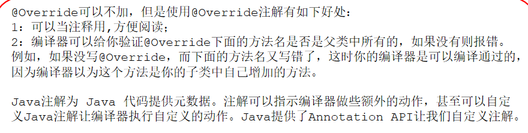
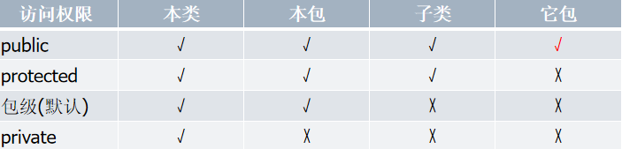
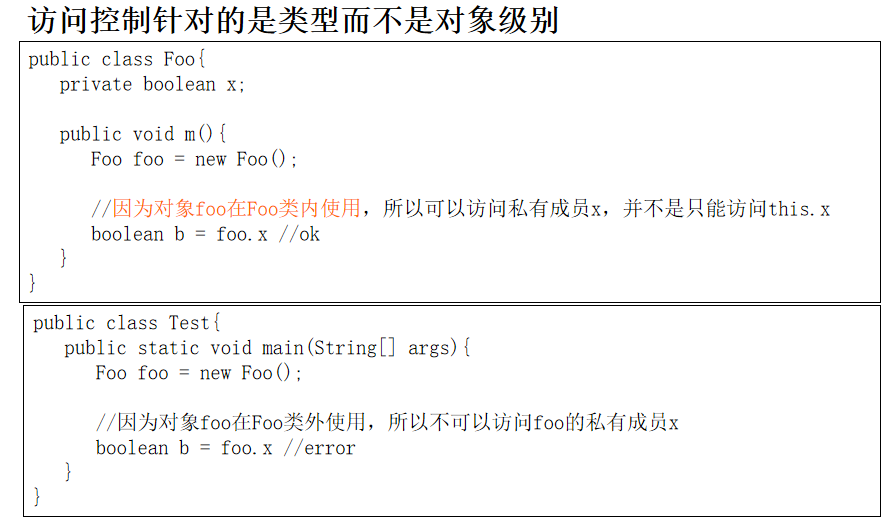

* Java中可以创建一个和类名一样的构造函数，没有任何返回类型。若是加返回类型，则将其当作普通函数，不会报错。

* java有自动内存管理，不需要也没有析构函数

* 推荐用类名访问静态成员和静态方法

* 数组和类是引用类型变量，引用了内存里面的数组或对象，每个对象/数组有引用计数，一个对象**引用计数为0会被自动回收**

* Java无类似C++的&或C#的ref来修饰方法参数，只能靠形参的声明类型来区分是传值还是传引用，因此一定要注意区分。

* 包是一组相关的类和接口的集合。将类和接口分装在不同的包中，可以避免重名类的冲突，更有效地管理众多的类和接口。类似C++的namespace。

* **@Override**是注解(annotation),告诉编译器这里是覆盖父类的方法。

  

> 作为实例数据成员，不同对象的值可能不一样。作为静态变量的值应该在所有对象中都有相同的值，例如类创建的实例对象个数。

* 静态变量为所有对象所共享，也叫**类变量**，可以通过”类名·变量名“访问

方法重载，方法覆盖，方法隐藏

* final修饰方法不能被隐藏和覆盖。

* 重载：名字一样，参数列表改变，返回类型不一样不能视为重载，会报错！
* 覆盖和隐藏：前提是有继承，子类和父类方法**名字，参数列表，返回类型**都一样（也允许子类中方法的返回类型是父类中方法返回类型的子类）
  * 方法覆盖：实例方法
  * 方法隐藏：静态方法

* 构造函数不能用static修饰，静态函数无this引用。

* 静态方法内部只能访问类的静态成员 (因为实例成员必须有实例才存在，当通过类名调用静态方法时，可能该类还没有一个实例）

可见性修饰符

* 子类类体中可以访问从父类继承来的protected成员 。但如果子类和父类不在同一个包里，子类里不能访问另外父类实例（非继承）的protected成员。

* 成员变量默认初始化，new后成员默认值为0或null，函数局部变量须初始化
* 作用域越小，访问优先级越高