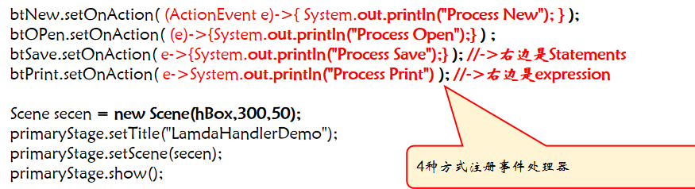

* 事件处理器必须实现EventHandler<T extends Event> 泛型接口
* **事件处理器对象**handler需要同**事件源对象**source**绑定**起来,通过事件源对象source的**setOnAction(handler)方法**
  		source.setOnAction(handler)
* 事件驱动编程：当运行一个Java GUI 程序的时候，程序和用户进行交互，并且事件驱动它的执行。

* 产生一个事件并且触发它的组件称为**事件源对象**。

  例如，一个按钮是一个按钮单击动作事件的源对象。一个事件是一个事件类的实例。JavaFX 的各种具体事件类都派生自javafx.event.Event，即所有事件都是Event的实例

* 一个事件对象包含与亊件相关的任何属性(比如键盘事件对象包含用户按下了哪个键）。可以通过EventObject 类中的getSource( )实例方法可以得到产生事件的事件源对象的引用。记得进行强制类型转换，getSource返回的是Object。

  

* Java 采用一个基于委派的模型来进行事件处理：一个事件源对象触发一个事件，然后一个对该事件感兴趣的对象处理它。后者称为一个事件处理器或者一个事件监听者(实际上就是观察者模式）。

## 内部类

* 内部类也称为嵌套类，是在一个**类的内部定义的类**。通常一个内部类仅被其外部类使用时,同时也不想暴露出去，才定义为内部类。**内部类不能定义在方法中。**

* 实例内部类内部不允许定义静态成员

* 必须有外部类的实例对象才能创建内部实例类，内部静态类则可以直接用类名new

* 在外部类体外面，不能通过内部类对象访问外部类成员，只能在内部类里面访问

* 一个内部类被编译成名为OuterClassName$InnerClassName的类

* 匿名内部类可以简化编程。简化时使用匿名内部类的父类或者接口代替匿名内部类

* Lambda表达式可以进一步化简，编译器会将lamda表达式看待为匿名内部类对象。

  

