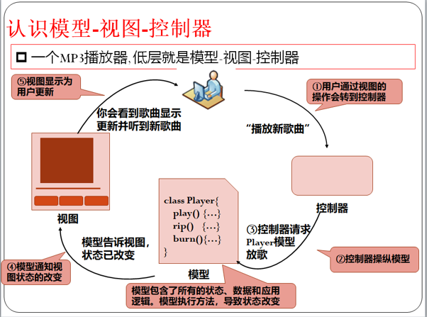

## 设计模式原则

### 开闭原则

**软件对扩展是开放的**，**对修改是关闭的**，如此可通过不断增加模块增加功能且不更改原有代码，保证稳定性

实现的主要原则：

* 抽象原则

* 可变性封装原则

  每个可变元素单独进行封装

### 单一职责原则

* **一个类一个职责**

* 需求变化反映为类的职责的变化

### 里氏代换原则

* 继承必须确保超类所拥有的性质在子类中仍然成立，当一个子类的实例能**替换任何其超类的实例**，二者才有is-A关系
* **子类可以扩展父类的功能，但不能改变父类原有的功能**

### 依赖倒置原则

* 高层模块不应该低层模块，二者都应该**依赖于抽象（接口等）**

### 接口隔离原则

## 工厂模式

product：定义产品的接口

concretproduct：实现product

Factory：工厂

Create：实现工厂方法

### 抽象工厂模式

* 面向相关联的一系列产品，工厂模式只针对一个产品

## 单件模式

* 一个类只能有一个实例，且提供一个全局访问点

  how？---类的**构造函数必须是私有**的，但引发鸡生蛋蛋生鸡问题

  更好的办法：**类自身**负责保存它的**唯一实例**，提供一个可以访问该实例的方法

> 为什么不用静态初始化块来实现同样效果？
>
> 类被装载在到JVM的时候就创建了唯一实例，若是对象非常耗费资源，且实例没有马上使用甚至没被使用，就浪费了资源，这种现象称之为**急切实例化**。
>
> 而需要实例的时候才调用get方法获得实例，则称之为**延迟实例化**

## 适配器模式

写一个类，将类提供的source接口变成客户希望的target接口 

类适配器：用一个具体的类对Adaptee和Target进行匹配，Adapter类多重继承Adaptee和Target类，Adapter类可重定义部分Adaptee类的方法，实现适配

对象适配器：允许一个Adapter与多个Adaptee关联

## 迭代器模式

## 观察者模式

主题对象+观察者

## 策略模式

把会变化的代码和不会变化的分开

将每种算法对象独立出来，定义一系列算法一个个封装，使其可以相互替换，使得算法独立于使用它的用户而变化

## 复合模式

eg：MVC 模型-视图-控制器

1. 通过视图的操作会转到控制器

2. 控制器操纵模型
3. 模型包含所有状态，数据和应用逻辑
4. 模型告诉视图状态已改变
5. 视图显示为新更新

## 命令模式

