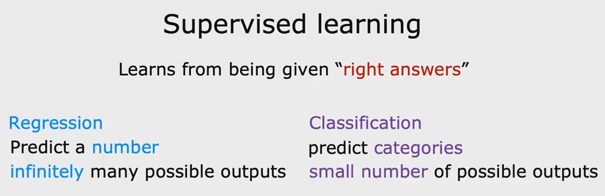
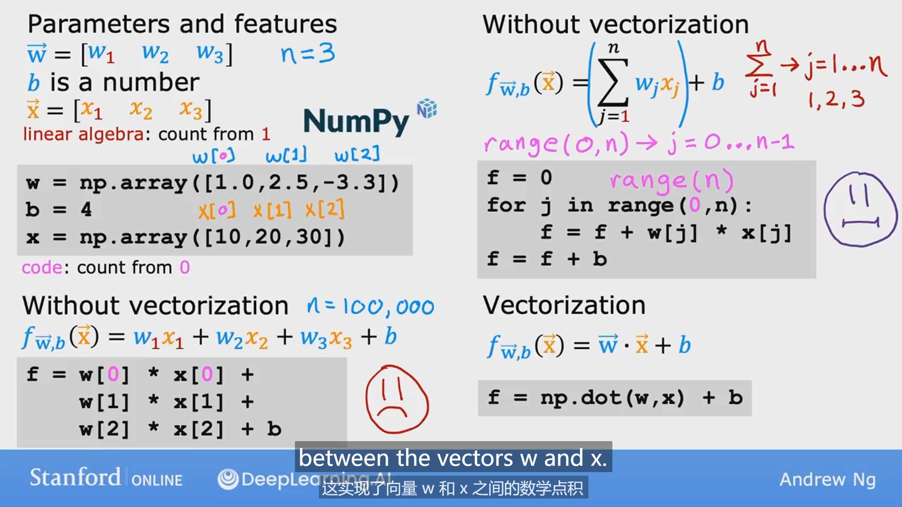

# Supervised Machine Learning: Regression and Classification

## Supervised learning

* 监督学习关键特征：在给机器的学习算法示例中包含正确答案

### Regression

* 学会从无限多可能的数字中预测数字，试图预测无限多可能数字中的一个

### Classification

* 预测类别，可以不是数字，输出的类别是有限的，不再像回归问题有无限种可能的输出

## Unsupervised learning

 

* 无监督学习特征：获取没有标签的数据，并且尝试将它们自动分成不同的集群

### Clustering 聚类

* Group similar data points together
* 将数据根据它们的特征划分为不同的集群

### Anomaly detection 异常检测

* Find unusual points

### Dimensionality reduction 降维

* 将获取到的大数据集压缩到一个小得多的数据集，并且尽可能减少损失的信息

## Linear regression model

>Terminolgy
>
>Training set: Data used to train the model

### Cost function 

### Gradient descent 梯度下降

* 用于寻找损失函数最小值
* w和b要求同步更新，使用左侧的方法进行同步更新

## Multiple linear regression 多元线性回归

### Vectorization 向量化

* 向量化能加快运算的原因：

  numpy可以利用计算机的并行计算硬件实现并行计算

* 一些机器学习的库可能使用法方程（Normal equation）来求解w和b参数，该方法仅适用于线性回归算法，无法扩展至其他算法

### Feature scaling 特征缩放

* 利用特征缩放可以把变化范围相差很大的特征的范围缩放到comparable的范围 ，从而提高梯度下降的速度

几种特征缩放的方法：

1. 直接把数除以最大值

2. Mean normalization 均值归一化 
   $$
   x = \frac{x-\mu}{x_{max}-x_{min}}\\
   \mu:x的均值
   $$
   
3. Z-score normalization
   $$
   x = \frac{x-\mu}{\sigma}
   \\ \mu:均值
   \\ \sigma：标准差
   $$
   
   
   

### Feature engineering 特征工程

* 利用直觉去设计一个新的特征，该特征基于转换或者结合已有的特征，帮助机器更好地做出预测

## Polynomi regression 多项式回归

> Why is numpy faster?
>
> vectorization provides a large speed up in this example. This is because NumPy makes better use of available data parallelism in the underlying hardware. GPU's and modern CPU's implement Single Instruction, Multiple Data (SIMD) pipelines allowing multiple operations to be issued in parallel. This is critical in Machine Learning where the data sets are often very large.
>
> 矢量化在此示例中提供了很大的加速。 这是因为 NumPy 更好地利用了底层硬件中可用的数据并行性。 GPU 和现代 CPU 实现了单指令多数据 (SIMD) 管道，允许并行发出多个操作。 这在数据集通常非常大的机器学习中至关重要。

## Classification

### Logsitic Regression

* logisitic regression是用于处理 classification的

* logistic function / sigmod funciton:
  $$
  g(z) = \frac{1}{1+e^{-z}}
  $$
  

* logistic regression 

  

* logsitic 的loss function

  

* logsitic的 cost function

  

  

### overfitting

* 如何避免overfitting：

  1. collect more training examples

  2. use fewer features, selcet features that is most related to the target

  3. regularization 正则化

     keep all of your features just prevents the features from having an overly large effect

     

     

     在正则化的过程中，b可以不加入正则项也可以加入，影响不大

     

​			

