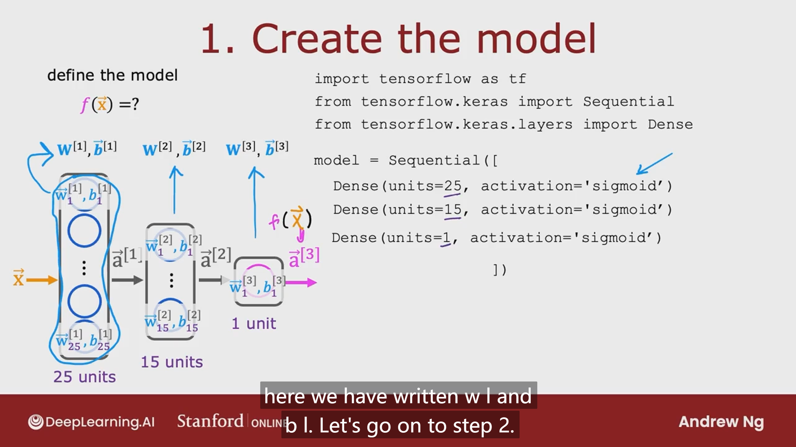
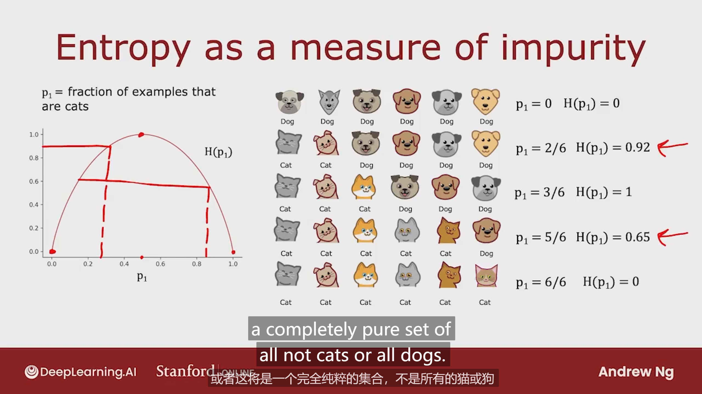

## Neural Network Training Steps

### 1. Create the model

### 2. Loss and cost functions

### 3.Gradient descent

 

* sigmod 的替代刺激函数

  

* how you can choose activation function for different neurons in your neural network?

  根据y的输出来决定output layer使用何种activation function

  

  在hidden layer中最常使用ReLU

* summery

>Why do we need activation functions
>
>因为如果全部使用线性activation function或者不使用activation function 神经网络将只是一个linear regression

**So, don't use linear  activations in hidden layers(instead , use ReLU)**

## Multiclass

### Softmax regression 

Softmax是logistic 的一个抽象化，logistic是它的特例

don't use the version shown here!

* **the recommended version 在output layer使用linear直接给出z，在计算误差的地方再算loss可以降低数字太大太小导致的误差**

## Classification with multiple outputs / Multi-label Classification

和Multi-class Classification不同的是这里的多个输出是多个label，他们之间没有相加等于1的要求，多个数字代表着不同的label

## Advanced Optimization

### Adam Algorithm

代码实现：在compile里面增加一个参数，调用Adam且设置初始学习率

## Additional Layer Types

### Dense Layer 紧密层

* dense layer type： every neuron in the layer gets its inputs all the activations from the previous layer

### Convolutional Layer 卷积层

summery： 

* dense layer的每个neuron接收上一层的**所有**activation
* convolutional layer 每个neuron只接受上一层的**部分**activation

## Model evaluation

* 将数据集分割成训练集和测试集，用测试集的误差观测模型对于未知数据的预测效果

### Model selection(choosing a model)

* 数据集分割方案：Training/cross validation(十字交叉验证)/test set 

> 为什么需要十字交叉验证，直接训练后根据test set进行模型选择不好吗？
>
> 因为如果直接根据training set的结果，选择不同degree的function去拟合test，test的loss是对未知数据的一个偏于乐观的误差预测，因为为了选择最小的test loss，我们增添了多项式的阶次，去迎合test set
>
> 如果采用了十字交叉，model selection部分就被用在了计算不同的cross validation 的loss ，这样训练出来的w和b和function的多项式阶次都没有去fit test set，这时候用test set计算出来的loss就是对generalization error of this module一个合理的估计

### Bias and variance偏差和方差

* high bias说明模型unfit，训练集都没拟合好
* high variance说明模型过拟合

#### Regularization and bias/variance

#### Establishing a baseline level of performance 建立表现基准

* human level performance
* competing algorithms performance
* guess based on experience

baseline和J_train之间有巨大gap 说明 high bias  如果J_train和J_cv有巨大gap则说明high variance

#### Learning curves 学习曲线

* high bias

  

* high variance

  

#### Decide what to do next 

#### Bias/variance and neural network

* 当大的神经网络正确使用regularization，它总能起到比小的神经网络更好的效果
* 当数据集不是太大的时候，神经网络特别是大的神经网络总是一个low bias machine

## Machine learning development process

### Iterative loop of ML development

### Error analysis

* 分析神经网络错误预测的那些实例，取其中一部分，分析预测失败的原因，根据不同类型错误发生的频率根据优先级进行该种错误的修正，例如大量增加该类型的数据

### Adding data

### Transfer learning: using data from a different task

* 从别的大数据集中进行训练，然后再将训练好的神经网络放到需要的数据集进行训练，只要进行稍加训练就能很好fit

### Full cycle of a machine learning project

### Fairness,bias,and ethics

## Skewed datasets

### Error metrics for skewed datasets

* 我们常使用不同的误差度量而不仅仅是分类误差来计算算法的效果

  以罕见病为例：若是仅仅根据正确率判断，y永远等于零误差最小，但是它没有实际意义，永远测不出罕见病，所以不是最好的算法

  

* Precision/recall 

  

### Trading off precision and recall 权衡

* 当提高预测y=1的可能性阈值的时候，我们提高了precision，降低了recall
* precision代表了你预测了此人患病，此人真的患病的准确率
* recall代表了一个人真的患病了，你能预测出来的准确率

* 我们要根据实际情况，手动选择阈值来达到我们需要的precision和recall

* 一种评估算法的方法：取precision和recall的调和平均值

  

## Decision Trees

### The process to build a decision tree

1. choose what feature to split on at each node

   Maximize purity or minimize impurity

2. when do you stop splitting?

   * When a node is 100% one class 

   * When splitting a node will result in the tree exceeding a maximum depth
   * When improvements in purity score are below a threshold
   * When number of examples in a node is below a threshold

### Measuring purity

Entropy熵：用于表征数据集中数据的纯净度/不纯净度，一般用H表示

$$
p_0 = 1 - p_1
\\H(p_1)=-p_1log_2(p_1)-p_0log_2(p_0)\\
=-p_1log_2(p_1)-(1-p_1)log_2(1-p_1)
$$

### Choosing a split: Information Gain

* 根据子树的数据量作为权重计算熵值加权平均值，寻找最小值

  

* 上面的0.28 是Information gain，越大说明对根的熵值下降越多，获取的信息越多，分割方案越好

### Summary

### Using one-hot encoding of categorical features

* 通过热编码把有三个及以上值的特征转换为多个二进制特征，其中总有一个特征是hot（1），所以称之为one-hot encoding

### Continuous valued features

* splitting on a continuous variable

  选择不同的threshold计算information gain 取最大值

### Regression Trees

* 和classification不同，regression根据不同的selected feature进行分割，分割出来计算不同方案的variance，然后加权平均左右branch的variance，然后用root的variance 减去不同方案的variance最终选择最大值，使得variance降低的最多

  eg：

  

## Tree ensembles 树的集合

### Using multiple decision trees

> 为什么需要使用多个决策树集合
>
> 因为单个决策树对于数据的微小改变太过敏感，一个小小的data改变都可能导致selected feature不同，我们需要一个更加robust的解决方案

如何使用多个决策树？

* 将数据放入所有构建好的决策树，根据这些树的结果进行投票决定最终预测结果

### Sampling with replacement 放回抽样

* 放回抽样用于构建决策树集合，对training set进行放回抽样构建一个新的training set
* 根据抽样放回生成的所有training set分别构建不同的决策树，组合起来就是一个决策森林
* 不用构建过多的放回抽样，到一定个数后就没什么大提升了

### Random forest algorithm 随机森林算法

### XGBoost

* 相比于随机抽样放回，XGBoost在构建新的training set的时候更可能选择那些在之前的训练中没有很好地被正确分类的那些数据，这和我们想学好某些东西狠补薄弱之处类似，在机器学习中称之为deliberate practice

## Conclusion

### When to use decision trees

