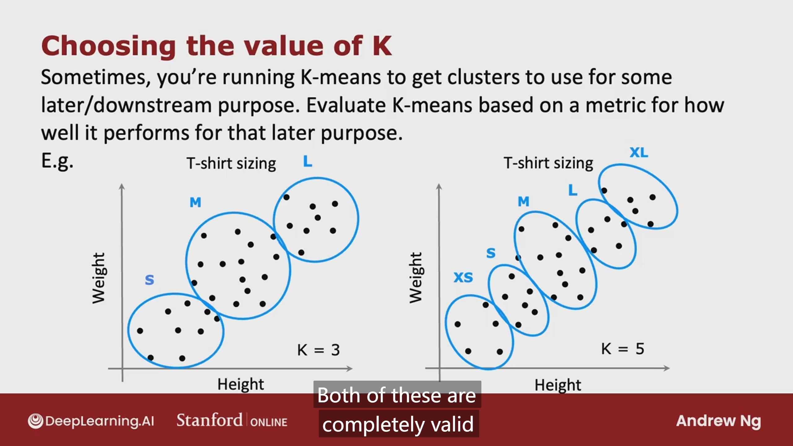

# Unsupervised Learning

## Clustering

### K-means 

* K-means optimization objective 优化目标

  K-means 的cost function即所有training set到他们的centroid的距离的平方和的均值

  k-means 的cost function又称之为 distortion function 失真函数

  

* Initializing K-means

  

* Choosing the number of clusters

  1. elbow algorithm 肘部法

     寻找到某个k值，在该处的cost function突然下降，在该处之后的下降又减缓，像一个手肘，该处即为k值

  2. 根据后续purpose来选取聚类值

     

## Anomaly Detection 异常检测

### Finding unusual events

### Gaussian (Normal) Distribution 高斯分布

### Algorithm

### Developing and evaluating an anomaly detection system

* 利用部分带有label的已知数据集进行测试，从而获取一个定量的对异常检测模型的评判，从而根据测试结果修改参数epsilon等

* 当数据集尤其是异常数据集不够多的时候，可以不设置test set，把除了training set以外的所有数据集都放入cross validation set中

  

> 既然数据都有label了，为何不使用监督学习来进行检测？Anomaly detection vs supervised learning
>
> 异常检测能在仅有较少positive数据的情况下，预测到未来可能没遇到过的异常数据，而监督学习只能根据已有的positive数据集来进行预测，只能预测到和已有positive数据相似的数据为positive
>
> 

### Choosing what features to use

1. 尽量使用高斯分布的数据，或者把非高斯分布的调整成接近高斯分布的

# Recommender Systems 

## Collaborative Filtering 协同过滤

### Using per-item features

### Collaborative filtering algorithm

### Binary labels: favs, likes and clicks

将yhat设置为g的函数，使得预测结果在0到1之间，cost function 也要设置为相应的log函数形式

### Mean Normalization 均值归一化

* 均值归一化将数据均值求出，所有数据都减去它们的均值，然后在利用函数预测 y 的时候加回均值，这样对于从未或很少对电影做出评价的用户来说，不会得到全 0 的结果

### Tensorflow implementation  

在tensorflow中实现普通的梯度下降和实现Adam优化算法

  

### Finding related items

## Content-based Filtering 基于内容的过滤

和协同过滤的不同之处：

协同过滤是获取到一系列用户对电影的评分，然后根据和你口味相似的用户的评分来预测你未看过的电影你会做出的评价

基于内容的过滤是提取电影的特征和用户的特征，使得二者match，利用二者特征向量的点积来预测对某电影的评分

### Deep learning for content-based filtering

* 首先利用神经网络将user和movie的特征提取出来

  

### Recommending from a large catalogue

1. Retrieval 检索

   获取尽可能多的关联电影，保证覆盖够广

   

2. Ranking 排名

   

   

### TensorFlow Implementation

* 使用l2范数将特征向量归一化，使得向量长度为1，有利于计算的准确度

# Reinforcement Learning

## Reinforcement Learning formalism

### The Return in reinforcement learning

### Making decisions: Policies in reinforcement learning

### Review of key concepts

以上这些概念也被称之为马尔科夫决策过程 **Markov Decision Process**

未来的结果仅取决于当前的状态，而非之前的状态

the future only depends on where you are now, not on how you got there

## State-action value function 状态动作价值函数

### Bellman Equation 贝尔曼方程

* 用于计算状态动作价值函数的方程
* 在中断状态（此处的左右两侧）Q(s,a) = R(S) 没有下一个状态，终端状态的状态动作价值函数就是当前状态的reward

### Random (stochastic) environment 随机环境

* 在实际环境中，机器人可能无法按照理想规划路线行进，有一定概率出错
* 此时计算return就不能单纯计算一次的理想结果，要运行很多次，取return的平均值作为最终的return。然后选择均值最高的策略。

## Continuous State Spaces 连续状态空间

### Example ：Lunar Lander

### Learning the state-value function

* heart: 设计一个neural network 以当前的state和可能的action作为输入，用network计算出一个Q(s,a)，用这个Q去算不同的action

* 不同的action可以用one-hot编码，以0和1代表是否采取该action

* 如何训练神经网络？

  利用Bellman Equation和大量的training set用supervised learning algorithm进行训练

  Bellman Equation用于计算每个training set的y，然后训练Q_new使得其更接近Bellman Equation算出来的y，然后不断更新Q。

  最初的Q可以随机选择。

  

#### Deep-Q Network （DQN)

### Algorithm refinement: Improved neural network architecture

instead of 对于每个 input 训练四次，把四个action的Q值在一次训练中同时得到，提高了算法效率

### Algorithm refinement: epsilon-greedy policy

适当随机选择一下action。防止个别action永远不被选择，这个操作也被称之为 Exploration Step

选择最大回报的Step则被称之为Greedy Step

最开始把epsilon设置的很高，随着Q逐渐优化，epsilon也逐渐降低

**强化学习算法对于超参数的选择比监督学习算法的更严格**

### Algorithm refinement: Mini-batch and soft update

* Mini-batch

  同样适用于监督学习，例如在梯度下降的时候，不要遍历所有数据集，只取其中的一小部分用于梯度更新，每次更新不同批次的数据集

  

* soft updates

  避免在某次更新中训练出来的函数反而往更加noisy的方向更新了一大步，使得算法更可靠地收敛，同样适用于监督学习

  

### Deep Q-Learning with Experience Replay Algorithm

* Target Network：由于直接使用Q-Network进行误差计算，更新权重会因为y_target在每次迭代都变化，导致震荡和不稳定，因此创建一个完全分离的Q‘-Network来产生y_target，在实践中每经过一定次数的迭代，用Q’去产生y_target然后用Q-Network的w去soft update Q'-Network 的权重

* experience replay：直接从上一次的状态中去update函数权重，由于二者之间的强关联性，容易导致问题，experience replay则通过在memory buffer中储存过往经验，然后用mini-batch随机从中选择部分experience进行学习，由此降低了experience和当前状态的关联性

### The state of reinforcement learning

# Summary

# Congratulations!
