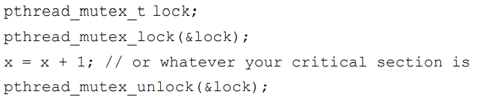
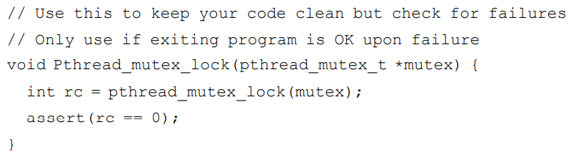
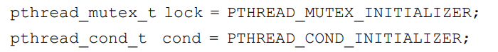
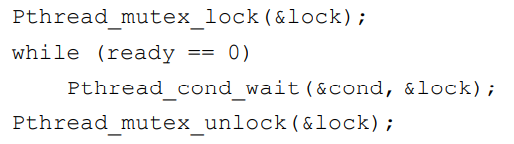
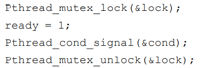

* 线程创建：

  int pthread_create( pthread_t * thread,  const pthread_attr_t * attr,  void * (*start_routine)(void*),  void * arg);

* 线程完成：

  int pthread_join(pthread_t thread, void ** retval);

* 锁：

  只有获得锁的线程才能进入临界区，用完后调用解锁释放该锁，别的线程才能去获取锁从而进入临界区

  

  上图还缺乏锁的初始化和获取和释放锁的时候检查错误代码

  锁的初始化：

  * 法一（静态）：pthread_mutex_t lock = PTHREAD_MUTEX_INITIALIZER; 
  * 法二（动态）：int rc = pthread_mutex_init(&lock, NULL);

  错误代码检查：

  

* 条件变量：线程间通信

  所需函数：

  int pthread_cond_wait(pthread_cond_t *cond, pthread_mutex_t *mutex);  

  int pthread_cond_signal(pthread_cond_t *cond); 

  休眠等待线程：

  

  发出信号线程：

  

>等待调用多一个参数原因：除了使调用线程进入睡眠，还会使调用者在睡眠时释放锁，供其他线程获取锁并唤醒它，唤醒后返回前，该进程会重新获取该锁，从而确保等待线程在等待序列开始时获取锁与结束时释放锁之间运行的任何时间，它持有锁。