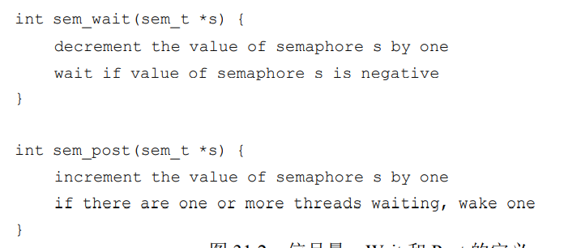
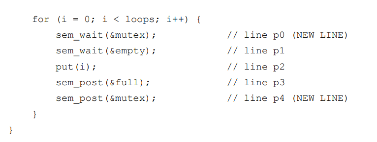
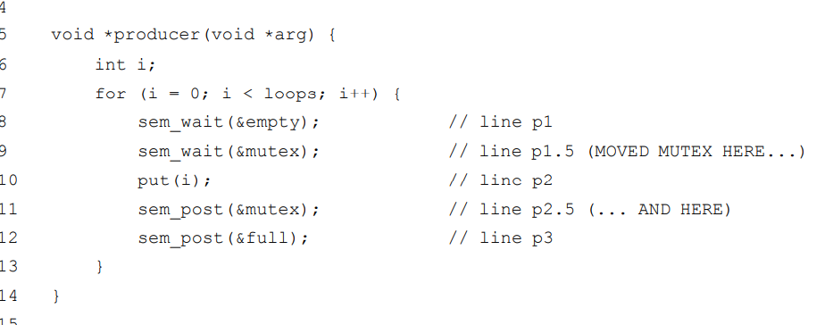

信号量操作函数：

* 当信号量的值为负数时，这个值就是等待线程的个数s

信号量应用：

1. 信号量作为锁（二值信号量）

2. 信号量用作条件变量

## 生产者/消费者（有界缓冲区）问题

生产者等待缓冲区为空然后加入数据，消费者等待缓冲区为满然后取走数据。

给整个函数操作加锁会导致**死锁**情况：例如消费者先运行调用wait阻塞，让出CPU**但是没有让出锁**，然后生产者执行，此时因为锁被消费者持有，生产者被卡住了。二者相互等待，产生死锁。

**死锁解决方案：改变锁的作用区域，将full，empty的唤醒和等待操作移到锁外。**

修改前：	

修改后：

## 读者-写者锁

一旦一个读者获得了读锁，它会同时获取写锁，然后其他的读者也可以获取这个读锁。但是，想要获取写锁的线程，就必须等到所有的读者都结束。最后一个退出的写者在“writelock”信号量上调用sem_post()，从而让等待的写者能够获取该锁。

该方法很容易导致读者饿死写者（公平性不佳），且在性能方面没有优势，太复杂了。

## 哲学家就餐问题

有问题方案：为了拿到餐叉，我们依次获取每把餐叉 的锁——先是左手边的，然后是右手边的。结束就餐时，释放掉锁。当每个哲学家都拿到左手边的餐叉的时候，**产生死锁**。

解决方案：破除依赖，修改某个或者某些哲学家的取餐叉顺序，例如让哲学家4先拿右餐叉，即可打破等待循环。