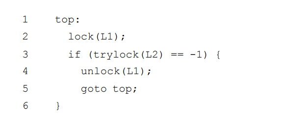

## 非死锁缺陷

### 违反原子性缺陷

解决方案：给共享变量的访问**加锁**

### 违反顺序缺陷

解决方案：利用条件变量等方式通过**强制顺序**修复这种缺陷

## 死锁缺陷

**死锁产生条件**：

* 互斥：线程对于需要的资源进行互斥的访问（例如一个线程抢到锁）。 

* 持有并等待：线程持有了资源（例如已将持有的锁），同时又在等待其他资源（例 如，需要获得的锁）。 

* 非抢占：线程获得的资源（例如锁），不能被抢占。 

* 循环等待：线程之间存在一个环路，环路上每个线程都额外持有一个资源，而这 个资源又是下一个线程要申请的

**预防死锁：**

* 避免循环等待，提供一个获取锁的**全序/偏序**

* 利用**原子地抢锁**来避免持有并等待

* 利用trylock（）实现无死锁的加锁，可能导致**活锁**，即两进程一直重复该序列，又同时抢锁失败。

  

> 活锁解决办法：例如，可以在循环结束的时候，先随机等待一个时间，然后再重复整个动作，这样可以降低线程之间的重复互相干扰。

* 通过强大的硬件指令，构造出**不需要锁的数据结构**
* 了解全局的信息，包 括不同线程在运行中对锁的需求情况，从而使得后续的**调度能够避免产生死锁**。
* 允许死锁偶尔发生，检查到死锁时再采取行动。