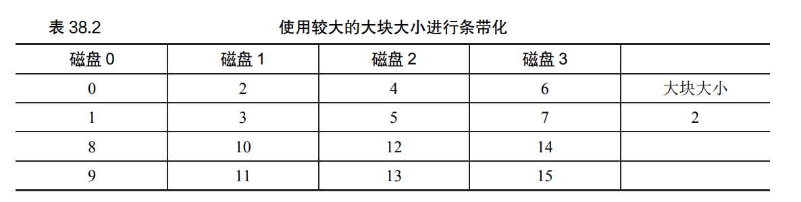
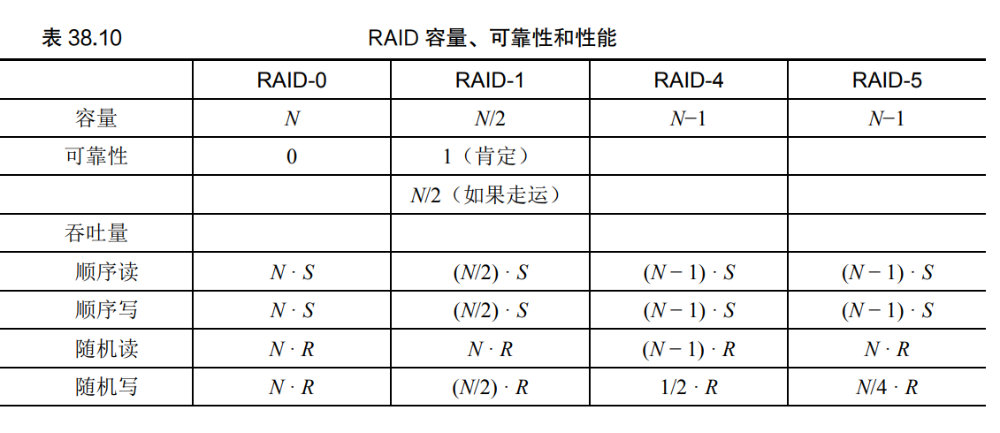
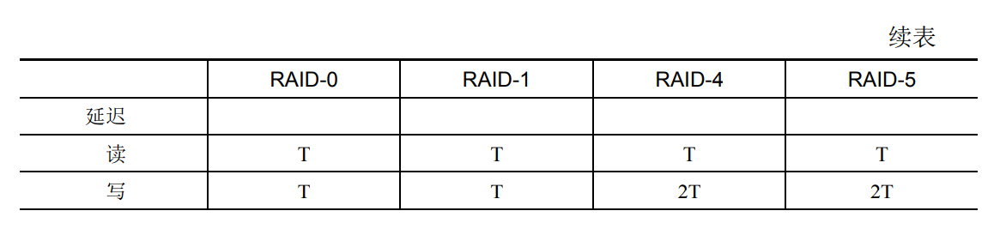

* RAID 为使用它们的系统透明地（transparently）提供了这些优势：**大型、快速、可靠**，即 RAID 对于主机系统看起来就像一个大磁盘

## 故障模型

### 故障—停止（fail-stop）故障模型

## RAID 0 级：条带化

以轮转方式将磁盘阵列的块分布在磁盘上

> 块大小为1时的RAID映射，A为逻辑地址：
>
> 磁盘= A % 磁盘数 
>
> 偏移量 = A / 磁盘数

## RAID 1 级：镜像

> RAID一致更新问题：
>
> 是使用某种预写日志（write-ahead log），在做之前首先记录 RAID 将要执行的操作（即用某个数据更新两个磁盘）。通过采取这种方法，我们可以确保在发生崩溃时，会发生正 确的事情。通过运行一个恢复（recovery）过程，将所有未完成的事务重新在 RAID 上执行，我们可以确保两个镜像副本（在 RAID-1 情况下）同步。
>
> 由于代价昂贵，因此大多数 RAID 硬件都包含少量非易失性 RAM（例如电池有备份的），用于执行此类记录

假设顺序读取的最大速度是 S MB/s，随机读取为 R MB/s

在RAID-1中，顺序写入最大带宽为 （N/2） · S ，顺序读取也只能获得 （N/2） · S

对于随机读取，RAID-1提供 N·R MB/s。随机写入：N/2 · R MB/s

## RAID 4 级：通过奇偶校验节省空间 

分析：

容量：RAID-4 使用 1 个磁盘作为它所保 护的每组磁盘的奇偶校验信息。因此，RAID 组的有用容量是（N−1）。

可靠性：RAID-4 容许 1 个磁盘故障，不容许更多。如果丢失多个磁盘， 则无法重建丢失的数据

性能：

1. 连续读取性能可以利用除奇偶校验磁盘以外的所有磁盘，因此可提供（N−1）·S MB/s（简单情况）的峰值有效带宽

2. 连续写入（**全条带写入**）：（N−1）·S MB/s

3. 随机读取：（N−1）· R MB/s

4. 随机写入：

   * 加法奇偶校验：读取条带中所有其他块，算出新的奇偶校验块，然后新数据和新奇偶校验块写入，可并行写入

   * 减法奇偶校验：比较新旧数据的区别，确定校验位是否发生改变

     产生**基于奇偶校验的RAID的小写入问题**，奇偶校验磁盘必须为每次逻辑I/O进行两次I/O（一次读取旧的数据，一次写入新的数据），所以奇偶校验磁盘在小写入的情况下成为了性能瓶颈。由于奇偶校验磁盘，所有对系统的写操作都将被序列化。

## RAID 5 级：旋转奇偶校验

RAID5是将奇偶校验块跨驱动器旋转的RAID4。

分析：

* 两级的有效容量和容错能力是相同的
* 随机读取性能稍好一点，因为我们可以利用所有的磁盘
* RAID-4 的随机写入性 能明显提高，因为它允许跨请求进行并行处理。如果有大量的随机请求，我们将能够保持所有磁盘均匀忙碌。如果是这样的话，那么我们用于小写 入的总带宽将是 （N/4） ·R MB/s。4 倍损失是由于每个 RAID-5 写入仍然产生总计 4 个 I/O 操 作，这就是使用基于奇偶校验的 RAID 的成本。

## 小结

* RAID 将大量独立磁盘扩充成更大、更可靠的单一实体。重要的是， 它是**透明的**，因此上面的硬件和软件对这种变化相对不在意