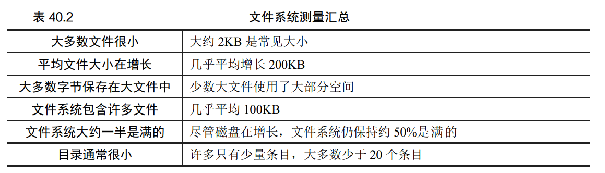
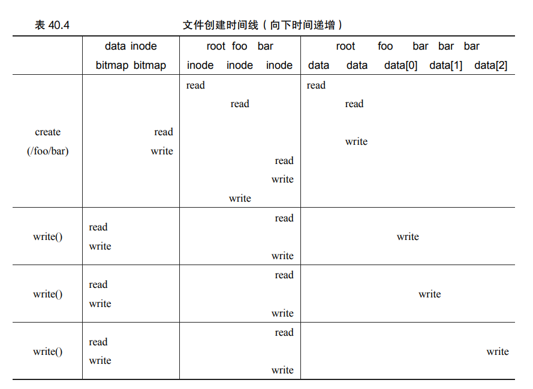

**文件系统是纯软件**

* 文件系统的数据结构
  * 数据块block
  * inode
  * 分配结构：记录inode是空闲的还是已经分配的，eg：**位图**：每个位用于指示相应的对象/块是空闲（0） 还是正在使用（1）
  * 超级块：特定文件信息，如：inode和数据块个数，文件系统类型等

* 文件系统的访问方法

## 文件组织：inode

> 文件系统中除了用户数据外，其他任何信息通常都称为**元数据**

文件很大时怎么办？如下

### 多级索引

利用一定比例的间接指针和直接指针，其中间接指针指向包含更多指针的块。而直接指针指向用户数据。	

### 范围

用一个磁盘指针加一个长度来指向很大的文件，缺点是分配文件时可能无法找到连续可用的磁盘块

### 基于链接的方法

用链表设计inode，为了使得这种连接式分配更好工作，系统可以在内存中保留**链接信息表**，而非将下一个指针和数据块本身一起储存，

这样的下一个指针表使其可以有效进行随机文件访问。这样的表就是所谓的**文件分配表**

## 目录组织

一个目录基本上只包含一个二元组（条目名称，inode 号）的列表。

## 空闲空间管理

在VSFS中，用两个**位图**完成空闲空间管理

> 一些 Linux 文件系统 （如 ext2 和 ext3）在创建新文件并需要数据块时，会寻找一系列空闲块（如 8 块）。通过找到这样一系列空闲块，然后将它们分配给新创建的文件，文件系统保证文件的一部分将在 磁盘上并且是连续的，从而提高性能。因此，这种预分配（pre-allocation）策略，是为数据块分配空间时的常用启发式方法

## 访问路径：读取和写入 

### 从磁盘读取文件

1. 寻找**根目录inode**，寻找inode就要找到i_number，根没有父目录，**根目录inode号**必须是众所周知，**在linux中一般是2**
2. 一旦 inode 被读入，文件系统可以在其中查找指向数据块的指针，数据块包含根目录的内容。因此，文件系统将使用这些磁盘上的指针来读取目录，找到下一个需要的文件/目录的inode号。
3. 递归遍历路径名，直到找到所需的 inode，将其读入内存，**进行权限检查**，在每个进程的打开文件表中，为此进程分配一个文件描述符，并将它返回给用户。打开后，程序可以发出 read()系统调用，从文件中读取。

### 写入磁盘

与读取不同之处：写入文件可能分配一个空闲的新块，要更新其他结构如数据位图和inode。

* **每次写入文件在逻辑上会导致 5 个 I/O**：一个读取数据位图（然后更新以标记新分配的块被使用），一个写入位图（将它的新状态存入磁盘），再是两次读取，然后写入 inode（用新块的位置更新），最后一次写入真正的数据块本身

* 要创建一个文件，文件 系统不仅要分配一个 inode，还要在包含新文件的目录中分配空间。这样做的 I/O 工作总量 非常大：一个读取 inode 位图（查找空闲 inode），一个写入 inode 位图（将其标记为已分配）， 一个写入新的 inode 本身（初始化它），一个写入目录的数据（将文件的高级名称链接到它 的 inode 号），以及一个读写目录 inode 以便更新它。如果目录需要增长以容纳新条目，则还 需要额外的 I/O（即数据位图和新目录块）。所有这些只是为了创建一个文件！

### 缓存和缓冲

* 静态内存分划

​		早期文件系统引入一个固定大小的缓存（fixed-size cache）来保存常用的块。这个固定大小的缓存通常会在启动时分配，大约占总内存的 10%。

* 动态划分

  将**虚拟内存页面和文件系统页面集成到统一页面缓存中**，可以在虚拟内存和文件系统之间更灵活地分配内存，具体取决于在给定时 间哪种内存需要更多的内存

  **高速缓存不能减少写入流量**，但还是具有有点：

  1. 通过延迟写入，文件系统可以将一些更新编成一批（batch），放入一组较小的 I/O 中，减少I/O次数
  2. 通过将一些写入缓冲在内存中，系统可以调度（schedule）后续的 I/O，从而提高性能
  3. 一些写入可以 通过拖延来完全避免。例如，如果应用程序创建文件并将其删除，则将文件创建延迟写入 磁盘，可以完全避免（avoid）写入。

总结：

* **目录只是“存储名称→inode 号”映射的特定类型的文件**

* 文件系统通常使用诸如位图的结构，来记录哪些 inode 或数据块是空闲的或已分配的