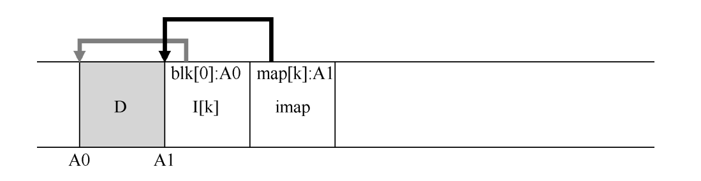

* 日志文件系统LFS在写入磁盘时，LFS 首先**将所有更新（包括元数据！）缓冲在内存段**中。当段已满时，它会在**一次长时间的顺序传输中写入磁盘**，并传输到磁盘的未使用部分。
* LFS 永远不会覆写现有数据，而是始终将段写入空闲位置。
* 由于段很大，因此可以有效地使用磁盘，并且文件系统的性能接近其峰值
* 顺序写入的性能不好，LFS使用**写入缓冲**：在写入磁盘之前，LFS 会跟踪内存中的更新。收到足够数量的更新时，会立即将它们写入磁盘， 从而确保有效使用磁盘，写入的大块更新叫做段。
* FFS 将 inode 表拆分为块并 在每个柱面组中放置一组 inode。

如何查找inode？

* LFS 的设计者通过名为 **inode 映射**（inode map，imap）的数据结构， 在 inode 号和 inode 之间引入了一个间接层（level of indirection），IMAP将inode号作为输入，生成最新版本的inode的磁盘地址，通常用**数组**实现

* LFS将inode映射的块放在它写入所有其他新信息的位置旁边

  

**文件系统必须在磁盘上有一些固定且已知的位置，才能开始文件查找**，LFS上这个位置叫**检查点区域CR**，CR包含指向最新inode映射片段的指针

* 检查点区域定期更新，因此性能不会受到影响

### 从磁盘读取文件

1. 读取检查点区域获取指向整个inode映射的指针，读入整个inode指针并将其缓存在内存中
2. 给定文件inode号，从IMAP中查找到inode地址，读入最新inode
3. 从文件读取块，使用直接指针或间接指针或双重间接指针

LFS 在读取过程中所做的额外工作是在 imap 中查很 inode 的地址

* LFS利用inode映射解决了**递归更新问题**，更新inode不会反映在目录本身，而是更新imap。避免递归更新目录。
* 为了确保 CR 更新以原子方式发生，LFS 实际上保留了两个 CR，每个位于磁盘的一端，并交替写入它们

LFS更新间隔30s左右，留下的快照可能很久，如何改进？

* 使用**前滚技术**：从最后一个检查点区域开始，很到日志的结尾（包含在 CR 中），然 后使用它来读取下一个段，并查看其中是否有任何有效更新。如果有，LFS 会相应地更新文件系统，从而恢复自上一个检查点以来写入的大部分数据和元数据。

