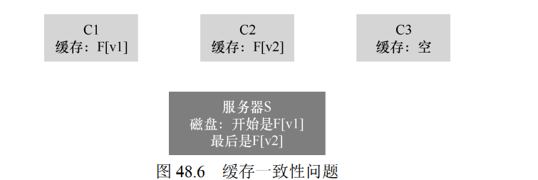

* 无状态协议实现快速崩溃恢复
* 幂等性：如果操作执行多次的效果与执行一次的效果相同，该操作就是幂等的

* 利用客户端缓存，使得第一次访问昂贵，但是后续访问能很快从客户端内存中获取服务
* 缓存用于写入的临时缓冲区可以让客户端应用把数据缓存在客户端内存，因此应用程序调用write（）能马上成功（只是把数据放入客户端文件系统的缓存），只是稍后才会将数据写入文件服务器

缓存一致性问题

1. C2写入操作可能先写到缓存，后面再写到服务器，可能产生C2更新文件了，C3读取还是Fv1
2. 服务器更新后，C1从自己的缓存读取的仍然是旧版本