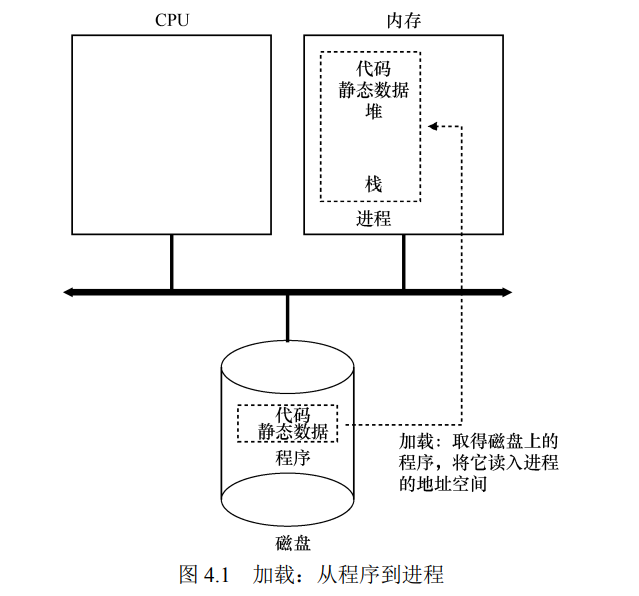
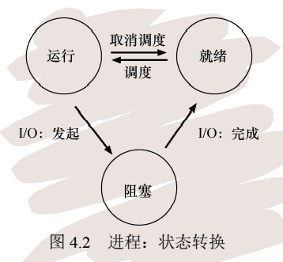

# 4.1 抽象：进程

* 进程非正式定义：**运行中的程序**
* 要实现CPU虚拟化，操作系统需要一些**低级机制**和**高级策略**
* 进程的机器状态：内存和寄存器

# 4.2 进程API

* 创建
* 销毁
* 等待
* 其他控制
* 状态

# 4.3 进程创建

- 操作系统首先将代码和静态数据加载到进程的内存地址空间
- 分配一些内存作为进程运行时的栈(用于存放局部变量,函数参数,返回地址))
- 分配一些内存作为进程的堆(heap),(用于存放动态分配的数据)
- 其它初始任务:
  - 一般会默认分配三个输出流:标准输入流(input),标准输出流(output),标准错误流(error)
- 最后:跳到程序执行入口即main()运行

# 4.3进程的状态

- 运行(Running):正在执行指令

- 就绪(Ready):进程已经准备好运行,因为某些原因操作系统没选择它运行

- 阻塞(Block):执行了某些操作(比如I/O操作),直到某些事件发生才会准备运行 

  

# 4.4 进程相关的数据结构

- context : 进程相关的寄存器内容,当切换进程时会将该进程的寄存器内容存起来,当再次切换回来的时候将之前存起来的寄存器内容一一加载到真实的寄存器中 
- proc_state: 进程的状态枚举 
- proc: 进程的相关信息,包括进程id,父进程id,context的引用,proc_state值等 