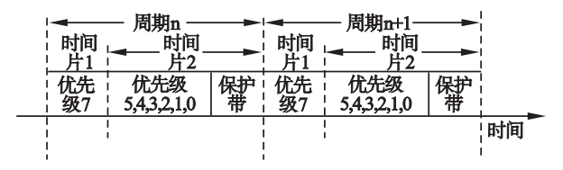

暂时将数据分为三种：

* 周期性实时数据（优先级7）
* 非实时数据（优先级5 4 3 2 1 0）
* 非周期实时性数据（优先级6）

## 基于时间感知通信时间划分的设计

在时间片的分割上：



> 保护带部分可以设一个单独的gcl的entry将bitvector全部置0

* 优先级6的非周期性实时数据可以在除了周期性实时数据通信时间外的任何时间通信

* 时间片长度的划分根据实际情况在配置文件中进行调整(gcl中的length)

* 周期性利用Timer实现：

  timer中可以周期性取出和放回ticker，设置三个ticker分别对应时间片1，2 和保护带，与图中稍显不同

  .......

##  基于加权轮询的门控制调度算法的设计

* 处理第二个时间片中不同优先级的门控列表
* 为了防止低优先级饥饿，不能完全采取高优先级优先策略
* 采用加权轮询政策，把发送的字节数和队列的优先级加权求和，根据加权进行队列发送

* 在第二个时间片里面如果遇到了优先级6的实时性数据，则不考虑权重问题，优先发送实时性数据

```c
//进行加权轮询所需参数
int priority[5];
int weight[5];
int Head_size[5];//第i个队列头部数据帧长度
int num = 6;//队列总数
int Max_byte[5];//第i个队列允许连续发送最大字节数，用来防止饥饿的关键参数
int Send_byte[5];//第i个队列已经发送的字节数

//加权初始化
for(int i = 0;i < num;i++)
{
	priority[i] = i;
	weight[i] = 2 * priority[i] + 1;//暂定如此处理加权和优先级关系
}

//初始化各优先级队列能够发送的最大字节数
for(int i = 0;i < num;i++)
{
	Max_byte[i] = 1522 * (priority[i] + 1);//1522是802.1Q数据帧最大字节数，加1是保证优先级0最大字节数非0
}


//在第二个时间片内进行轮询

//当优先级6的队列有东西的时候优先出队
//优先级6没有数据则开始加权轮询
int chosen = 0;//确定最高优先级的队列索引
//选择权重最高队列
for(int i = 1;i < num;i++)
{
	if(weight[i] > weight[chosen])
	{
		chosen = i;
	}
}
if(weight[chosen] == 0)//所有队列权重都减为0了
{
    for(int i = 0;i < num;i++)
	{
		weight[i] = 2 * priority[i] + 1;//重新初始化权重
	}
    for(int i = 1;i < num;i++)//重新选择最高权重队列
	{
		if(weight[i] > weight[chosen])
		{
			chosen = i;
		}
	}
}
int flag = 0;//标记是否找到能发的最高权重队列了
while(flag == 0)
{
    if(Send_byte[chosen] < Max_byte[chosen])//该队列已发送的字节数小于最大连续发送字节数
	{
		Send_byte[chosen] += Head_size[chosen];
		weight[chosen] -= 1;
        flag = 1;
	}
	else//该队列发送的字节数大于等于允许发送最大连续字节数，换个队列发
	{
		Send_byte[chosen] = 0;
		int k = 0;
		for(int i = 1;i < num;i++)
		{
			if(i == chosen)
				continue;
			if(weight[i] > weight[k])
				k = i;
		}
		chosen = k;
	}
}
//初始化Head_size,即每个IEEE8021Queue中的innerbuffer中的m_buffer双边队列中第一个framebody的byte数
//可以在TransmissionSeletion的dequeue之前进行初始化
//当dequeue后，Head_size不用马上更新，会在下一个dequeue之前被更新
```

* 这些变量或许可以在QueueContext中声明，在后续其他文件中需要的时候用extern声明一下


