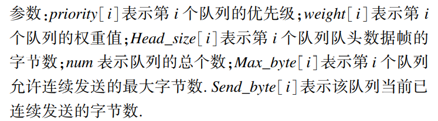

## 传输选择算法：CBS算法

* 当队列中没有可用的帧时，该队列的信用将设置为零。如果**信用为非负数，则队列有资格进行传输**。当队列中的令牌帧增加时，信用值以空闲率增加，而在发送帧时，以发送率减少信用值。当信用值小于 0 时， 则停止发送。
* 空闲率是为网桥中的特定队列和流量类别保留的实际带宽（以每秒比特数为单位），而发送率是底层 MAC 服务支持的端口传输速率（以每秒比特数 为单位）。

* CBS 限制每个整形流量的类别，使其不超过其预先配置的带宽限制，其 结合 SRP 协议可将延迟限制在每个网桥 250 µs 以下

## 基于TAS的分级交叉（HC-TAS）流量调度机制

* 在TAS的基础上增加了低优先级流量处理发送模块

## 基于模糊控制的限制抢占调度方法

* 根据剩余时间比例与剩余传输比例的差值和流量优先级制定的模糊准则允许AVB流量对BE流量的抢占，降低较高优先级流量的延时，并在一定程度上减小频繁抢占带来的带宽浪费

## TAS-WRR 调度算法

------基于时间感知整形器的加权轮询

* 首先,该算法根据通信需求,将数据**划分不同优先级**.
* 其次,为保证数据通信的周期性和实时性,将通信时间**划分周期**,并为**高优先级**的实时数据**预留带宽**. 
* 最后,采用**加权轮询调度**的方式,在保证高优先级数据通信质量的同时,有效的减少低优先级数据的饥饿现象.

### 基于时间感知通信时间划分的设计

利用门控制列表,将通信时间进行周期性划分,同时每个周期又划分为两个时间片. 最高优先级队列在第 1 个时间片 内将门状态设置为开启,允许周期性实时数据进行转发通信; 优先级 0 ~ 5 的队列在第 2 个时间片内将门状态设置为开启, 允许非实时性进行转发通信;**非周期性实时数据不受门状态的控制**,在周期性实时数据的发送间隔内进行转发通信,并可以**抢占低优先级非实时性数据的发送**. 在每个周期的末尾设置一个保护带,在保护带里禁止发送任何数据,避免因上个周 期数据帧传送未完成而对下个周期数据传送造成影响. 通信 时间的划分如图 3 所示：

周期性实时数据：7优先级，在每个周期的第一个时间片打开

非周期性实时数据：6优先级，不受门控列表控制，可以抢占低优先级的非周期非实时数据，在周期性实时数据通信空闲时进行转发

非周期非实时数据：0~5优先级，受门控列表控制，在每个周期的第二个时间片打开

### 基于加权轮询的门控制调度算法的设计

* 优先级越高，权重越大，能发送的最大字节数越多
* 

