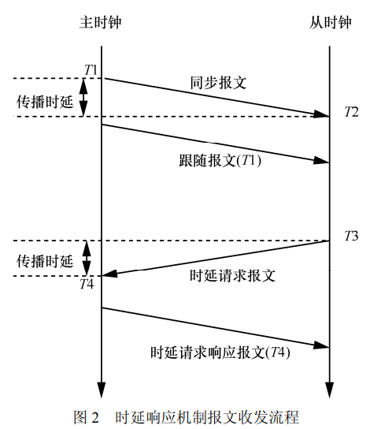
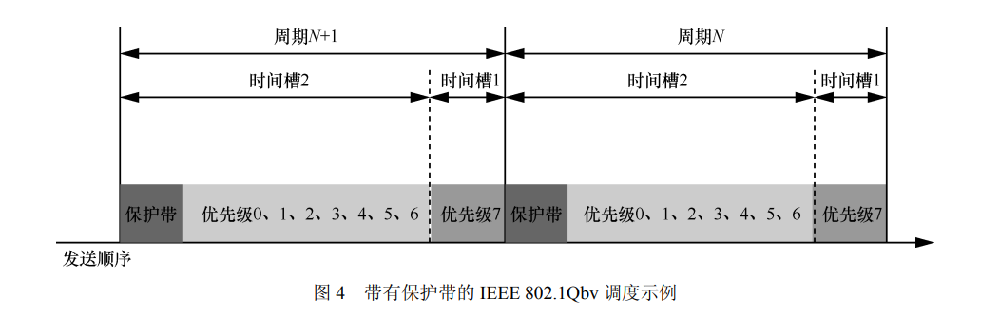
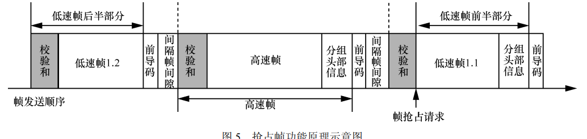
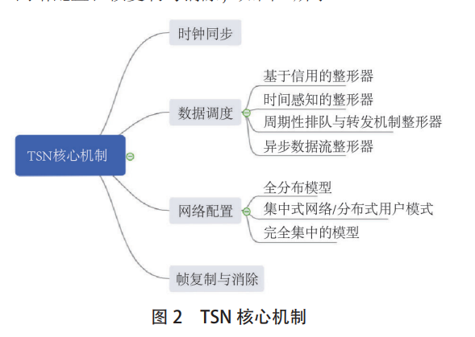
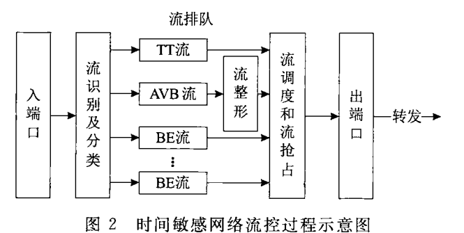
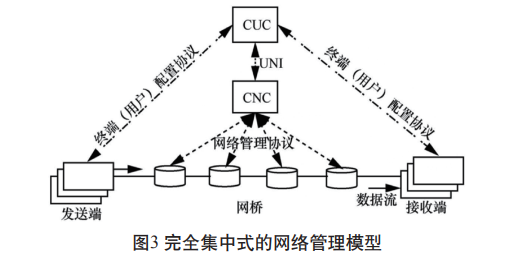
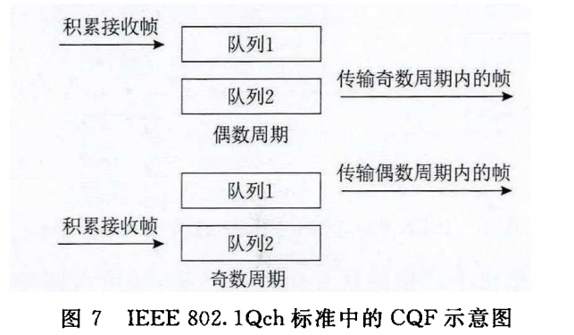
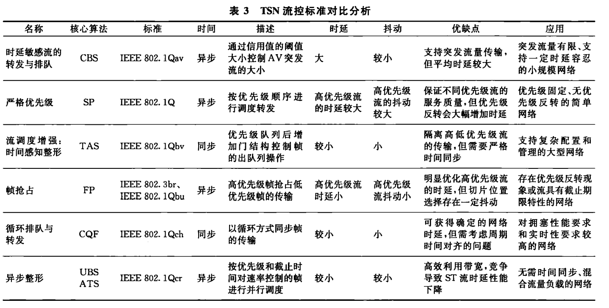
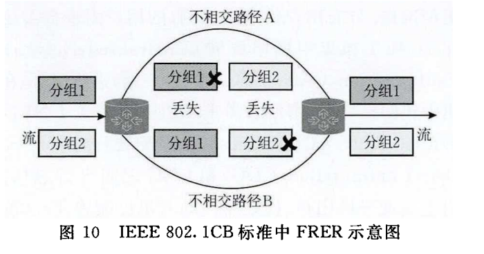
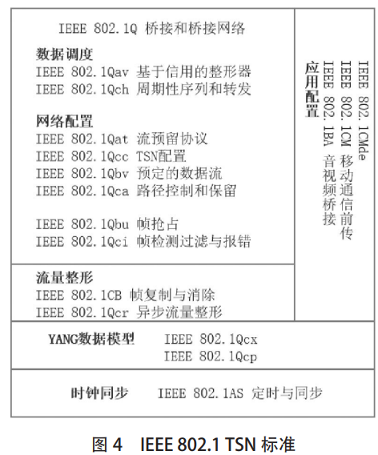

## TSN简介

时间敏感网络（time-sensitive  networking，TSN）技术提供基于**时间同步**的**周期性流量整形及调度、数据无缝冗余传输、路径预留和网络配置**等，从而能够满足时间敏感型应用的要求。

### TSN特点

1. 时间同步

   TSN 利用 **IEEE 802.1AS** 在各个时间感知系统之间传递同步消息，提供精确的时间同步

   主时钟周期性地发送 sync 报文，并根据主时 钟记录下精确发送时间 T1，从时钟在接收到 sync 报文时记录到达时间 T2

   两种机制获取T1：

   1. 单步时间同步，sync报文含有T1，从时钟解析报文获取
   2. 两部时间同步，后继发送的fellow-up把T1的值传给从时钟，如图，**该机制有更好的兼容性**，在不支持给报文打时间戳的设备之 间也可以正常使用。

   

2. 确定性传输/调度和流量整形

   TSN 通过对数据流量的整形、无缝冗余传输、过滤和基于优先级调度等，实现对关键数据的**高可靠、低时延、零分组丢失**的确定性传输

   * 流量调度

     IEEE  802.1Qbv，使用八个优先级，基于时分多址，将以太网通信分为固定长度时间片，即周期，每个周期又分成更细粒度的时间槽，每个槽可以分配给八个优先级的一个或多个。

     保护带机制：在每个周期结束前设置规定一个时间段，称之为保护带，通过这一操作来确保在周期切换中不存在有帧正在传输的现象，保护带中不允许有新帧开始传输

     

   * 帧抢占

     帧抢占不可嵌套，只能应用在全双工点对点的链路中，每个独立传输的切片需要大于或等于 64 byte（传统以太网中的最小帧）

     

   * IEEE 802.1Qav 队列及转发协议

     将时间敏感数据流帧的优先级设置为最高，和普通数据流帧分类，保证时间敏感流正常传输的条件下，继续提供普通异步传输的服务

3. 网络的动态配置

   TSN 通过 **IEEE 802.1Qcc** 引入集中网络控制器（centralized network configuration，CNC）和集中用户控制器（centralized user configuration， CUC）来实现网络的动态配置，在网络运行时灵活地配置新的设备和数据流。

4. 兼容性

   TSN以传统以太网为基础，是开放的以太网标准而非专用协议，不同供应商的TSN都可以互相兼容

5. 安全

   TSN 利用 **IEEE 802.1Qci** 对输入交换机的数据进行筛选和管控

### TSN核心机制

### TSN 流控过程

1. 流识别

   以太网帧头中 IEEE 802.1Q VLAN 标签内的优先级代码点（PCP）字段和 VLAN 识别符（VID）定义了 TSN 流的标识

2. 流同步

   IEEE  802.1AS 通过在 gPTP 域的时间感知系统之间传递相关时间事件消息来完成网络设备间的同步。

   gPTP同步机制：**最佳主时钟算法**

3. 流管理

   支持静态或者动态网络配置，通过减少预留消息的大小和频率改善原有的 流预留协议SRP，仅通过链路状态或预留变化来触发更新

   

4. 流控制

   * IEEE 802.1Qbv 排队与转发

     

   * IEEE 802.1Qbu 帧抢占

     高 优 先 级 的 帧 通 过 切 片 动 作 对 低 优 先 级 帧 的 传 输 进 行 打 断 ． 然 后 在 一 个 帧 间 间 隔 后 进 行 传 输 ． 而 已 传 输 的 低 优 先 级 帧 在 等 待 高 优 先 级 帧 传 完 后 补 全 为 完 整 的 帧

   * IEEE 802.1Qch 循环排队和转发

     

   

5. 流完整性

   * IEEE 802.1CB 帧复制和消除

     FRER对即将进行传输的帧进行复制并产生冗余帧，然 后在不相交的网络路径上对两者同时进行多径转发．若两个帧都到达目的地后，便删除重复的帧．

     

   * IEEE 802.1Qca 路径控制和预留

     预先为每个流定义受保护的路径设置，带宽预留，数据流冗余（包括保护和恢复），流同步及流控制等信息，解决网络中传统异步流量与实时流量之间的资源竞争问题

     显示路径转发方式允许网络按照业务QoS需求和用户需求灵活分配，SDN集中式控制还能管理冗余显示转发路径将其作为保护路径。

   * IEEE 802.1Qci 逐流过滤和监管

     1.  过滤： 根据流ID和优先级，过滤规范和策略等信息对流进行逐一过滤 
     2.  门控：对过滤后的流进行有序的组织和传输 ；

     3.  计量：对通过门控后的流执行预先配置的带宽分配策略

   

### TSN应用场景

* 车载网络
* 工业物联网：标准不统一
* 航空电子网络
* 移动前传网络