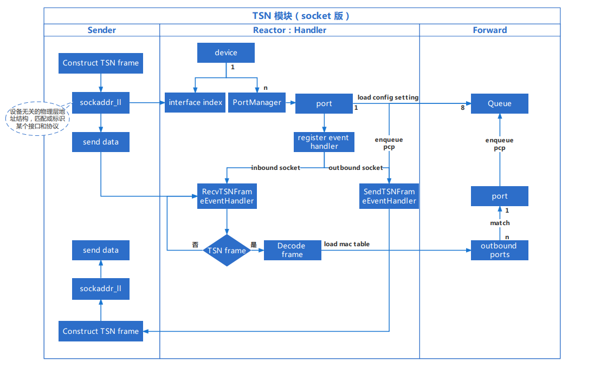
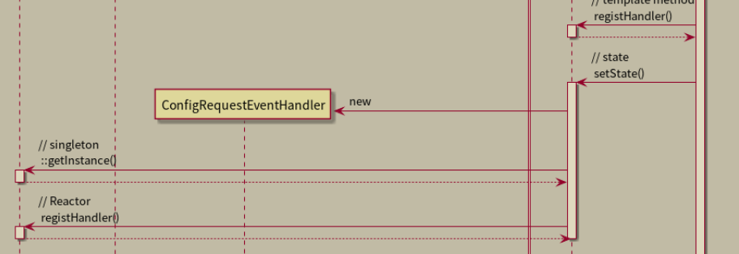
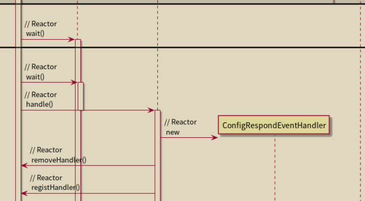

**ConfigQeqChart**流程：

* 先获取一个TSNContext和Reactor的实例，均为唯一实例。（**我们要完成的Timer就在TSNContext的构造函数里**）

* 随后Reactor会新建一个Selector，同时TSNContext这里初始化其状态，随后在InitTSNContextState的doAction函数中的setState函数中完成TSNContext状态的设置和PortManager的创建。

* 新建一个PortManager，其中的ConfigPort和CreationPortState随之初始化，

  * 根据PortState的doAction函数调用实例方法，进行socket的创建，Mac地址的设置和问题处理程序Handler的注册，最后设置ConfigPort的state为creation state

    此处的ConfigRequestEventHandler是啥？

    

  * 获取Reactor的实例，并完成相应事件处理程序的注册，上一步PortState中对事件处理程序的注册在此处才真正实现。

  * 完成对Port的创建，将Port的State调整为UP State，至此从PortManager中构建一个Port的过程圆满完成。

以上步骤完成了InitTSNContextState的操作，初始化了一个TSNContext，接下来开始真正使用它

* new一个RunTSNContextState，在doAction中设置context的状态，随后获取Reactor，开始进行循环等待

  此时给了一个Configuration Case描述Reactor的执行

  * 在遇到事件需要处理，又new了一个ConfigRespondEventHandler？

    

  * 随后完成第一个事件，移除Handler

  * 然后又注册了一个Handler？

  * 获取了一个TSNConfigurationClient的实例，调用requstConfig函数让Client把数据发给TSNConfigurationSever，Sever再返回一段数据

  * Reactor接收到Sever的数据后可以执行事件处理，向client执行writebuffer，同时等待client返回ack，完成doConfig成功配置TSNContext

  最终完成事件，移除Handler，ConfigRespondEventHandler又对PortManager执行了enableDataPort函数，该函数有何作用？

## 转发模块

* 先根据设备名称创建一个port，创建其raw socket

  > raw socket可以工作在网络层或者数据链路层，而其他类型套接字工作在传输层

* 设置它的portstate为creation，创建用于接收的inbound socket和用于发送的outbound socket

* 根据设备名称创建链路层接口，初始化链路层接口类对象，根据名称查找符合 name 的网卡设备，找到后创建接口赋值给上面初始化的接口对象变量

* 创建linklayerinterface要获取接口的索引（用套接字和ioctl函数获取）和mac地址（网卡设备name的唯一mac地址）

  > 接口索引有何作用？

* 成功创建完链路层接口后，根据其mac地址设置data port的mac地址，再将接收数据的inbound socket和interface绑定在一起，实现port和interface的绑定

* 创建QueueContext，往里面放入八条优先级queue

* 注册收发数据的事件处理程序

* 载入MacTable

* 触发write event，sendTSNFrameEventHandler响应，从QueueContext中尝试获取data构造TSNFrame

* QueueContext调用TransmissionSelection的dequeue，根据调度算法判断各优先级队列是否应该出队，此时每个队是IEEEQueue，调用其dequeue，其中再调用innerbuffer的dequeue这才真正出队数据

* 根据优先级把所有队列出队，获取数据构造TSN帧，将其发送

* 如果是触发了接收事件，则通过Recv的事件处理程序获取数据，构造tsn帧，进行转发

* Forward函数响应，获取发送数据包用的outbound socket，随后进行根据**目的**mac地址往对应的port进行转发操作

* **此处完成单播和多播**：ForwardFunction

* 暂时限制只能发送给portmanager中索引为0的端口

* 向指定端口存入帧，还是QueueContext的入队调用IEEE8021Queue的入队，IEEE8021再调用innerbuffer的入队

  > 此处直接获取portmanager的实例，这个portmanager是如何构造的？（ForwardFunction 27行）

## newsocket

* 先用socket函数提交一个创建socket的申请，获取套接字描述符用于后续查找网卡信息
* 用上述创建的套接字描述符作为ioctl函数参数，获取**源MAC地址**
* 利用 if_nametoindex 函数把网卡名称转换为索引并储存在sockaddr_ll结构中
* 设置目的MAC地址
* 填充物理层地址
* 填充以太网帧（目的地址，源地址，数据包类型，数据包）
* 创建真正用于发送的socket
* 将以太网帧送出