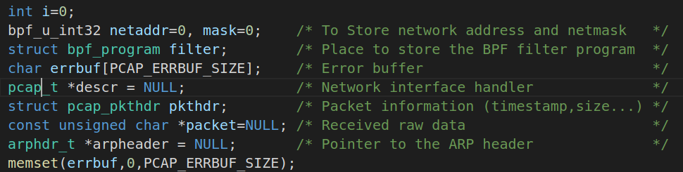

## Reactor模型

* **基于事件驱动**

* 与普通函数有何不同？

  * 普通的函数处理机制为：调用某函数-> 函数执行， 主程序等待阻塞-> 函数将结果返回给主程序-> 主程序继续执行

  * `Reactor`事件处理机制为：主程序将事件以及对应事件处理的方法在`Reactor`上进行注册, 如果相应的事件发生，`Reactor`将会主动调用事件注册的接口，即 **回调函数**. 

    `libevent`即为封装了`epoll`并注册相应的事件(I/O读写，时间事件，信号事件)以及回调函数，实现的事件驱动的框架。

* Reactor事件处理的流程：

  

  详细描述：[深入理解Reactor 网络编程模型 - 知乎 (zhihu.com)](https://zhuanlan.zhihu.com/p/93612337)

## arpsniffer

### arpsniffer.h

定义了ARP，TCP，IP，以及以太网的头部结构体信息

> 地址解析协议（ARP）：将**网络层地址和链路层地址**进行**转换**的协议（IP地址--->MAC地址）,具体看笔记

### srpsniffer.cc

用pcap捕获数据报，用BFP过滤，再把过滤后的程序返回，如果最后数据包里面是我们假定的IPv4+以太网的类型就说明格式正确，打印ARP头部信息

> BFP:伯克利封包过滤器,类Unix系统上数据链路层的一种原始接口，提供原始链路层封包的收发

### faker_arp.cc

从命令行参数获取源和目的IP地址，Mac地址，然后用pcap去捕获指定的网络流量，然后用libnet构造ARP和以太网的header

主要就是用pcap的各个函数获取：

* 网络设备指针名
* 设备ip和掩码
* 过滤流量等

## core

### forward

#### ForwardFunction

forward函数把数据包从发送到目的端口上，触发epollout事件，指示socket缓冲区可写

#### MacTable

对mac地址和forward pair组成的item进行增删改查（查的是对外的端口）

MacTable.c中描述了如何loadxml文件，对其进行解析，获取单播地址，多播地址等信息

forward pair：由对外端口集合和timeout组成

#### MulticastMacTable

multiMacTable就是在普通MacTable基础item中多了一个VLAN ID	

### port

#### ConsolePort

继承Iport，并增添如下变量：

#### CreationPortState

创建Iport实例，设置状态为creation state，创建新的套接字，并注册事件handler，还声明了一个openPCAP的函数等待后续使用。

#### DataPort

真正储存端口数据的类：

创建套接字的函数：

1. 创建inbound套接字
2. 创建outboud套接字
3. 创建链路层接口
4. 设置Mac地址

5. 把链路层接口和inbound套接字绑定
6. 创建队列文本

> inbound 和 outbound
>
> Outbound模式相较于嵌入式语言相比更强大，适合控制单腿的呼叫，实现复杂的IVR应用；而Inbound更适合接收所有的事件，与多条腿进行交互，进行更复杂的呼叫控制。其中，在Outbound模式中，又分为同步模式和异步模式，同步模式控制比较简单，但自由度较小；异步模式需要更多的编程技巧，但会更强大。
>
> Outbound模式的Socket是由FreeSWITCH建立的，它是建立在Channel的基础上的，每一个Channel均会为外部的TCP Server建立一个连接，在Channel挂机时释放，因此，Outbound的连接要考虑Channel的生命周期（即Socket的生命周期）。而Inbound的连接由客户端主动向FreeSWITCH发起连接，极需要考虑断线重连等问题。

注册EventHandler：

1. 填补设备无关的物理层地址结构
2. 分别注册inbound和outbound套接字

#### DownPortState

没看出和UpPortState有什么区别，应该是down state

#### UpPortState

将传入端口参数设置为up state

#### IPort

定义了对设备名称，ip，状态，mac地址等变量的获取和设置函数

定义了对收发套接字的获取设置

#### IPortState

在IPort改变的时候调用doAction执行对应操作

#### PortManager

在PortManager中定义了端口和设备名称集合的存储变量，以及端口过滤器的集合

除了对变量进行普通的获取修改，还能从设备名称列表创建新端口（要经过过滤）和向Reactor添加事件处理（还没找到bindEventHandler的实现）

### queue

#### GateControlList

* GateControlListItem：包含一个**时间间隔**成员和一个由**位数组组成的门控列表**成员

  * GateControlList：定义loadScheduleXML函数从xml文件获取周期和门控列表item

  

#### TransmissionGate

* 包含一个**pcp优先级指示代码**，一个指示该**门是否打开**的bool变量，一个**传递选择算法**

  

#### IQueue

* 一个有容量的**队列**，可以查询总容量和剩余容量，声明了一下queue的增删改查函数

#### InnerBuffer

* IFrameBody储存了一个数据包的结构类型成员RELAY_ENTITY

  

* InnerBuffer主要就是对m_buffer队列的增删改查操作

#### IEEE8021Queue

* 

#### TransmissionSelectionAlgorithm

* 定义了一个inner_buffer和一个优先级代码pcp和一个dequeue函数
* 有一个子类PriorityStrictTransmissionSelectionAlgorithm，不知道怎么体现的严格优先级

##### /question

该子类怎么和父类相比什么地方实现了严格优先级？

### TSNContextState

如果TSN的状态发生改变，做出相应的行为

* InitTSNContextState就是初始化状态信息
* RunTSNContextState指示的是运行状态

### TSNConfigurator

配置后面TSNContext的设备名称...

### TSNContext

包含**设备名称（从上面那个配置得到的），端口管理器和状态信息**三个变量、

除了对变量进行获取与设置的基本操作，还有一个getInstance用来返回TSNContext的**唯一实例**

### minitcpip

#### minitcpip

* 利用套接字实现tcp连接和数据包发送接收功能

#### tcpsyndos

* 定义一个用来检验TCP和IP校验和的结构体及函数，还有一个发送数据报函数
* 此处校验和算法：把高16位的数和低16位相加储存在低16位，再把结果右移16位加到原来的结果上，把可能存在的进位都加到低16位，然后取反

## networking

### frame

#### TSNFramBody

继承了IFramBody中的realy_entity，一个用于记录frame类型的结构体

#### RELAY_ENTITY

#### EnhancementTSNFrameBody 

相比于普通TSNFramBody，增加了一个流id和一个phase，暂时不知道干啥的

### interface

#### MacAddress

虽然继承了IAddress，但IAddress中啥也没有，自己定义的这些变量能用来构造一个sockaddr结构体

> htons:将整型变量从主机字节顺序转变成网络[字节顺序](https://baike.baidu.com/item/字节顺序/10059170)， 就是整数在地址空间存储方式变为高位字节存放在内存的低地址处。

#### LinkLayerInterface

包含链路层接口名，接口索引和mac地址

定义了把socket和sockaddr绑定的一个函数

### Selector

主要函数是对epoll里面的handle进行增删和更新操作，handle就是一个个事件源

### IEventHandler

事件处理，有三个子类承担不同事件的处理功能。

子类：

* ReadEventHandler 对事件源进行读操作

* ReadWriteEventHandler 说是读或者写操作都能做，但是ta没写读的操作，所以只能处理写

  

* RecvTSNFrameEventHandler

  接收数据，并且根据数据构建TSN帧，包括以太网头部，vlan-tag，r-tag，data和forward帧

* SendTSNFrameEventHandler

  从队列中获取数据构建TSN帧，然后发送数据

* StdinEventHandler

  从文件里面读取数据的读事件处理程序

### Reactor

定义了用于实现事件多路分发的demultiplexer，还有一个事件源和对应的事件处理程序的hashmap

函数：

* 实现了根据event_type设置event的toEpollEvent

* 还有根据event返回event_type的toEventType

* 向event_handler中注册或者注销某种特定事件类型的事件处理程序

* 处理事件源的函数

  

## timer

#### ITimer

sec：以秒为单位的时间戳

nsec：以纳秒为单位的时间戳，表示sec没有表示出来的小于1s的部分

在重载操作符中先比较sec，若是秒级别就能比较出来就不用再比较纳秒级

* 定义了一个ticker时钟类型

  

> C++实现反射类
>
> Reflector中实现，利用输入的参数建立对应类型的对象，需要建立一个工厂类用来生产相应对象，同时用map把传进来的string和工厂对象相映射，当有定义新类，就要在map中进行注册

#### PQTimer

##### /question

timer和clock，ticker具体是啥？

已知：timer计时器的设置需要获取ticker并且reset它，然后检查下一个ticker

* ITimer的子类

  

  定义了一个看着很高级的ticker heap，不知有何作用，.h文件其中函数主要是对ticker的增删改查

  * `sigevent`的作用是为Linux/Unix系统调用函数API提供一个调用接口的通用参数；这类API的作用以某种特定的方式来通知进程到达的事件。API根据`sigevent`提供的结构，来具体处理有关信息。

  * timespec提供纳秒精度时间nsec和秒精度sec

  * itimerspec：

    

  * sigaction:用于信号处理动作

    

* PQTimer构造函数完成了时钟的设置和计时器的构造两个步骤

#### RealTimeClock

* 根据当前的时间构建真正的时钟

#### TimeContext

* 利用反射类获取PQTimer类型的对象实例，还有一个private的ITimer对象

* TimeContext的实例同样是用static函数来获取唯一实例

  

