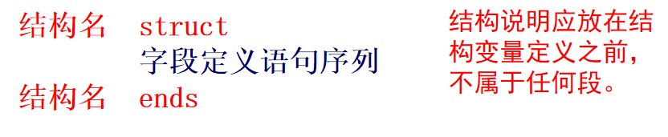
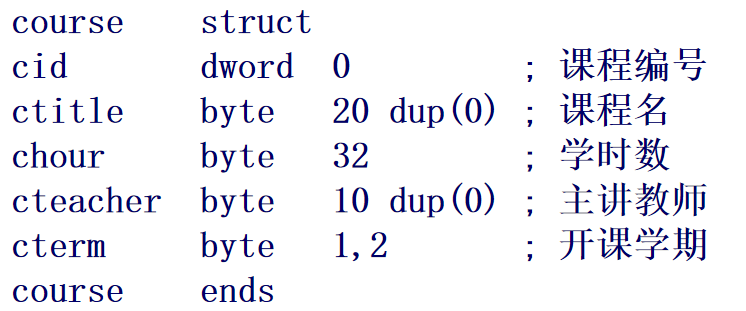
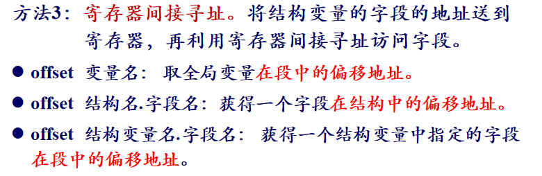

## 10.1 结构体

* 定义结构变量：**变量名  结构名  <字段赋值表 >**
* 如果不对结构变量重新赋值，则可省去字段赋值表，但仍必须保留一对尖括号。

* 各字段值的排列顺序及类型应与结构说明时的各字段相一致，中间用逗号分隔;

* 如果某字段用其声明时候的初始值，字段赋值表里面就用**逗号**代替

* **定义结构变量的时候，不能对含有多个项目的字段重新赋值，要修改值，只能通过访问结构体成员的指令来完成**

  eg：下图的cterm

  

访问结构成员方法：

1. 结构变量名.结构字段名
2. 构首址先存入某个寄存器, 用**“[寄存器名]” 代替结构变量名**。所选择的寄存器必须满足变址寻址的要求
3. 

## 10.2 结构变量的数据存储

* 在汇编程序中可以使用伪指令“align bound”来对齐字段或变量的边界，其中bound的取值为1、2、4、8、16，即2的n次方

## 10.3 union结构体

联合体名称  union
    字段定义
联合体名称  ends