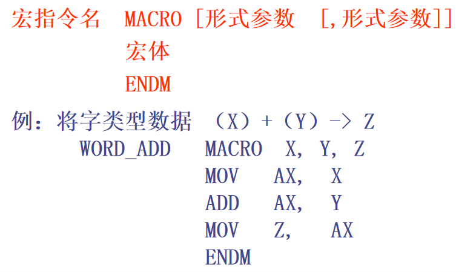

## 11.1 多模块程序设计

1. 公共符号：在一个模块中定义，其它模块要用到的符号

   PUBLIC  符号 [,符号]

2. 外部符号：在一个模块内访问而不在该模块内定义的符号。
   语句格式（EXTRN / EXTERN）：
       EXTERN 符号:类型 [,符号:类型 ]
   例如：
        EXTERN  avg : near
        EXTERN  V : dword

## 11.2 C程序和汇编程序的混合

* C/C++中区分函数名大小写，汇编程序中不区分
* 在汇编程序中，函数原型说明伪指令proto。

## 11.3 内嵌汇编

* __asm 
  {
      汇编语言指令序列
  }__
* asm  汇编语言指令

## 11.5 宏定义

* 宏名字可以与其它变量、标号、保留字同名，汇编程序在处理时，宏名字优先级最高
* 调用格式：宏指令名 [实在参数[，实在参数]]