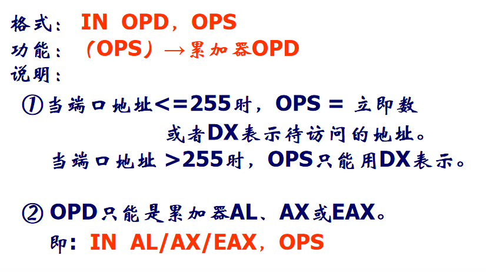
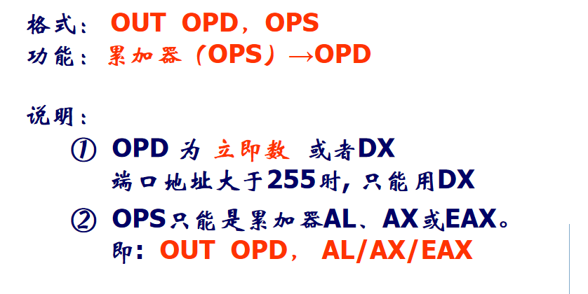
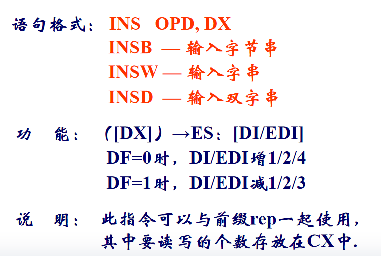
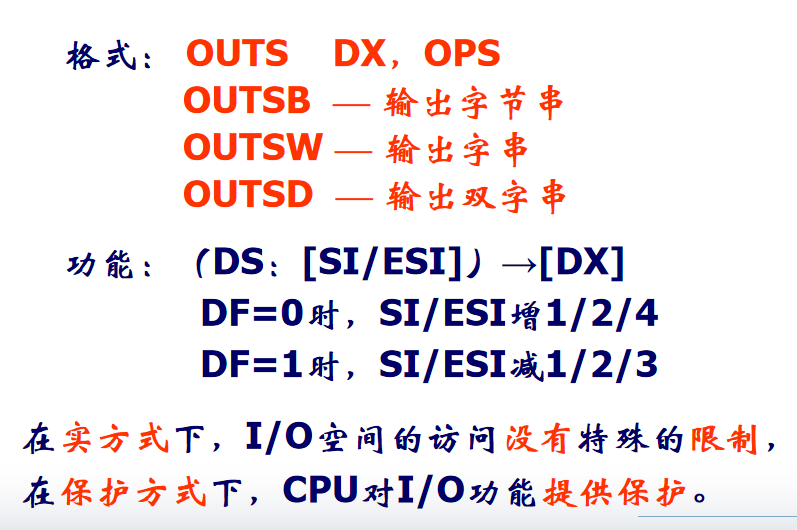
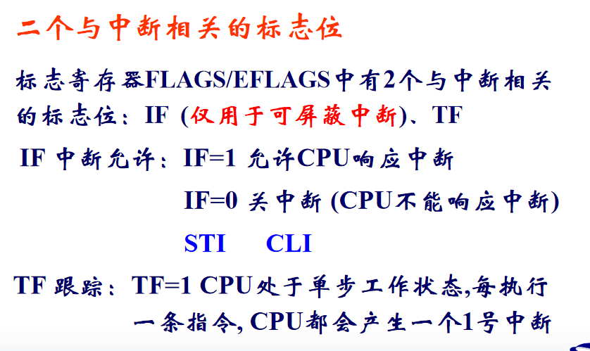

## 12.1 输入输出指令

1. 输入指令

   

2. 输出指令

   

3. 串输入指令

   

4. 串输出指令

   

## 12.2 中断与异常

* 外部中断：**中断**，具有随机性
* 内部终端：**异常**，与CPU状态和当前执行的指令有关
* 一般的中断处理程序执行后会返回到被中断处继续执行.

异常：

* 故障

  故障异常是在引起异常的指令之前或者指令执行期间，在检测到故障或者预先定义的条件不能满足时产生。

* 陷阱

  在执行引起异常的指令之后，把异常情况通知给系统

* 中止

  中止是在系统出现严重问题时通知系统的一种异常

* 软中断指令：INT n

* 中断返回指令：IRET 

  恢复断点地址和标志寄存器内容