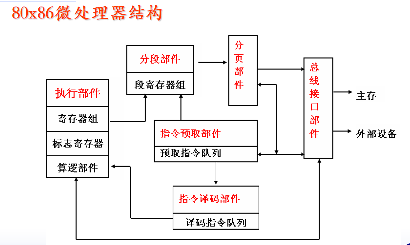

* 下一条指令的偏移地址(简称EA)总是保存在指令指示器EIP

* 寄存器组由8个32位通用寄存器：4个数据寄存器和4个指示器变址寄存器组成

  **数据寄存器**：EAX EBX ECX EDX

  **指示器变址寄存器组**：ESI, EDI, ESP, EBP

* C 程序中的全局变量存储在数据段中；局部变量和函数参数则存储在堆栈段中。

* 标志寄存器是CPU内部的**逻辑寄存器**

* 条件标志位

  SF：符号标志

  ZF：零标志

  OF：溢出标志	

  加法：2个同符号数相加，结果的**符号位发生了改变**，则 OF=1。

  减法：若被减数与减数的符号位不同，结果的最高位与被减数的最高位不同，则OF=1; 否则OF=0

  CF：进位标志
  
  PF（奇偶标志） =1 数据最低8位中1的个数为偶数 =0 数据最低8位中1的个数为奇数；