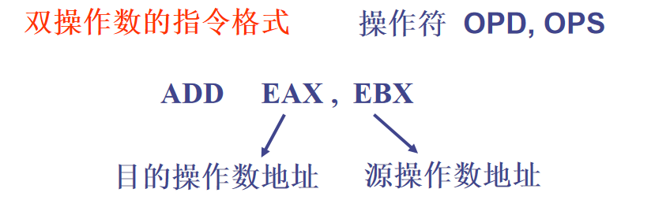
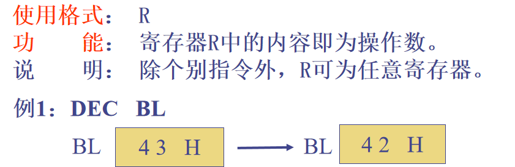
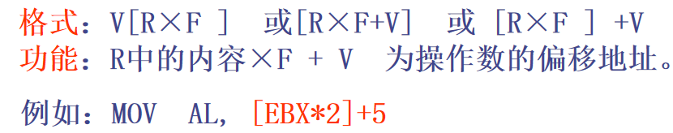
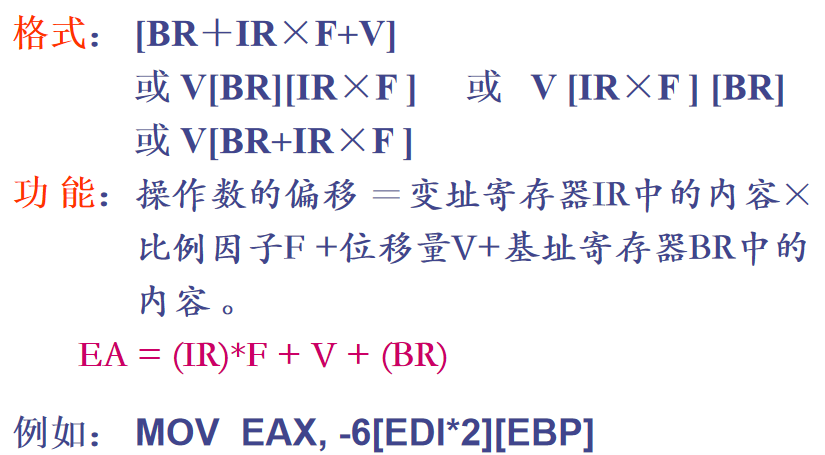

## 4.1 寻址方式概述

## 4.2 立即寻址

* 立即操作数只能作为源操作数
* 字符，字符串，由常量组成的数值表达式都是立即数
* 取一个段的段地址和变量的偏移地址得到的是立即数

## 4.3 寄存器寻址

## 4.4 直接寻址

* 变量的形式可类比**一维数组**
* **C不能作为变量名**

## 4.5 寄存器间接寻址

* **类比指针理解**

## 4.6 变址寻址

* 当R是16位寄存器或为ESP时，F只能为1，否则F可为1，2，4，8
* R可以是八个32位通用寄存器任意一个，或 BX,SI,DI,BP

## 4.7 基址加变址寻址

* **类比二维数组**
* 对于32位段（保护模式），在 VS2019中各个段定义的变量都是全局变量，**(DS) = (SS)**，操作数（包括代码段）的段地址是DS。
* 在机器指令中，变量名消失，以相应的偏移地址替换之。即：**凡是出现变量名的地方，都会以相应的偏移地址替换之**；

补充：

**一条指令的源操作数和目的操作数不能同时用存储器方式。**