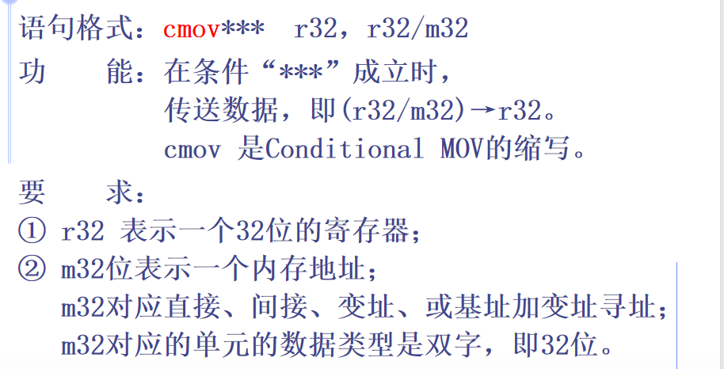

## 5.1 表达式

SHR右移，SHL左移，MOD模除，AND逻辑乘，OR逻辑加，XOR按位加，NOT逻辑非

* 算符优先级

* 表达式有5种形式
     (1) 数值表达式
     (2) 字符串
     (3) 地址表达式：地址表达式只能出现在 DW 和 DD后。
     (4) ？
     (5) 重复子句 n DUP (表达式[，…])

>如果地址表达式中出现变量或标号, 则均取他们的EA参加运算, 不可理解为取其存储单元中的内容。

* SEG取的是变量的**段地址**，offset取的是变量的**段内偏移地址**
* HIGH取高字节，LOW取低字节

## 5.2 机器指令概述

1. 数据传送指令

   * 目的操作数一定不能是立即操作数

   * **目的操作数和源操作数不能同时为存储器操作数。** 如果一个操作数在内存存储单元中，那么另一个必须是立即数或寄存器操作数。

   *  立即数不能送段寄存器
      不能用MOV指令改变CS

   * MOVSX：有符号数据扩展传送，源操作数不能是立即数，**符号向前扩展**成与目的操作数相同数据类型

     MOVZX：无符号数据扩展传送，**高位补0**

     XCHG：数据交换，不能使用段寄存器

     XLAT：查表，将(BX)或(EBX)为首址，(AL)为位移量的字节存储单元中的数据传送给AL **([BX+AL]) → AL  或  ([EBX+AL]) → AL**

     

   * **低地址端为栈顶**

   * 堆栈用于子程序调用传参，保存或恢复下一条语句地址，局部变量，中断等

   * PUSHA

     功能：将8个16位寄存器按AX, CX,DX,BX,SP,BP,SI,DI顺序入堆栈

     POPA：依次出栈，送给DI, SI, BP, SP, BX, DX, CX, AX。

   * PUSHAD
     功能：将8个32位寄存器按EAX, ECX,EDX,EBX,ESP,EBP,ESI,EDI顺序入堆栈。

     POPAD：依次出栈给EDI , ESI,   EBP,  ESP, EBX, EDX, ECX, EAX。

   * LAHF：将标志寄存器的低8位送入ah中，即(eflags)7～0→ah

   * SAHF：将(ah)送入标志寄存器的低8位中，高位保持不变，即(ah)→eflags7～0。

   * PUSHFD,POPFD：eflags入栈出栈

   * PUSHF,POPF：eflags低十六位入栈出栈

   * (1) 偏移地址传送指令         LEA
     (2) 数据段地址传送指令     LDS
     (3) 附加段地址数传送指令 LES

2. 算术运算指令

   

   * **INC，DEC不影响CF进位标志**

   * NEG求补指令

   * IMUL

     

   * 除法指令

     

   * CBW：将AL中的符号扩展至AH中。字节-->字

   * CWD：将AX中的符号扩展至DX中。字-->双字

   * CWDE：将AX中的**有符号数**扩展为32位送EAX

   * CDQ：将EAX中的有符号数扩展为64位数送 EDX, EAX

3. 位操作指令

   * 算术左移右移主要控制有符号数
   * 逻辑左移右移控制有符号数
   * 算术左移和逻辑左移一样，**逻辑右移**左边补0，**算术右移则要移动符号位**，且要在**左边补上符号位**
   * RCL和RCR就是LOL和ROR加上CF位一起移动
   * SHLD：

   

4. 控制转移指令

5. 串操作指令

6. I/O指令

7. 处理机控制指令

8. 杂项指令

## 5.6 伪指令

* 伪指令不产生目标代码
* EQU 和 = 的区别：一个符号名只能在程序中用EQU定义一次，而可以用=重新定义多次。
* 上述二者均不占用储存单元

## 5.7 常用的DOS功能调用

* MOV  AH，1
   INT    21H

  等待从键盘输入一个字符并将输入字符的ASCII码送入寄存器AL中

* MOV  DL, 待显示字符的ASCII码
  MOV  AH, 2
  INT  21H

  将DL中的字符送显示器显示，若DL中为〈CTRL〉＋〈Break〉的ASCII码，则从本调用的执行中退出。

* LEA  DX，字符串首偏移地址        		

  MOV  AH，9
  INT  21H 

  将从数据区DS：DX所指向的单元开始，依次显示字符，直到遇到 ’$’为止。

* 格式： LEA    DX，缓冲区首偏移地址
              MOV   AH，10
              INT     21H

  从键盘上往DS∶DX所指的输入缓冲区输入字符串（以回车键结束）并送显示器显示。
