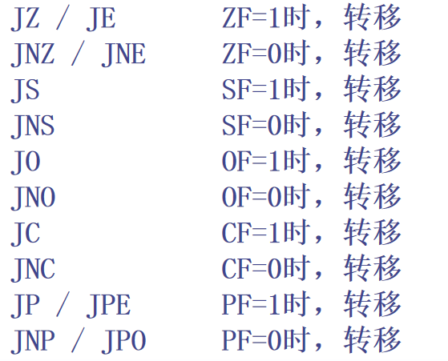

## 6.3 转移控制指令

* 有符号转移指令

  **JG** / JNLE   标号 (SF =OF 且 ZF=0，转移)

  JGE / JNL   标号 (SF =OF 或 ZF=1，转移)

  **JL** / JNGE   标号 (SF≠OF 且 ZF=0，转移)

  JLE / JNG   标号 (SF≠OF 或 ZF=1，转移)

* 无符号转移指令

  **JA** / JNBE   标号   (CF=0 且 ZF=0，转移)
  JAE / JNB   标号   (CF=0 或 ZF=1，转移)

  **JB** / JNAE   标号   (CF=1 且 ZF=0，转移)

  JBE / JNA   标号   (CF=1 或 ZF=1，转移)

## 6.6 条件控制流伪指令

* .IF XXXX

  .ELSEIF XXXX

  .ELSE XXXX

  .ENDIF