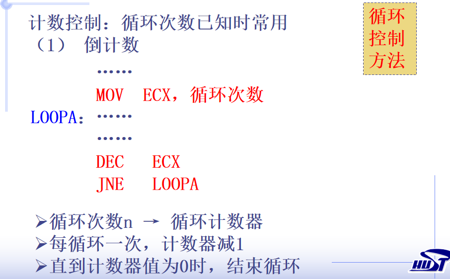
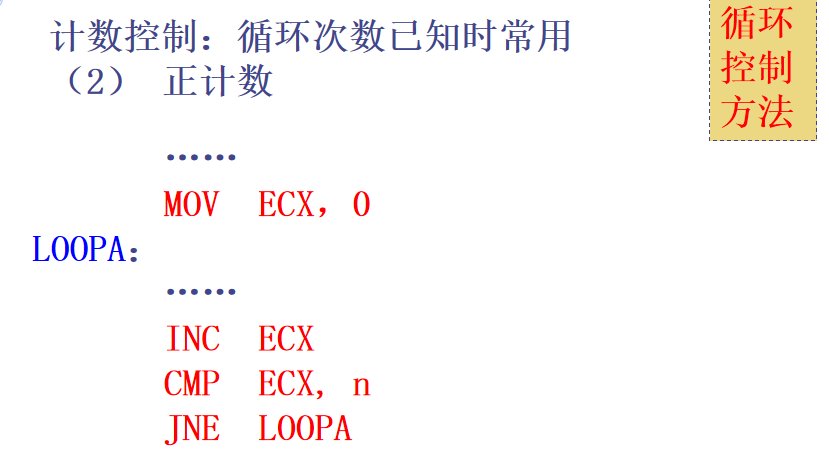

* loopa

  

  

* 四种计数控制循环转移指令 都是(ECX) - 1 --> ECX

  loop 标号：若 （ECX)  不为0, 则转标号处执行。

  loope/loopz 标号：若(ECX)不为0, 且ZF=1,则转标号处执行

  loopne/loopnz 标号：若(ECX)不为0, 且ZF=0,则转标号处执行

  jcxz 标号：若 （ECX) 为 0, 则转标号处执行。

* 循环控制伪指令

  **.while  条件表达式1**
          **语句序列1**
    **[.break   [.if  条件表达式2]]**
    **[.continue  [.if  条件表达式3]]**
          **语句序列2**
  **.endw**

* 重复执行伪指令

  **.repeat**  
  
   **语句序列**
  **.until 条件表达式**