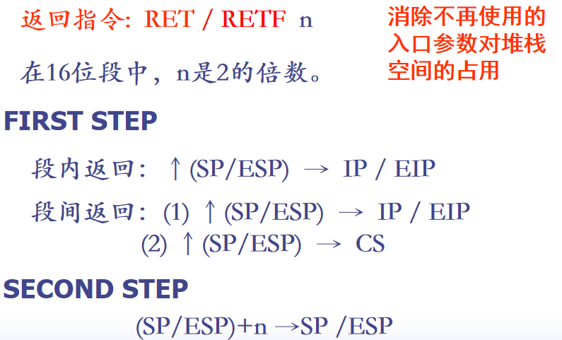
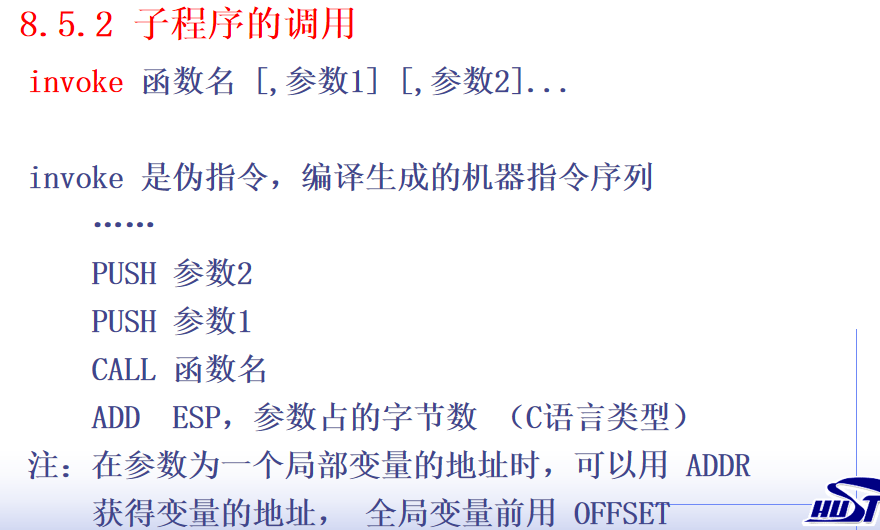

## 8.1 子程序概念

* 断点：转子指令的直接后继指令的地址，子程序执行完毕，返回主程序的断点处继续执行

## 8.2 子程序的定义和调用

* **子程序名  PROC  NEAR 或者 FAR**
                  **……**
                         **……**
    	        **RET   [n]**
  **子程序名  ENDP**

* 缺省调用：  CALL  子程序名
  根据子程序的属性决定是远程调用还是段内调用
  远程调用： CALL  FAR    PTR  过程名
  段内调用： CALL  NEAR PTR  过程名
  地址表达式调用：CALL  DWORD  PTR  OPD
                             CALL  WORD  PTR  OPD

* 将子程序的地址送 CS, IP/EIP
       段内：子程序的入口偏移地址--> IP / EIP
       远程：子程序的入口偏移地址--> IP / EIP
                 子程序的段地址--> CS

* 返回指令:  RET / RETF

  段内返回：↑(SP/ESP)  →  IP /EIP

  远程返回：(1) ↑(SP/ESP)  →  IP / EIP
                   (2) ↑(SP/ESP)  →  CS

  **栈顶必须是主程序的断点地址！**

* 

* 保护模式(FLAT)下，所有段都在痛一个4G内存空间中，所以子程序的属性都为NEAR。

## 8.5 汇编中子程序的高级用法

* 在proc语句之后，用local伪指令说明仅在本函数内使用的局部变量。
* 只能用 lea 指令来获取局部变量的地址；
  可以用 offset 获取全局变量的地址；

* 