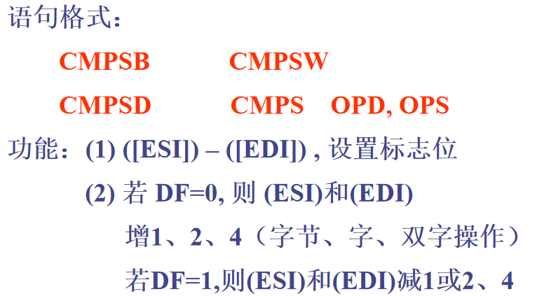
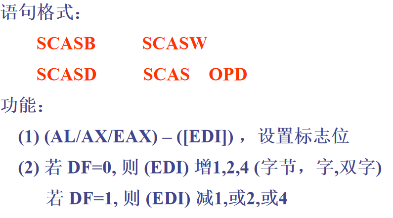
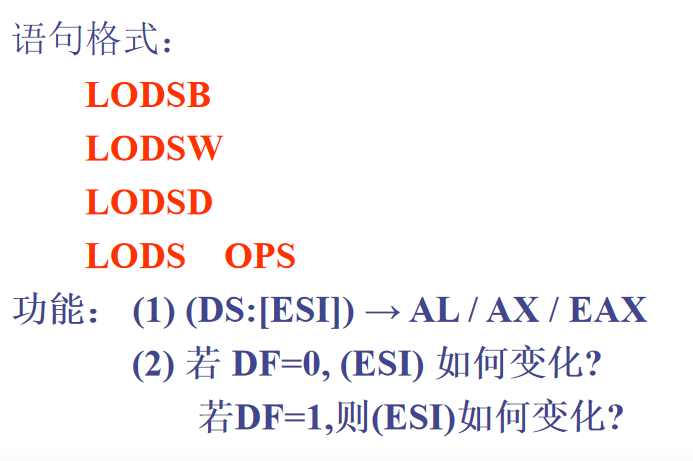
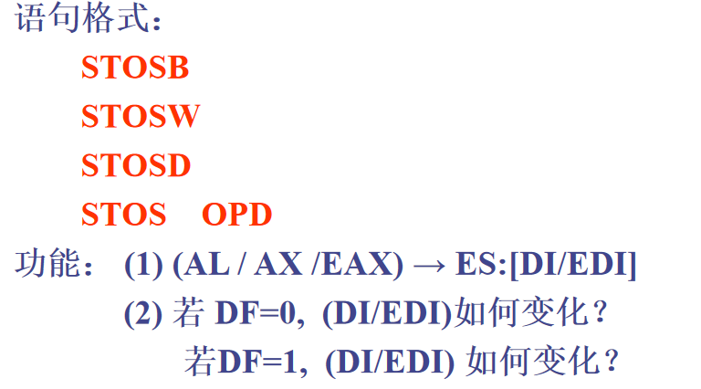

## 9.3 串比较指令

* 

  (1) ZF 是根据串比较指令设置的，而不是 最后的ECX减1。
  (2) 先执行比较，后修改 ESI、EDI
  (3) **两个串是否相等，要用ZF来判断**
  (4) 若串不等，ESI 指向第一个不相等的字符的下一个字符。

## 9.4 串搜索指令

* 

## 9.5 从源串中取数指令

* 

## 9.6 往目的串中存数指令

* 