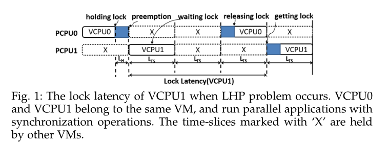
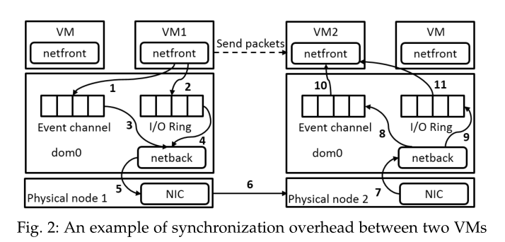
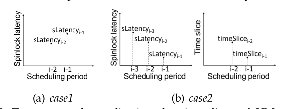
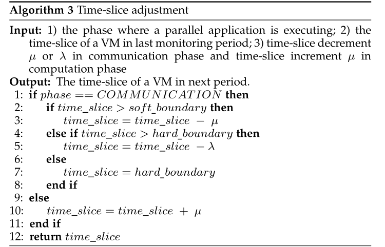

这篇论文提出了一种自适应时间片控制（ATC）机制，用于提高云平台中并行应用的性能。并行应用在云平台中运行时，由于资源过度分配和同步开销，会导致严重的性能下降。现有的方法通过提高涉及的虚拟机的调度优先级来优化并行应用，但是忽略了不同执行阶段对时间片的需求，而且会影响非并行应用的性能。ATC机制首先根据锁延迟或缓存失效率来检测并行应用的执行阶段，然后根据执行阶段动态地调整时间片。具体地说，ATC在通信阶段缩短时间片，以减少同步开销，在计算阶段延长时间片，以避免频繁的上下文切换。对于非并行应用，ATC设置一个统一的时间片，以保证其性能。作者使用七个著名的基准测试和25多个不同类型的应用来评估ATC机制。实验结果表明，ATC机制比现有的方法能够获得1.5-75倍的性能提升，同时对非并行应用的影响很小。

## Introduction

* 为了最大利润和资源利用率，云计算提供商经常故意提供比可用物理CPU大得多的虚拟可执行cpu，过度承诺加剧虚拟化环境中运行紧耦合并行应用程序性能下降问题。

* **锁持有人抢占问题**导致并行应用程序的同步开销大大增加

  >锁持有人抢占问题 lock holder preemption （**LHP**）
  >
  > 当一个虚拟CPU（VCPU）占有一个锁的时候，如果它的时间片用完了，就会被虚拟机管理器（hypervisor）抢占，让出CPU给其他的虚拟CPU。这时，其他想要获取这个锁的虚拟CPU就只能一直等待，直到当前占有锁的虚拟CPU重新被调度并释放锁。这种情况会导致同步操作的延迟和性能下降

* 传统解决方法：平衡调度，动态切换频率调度、协同调度

  缺点：简单提高并行程序涉及的vm的调度优先级来减少同步开销，忽略并行执行的计算阶段和通信阶段的区别，且由于调度优先级低，不可避免影响到了非并行应用程序例如web的请求-响应操作这种具有延迟敏感的操作。此外，这些方法主要关注单个对称多处理(SMP)虚拟机下的多线程并行应用程序。

* 本文分析了**同步操作**与**并行应用程序性能行为**之间的关系。我们观察到，**缩短虚拟机的时间片可以有效地减少同步开销**，从而显著提高多线程和分布式并行应用程序的执行性能。**其关键原因是缩短虚拟机的时间片可以有效地缓解同步操作中的LHP问题。**但是，过短的时间片会导致计算阶段频繁的缓存刷新，从而抵消了减少同步开销的好处。

  此外，**同步开销(主要发生在通信阶段)与锁延迟明显正相关，与缓存丢失率可能呈反比关系**。

* 提出ATC机制：
  1. 根据锁延迟和缓存丢失区分通信阶段和计算阶段
  2. 缩短通信阶段时间片，延长计算阶段时间片
  3. 非并行应用程序设置同一时间片，提升并行应用程序性能同时避免了对非并行应用程序的影响

* 相比之前那篇，解决了分布式和多线程并行应用程序，扩展了研究的全面性

## BACKGROUND AND MOTIVATION

* 并行程序的性能退化：

  多线程并行应用程序：主要受到单个vm内部同步开销影响

  分布式并行应用程序：VM内部和VM之间都存在同步开销，旧方法无法实现跨虚拟机的同步操作，实现的也没有充分考虑到应用程序的执行阶段

* 多线程并行程序的同步

  

  > 用户级别的屏障
  >
  > 一种并发编程技术，在用户级别的屏障中，多个线程或进程通过调用特定的同步函数或指令来实现同步。当线程或进程到达屏障点时，它们会被阻塞，直到所有其他线程或进程也到达屏障点。一旦所有线程或进程都到达屏障点，它们就会同时解除阻塞，继续执行后续代码。

  所以用户级别的屏障的同步也会因为LHP问题受到严重影响

* 分布式并行程序的同步

  

它描述了一个分布式并行应用在两个虚拟机之间进行网络通信的过程，以及其中可能产生的同步开销。这里涉及到一些虚拟化的概念，如下：

- VMM：虚拟机监视器，是一种软件或固件，负责创建和运行虚拟机。
- VM：虚拟机，是一种模拟物理计算机的软件环境，可以运行不同的操作系统和应用程序。
- PCPU：物理CPU，是物理计算机上的处理器。
- VCPU：虚拟CPU，是虚拟机上的处理器，可以映射到一个或多个PCPU上。
- dom0：域零，是一种**特殊的虚拟机，负责管理其他虚拟机和硬件资源。**
- domN：域N，是除了域零之外的普通虚拟机。
- event channel：事件通道，是一种在虚拟机之间传递消息和信号的机制。
- I/O ring：输入/输出环，是一种在虚拟机和域零之间传递数据的缓冲区。
- netback：网络后端，是域零中负责处理网络数据包的驱动程序。
- netfront：网络前端，是虚拟机中负责处理网络数据包的驱动程序。

根据这些概念，我们可以将这段文字简单地解释为：

​		一个分布式并行应用在两个虚拟机（VM1和VM2）之间进行网络通信。首先，VM1要等待VMM调度它到PCPU上运行（这是第一个同步开销源头）。然后，VM1通过事件通道通知dom0（第一步），并把网络数据包放到I/O环中（第二步）。接着，dom0也要等待VMM调度它到PCPU上运行（这是第二个同步开销源头）。然后，dom0从事件通道中得到VM1发来的通知（第三步），并把网络数据包从I/O环中复制到netback中（第四步），再通过物理网卡发送出去（第五步）。网络数据包经过物理网络传输到另一个物理节点上的VM2（第六步）。在进行第七步之前，dom0要等待VMM调度它到PCPU上运行（这是第三个同步开销源头）。然后，dom0把网络数据包从网卡复制到netback中（第七步），并通过事件通道通知VM2（第八步），再把网络数据包从netback复制到I/O环中（第九步）。在进行第十步之前，VM2要等待VMM调度它到PCPU上运行（这是第四个同步开销源头）。然后，VM2从事件通道中得到dom0发来的通知（第十步），并把网络数据包从I/O环中复制到netfront中（第十一步）。从上面的描述中可以看出，在两个虚拟机之间进行网络通信时，有两个主要的同步开销源头。一是dom0不能及时地获取网络数据包；二是domN不能及时地处理挂起的中断。注意，如果一个并行应用涉及三个或更多的虚拟机，那么它就由多个需要同步的虚拟机对组成。所以，优化虚拟机对之间的同步是关键。[17]

​		当一个任务要释放一个socket结构体时，它会唤醒等待队列中的另一个被阻塞的任务。但是，如果执行唤醒操作的虚拟CPU（VCPU）在释放socket结构体之前被虚拟机管理器（VMM）抢占了，那么其他想要获取socket结构体的VCPU就会一直等待，直到当前的VCPU被重新调度并释放socket结构体。这就是**锁持有者抢占（LHP）问题**，它会导致同步开销。另一种LHP问题发生在锁定socket结构体的过程中。一个想要锁定socket结构体的任务会获取socket自旋锁并把自己阻塞在等待队列中。然后，这个任务会不断地循环检查socket结构体是否可用，直到socket结构体最终被其他任务释放。LHP问题可能发生，因为如果socket结构体被其他任务占用了很长时间，那么试图获取socket结构体的VCPU可能会被VMM抢占。在步骤1和10中，epoll锁也会因为同样的原因导致LHP问题。

​		在一个**过度提交的云系统**中，上述开销可能会被大大放大，因为**LHP问题更容易发生**。为了提高并行应用的性能，我们必须减少LHP问题导致的同步开销。例如，在第1个开销源中，同步开销取决于在PCPU上运行队列中等待VM1之前的VM的总时间片长度。假设有N-1个VM（VM1, · · · , VMN-1）在VMN之前等待，那么由LHP问题引起的同步开销等于PN-1 i=1 T imeSlicei ，其中T imeSlicei 是VMi 的时间片长度。我们可以直观地得出，为了最小化同步开销，**VM的时间片应该尽可能地短**。

* 单位时间内同步操作越多，LHP问题越严重，可提高性能越多，用**每秒锁调用LPS**来表示单位时间内的同步操作。我们可以观察到**并行应用的性能增益与LPS呈正相关**。然而，**很难对性能增益和同步操作之间的精确关系给出定量指导**，因为性能增益不仅取决于同步操作的数量，还取决于**减少的锁延迟和并行度**。

* 虽然调优时间片是一种很有希望提高并行应用程序性能的方法，但是使**用太短的时间片可能会损害性能**，如图5所示。原因如下:并行应用程序交替执行计算阶段和同步阶段[19]。在**通信阶段，通常需要任务之间的同步，由于LHP问题，会出现长锁延迟。在这些阶段减少时间片可以减少锁延迟。**

  **在计算阶段，应用程序可能会将大量数据加载到CPU缓存中。减少时间片将导致更多的上下文切换和缓存刷新**。因此，缓存丢失率上升，并且在通信阶段减少锁延迟的好处被抵消了。因此，在计算阶段需要很长的时间片。因此，我们需要缩短时间片以减少通信阶段的同步开销，延长时间片以降低计算阶段的缓存丢失率。

**基于VMM中的low-level metrics低级度量来区分计算阶段和通信阶段**

1. 由于同步操作和LHP问题，**通信阶段**的**锁延迟较高**
2. **计算阶段**由于虚拟机上下文切换导致缓存刷新，具有**较高的缓存缺失率**

## SYSTEM DESIGN

ATC面临挑战：**执行阶段检测、动态时间片调整、非并行应用程序**

* 执行阶段检测

  1.基于锁延迟的检测

  

  case1和case2都代表了处于通信阶段。但是这种检测只适用于内核级锁原语（自旋锁）进行同步的应用程序，因为VMM中获取用户级锁原语需要修改应用程序，这对云提供商来说是不可能的。

  2. 基于缓存缺失率的检测

     **适用于各种并行应用程序**

     

* 时间片动态规划

  

  小于1ms性能会明显的有微小变化，为了不错过最佳实践片，软边界设置成1ms。

  硬边界设置成0.3ms。理论最佳就是硬边界，在此之后，锁延迟带来的性能提升将完全被缓存丢失的代价所抵消。