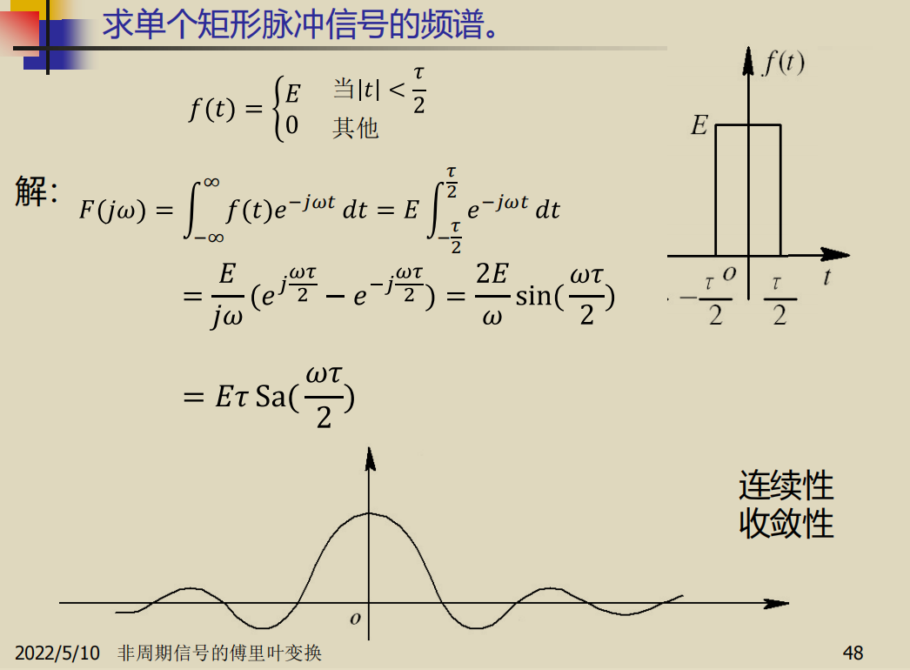
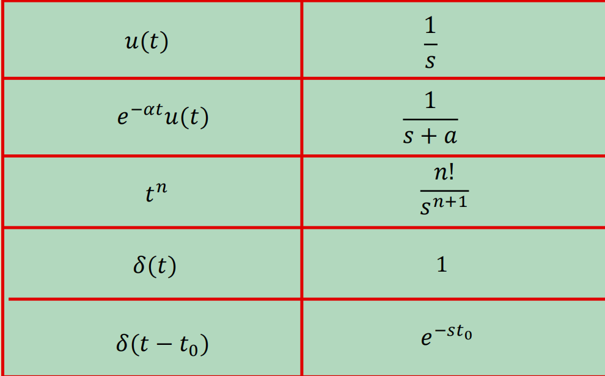
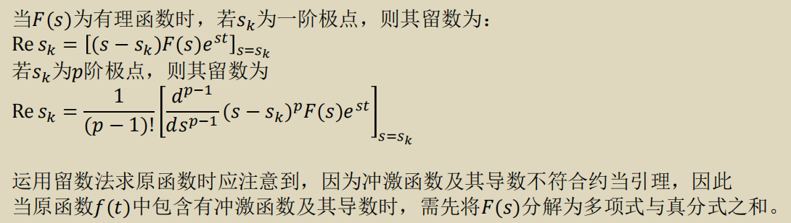
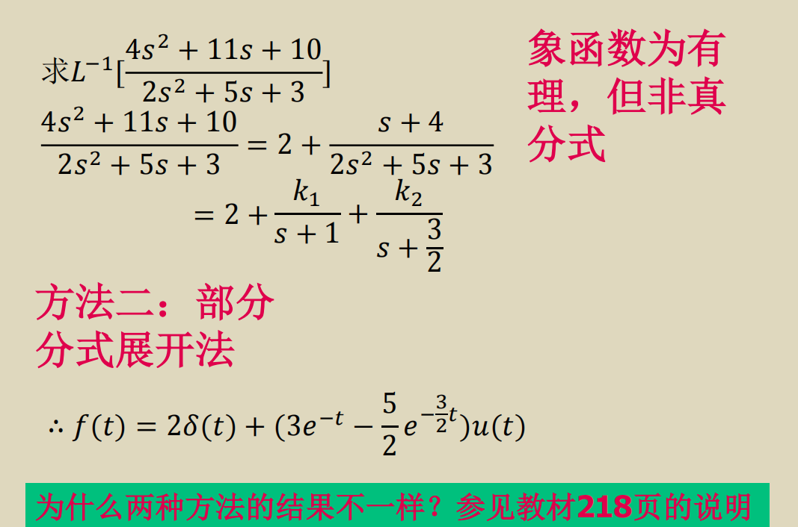
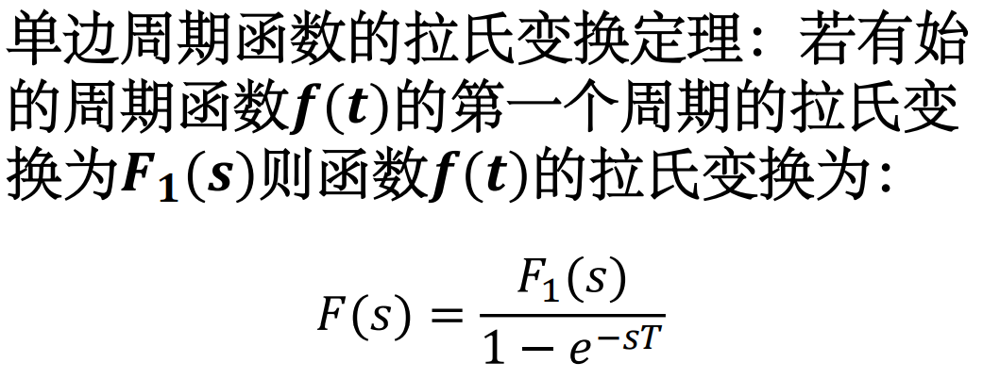
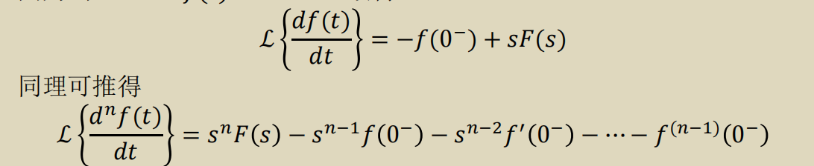
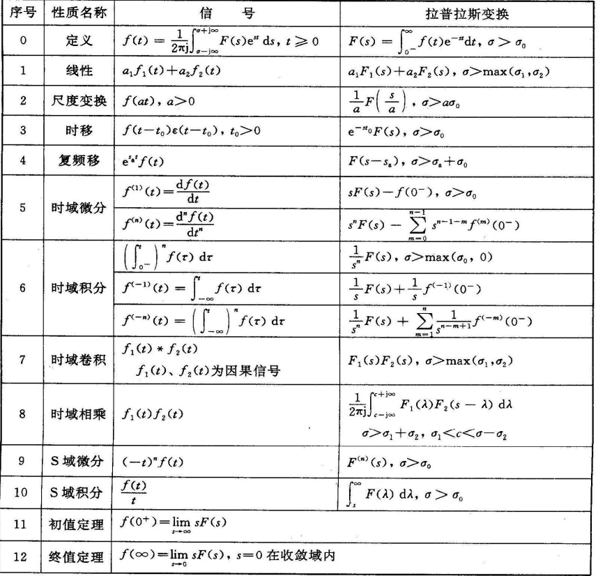

单位冲激函数的性质：
$$
f(t)δ(t)=f(0)δ(t)\\
\int_{-\infty}^{\infty}f(t)\delta(t-t_0)=f(t_0)\\
f(t-t_1)*δ(t - t_0)=f(t-t_0-t_1)
$$
傅里叶变换：
$$
F(jw)=\int_{-\infty}^{\infty}f(t)e^{-jwt}dt\\
f(t)=\frac{1}{2\pi}\int_{-\infty}^{\infty}F(jw)e^{jwt}dw
$$
F(jw):频谱密度函数，简称频谱函数，量纲为单位频带的振幅
$$
\cal{F} \{\delta(t)\}= 1
$$
Sa函数：
$$
Sa(x)=\frac{sin(x)}{x}
$$

* 经典傅里叶变换对：

  门函数和Sa函数

  单位冲激函数和1
  $$
  \delta(t)<->F(w)=1=e^{j0w}\\
  2\pi\delta(w)<->f(t)=1\\
  \delta(t+t_0)<->F(w)=e^{jwt_0}\\
  cosw_0t=\frac{1}{2}(e^{-jw_0t}+e^{jw_0t})<->F(jw)=\pi(\delta(w+w_0)+\delta(w-w_0))\\
  u(t)<->F(w)=\pi\delta(w)+\frac{1}{jw}
  $$

* 傅里叶变换的性质：

  对称性质：
  $$
  f(t)<->F(w)\\
  F(t)<->2\pi F(-w)
  $$

* H,E,R的时域频域变换
  $$
  H(p) = \frac{k}{p-\lambda} ->h(t)=ke^{\lambda t}\varepsilon(t)\\
  H(p)=\frac{k}{(p-\lambda)^2}->h(t)=kte^{\lambda t}\varepsilon(t)\\
  H(p)=\frac{k}{(p-\lambda)^n}->h(t)=\frac{kt^{n-1}e^{\lambda t}\varepsilon(t)}{(n-1)!}\\
  H(p)=k->h(t)=k\delta(t)\\
  H(p)=kp^n->h(t)=k\delta^n(t)
  $$
  
* 拉普拉斯变换不同原函数，收敛域不同，也能得到相同的象函数，所以象函数求原函数要看收敛域

* 常用拉普拉斯变换

  
  $$
  cosw_0t->\frac{s}{w_0^2+s^2}\\
  sinw_0t->\frac{w_0}{w_0^2+s^2}\\
  te^{at}u(t)->\frac{1}{(s-a)^2}
  $$
  
* 拉普拉斯逆变换：

  1. 部分分式分解

  2. 留数法

     

* 留数法不能直接求解m>=n的情况，要先把真分式提取出来对真分式才能用留数法，不是真分式的直接求，理由如上

  

* 利用时移性质计算有始周期函数的拉普拉斯变换

  

* 拉普拉斯变换时域微分性质

  

* what is 奈奎斯特抽样定理？（描述能够从抽样信号恢复原始信号的定理）

* Z变换的初值与终值定理与拉普拉斯的不同：
  $$
  f(0)=\lim_{z->\infty}F(z)
  \\
  f(\infty)=\lim_{z->1}(z-1)F(z)
  $$

### 做题

* 利用卷积微积分性质的时候记得积分后也要带上u(t)，即使积分的时候已经消除了！！！
