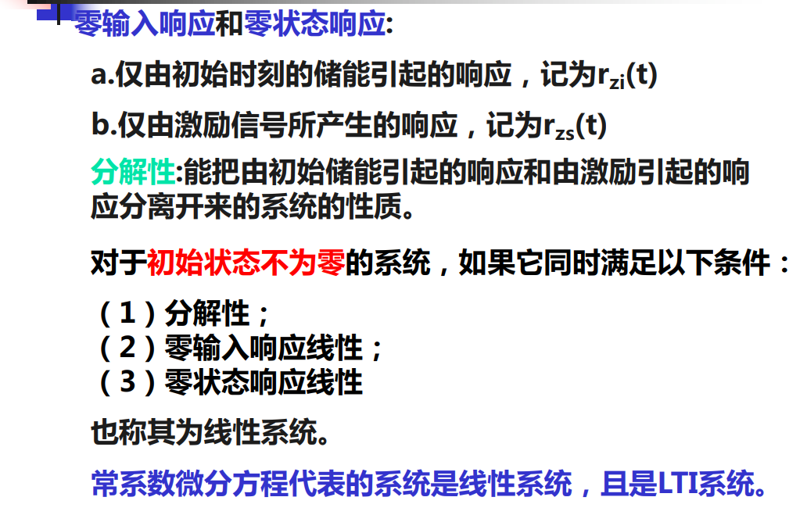
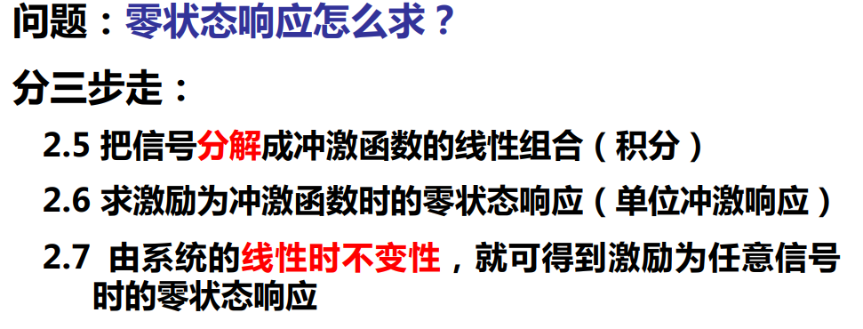
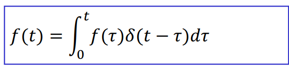
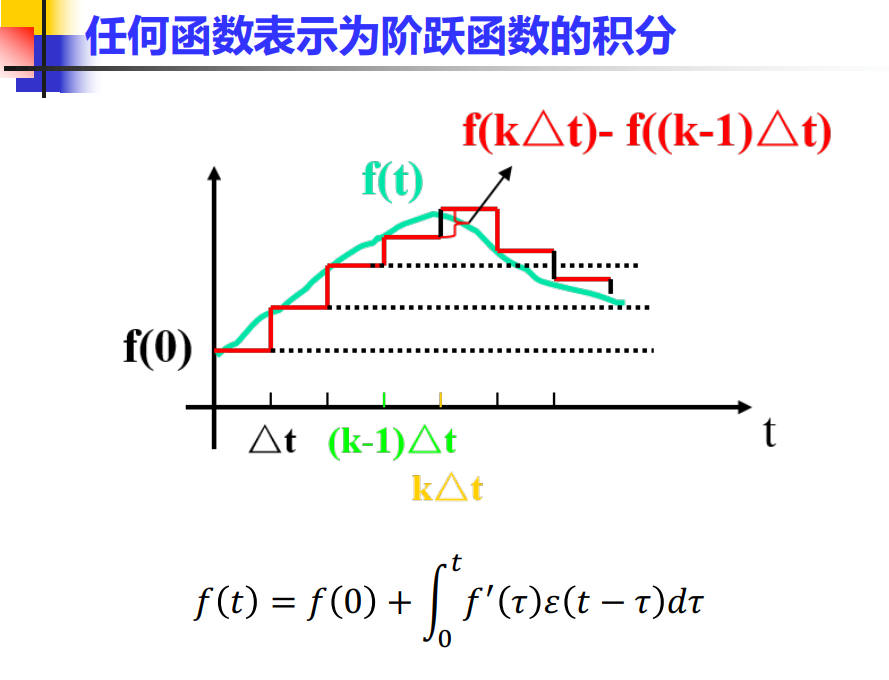
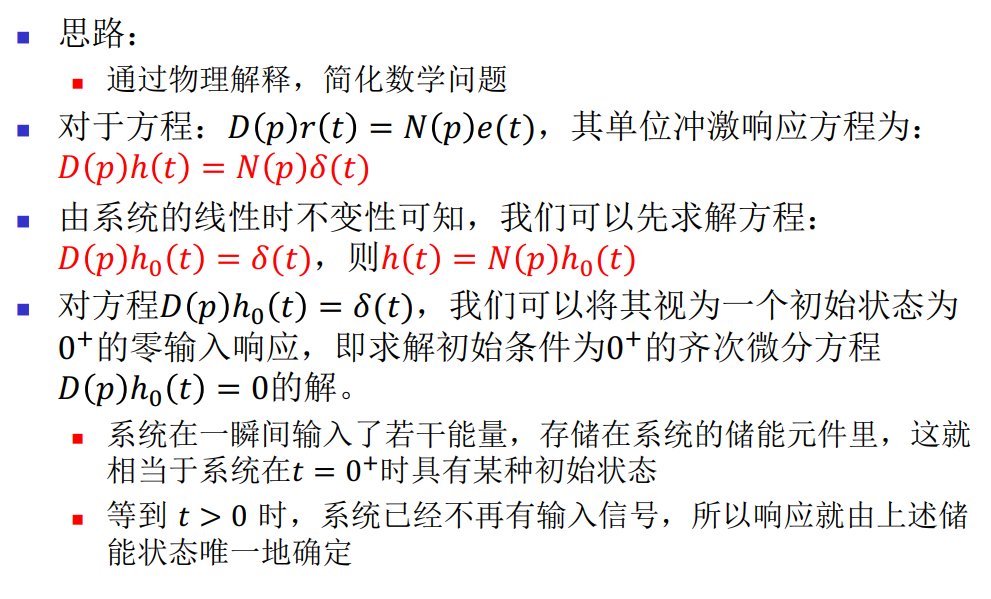
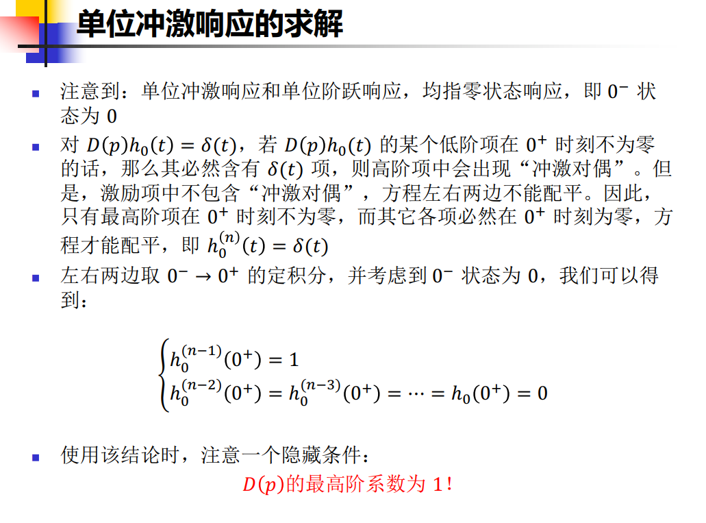
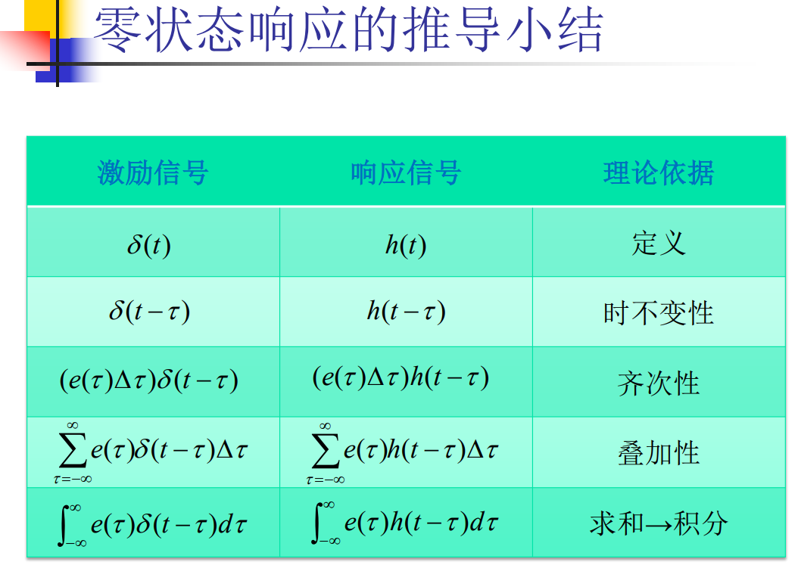
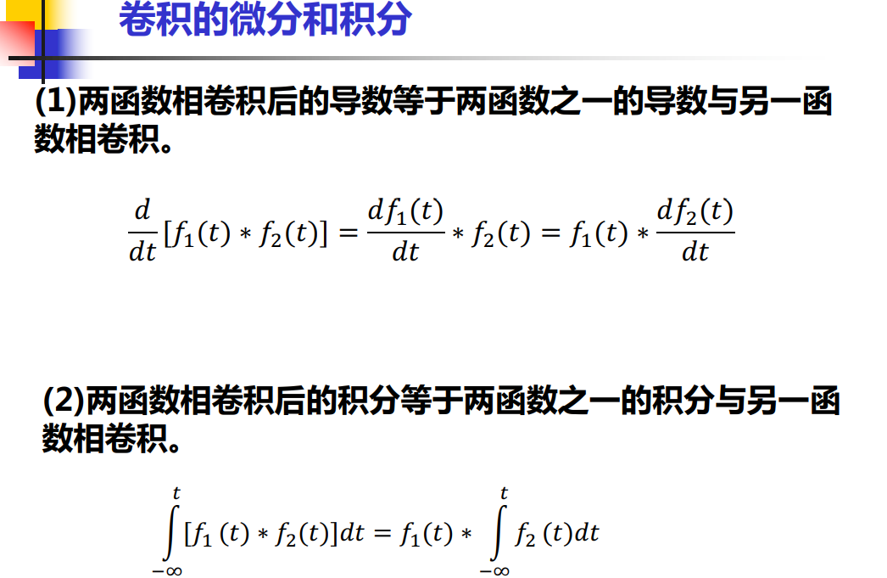
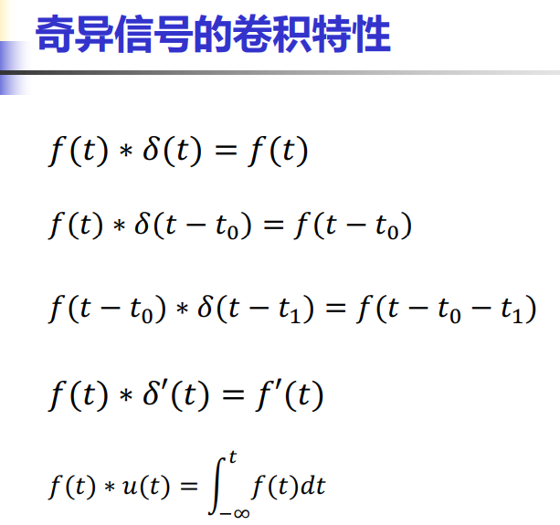

* 线性时不变连续系统的数学模型：**线性常系数微分方程**

  经典解法：

  1. 求特征根，求齐次通解
  2. 由激励函数得到特解

全响应难以直接求解，就把他分成零输入响应和零状态响应。

* 零输入响应就是求解常系数线性**齐次**微分方程，**并且要求自变量t大于0，因为在t大于0后才有能量**。

* 零状态响应可以用一系列奇异函数进行分解，例如利用单位冲激信号的**抽样性**将任何信号表示为冲激函数的线性组合

  

  将函数表示为单位冲激函数的积分

  

  将函数表示为阶跃函数的积分

  

## 

## 卷积积分法

### 单位冲激响应的求解

### 卷积性质

