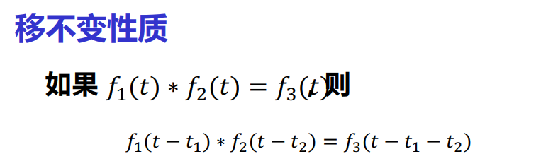

* 线性时不变连续系统的数学模型：**线性常系数微分方程**

## 经典解法

1. 求特征根，求齐次通解
2. 由激励函数得到特解

## ZIR/ZSR方法

转移算子表示：
$$
D(p)r(t)=N(p)e(t) \\
r(t)=\frac{N(p)}{D(p)}e(t)\\
H(p) = \frac{N(p)}{D(p)}
$$

### 转移算子的性质

全响应难以直接求解，就把他分成零输入响应和零状态响应。

* 零输入响应就是求解常系数线性**齐次**微分方程，**并且要求自变量t大于0，因为在t大于0后才有能量**。

  >求解零输入响应和求解线性常微分方程的齐次解有何不同？
  >
  >答：求解零输入响应的待定参数是根据初始条件直接得到，齐次解的待定参数是求出特解的参数后得到全响应带入原方程求得。

* 零状态响应可以用一系列奇异函数进行分解，例如利用单位冲激信号的**抽样性**将任何信号表示为冲激函数的线性组合

* 奇异函数：

  单位斜变信号R(t)-----求导------>单位阶跃信号u(t)-----求导------->单位冲激信号-----求导------>冲激偶信号

  

  将函数表示为单位冲激函数的积分

  

  将函数表示为阶跃函数的积分
  
  

## 卷积积分法求零状态响应

### 单位冲激响应的求解

### 冲激响应的求解-部分分式分解法

### 卷积性质

