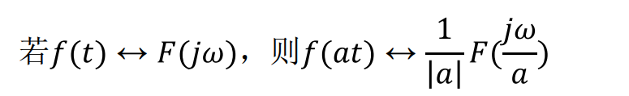

* 正交矢量集：所有矢量两两正交，没有零矢量

* 完备正交矢量集：在矢量集的空间中找不到任何一个非零矢量不在该矢量集且与矢量集中所有矢量都正交

* 周期信号的三角傅里叶函数

  w:基频 nw:谐波 最后那个是相位

  

* 周期信号的复指数形式

  

  * 吉布斯现象：在不连续点处，随着 n 的增大，起伏震荡的时间将缩短，但其引起的过冲值则趋于约 9% 的固定值

* 

* F(jw) 具有单位频带的振幅的量纲，成为频谱密度函数，简称频谱函数。

* 重要公式：

  

  

  时移特性

  在时域中的时延等于在频域中的**相移**

  

  移频特性

  在时域中的调制等于在频域中的频移

  

  尺度变换特性

  

  对称特性

  

  微分特性

  

  积分特性

  

* 频率和时域都分别丢失了对方的一定信息，**时域中的压缩（扩展）对应频域中的扩展（压缩）**

* 卷积定理

  

  时域中的乘积（卷积）等于频域中的卷积（乘积）

* **两个等宽脉冲卷积是三角形函数，两个不等宽脉冲卷积是梯形函数**

* 三角脉冲可看成两个同样矩形脉冲的卷积

* Parseval’s定理：

  物理意义：无论从时域角度还是频域角度计算一个信号的能量，结果相同，左侧是时域，右侧频域，类似**坐标系变换**
