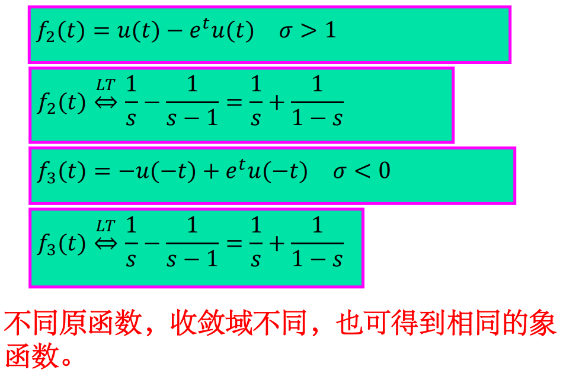
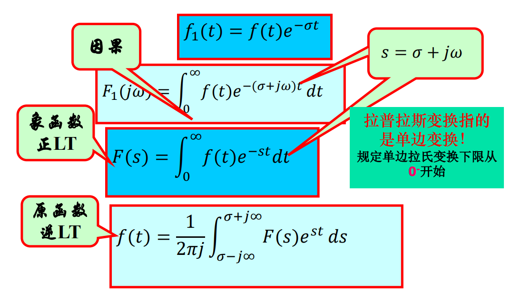
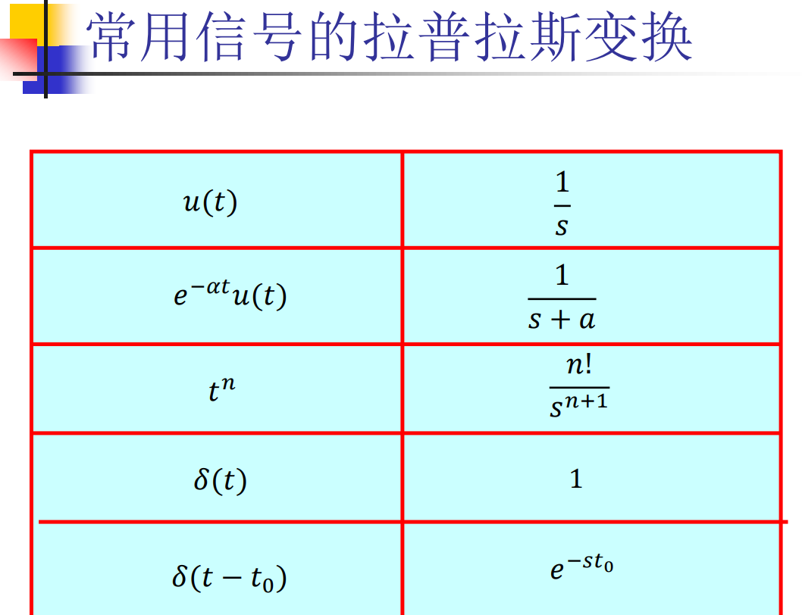
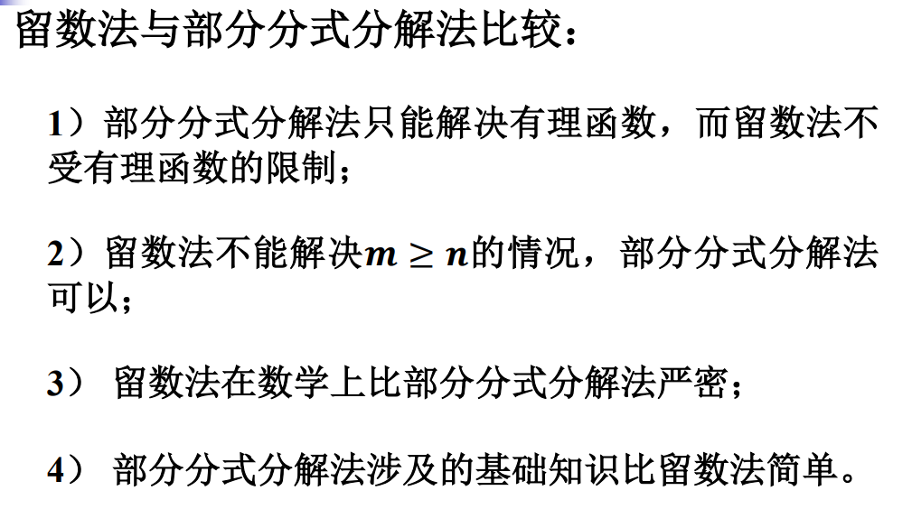
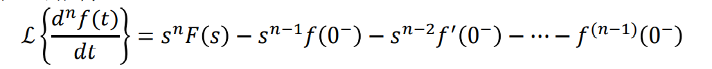
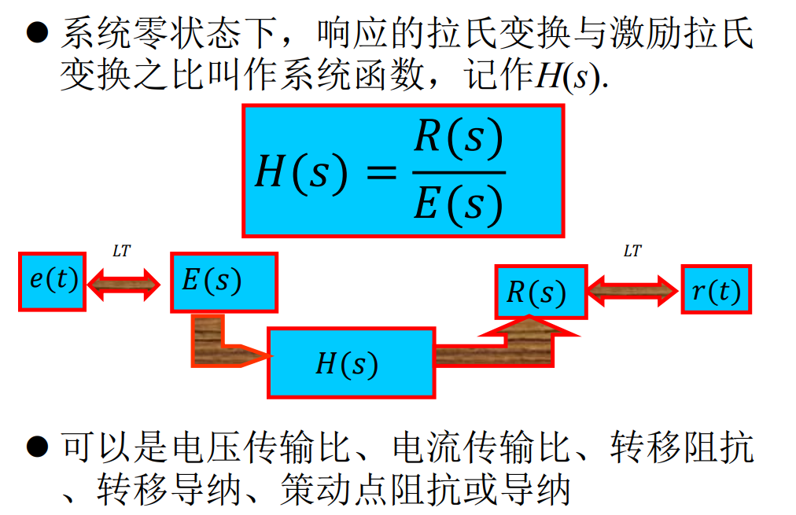
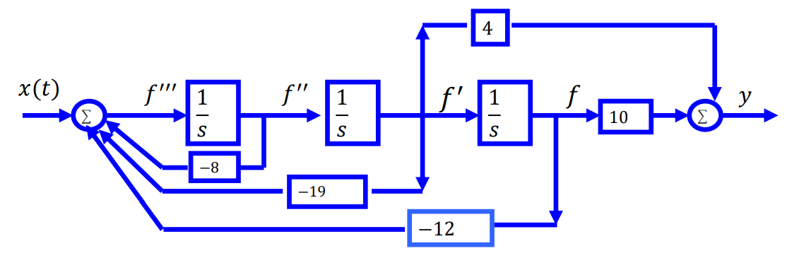
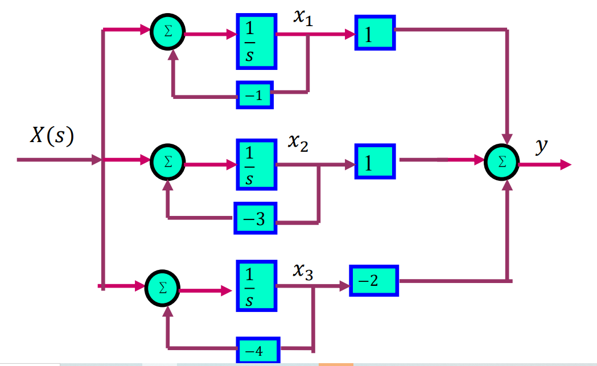
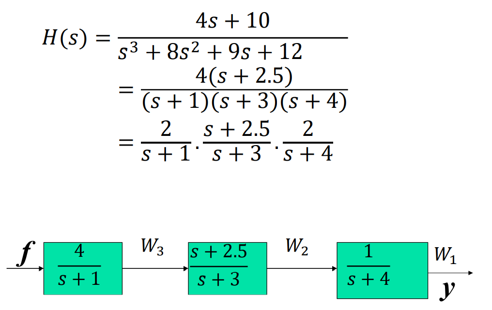

* 双边拉普拉斯变换

  

  拉普拉斯变换不是可逆变换，要结合收敛域

* 为了解决上述问题，引入单边拉普拉斯变换：

  

* 常用拉普拉斯变换

  

* 

* 利用时移性质计算有始周期函数的拉普拉 斯变换

  

拉普拉斯变换性质：

* 时域微分性质：

* 

* 系统函数(**零状态下！不因初始条件改变而改变系统函数**)

  

### 系统模拟

* 三阶及以上的电路一般不用直接模拟法

  

  直接模拟法：

  

  并联模拟法：

  

  串联模拟法：

  