极零图：零点用圆圈表示，极点用叉叉表示，零极点关于实轴（横轴）对称

## 系统函数与时域特性

1. H(s)极点与单位冲激响应模式的关系

   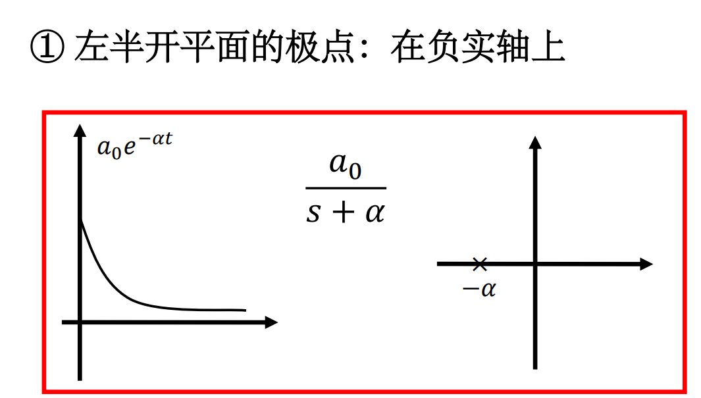

   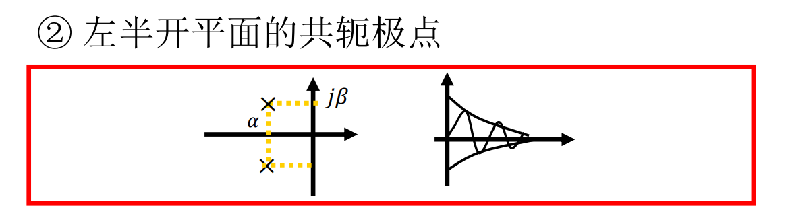

   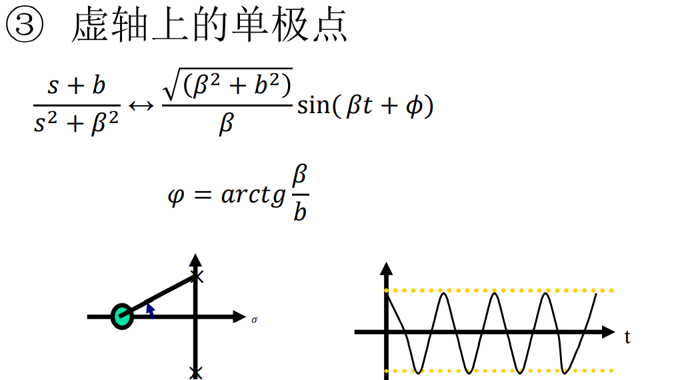

   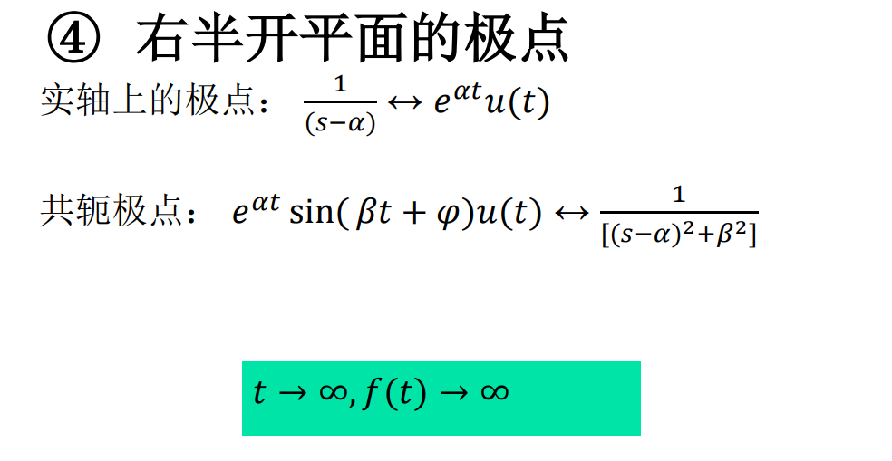

   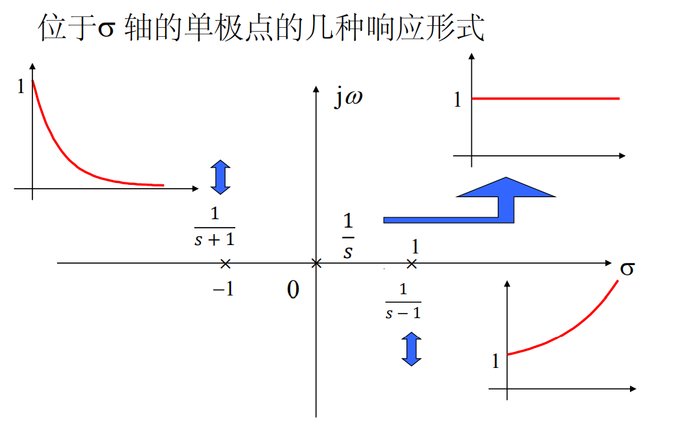

   

   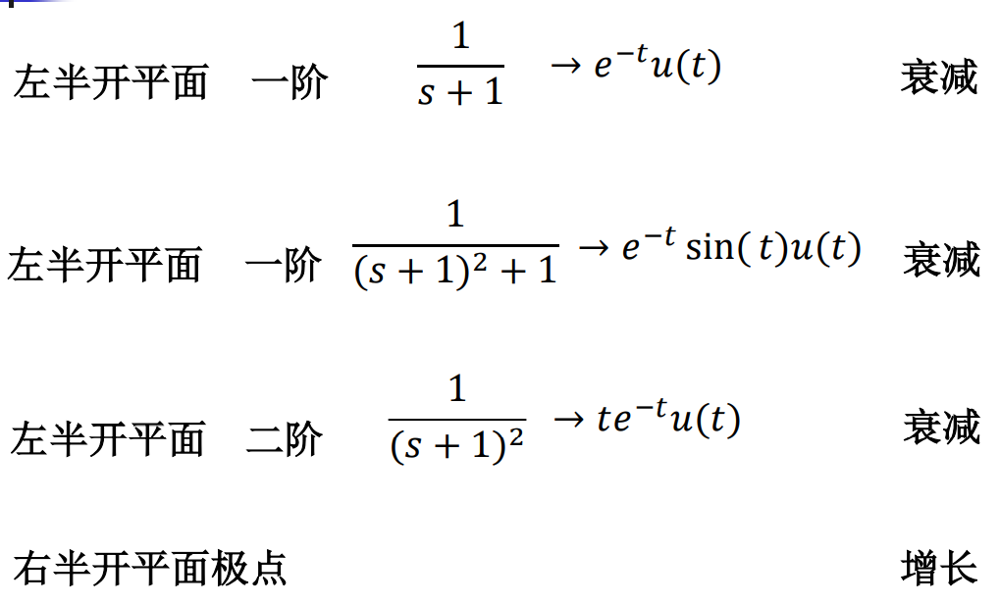

   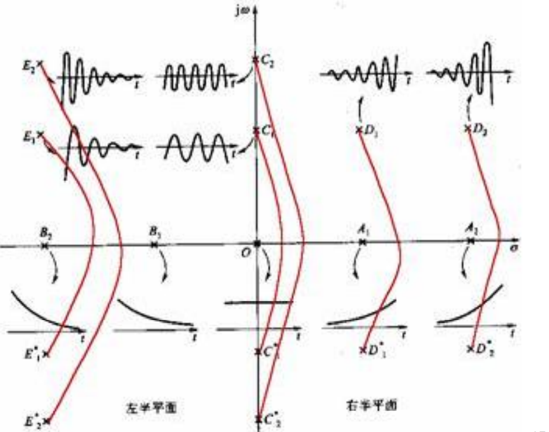

   左半平面收敛，右半平面发散，实轴单调，虚轴低阶极点既不发散也不单调，高阶仍发散

2. H(s)、E(s)极点分布与响应的关系 

3. H(s)零点对系统时域特性的影响

   零点变化，只影响时域函数的幅度和相移，不会影响振荡频率

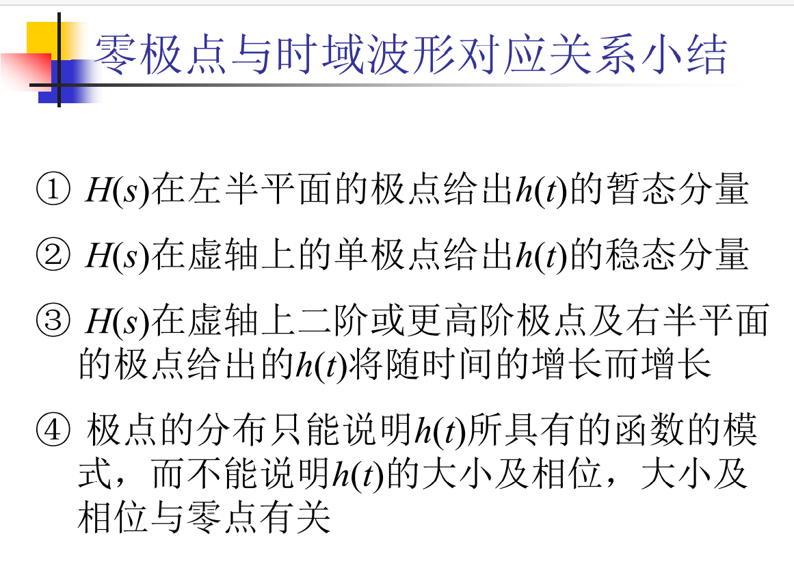

## 系统函数的频域特性

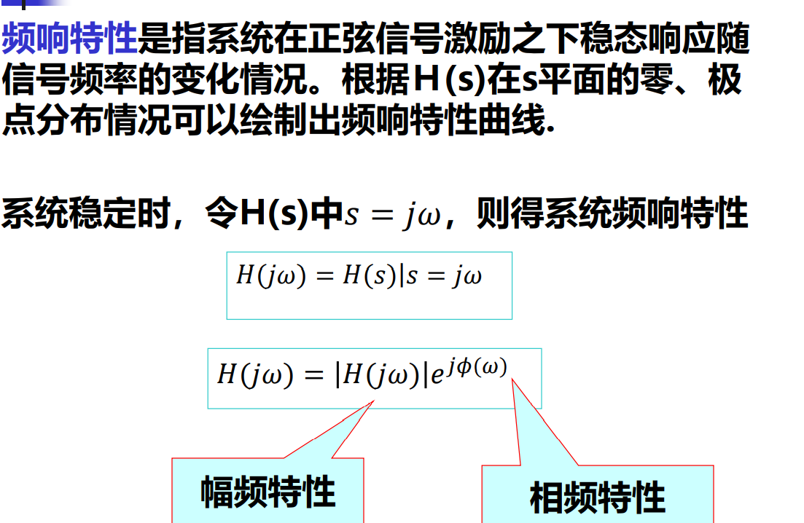

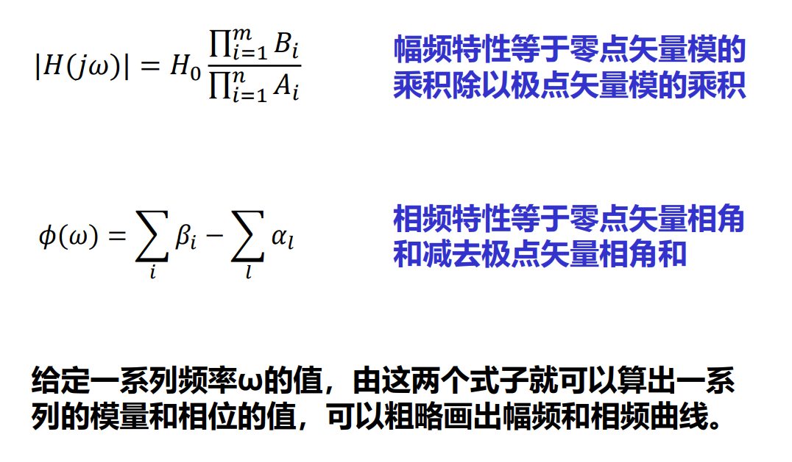

### 系统稳定性

如果一个系统对于任何有界的输入，其响应也是有界的。

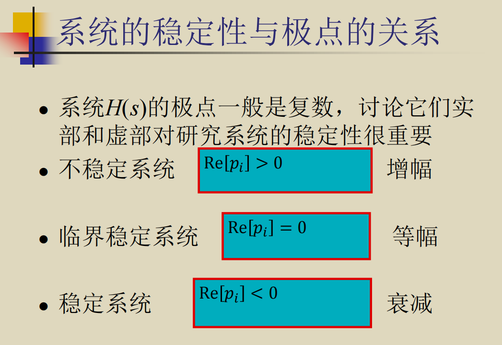

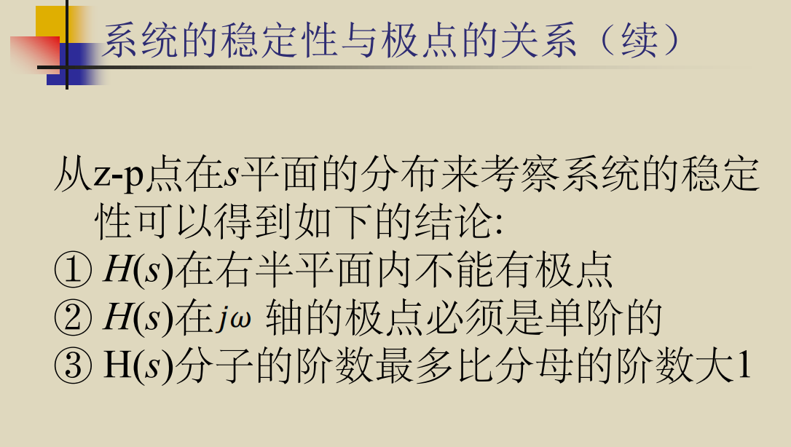

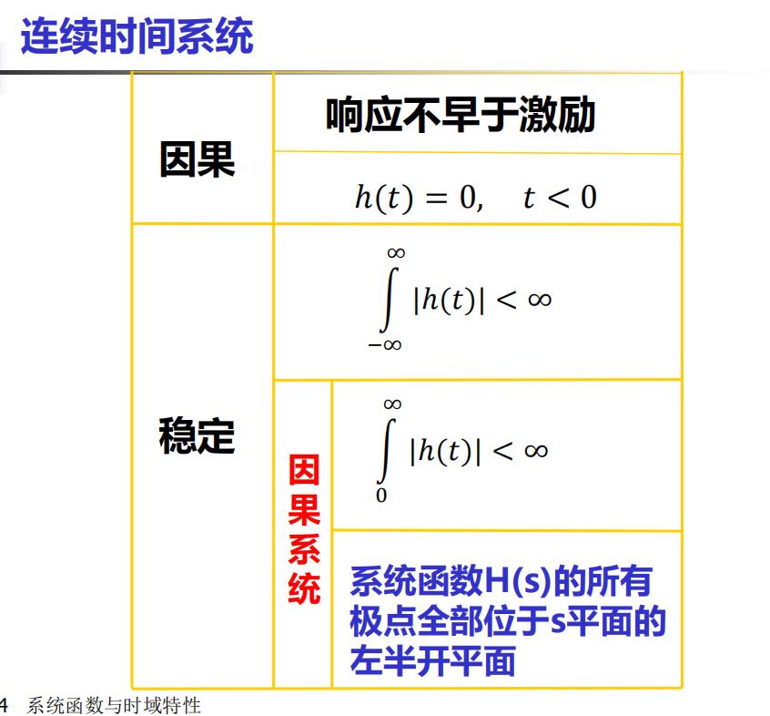