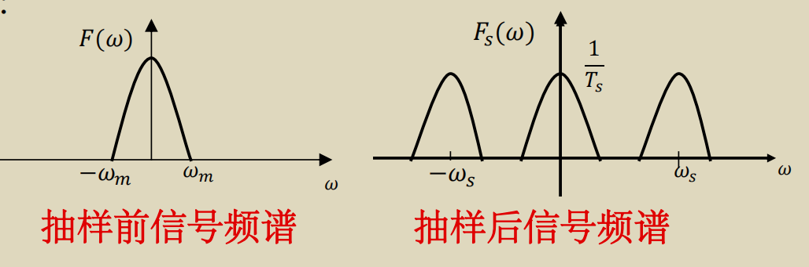
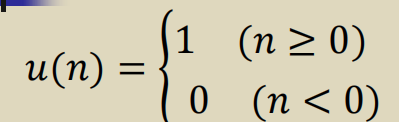
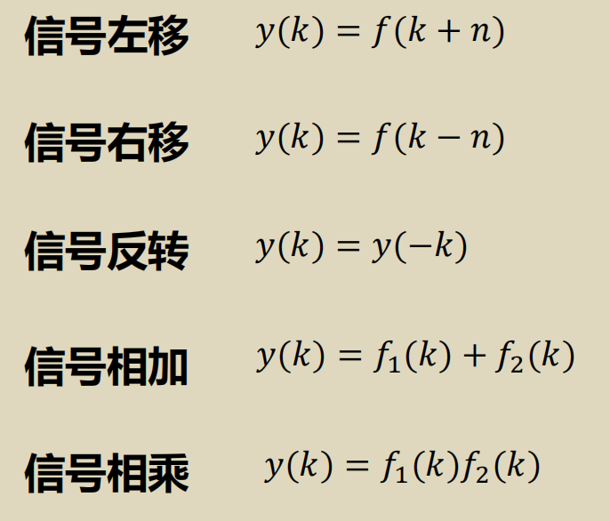
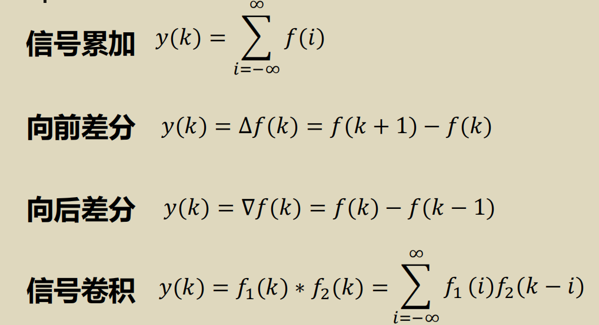
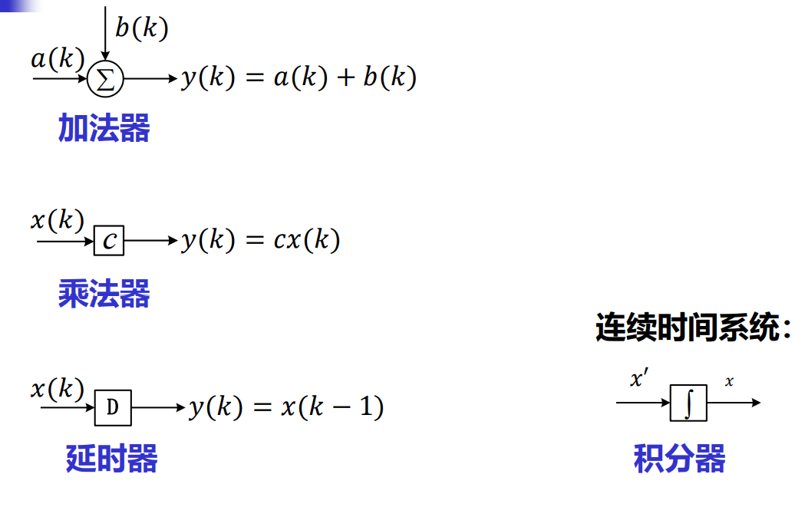
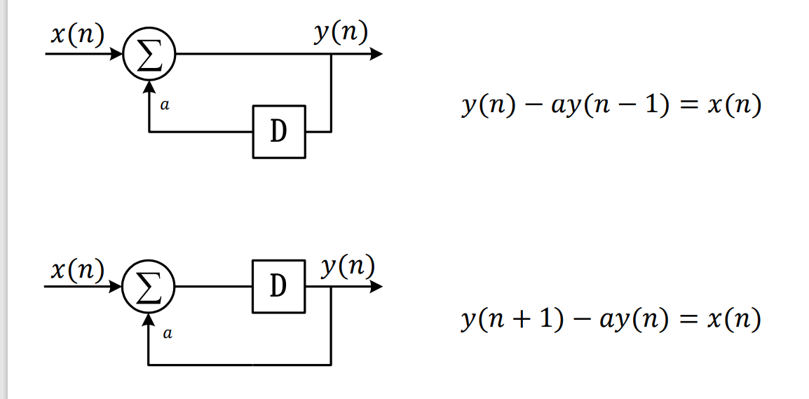
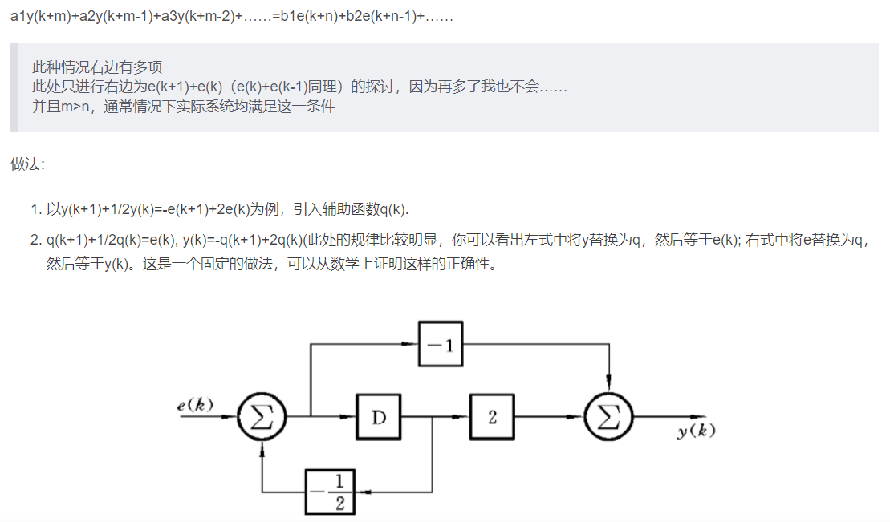

连续信号-->离散信号

* 采样：时间离散
* 量化：幅度离散

* 抽样信号的频谱等于原始信号频谱的周期扩展

* 抽样信号经过低通滤波可以返回原始信号

  

* 频域中和低通滤波器相乘等于时域中Sa函数的插值

* 香农取样定理（奈奎斯特取样定理）：一个在频谱中不包含有大于频率𝑓𝑚的分量的有限频带的信号，由对该信号以不大于1/2𝑓𝑚

  的时间间隔进行取样的取样值唯一地确定。当这样的取样信号通过其截止频率𝜔𝑐满足条件𝜔𝑚 ≤ 𝜔𝑐 ≤ 𝜔𝑠 − 𝜔𝑚的理想低通滤波器后，可以将原始信号完全重建

几种常用的离散信号

* 单位函数（有确切值的，和冲激函数区分开）
* 单位阶跃序列
* 矩形序列
* 指数序列
* 正弦序列
* 复指数序列

离散信号的变换和运算

* 离散系统的差分可以近似为连续系统的微分，所差的常数可以被归一化

模拟框图

* 与X有关的是反馈项，y相关的是正馈项

* 零输入响应：齐次解+初始条件

框图画法：

