典型序列的Z变换：

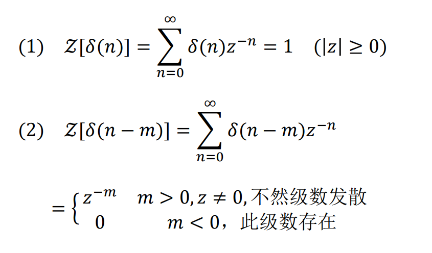

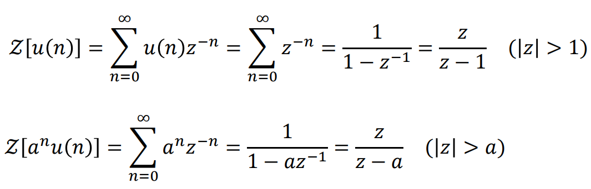

Z变换的基本性质：

* 线性 

* 位移性

  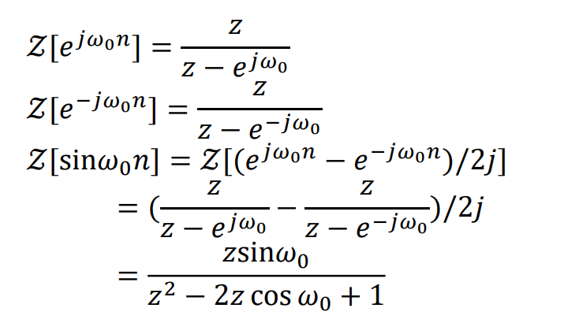

  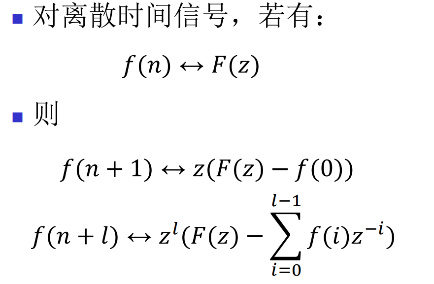

* 序列指数加权（ Z 域尺度变换） 

  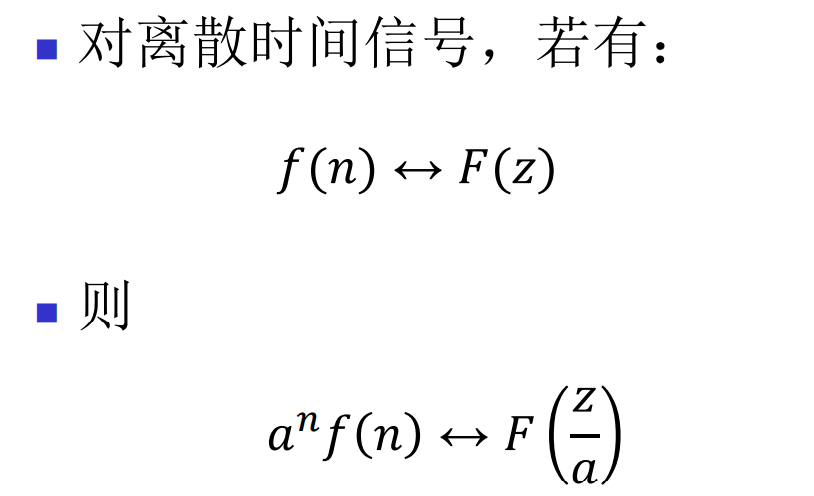

* 序列线性加权（ Z 域微分）

  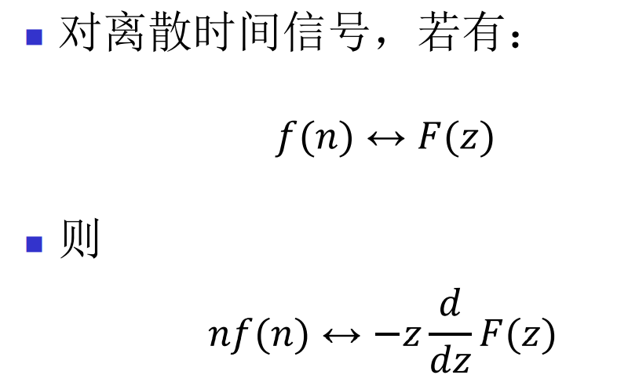

* 卷积定理 

  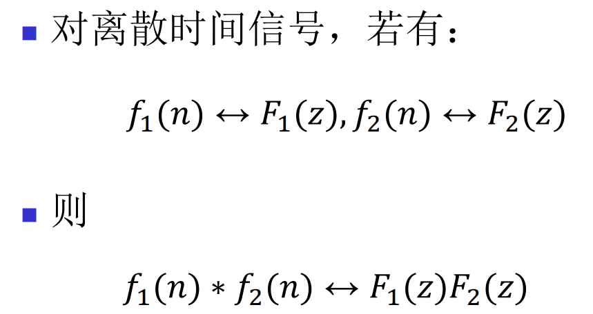

* 初值定理和终值定理

  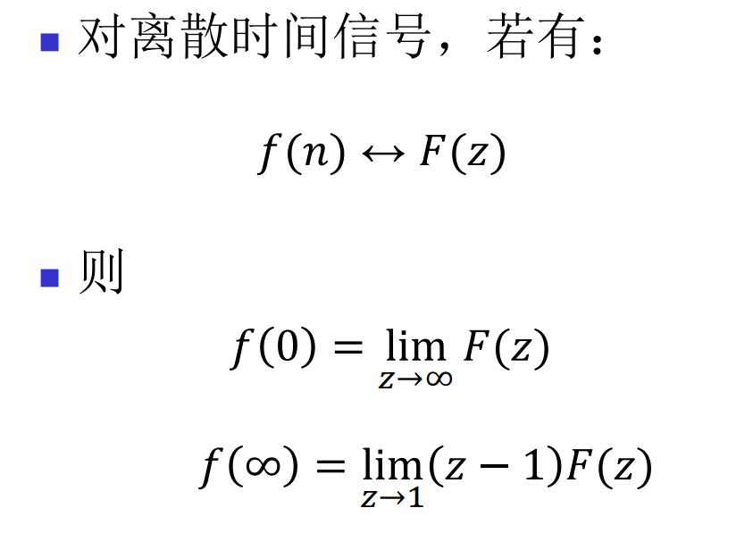

Z逆变换

* 留数法（X（z）z^(n-1)的各极点留数之和）
* 幂级数展开法
* 部分分式展开法（F(z)/z展开！！！）
* 查表

z变换和拉普拉斯变换的区别：

* z变换处理离散时间信号，拉普拉斯处理连续时间信号

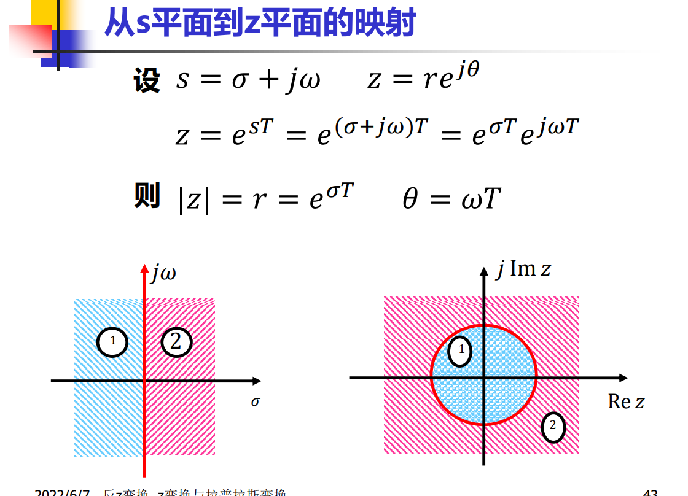

* 左边任何一个竖轴对应右边一个圆，虚轴对应单位元
* s平面收敛轴左半开平面对应z平面收敛圆内部，右半开平面对应收敛圆外部，俩收敛轴中间对应z平面收敛环

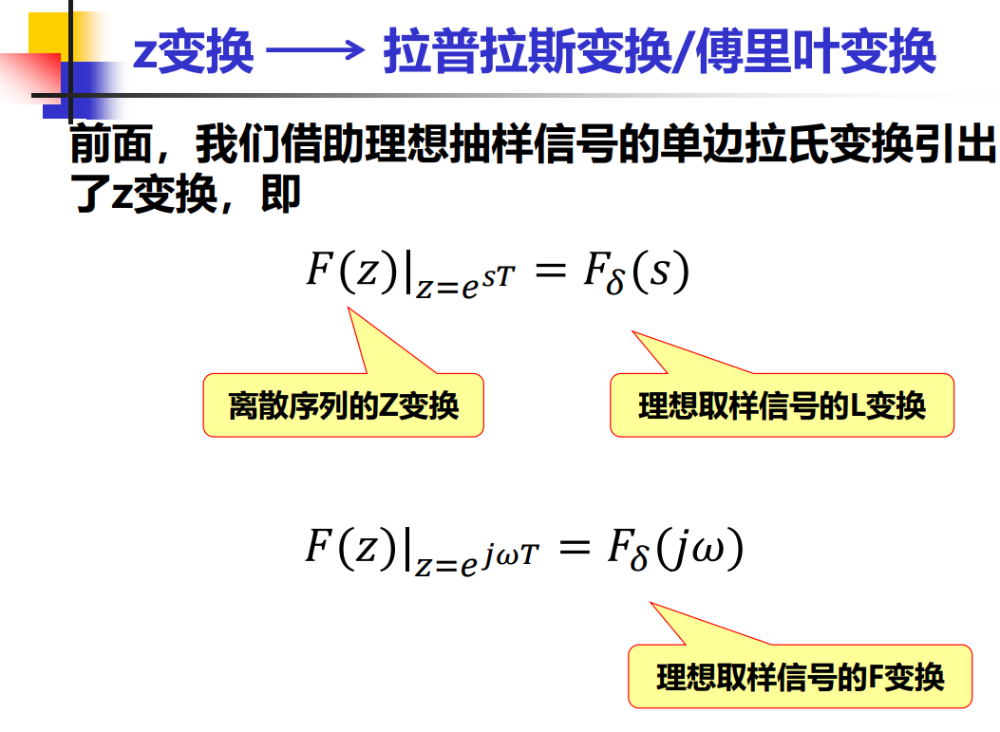

* 拉普拉斯变换变z变换就是求拉普拉斯变换在各个极点处**留数**

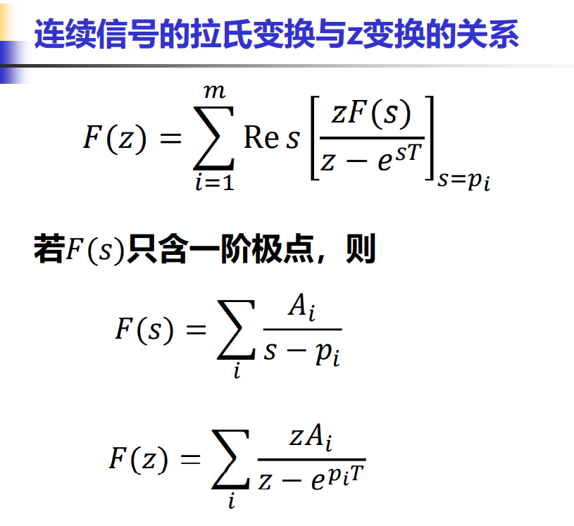

系统函数H（z）

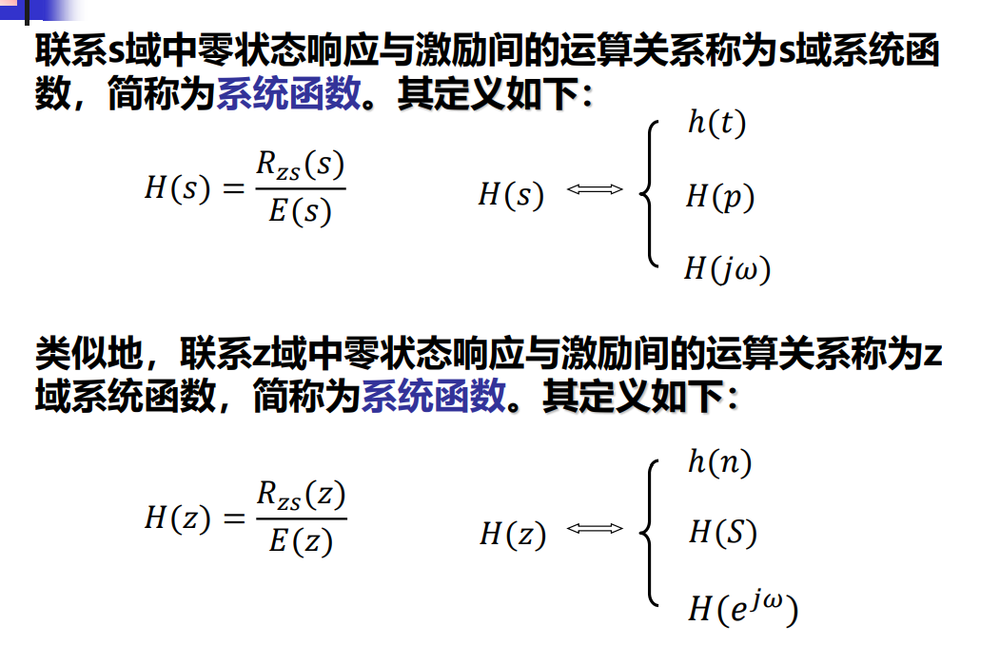

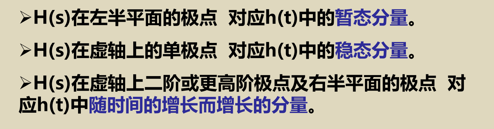

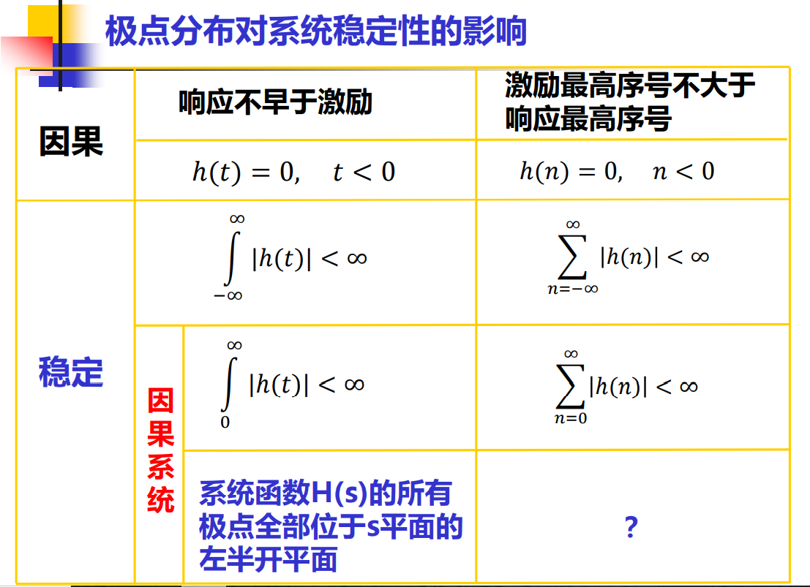

* 时域离散对应频域周期

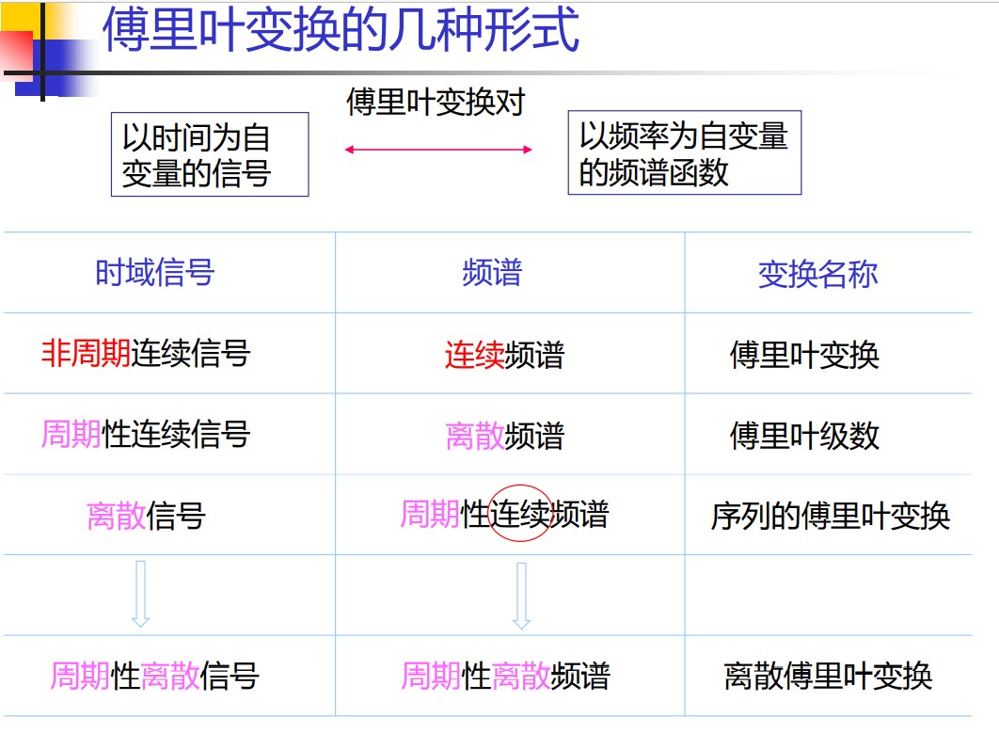

系统稳定性判别

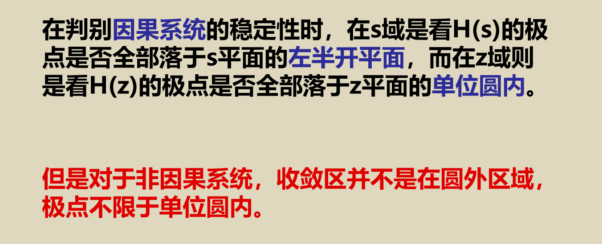

DTFT序列的傅里叶变换

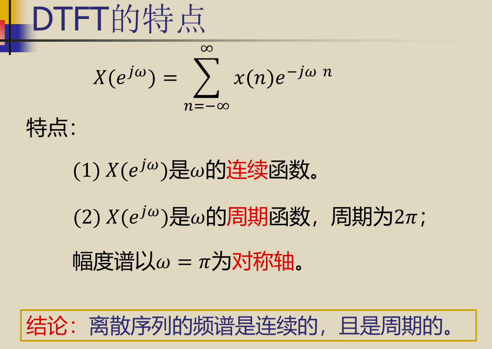

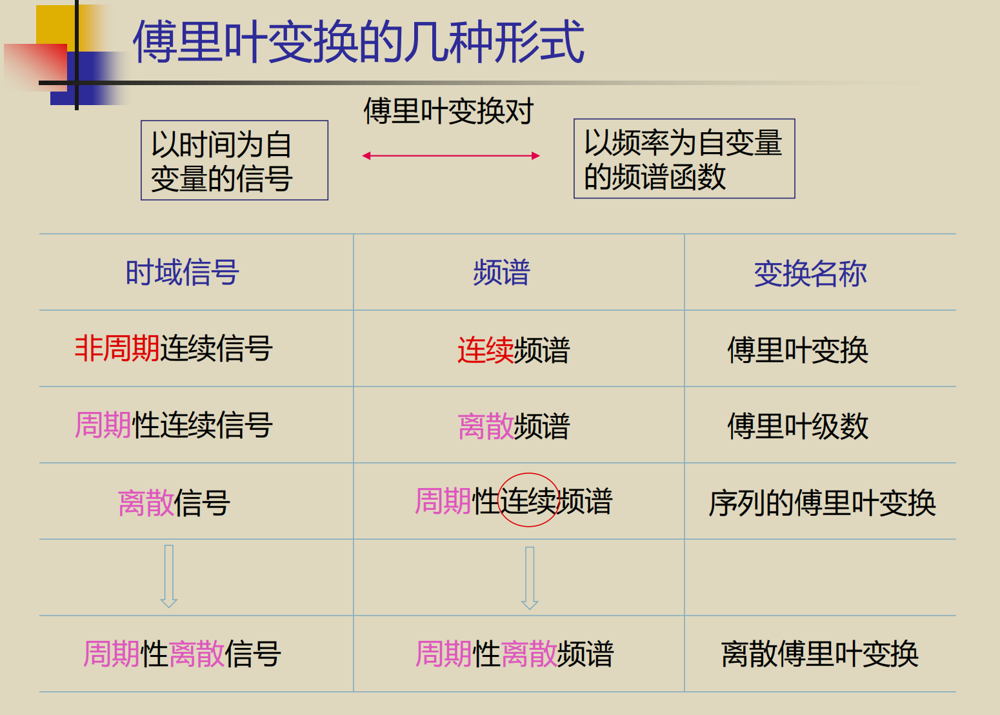

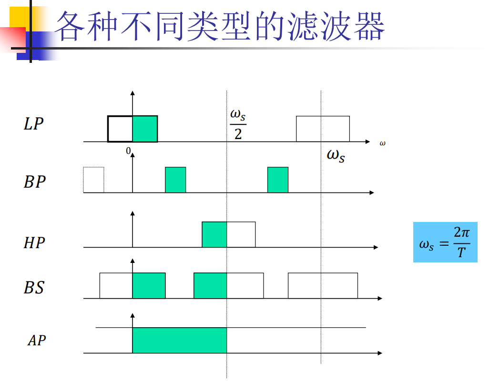