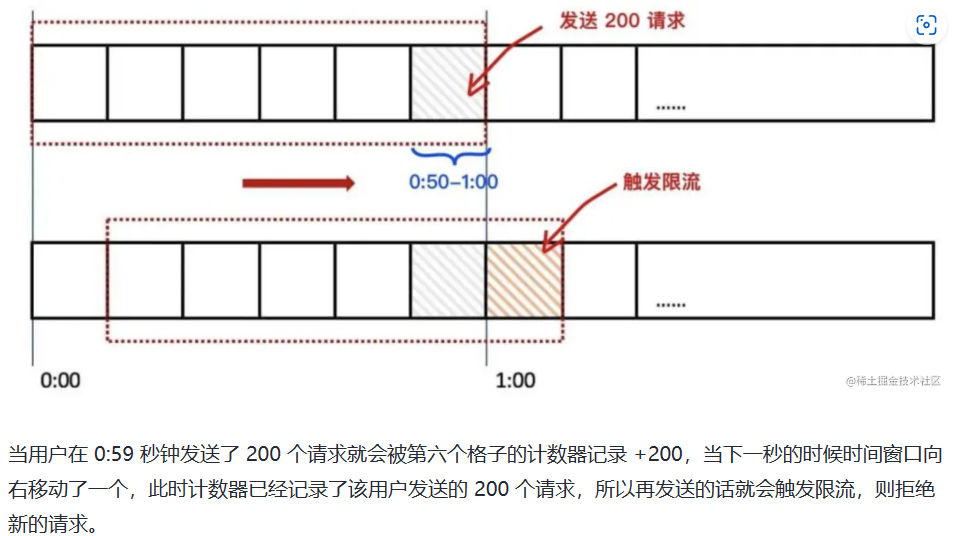
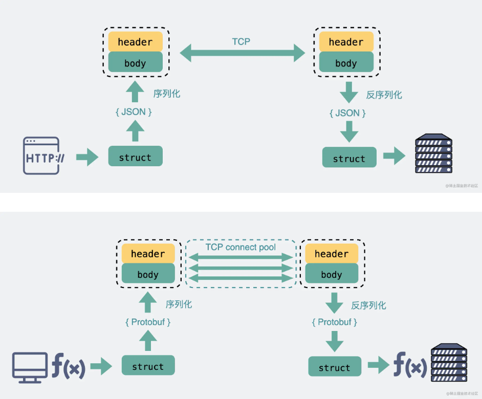

## 限流

常用限流方式：

* 计数器（一个格子的滑动窗口）：方法简单，但是没有很好处理**单位时间的边界**

* 滑动窗口：利用格子的划分影响滑动窗口的精度，但是依然有时间片概念，无法根本解决临界问题

  

* 漏桶

  限制一个常量流出速率，从而达到流量整形和速率限制的目的，**不能出现突发流量**

  

* 令牌桶：限制**平均流入速率**，允许一定程度的突发流量

  * 令牌按固定的速率被放入令牌桶中
  * 桶中最多存放 B 个令牌，当桶满时，新添加的令牌被丢弃或拒绝
  * 如果桶中的令牌不足 N 个，则不会删除令牌，且请求将被限流（丢弃或阻塞等待）

  

* Redis + Lua分布式限流

## MySQL InnoDB

* 若是某行数据较大超过最大行长度，需要将**可变长度用外部页存储**，直到该行符合最大行长度限制

  >当使用 DYNAMIC 创建表时，InnoDB 会将较长的可变长度列（比如 VARCHAR、VARBINARY、BLOB 和 TEXT 类型）的值剥离出来，存储到一个**溢出页**上，只在该列上保留一个 20 字节的指针指向溢出页。

* InnoDB一般三层B+树，两层索引一层数据，查表只要进行三次就好（**实际上根节点常驻内存，所以少一次**）

## DDD

Domain Driven Design

* 核心思想：

  * 避免夜壶逻辑和技术实现的复杂性耦合
  * 明确业务和技术复杂性别见，隔离复杂性，站在更高角度实现耦合

* DDD的核心就是通过一套科学的方法论告诉大家如何创建不同的领域，如何确定领域的边界。

  * *“模型”是DDD中的重要概念：模型是对领域的抽象和模拟。*

  * *“建模”是DDD中重要的手段：建模是针对特定问题建立领域的合理模型*

## 微服务

微服务特点：

1. 单一职责
2. 团队独立
3. 技术独立
4. 数据库分离
5. 独立部署

## 索引失效的几种场景

* 最左匹配原则：在联合索引中，如果你的 SQL 语句中用到了联合索引中的最左边的索引，那么这条 SQL 语句就可以利用这个联合索引去进行匹配

## DHCP

1. DHCP Discover
2. DHCP Offer
3. DHCP Request
4. DHCP ACK

* 为什么需要第三步（DHCP Request）和第四步（DHCP ACK）？

  1. 本地网段内可能不止一台DHCP服务器，机子一般对第一个到的DHCP offer发request，同时DHCP服务器确认这个IP没被发出去你才可以安心使用

* DHCP是应用层协议，**基于UDP协议**进行数据传输

  > 这里TCP不能用的原因？
  >
  > TCP面向连接，DHCP是广播的，UDP只要发给255.255.255.255这个特殊地址进行广播，TCP没法和这个地址建立李连杰，因为不存在对应机器，要广播只能对本地网段所有IP**挨个建立连接，再挨个发消息**，这就很低效了

  > 为什么第二阶段是单播而非广播？
  >
  > 这是DHCP一个小优化，根据系统情况看是否能单播，对于能收单播包的系统，会在发**DHCP Discover**阶段设一个 **Broadcast flag = 0 (unicast)** 的标志位，告诉服务器，支持单播回复，于是服务器就会在**DHCP Offer阶段以单播的形式进行回复**

* 不是每次联网都要经历四个阶段，如果断开再连接WiFi，只会经历第三四阶段，因为机子记录曾经使用过的IP，重新联网后会优先再次请求该IP

> DHCP分配的IP重复情况：
>
> 1. 自己手动配置IP和别人DHCP分配的IP相同
> 2. 本地网段内多个DHCP server维护的IP地址范围重叠，解决方法是改变两台服务器维护的IP地址范围让他们不重叠

* DHCP ACK后机器会先发**三条ARP消息**，称之为**无偿ARP**，会把IP和mac都填写自己的

  目的：

  * 告诉本地网段所有机子，让大家记录IP地址和mac地址的对应到自己的ARP缓存
  * 看是否有IP地址冲突

## HTTP和Websocket

> websocket是一个基于TCP的应用层协议，用于支持网页游戏这种客户端和服务器都需要互相主动发大量数据的场景
>
> 和socket毫无关系

看起来像是服务器主动给客户端发消息的场景如何实现的？

* 使用HTTP不断轮询

  但是会有**明显卡顿**且**消耗带宽**，**增加下游服务器负担（？）**

* 长轮询

  增加HTTP请求超时的时间

以上两种方式本质上还是用户主动获取数据，只能简单应用于**扫码登陆**等场景

为了真正支持网页游戏这种场景，出现了websocket

* 如何建立websocket连接？

  1. TCP三次握手后统一采用HTTP进行一次通信，这是为了兼容所有场景
  2. 如果想建立websocket连接，就会在第一次HTTP请求上加一个**Upgrade: websocket**，同时带上**随机生成的base64码**
  3. 如果服务器支持升级，会根据客户端的base64码用**公开**算法变成另一个字符串，放在HTTP相应的**Sec-WebSocket-Accept**偷里面，同时带上**101状态码**
  4. 然后浏览器用同样公开算法把base64码转成字符串和服务器传回来的比较，一致则验证通过建立连接

  >101: 协议切换状态码

websocket完美继承了TCP协议的**全双工**能力，并且还贴心的提供了解决粘包的方案。它适用于**需要服务器和客户端（浏览器）频繁交互**的大部分场景。比如网页/小程序游戏，网页聊天室，以及一些类似飞书这样的网页协同办公软件。

在使用websocket协议的网页游戏里，怪物移动以及攻击玩家的行为是**服务器逻辑**产生的，对玩家产生的伤害等数据，都需要由**服务器主动发送给客户端**，客户端获得数据后展示对应的效果

### 总结

- TCP协议本身是**全双工**的，但我们最常用的HTTP1.1，虽然是基于TCP的协议，但它是**半双工**的，对于大部分需要服务器主动推送数据到客户端的场景，都不太友好，因此我们需要使用支持全双工的websocket协议。
- 在HTTP1.1里。只要**客户端不问，服务端就不答**。基于这样的特点，对于登录页面这样的简单场景，可以使用**定时轮询或者长轮询**的方式实现**服务器推送**(comet)的效果。
- 对于客户端和服务端之间需要**频繁交互**的复杂场景，比如网页游戏，都可以考虑使用websocket协议。
- websocket和socket几乎没有任何关系，只是叫法相似。
- 正因为各个浏览器都支持HTTP协议，所以websocket会**先利用HTTP协议**加上一些特殊的header头进行握手升级操作，升级成功后就跟HTTP没有任何关系了，之后就用websocket的数据格式进行收发数据。

## HTTP和RPC

* **TCP是传输层的协议**，而基于TCP造出来的HTTP和**各类**RPC协议，它们都只是定义了不同消息格式的**应用层协议**而已。

* **RPC**（**R**emote **P**rocedure **C**all），又叫做**远程过程调用**。它本身并不是一个具体的协议，而是一种**调用方式**。
* 虽然大部分RPC协议底层使用TCP，但实际上**它们不一定非得使用TCP，改用UDP或者HTTP，其实也可以做到类似的功能。**
* TCP传字符串和数字都问题不大，因为字符串可以转成编码再变成01串，而数字本身也能直接转为二进制。但结构体呢，我们得想个办法将它也转为二进制01串，这样的方案现在也有很多现成的，比如**json，protobuf。**
* 结构体转为二进制数组的过程就叫**序列化**，反过来将二进制数组复原成结构体的过程叫**反序列化**。

* HTTP内容冗余，RPC定制化程度更高，用体积更小的protobuf或其他序列化协议去保存结构体数据，同时也不需要像HTTP那样考虑各种浏览器行为，比如302重定向跳转啥的。**因此性能也会更好一些，这也是在公司内部微服务中抛弃HTTP，选择使用RPC的最主要原因**

  

* HRRP2性能可能比很多RPC要好，gRPC的底层直接用的HTTP2

  > 有HTTP2为什么还要RPC？
  >
  > * HTTP2是2015年才出的

### 总结

- 纯裸TCP是能收发数据，但它是个**无边界**的数据流，上层需要定义**消息格式**用于定义**消息边界**。于是就有了各种协议，HTTP和各类RPC协议就是在TCP之上定义的应用层协议。
- **RPC本质上不算是协议，而是一种调用方式**，而像gRPC和thrift这样的具体实现，才是协议，它们是实现了RPC调用的协议。目的是希望程序员能像调用本地方法那样去调用远端的服务方法。同时RPC有很多种实现方式，**不一定非得基于TCP协议**。
- 从发展历史来说，**HTTP主要用于b/s架构，而RPC更多用于c/s架构。但现在其实已经没分那么清了，b/s和c/s在慢慢融合。** 很多软件同时支持多端，所以对外一般用HTTP协议，而内部集群的微服务之间则采用RPC协议进行通讯。
- RPC其实比HTTP出现的要早，且比目前主流的HTTP1.1**性能**要更好，所以大部分公司内部都还在使用RPC。
- **HTTP2.0**在**HTTP1.1**的基础上做了优化，性能可能比很多RPC协议都要好，但由于是这几年才出来的，所以也不太可能取代掉RPC。

## Kafka科普

### 什么是Kafka

* 消息系统

  和传统的消息中间件一样，具备系统解耦、冗余存储、流量削峰、缓冲、异步通信、扩展性和可恢复性等功能

  还提供大多消息系统难以实现的**消息顺序性保障和回溯消费**功能

* 存储系统

  把信息持久化到**磁盘**中，相比于基于内存存储的系统，有效降低了数据丢失风险。

  也正是得益于 Kafka 的**消息持久化功能和多副本机制**，我们可以把 Kafka 作为**长期的数据存储系统**来使用，只需要把对应的数据保留策略设置 为“永久”或启用主题的日志压缩功能即可。

* 流式处理平台

  Kafka 不仅为每个流行的流式处理框架提供了可靠的数据来源，还提供了一个完整的流式处理类库，比如窗口、连接、变换和聚合等各类操作

### Kafka基础概念

* 整体架构

  

  * Producer: 发送消息，投递到Kafka中
  * Consumer：连接到Kafka上并接收消息，从而进行相应的业务逻辑处理
  * Broker：服务代理节点，可以简单看成一个独立的Kafka服务节点或者服务实例。大多数情况下也可以将 Broker 看作一台 Kafka 服务器，前提是这台服务器上只部署了一个 Kafka 实例。一个或多个 Broker 组成了一个 Kafka 集群。

* 基础概念

  

  * Kafka 中的消息以 topic 主题为单位进行归类，生产者负责将消息发送到特定的 topic (发送到 Kafka 集群中的每一条消息都要指定一个主题)，而消费者负责订阅主题并进行消费。
  * 主题是逻辑概念，还可以细分为多个分区，也称为主题分区。每个分区在存储层面可看为一个可朱家的日志文件，消息被追加到分区日志文件都会分配一个特定的**offset**，offset是消息在分区中的唯一标识，Kafka通过它保证**消息在分区内的顺序性**，offset不跨分区，所以**Kafka保证的是分区有序而不是主题有序**
  * 不同分区可以分布在不同服务器上，一个主题可以横跨多个broker

* 消费者与消费组

  

  * 每一个分区只能被一个消费组中的一个消费者所消费

  

  * 对于分区数固定的情况，一味地增加消费者并不会让消费能力一直得到提升，如果消费者过多，出现了消费者的个数大于分区个数的情况， 就会有消费者分配不到任何分区

* 存储视图

  

* 多副本

  * Kafka为分区引入多副本机制，提升容灾能力
  * 副本之间为一主多从关系，leader副本负责处理读写，follower负责和leader副本消息同步，leader出现故障从follower中选举新的leader提供对外服务

  

### Kafka应用实战

* 分区数的设定

  ```php
  public class ProducerRecord<K, V> {
      private final String topic;
      private final Integer partition;
      private final Headers headers;
      private final K key;
      private final V value;
      private final Long timestamp;
       (省略…)
  }
  ```

  partition 表示 topic 的分区号，如果在消息（ProducerRecord）中指定了这个属性，就会将这条发送到topic 的指定分区。如果消息中未指定 key，那么会以轮训的方式分发。如果指定了 key，那么会对 key进行哈希（MurmurHash2 算法）来计算分区号。

  * 再比如对于同一个 key 的所有消息，消费者需要按消息的顺序进行有序的消费，**如果分区的数量发生变化，那么有序性就得不到保证**。在创建主题时，最好能确定好分区数，这样也可以省去后期增加分区所带来的多余操作。尤其对于与 **key 高关联**的应用，在**创建主题时可以适当地多创建一些分区**， 以满足未来的需求。通常情况下，可以**根据未来 2 年内的目标吞吐量来设定分区数**
  * 如果应用和key弱相关，则不需要考虑那么长远的目标
  * 分区数也不能一味增加：
    * 分区数会占用文件描述符的个数，一个进程所能支配的文件描述符有限
    * 分区数影响系统可用性，如果集群中某个broker节点宕机，会有大量分区需要进行leader的重新选举，这个切换会耗费大量时间，且该时间内窗口内这些分区也不可用
    * 分区数多会让Kafka的正常启动和关闭耗时更长

> 为什么分区数只能增加不能减少？
>
> 实现该功能要考虑的因素很多，删除消息则消息可靠性得不到保障。
>
> 保留消息也需要考虑如何保留
>
> * 存到现有分区尾部消息的时间戳就不会递增
> * 分散插入现有的分区，消息量很大的时候，内部数据的复制会占用很大的资源，复制期内主题可用性如何保障
>
> 反观这个功能收益点却是很低的，真的需要实现此类功能可以重新创建一个分区比较少的主题，然后把现有主题中的消息按照既定逻辑复制过去即可。

* 追求极致性能

  * 批量处理

    生产者发一条消息，然后broker返回ACK产生两次rpc；消费者请求接收消息，broker返回消息，然后发ACK表示已消费，产生三次rpc。

    Kafka采用批量处理方法，生产者聚合一批消息再做两次rpc把消息存入broker。

  * 日志格式改进+编码改进

  * 消息压缩

  * 建立索引，方便快速查询

  * 分区

  * 一致性

  * 顺序盘写

  * 页缓存

    Kafka 中大量使用了页缓存，这是 Kafka 实现高吞吐的重要因素之一

  * 零拷贝

## UDP一定比TCP快吗

* TCP
  * 面向连接
  * 可靠的
  * 基于字节流的
* UDP
  * 无连接
  * 不可靠的
  * 基于消息报

> 流量控制 vs 拥塞控制
>
> * 流量控制针对的是**单个连接**处理数据的能力，主要是考虑两端的处理能力
> * 拥塞控制针对的是**整个网络环境**数据处理能力的控制

* TCP利用分段机制降低重传带来的影响

> MTU vs MSS
>
> * 数据包在**传输层**的最大长度叫做**MSS(Maximum Segment Size)**，数据包长度大于MSS则会分成N个小于等于MSS的包
> * **网络层**如果数据包大于**MTU(Maximum Transmit Unit)**，还会继续分包
> * 一般情况下`MSS=MTU-40Byte`,所以TCP分段后，到了IP层大概率不会再分片了
>
> 

什么情况下UDP会比TCP慢？

* 大部分项目，会在基于UDP的基础上，模仿TCP，实现不同程度的可靠性机制。比如王者农药用的KCP其实就在基于UDP在应用层里实现了一套**重传**机制。

* 对于UDP+重传的场景，如果要传**超大数据包**，并且没有实现**分段机制**的话，那数据就会在IP层分片，一旦丢包，那就需要重传整个超大数据包。而TCP则不需要考虑这个，内部会自动分段，丢包重传分段就行了。这种场景下，其实TCP更快。

## HTTPS握手过程

以TLS1.2为例


### TLS四次握手

* Client Hello：客户端告诉服务端它所支持的加密协议版本(eg:TLS1.2)，是用什么样的加密套件(eg:RSA)
* Server Hello：服务端告诉客户端，服务器随机数+服务器证书+确定的加密协议版本

* 第三次握手
  * `Client Key Exchange`: 此时客户端再生成**一个随机数**，叫 `pre_master_key `。从第二次握手的**服务器证书**里取出服务器公钥，用公钥加密 `pre_master_key`，发给服务器。
  * `Change Cipher Spec`: 客户端这边**已经拥有三个随机数**： 客户端随机数，服务器随机数和pre_master_key，用这三个随机数进行计算得到一个"**会话秘钥**"。此时客户端通知服务端，后面会用这个会话秘钥进行对称机密通信。
  * `Encrypted Handshake Message`：客户端会把迄今为止的通信数据内容生成一个摘要，用"**会话秘钥**"加密一下，发给服务器做校验，此时客户端这边的握手流程就结束了，因此也叫**Finished报文**。

> 为什么第三次第四次握手要给摘要？
>
> * 摘要就是对一大段文本进行一次hash操作，目的是**确认通信过程中数据没被篡改过**
> * 第三次握手，客户端生成摘要，服务端验证，如果验证通过，说明客户端生成的数据没被篡改过，服务端后面才能放心跟客户端通信。
> * 第四次握手，则是反过来，由服务端生成摘要，客户端来验证，验证通过了，说明服务端是可信任的。
>
> 为什么要hash一次而不是直接拿原文对比？
>
> * 这是因为原文内容过长，hash之后可以让**数据变短**。更短意味着**更小的传输成本**。

## MySQL整体架构

* 网络连接层：主要是指数据库连接池，会负责处理所有客户端接入的工作。
* 系统服务层：主要包含`SQL`接口、解析器、优化器以及缓存缓冲区四块区域。
* 存储引擎层：这里是指`MySQL`支持的各大存储引擎，如`InnoDB、MyISAM`等。
* 文件系统层：涵盖了所有的日志，以及数据、索引文件，位于系统硬盘上。


### 网络连接层

#### 数据库连接池

* 提升性能，节省资源开销

### 系统服务层

#### SQL接口

* `SQL`接口会作为客户端连接传递`SQL`语句时的入口，并且作为数据库返回数据时的出口

#### 解析器

* 验证`SQL`语句是否正确，以及将`SQL`语句解析成`MySQL`能看懂的机器码指令

#### 优化器

* 优化器的主要职责在于生成执行计划，比如选择最合适的索引，选择最合适的`join`方式等，最终会选择出一套最优的执行计划

#### 缓存&缓冲

>*后续高版本的`MySQL`移除了查询缓存区，但并未移除缓冲区*

### 存储引擎层

* `MySQL`目前有非常多的存储引擎可选择，其中最为常用的则是`InnoDB`与`MyISAM`引擎
* 存储引擎是`MySQL`数据库中与磁盘文件打交道的子系统，不同的引擎底层访问文件的机制也存在些许细微差异，引擎也不仅仅只负责数据的管理，也会负责库表管理、索引管理等，**`MySQL`中所有与磁盘打交道的工作，最终都会交给存储引擎来完成**。

### 文件系统层

* 这一层则是`MySQL`数据库的基础，本质上就是基于机器物理磁盘的一个文件系统，其中包含了配置文件、库表结构文件、数据文件、索引文件、日志文件等各类`MySQL`运行时所需的文件，这一层的功能比较简单，也就是与上层的存储引擎做交互，负责数据的最终存储与持久化工作


* 主要分为**日志模块**和**数据模块**

# 502错误

> 粘包：两个包较小，间隔时间短，合并成一个包发送
>
> 拆包：一个包过大，超过缓冲区大小，分成两个或者多个发送
>
> 
>
> 裸TCP连接会有粘包，拆包问题，如何解决？
>
> * 发送方固定长度，不足补0
> * 发送方在包末尾用固定分隔符
> * 把消息分为头部和消息体，头部保存整个消息的长度，读取到足够长度的消息后才算读到了完整协议
> * 通过自定义的协议进行粘包和拆包处理

## HTTP状态码

* 客户端错误**4xx**：例如`401`是客户端没权限，`404`是客户端请求了不存在页面

* 服务端错误**5xx**

  服务端都有问题了，因此状态码不是服务端返回的，是**网关**返回的。

> **屏蔽掉具体有哪些服务器,利用中间层连接服务器和客户端的代理方式就是所谓的反向代理**，一般中间层角色由nginx这类网关充当
>
> 
>
> **反过来，屏蔽掉具体有哪些客户端的代理方式，就是所谓的正向代理**

* nginx返回5xx状态码，**服务端本身不会有5xx的日志信息**

* 502 (Bad Gateway) 状态代码表示服务器在充当网关或代理时，在尝试满足请求时从它访问的入站服务器接收到无效响应。

  > 无效响应：一般指TCP的`RST`报文和`FIN`报文
  >
  > RST报文用于异常发生，强制关闭连接，发出报文的原因：
  >
  > * 服务端过早断开连接
  >
  >   * 服务端设置的超时时间过短
  >
  >     
  >
  >   * 服务端应用进程崩溃
  >
  >     

## 总结

* HTTP状态码用来表示响应结果的状态，其中200是正常响应，4xx是客户端错误，5xx是服务端错误。

* 客户端和服务端之间加入nginx，可以起到**反向代理和负载均衡**的作用，客户端只管向nginx请求数据，并不关心这个请求具体由哪个服务器来处理。

* 后端服务端应用如果发生崩溃，nginx在访问服务端时会收到服务端返回的RST报文，然后给客户端返回502报错。502并不是服务端应用发出的，而是nginx发出的。因此发生502时，后端服务端很可能没有没有相关的502日志，需要在nginx侧才能看到这条502日志。

* 如果发现502，优先通过监控排查服务端应用是否发生过崩溃重启，如果是的话，再看下是否留下过崩溃堆栈日志，如果没有日志，看下是否可能是oom或者是其他原因导致进程主动退出。如果进程也没崩溃过，去排查下nginx的日志，看下是否将请求打到了某个不知名IP端口上。

# 一条MySQL的执行过程

> 有了MySQL连接池为什么还要客户端连接池？
>
> * **MySQL连接池**主要是为了实现**复用线程**，维护的是**工作线程**，每个数据库连接在`MySQL`中都会使用一条线程维护，而每次为客户端分配连接对象时，都需要经历创建线程、分配栈空间....这些繁重的工作，这个过程需要时间，同时资源开销也不小，所以`MySQL`利用池化技术解决了这些问题。
> * **客户端连接池**主要是为了实现**复用数据库连接**的目的，维护的是**网络连接**。每次SQL操作都需要经过三次TCP握手四次挥手，过程耗时且占用资源


## 一条SQL语句在数据库中的执行过程

### 查询SQL


### 写入SQL


# Redis面试题

* Redis是kv型数据存储系统，**可基于内存也可持久化**的日志型数据库，可以储存多种不同类型值之间的映射，支持事务，持久化，LUA脚本以及多种集群方案。

* 优点：

  * 完全基于内存操作，性能极高，读写速度快
  * 支持高并发
  * 支持主从模式，支持读写分离与分布式
  * 具有丰富的数据类型与丰富的特性（发布订阅模式）
  * 支持持久化操作，不丢失数据

* 缺点：

  * 数据库容量受物理内存的限制，不能实现海量数据的高性能读写
  * 相比关系型数据库，不支持复杂逻辑查询，存储结构相对简单
  * 虽然提供持久化，本质是一个`disk-backed`功能，和传统意义的持久化有所区别

  

# MySQL索引

