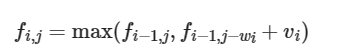

# 滑动窗口

> 关键词：**最大/最小连续，子数组，子字符串**
>
> 解法关键：左右边界双指针

## 剑指 Offer II 016. 不含重复字符的最长子字符串

* 设定左右窗口边界，利用unordered_set作为哈希集存储字母是否在window中，每个左边界都尽力移动右边界去寻找最大字符串，然后删除左边界，左指针右移一格继续查询。

## 209. 长度最小的子数组

* 同上，但是这次维护的是一个双端队列，为每个左边界寻找满足条件的右边界，唯一区别是从子数组中pop元素的时候要记得修改子数组之和sum的数值。

## 2024. 考试的最大困扰度

* 仍是维护左右边界，维护量变为数量少的那个字符的数量不能超过k个，为了简单，直接限定为T或者F，然后取两个函数返回的最大值。

## 424. 替换后的最长重复字符

* 维护一个最多重复字符，这样用长度减去最多重复字符就是需要修改的字符数
* 右指针不断右移，左指针只在子字符串不满足条件的时候左移，保证了right-left是最长的子字符串长度

## 1695. 删除子数组的最大得分

* 维护一个子数组之和变量和哈希表，计算是否出现重复子元素，否则不断右移右指针，有重复元素就左移左指针直至子数组合法

## 2134. 最少交换次数来组合所有的 1 II

* 换个思路，计算区间中所有的0的个数，以数组所有的1的个数作为长度。左右指针同时右移，计算不同位置下所需要交换的0个数，取最小值

## 1208. 尽可能使字符串相等

* 套模板，左指针遍历，对每一个左指针寻找最大右边界，然后超出maxCost再左移左指针
* 这里需要注意边界问题！有可能right == n但是cost在maxCost范围内，这个时候的长度应该是right - left，其他情况才是right处于右边界右边一个，需要用right - left - 1来代表长度

## [剑指 Offer 48. 最长不含重复字符的子字符串](https://leetcode.cn/problems/zui-chang-bu-han-zhong-fu-zi-fu-de-zi-zi-fu-chuan-lcof/submissions/416946058/)

* 经典滑动窗口，但是太久没写，记得**右边界是在左边界循环外面就定义的，每个左边界更新的时候不会重新定义右边界！**

## [438. 找到字符串中所有字母异位词](https://leetcode.cn/problems/find-all-anagrams-in-a-string/description/?favorite=2cktkvj)

* 先滑动到第一个和所求字母等长的位置，观察是否满足条件
* 移动窗口，记录满足条件的个数。当条件满足，插入最左侧索引入答案数组。

> 更简便的方法：
>
> * 我的方法是根据当前字符是否在所需字符串中且数量小于所需数量
> * 答案直接根据满足数量才对valid加一，最后判断满足的valid数和目标字符串的map的size是否相同，记录的时候window内只记录在目标字符串内的字符，其他字符也都不存储。

## [2302. 统计得分小于 K 的子数组数目](https://leetcode.cn/problems/count-subarrays-with-score-less-than-k/description/)

* 暴力DFS从每个点开始搜索会超时
* 利用滑动窗口，遍历右边界。每次维护一个能满足小于k的滑动窗口，每次累加以这个右边界为结尾的子数组个数，即窗口长度。

## [395. 至少有 K 个重复字符的最长子串](https://leetcode.cn/problems/longest-substring-with-at-least-k-repeating-characters/description/)

* 滑动窗口：计算满足条件的字符个数，从1遍历到26.每个循环里面去算左右边界，记录窗口内的字符数和不满足条件的个数，字符数大于当前循环要求的满足条件个数的时候右移左边界，移动到都满足，说明当前子串符合条件，和之前的最大长度取max。
* 也可以用DFS，利用字符串中不满足条件的字符作为分割点，当某个分割里面没有不满足条件的，就是需要的子串。否则找到下一个不含该分割点的子串左右边界递归。

## [1248. 统计「优美子数组」](https://leetcode.cn/problems/count-number-of-nice-subarrays/description/)

* 登记每个奇数的位置和从头到这个奇数的个数，用数组映射奇数个数->索引。
* 对于每个间隔是k的都计算一下左边和右边的偶数个数，相乘加入答案。

## [1052. 爱生气的书店老板](https://leetcode.cn/problems/grumpy-bookstore-owner/description/)

* 以老板使用秘诀时间为窗口进行滑动，寻找窗口内不满意人数最大值。这个值加上本来满意顾客人数即为答案

## [567. 字符串的排列](https://leetcode.cn/problems/permutation-in-string/description/)

* 貌似做过。。先判断字符串，s1要是比s2还长，直接false；
* 哈希表记录s1里面的每个字符个数，弄一个s1长度的窗口，记录剩余需匹配个数
* 不断右移窗口，直至剩余匹配个数为0.其中target记录了每个字符需要的匹配数量。
* 移动边界的时候注意加入子串的**多余的但是在s1里面的字符，target计数值仍然减少，但是不减少剩余匹配数**，**移除子串的target都增加，但是仅有本来target就大于等于0的才会增加待匹配个数。**
* 题解：**直接用数组来记录个数，可以直接比较两个数组内容是否相同，不需要哈希表计数**

## [658. 找到 K 个最接近的元素](https://leetcode.cn/problems/find-k-closest-elements/description/)

* 找到最小的，左右扩展。扩到个数为k就break出循环。**可以用lower_bound直接二分查找到**
* 法二：**直接对着数组按照题目要求排序，前k个元素即为满足要求的，再把这k个升序排列后直接返回**

## [1004. 最大连续1的个数 III](https://leetcode.cn/problems/max-consecutive-ones-iii/description/)

* 普通滑动窗口可解，条件是窗口内不能有多于k个0
* 用lower_bound进行二分查找，搭配前缀和记录1的个数。可以对每个right找到满足条件的left最小下标，用于更新答案。

# 二分查找

关键词：**有序数组，无重复元素**，循环不变量原则，明确区间边界定义

两种写法:

* [left, right): **左闭右开**区间，循环判定条件为`left < right`，如果`nums[middle] > target`则把右边界改为`middle`，因为右边界是开的，不会再扫描到middle，左边界`nums[middle] < target`则需要`middle + 1`来保证middle不会再被扫描到。

  ```cpp
  while (left < right) { // 因为left == right的时候，在[left, right)是无效的空间，所以使用 <
              int middle = left + ((right - left) >> 1);
              if (nums[middle] > target) {
                  right = middle; // target 在左区间，在[left, middle)中
              } else if (nums[middle] < target) {
                  left = middle + 1; // target 在右区间，在[middle + 1, right)中
              } else { // nums[middle] == target
                  return middle; // 数组中找到目标值，直接返回下标
              }
          }
  ```

* [left, right]：**左闭右边闭**区间，循环条件为`left <= right`，因为此时`left == right`有意义。此时因为是左右闭合，所以扫描过middle处元素后，不满足条件无论是左边界还是右边界都不能是middle才能保证middle处的元素不被扫描到。

  ```cpp
   while (left <= right) { // 当left==right，区间[left, right]依然有效，所以用 <=
              int middle = left + ((right - left) / 2);// 防止溢出 等同于(left + right)/2
              if (nums[middle] > target) {
                  right = middle - 1; // target 在左区间，所以[left, middle - 1]
              } else if (nums[middle] < target) {
                  left = middle + 1; // target 在右区间，所以[middle + 1, right]
              } else { // nums[middle] == target
                  return middle; // 数组中找到目标值，直接返回下标
              }
          }
  ```

## [34. 在排序数组中查找元素的第一个和最后一个位置](https://leetcode.cn/problems/find-first-and-last-position-of-element-in-sorted-array/)

* 确定好如何寻找左右边界，利用一个bool变量将左右边界的二分查找集成在一个函数实现

* 注意答案未被赋值的特殊情况，以此确定是否正确找出边界

* 利用以下情况更新左边界：

  ```cpp
  if (nums[middle] >= target) { // 寻找左边界，nums[middle] == target的时候更新right
                  right = middle - 1;
                  leftBorder = right;
              } 
  ```

  更新右边界反之：

  ```cpp
  if (nums[middle] > target) {
                  right = middle - 1;
              } else { // 寻找右边界，nums[middle] == target的时候更新left
                  left = middle + 1;
                  rightBorder = left;
              }
  ```

   **此处的左右边界均为不包含target的下标！！！**

## [33. 搜索旋转排序数组](https://leetcode.cn/problems/search-in-rotated-sorted-array/submissions/422920449/?favorite=2cktkvj)

* 二分查找，判断两种情况：
  1. 当当前值大于target且目标值大于最左侧数值的时候，才选择左半查找，否则选择右半查找
  2. 当前值小于target且target小于最右侧数值的时候，才选择右半查找，否则选择左半查找

## [剑指 Offer 53 - II. 0～n-1中缺失的数字](https://leetcode.cn/problems/que-shi-de-shu-zi-lcof/description/)

* 法一：直接遍历找不同
* 法二：二分查找找不同，最终找到的index就是缺失数字。

## [剑指 Offer 44. 数字序列中某一位的数字](https://leetcode.cn/problems/shu-zi-xu-lie-zhong-mou-yi-wei-de-shu-zi-lcof/?favorite=xb9nqhhg)

* 找数学规律的题目，先看base是10、100、1000，再找这个数是多少，然后再找是这个数的第几位。

## [718. 最长重复子数组](https://leetcode.cn/problems/maximum-length-of-repeated-subarray/description/)

* 法一：动态规划，用二维dp数组表示A[i:]和B[j:]的最长前缀子数组，提前计算好边界情况，然后二重循环从后往前迭代
* 法二：滑动窗口，分别从A的开头和B的开头，去对齐另一个数组。按照对齐后进行遍历，寻找最大窗口。

# 二分答案

**最小化最大值，最大化最小值**，相比于二分查找，这里的mid选择的是答案，二分查找一般是下标

## [2560. 打家劫舍 IV](https://leetcode.cn/problems/house-robber-iv/description/)

* 求最小化的最大值，利用二分答案去寻找满足条件的最小值。
* 遍历的时候可以用dp数组，也可以用两个遍历滚动数组

## [2594. 修车的最少时间](https://leetcode.cn/problems/minimum-time-to-repair-cars/description/)

* 用mid代表修车时间，累计每个机械工能修的上限和，超过cars就算mid能修。

## [875. 爱吃香蕉的珂珂](https://leetcode.cn/problems/koko-eating-bananas/description/)

* 同理，套用二分答案模板。（left < right； mid满足的话 right = mid否则 left = mid + 1）

## [2439. 最小化数组中的最大值](https://leetcode.cn/problems/minimize-maximum-of-array/description/)

* 典中典二分答案，确定每个limit是否大于整个数组的平均值

# 双指针

## [27. 移除元素](https://leetcode.cn/problems/remove-element/description/)

* 利用快慢指针处理，遍历过去把不是要移除元素的快指针所在的元素赋值给慢指针，然后慢指针自增。

## [19. 删除链表的倒数第 N 个结点](https://leetcode.cn/problems/remove-nth-node-from-end-of-list/)

* 快指针比慢指针多走n+1步，然后共同移动至快指针到达null。此时慢指针在倒数第N个节点前一个节点。

## [206. 反转链表](https://leetcode.cn/problems/reverse-linked-list/)

* 利用快慢指针一前一后，不断调换next的方向，迭代整个链表后实现反转

## [142. 环形链表 II](https://leetcode.cn/problems/linked-list-cycle-ii/)

* 利用快慢指针，快指针一次走两步。相遇则说明有环。然后利用数学原理推导入环位置。
* 一个从头节点出发，一个从相遇节点出发，他们二者同时移动，相遇节点即为环入口节点位置。

## [15. 三数之和](https://leetcode.cn/problems/3sum/description/)

* 利用双指针+排序解题。首先排序，然后固定一个`i`进行遍历，然后对每个遍历的`i`进行`left`和`right`的判断，和小了就右移left，大了左移right。对`i`去重体现在遍历时候若是和前一个数相同跳过该轮，`left`和`right`的去重在判断到为0的时候，在两个指针往里收缩的时候，判断收缩后的数字是否仍是相同的，是的话多收缩一格。

## [18. 四数之和](https://leetcode.cn/problems/4sum/description/)

* 三数之和升级版，多套一层循环
* target不为0，只能根据target和遍历到的元素都大于0的情况下进行剪枝

## [剑指 Offer 05. 替换空格](https://leetcode.cn/problems/ti-huan-kong-ge-lcof/)

* **很多数组填充类的问题，都可以先预先给数组扩容带填充后的大小，然后在从后向前进行操作。**

  > 从前到后的时间复杂度是$O(n^2)$

## [151. 反转字符串中的单词](https://leetcode.cn/problems/reverse-words-in-a-string/)

* 先去除整个字符串中的多余空格：使用双指针法，`fastIndex`只选取非空格位置，若不是第一个单词，要自动在slow处增添空格
* 然后反转整个字符串
* 以空格和字符串的结尾为边界，对每个单词进行反转

## [11. 盛最多水的容器](https://leetcode.cn/problems/container-with-most-water/submissions/422613919/?favorite=2cktkvj)

* 类似接雨水，双指针指向两边，每次移动高度较低的那个边。

## [287. 寻找重复数 ](https://leetcode.cn/problems/find-the-duplicate-number/description/?favorite=2cktkvj)

* 法一：桶排序
* 法二：二分查找
* 法三：**Floyd判圈算法**

## [31. 下一个排列](https://leetcode.cn/problems/next-permutation/submissions/422672197/?favorite=2cktkvj)

* 双指针，一个从尾部开始找到第一个非降序（从左往右看）排列的元素，设为`left`
* 另一个从尾部开始，找到第一个大于前一个指针指向的值的位置（因为都是降序的，所以找到的是恰好大于的最小值）`right`，交换两个元素。
* 把`left`后面的元素都反转成为升序的。

## [2555. 两个线段获得的最多奖品](https://leetcode.cn/problems/maximize-win-from-two-segments/description/)

* 双指针搭配前缀最大值数组来实现计算两个线段内的值。

## [2462. 雇佣 K 位工人的总代价](https://leetcode.cn/problems/total-cost-to-hire-k-workers/description/)

* 左右各自维护一个最小堆，优先维护左侧最小堆为candidates个，然后右侧**从不和左侧相交的位置开始维护**，尽可能维护candidates个
* 获取左右的头部节点值，选则之。然后每轮循环都先补充左侧的，再补充右侧的。**一定要保证左右侧的最小堆无交集**

# 字符串

## [剑指 Offer 58 - II. 左旋转字符串](https://leetcode.cn/problems/zuo-xuan-zhuan-zi-fu-chuan-lcof/)

* 先反转整个字符串，然后分别反转两部分字符串

## [722. 删除注释](https://leetcode.cn/problems/remove-comments/description/)

* 最难的就是跨行注释，要注意同时跨行注释删除了换行符的情况。故不能每行结束就判定当前字符串是否入答案数组，要等flag为false也就是块注释结束后或者还未开始才能确保当前字符串是完整的。

## [833. 字符串中的查找与替换](https://leetcode.cn/problems/find-and-replace-in-string/description/)

* 拿个新的字符串出来根据是否匹配往里面加原本的或者替换后的
* 这里面的对比索引没排序，需要套一层排序过的索引数组。

## KMP匹配算法

* `next`前缀表数组中存储的是最长的相同先后缀长度，用于表示可以重复利用的已匹配部分的长度。

  > 我的理解：
  >
  > `aabaaf`的前缀表是[0 1 0 1 2 0]
  >
  > 如果文本串是`aabaabaaf`，则文本匹配到第二个b的时候模板串是f，此时失配，如果是普通算法就要从头开始进行模板串匹配，但是**前缀表记录了后缀和前缀相同部分的最大长度，所以可以重复利用这个长度，让模板串从这个长度之后的第一个开始继续匹配**，此处即重复利用了`aa`从模板串的`b`继续进行匹配。
  >
  > 核心思想：**把失配位置前面的匹配字符串的后缀 当作后续匹配的前缀来用**

### [28. 找出字符串中第一个匹配项的下标](https://leetcode.cn/problems/find-the-index-of-the-first-occurrence-in-a-string/description/)

# 哈希表

关键词：重复出现（一般为隐含条件，重复出现说明无限循环之类的），不重复集合

## [剑指 Offer 35. 复杂链表的复制](https://leetcode.cn/problems/fu-za-lian-biao-de-fu-zhi-lcof/submissions/428505507/?favorite=xb9nqhhg)

* 因为存在乱序指针，所以无法直接一次遍历复制所有链表完成构建
* 利用哈希表作为原链表到新链表节点的映射，遍历一次完成新链表节点的构建
* 再遍历一次完成random和next指针指向的对象的链接。

# 栈和队列

## 单调队列

* 队列里面有序，但是队头pop出来的元素不一定真的是队头元素，因为真的队头可能已经排没了。

### [239. 滑动窗口最大值](https://leetcode.cn/problems/sliding-window-maximum/)

* 创建单调队列，限定pop和push

  `pop(value)`：当且仅当单调队列头部，即当前窗口最大值正好是被pop的那个value的时候，执行`pop_front()`

  `push(value)`：**单调队列的重点：当插入的数值大于队列尾部的数，就把单调队列尾部的数pop出来，直至到达队列头或者队列前面有比value大的数字**

* 本质：**push的时候仅考虑有机会成为最大值的数字**

### [剑指 Offer 59 - II. 队列的最大值](https://leetcode.cn/problems/dui-lie-de-zui-da-zhi-lcof/description/?favorite=xb9nqhhg)

* 构建一个单调队列，递减顺序存储当前元素内的最大值。

## 优先级队列

* 队列变成有序队列

### [347. 前 K 个高频元素](https://leetcode.cn/problems/top-k-frequent-elements/)

* 利用`map`对每个元素的频率进行存储
* 用`priority_queue`保存最高`k`频率的 pair，比较函数自定义

## 单调栈

* 维护栈顶到栈底递增的就是寻找数字右侧第一个比自己大的元素（因为大的都会导致需要pop元素才能入栈，对每个pop出来的元素求解距离等参数）；同理，维护栈顶到栈底递减的就是寻找自己右边第一个比自己小的元素。

### [739. 每日温度 ](https://leetcode.cn/problems/daily-temperatures/)

* 维护一个栈顶到栈底的递增单调栈，栈内元素是索引，只有最新温度高于栈顶才pop元素出来进行答案元组赋值。其他时候都pop新的索引进去。

### [496. 下一个更大元素 I ](https://leetcode.cn/problems/next-greater-element-i/)

* 和上题同理，先构造一个单调栈来记录每个数字对应的下一个最大元素，只不过这次记录的是元素本身值而非下标，然后把`nums1`中的元素直接根据`map`寻找其在`nums2`的下一个最大元素值

### [503. 下一个更大元素 II](https://leetcode.cn/problems/next-greater-element-ii/)

* **关键小妙招：题目中相对于每日温度唯一的区别是改成循环数组了，我们可以通过遍历两倍的长度来实现**

### [42. 接雨水 ](https://leetcode.cn/problems/trapping-rain-water/)

**面试经典常青藤！**

1. 双指针法

   **按列算雨水**，寻找当前位置左右高于本节点柱子高度的第一根柱子。两个柱子的较小值减去本柱子高度，即为该列的雨水数量。

   直接每次遍历寻找复杂度为$O(n^2)$，所以需要用空间换时间，上数组保存每个位置左右第一个高于本柱子高度的柱子，分别从最左边和最右边迭代赋值。

2. 单调栈法

   **按行算雨水**，维护一个栈顶到栈底递增的单调栈，当出现大于栈顶元素的柱子时，说明出现了凹槽。此时栈顶是凹槽底部，栈顶下一个元素是左侧柱子，待插入元素是右侧柱子，计算高度`h = min(left, right) - height[i]`然后计算宽度为左右柱子的索引差**减一**

### [84. 柱状图中最大的矩形](https://leetcode.cn/problems/largest-rectangle-in-histogram/)

* 改找左右侧第一个小于本柱子高度的柱子的**下标**
* 用双指针的话可以利用之前构造好的数组进行跳步遍历
* 用单调栈则维护一个栈顶到栈底递减的栈，寻找到左右第一个小于本柱子的位置，**矩形是以本柱子为最小高度的矩形**

## [155. 最小栈](https://leetcode.cn/problems/min-stack/description/)

* 额外维护一个最小值的栈，存储当前位置到栈底的最小值。
* push和pop都要额外同步一下最小值栈

# 二叉树

* 满二叉树：树中只有**度数为0和度数为2**的结点，且**度为0的结点在同一层上**

  

* 完全二叉树：**除了最后一层可能没填满**，其余每层节点数都达到最大值，并且**最下面一层结点都集中在该层最左边的若干位置**


## 二叉搜索树

* 有数值的二叉树，**二叉搜索树是一个有序树**
* 平衡二叉搜索树：左右子树高度差不超过1

> 红黑树实现容器  VS  哈希表实现容器
>
> set、map、multimap、multiset的底层实现是**平衡二叉树**，所以查找的时间复杂度为$O(logn)$，由于红黑树的平衡性，不会出现最坏情况
>
> unordered set、unordered map的底层实现是**哈希表**，查找时间复杂度是$O(1)$，最坏情况发生很多哈希冲突则时间复杂度变为$O(n)$，且在元素比较少的时候，用哈希表的容器可能比较浪费空间

## 二叉树遍历

迭代法

* 前序遍历：访问结点和处理结点顺序一致

  ```C++
  vector<int> preorderTraversal(TreeNode* root) {
          vector<int> res;
          stack<TreeNode *> st;
          if(root == nullptr)
              return res;
          st.push(root);
          while(!st.empty()){
              TreeNode *t = st.top();
              st.pop();
              res.push_back(t->val);
              if(t->right)
                  st.push(t->right);
              if(t->left)
                  st.push(t->left);
          }
          return res;
      }
  ```

* 中序遍历：访问结点和处理结点不一致，先压栈到最左下角节点，然后一个个开始当中间节点看待，没有右子树就出栈，有右子树就入栈对右子树再一直压栈至该子树最左下角点。                                       

* 后序遍历：把前序遍历的顺序换成中右左，然后**反转结果数组**

  ```c++
  vector<int> inorderTraversal(TreeNode* root) {
          vector<int> res;
          stack<TreeNode *> st;
          TreeNode *cur = root;
          while(!st.empty() || cur != nullptr){
              if(cur != nullptr){
                  st.push(cur);
                  cur = cur -> left;
              }else{
                  cur = st.top();
                  st.pop();
                  res.push_back(cur->val);
                  cur = cur->right;
              }
          }
          return res;
      }
  ```

  ```c++
  vector<int> postorderTraversal(TreeNode* root) {
          vector<int> res;
          stack<TreeNode *> st;
          TreeNode *cur = root;
          if(root == nullptr)
              return res;
          st.push(root);
          while(!st.empty()){
              cur = st.top();
              st.pop();
              res.push_back(cur->val);
              if(cur->left)
                  st.push(cur->left);
              if(cur->right)
                  st.push(cur->right);
          }
          reverse(res.begin(), res.end());
          return res;
      }
  ```

* 层序遍历：利用队列的先进先出来遍历，**每层的size要提前测量固定**

递归法

* 层序遍历：

  ```c++
  void order(TreeNode* cur, vector<vector<int>>& result, int depth)
      {
          if (cur == nullptr) return;
          if (result.size() == depth) result.push_back(vector<int>());
          result[depth].push_back(cur->val);
          order(cur->left, result, depth + 1);
          order(cur->right, result, depth + 1);
      }
      vector<vector<int>> levelOrder(TreeNode* root) {
          vector<vector<int>> result;
          int depth = 0;
          order(root, result, depth);
          return result;
      }
  ```


## [96. 不同的二叉搜索树 ](https://leetcode.cn/problems/unique-binary-search-trees/?favorite=2cktkvj)

* 转换成n个结点的二叉树数目`G(n)`和以`i`为根，序列长度为n的不同二叉树数目的函数`F(i, n)`，数学推导一下得到递归表达式

## [98. 验证二叉搜索树](https://leetcode.cn/problems/validate-binary-search-tree/?favorite=2cktkvj)

* 法一：中序遍历解君愁
* 法二：构造helper function去递归检查上下界是否超出。

## [105. 从前序与中序遍历序列构造二叉树](https://leetcode.cn/problems/construct-binary-tree-from-preorder-and-inorder-traversal/description/?favorite=2cktkvj)

* 前序第一个提出来作为根节点，作为中序的分割index
* 利用分割index获取中序左右子数组，利用左子树数组长度从前序分割出前序的左右子数组
* 迭代根节点左右子树

## [114. 二叉树展开为链表 ](https://leetcode.cn/problems/flatten-binary-tree-to-linked-list/description/?favorite=2cktkvj)

* 原地算法，不消耗额外空间`O(1)`：**左子树最右侧结点是当前右子树的前缀结点**，不断遍历左子树存在的最右结点插队到右子树前面

* 普通算法：用一个vector保存迭代或者递归前序遍历的结果，然后构造个新的树

## [236. 二叉树的最近公共祖先](https://leetcode.cn/problems/lowest-common-ancestor-of-a-binary-tree/?favorite=2cktkvj)

* **自底向上找，后序遍历回溯法**，如果有所求结点在子树中则返回，否则返回空值。若是左右子树返回都不是空的，说明根节点就是最近祖先
* 需要注意一个结点正好是祖先的情况，已经包含在回溯的时候了。

## [235. 二叉搜索树的最近公共祖先](https://leetcode.cn/problems/lowest-common-ancestor-of-a-binary-search-tree/)

* 通解：如上题
* 特解：利用二叉搜索树的特性，**递归到的第一个在p、q之间的结点就是二者的最近公共祖先**

## [337. 打家劫舍 III ](https://leetcode.cn/problems/house-robber-iii/submissions/414440689/?favorite=2cktkvj)

`dfs`、二叉树

* 用map去记录偷和不偷的价值
* 使用`dfs`和后序遍历去递归初始化两个哈希表
* 偷一定带有左右子树不偷，但是**不偷的返回值是左右子树的最大值之和，左右子树不一定要偷**

## [437. 路径总和 III](https://leetcode.cn/problems/path-sum-iii/submissions/414529078/?favorite=2cktkvj)

* 开个**`dfs`**去遍历从某个点开始的能满足目标长度的路径数目
* 主函数也用递归，对所有点都来次`dfs`，最终得到所有点开始的所有能满足路径长度的路径数目

更优解：**前缀和**，时间复杂度`O(n)`

1. 构造前缀和哈希表，存根节点到当前节点的路径上除了当前节点外的所有节点的前缀和
2. 在已经保存的前序结点中招是否存在前缀和等于当前节点到根节点前缀和减去目标路径长度的，有说明在路径中有一点到当前节点的路径长度是目标长度

## [538. 把二叉搜索树转换为累加树](https://leetcode.cn/problems/convert-bst-to-greater-tree/?favorite=2cktkvj)

* 前序遍历一遍，把树和求出来
* 迭代法中序遍历，赋值为和，然后把和减去当前结点的旧值，作为下一次赋值使用。

## [剑指 Offer 32 - III. 从上到下打印二叉树 III](https://leetcode.cn/problems/cong-shang-dao-xia-da-yin-er-cha-shu-iii-lcof/?favorite=xb9nqhhg)

* 相比于普通层序遍历，需要换成之字形遍历
* 增加一个判断层数奇偶性的变量，利用deque双向队列实现不同的push和pop。

## [剑指 Offer 33. 二叉搜索树的后序遍历序列](https://leetcode.cn/problems/er-cha-sou-suo-shu-de-hou-xu-bian-li-xu-lie-lcof/submissions/427020782/?favorite=xb9nqhhg)

* 根据左子树都小于根节点，右子树都大于根节点，根节点在后序遍历序列的最后一个。构建一个递归函数，判断当前是否符合这个定律，然后递归判断左右子树是否满足。

# 动态规划

**穷举（找到状态转移方程）----->聪明地穷举（剪枝，备忘录，dp table），空间换时间降低复杂度**

> `dp`写法：
>
> * 想清楚`dp table`的物理意义
>
> * 先确定base case
> * 然后根据状态转移方程循环迭代

## [5. 最长回文子串](https://leetcode.cn/problems/longest-palindromic-substring/submissions/414744665/?favorite=2cktkvj)

* 法一：普通`dp`，存`dp[i][j]`表示从`i`到`j`是否是回文的。首先长度为1的都是，然后从长度为2开始递推，内循环是左边界枚举。在时空复杂度均为o($n^2$)情况下完成
* 法二：扩散回文中心：即长度为1和2的情况开始不断左右扩散，寻找最大的边界。时间复杂度不变，空间复杂度变为`O(1)`

## [647. 回文子串](https://leetcode.cn/problems/palindromic-substrings/submissions/414749269/?favorite=2cktkvj)

* 和上一题本质一样，都会遍历所有回文子串，这里用法二直接加上一个计数秒了

## [70. 爬楼梯 ](https://leetcode.cn/problems/climbing-stairs/submissions/414753846/?favorite=2cktkvj)

* 别用`dfs`，用滚动数组的方法不断迭代就行。`p, q, r`分别代表`f(x - 2), f(x - 1), f(x)`

##  [64. 最小路径和](https://leetcode.cn/problems/minimum-path-sum/submissions/414769977/?favorite=2cktkvj)

* **别用`DFS`，会超时，用`dp`数组迭代就行，空间换时间**

## [53. 最大子数组和](https://leetcode.cn/problems/maximum-subarray/?favorite=2cktkvj)

* 别用dp数组，会超时

* 法一：用`f(i)`表示以第`i`个数结尾的连续子数组最大和，不断迭代，判断新元素单开比较大还是和旧子数组合并比较大。然后取`f`中最大的那个。迭代可以用**滚动数组**降低空间复杂度。

* 法二：**分治法**，维护区间`[l, r]`内的四个信息量：

  * `lSum`:  以`l`为左端点的最大子段和
  * `rSum`: 以`r`为右端点的最大子段和
  * `mSum`: 区间内最大字段和
  * `iSum`：区间和

  然后就是从l，r最大开始分治，维护四种信息量，回升后得到整个区间内的最大子段和

## [918. 环形子数组的最大和](https://leetcode.cn/problems/maximum-sum-circular-subarray/description/)

* 最大子数组和的进阶版，包括最大子数组和的情况和越过边界返回起始点的清理
* 首先求出不跨越n的基础情况，然后计算leftMax数组获取前缀和数组的最大值，枚举所有的后缀，二者相加获取跨越n的子数组和

## [152. 乘积最大子数组](https://leetcode.cn/problems/maximum-product-subarray/solutions/?favorite=2cktkvj)

* 不能按上面那样判断`f[i]`了，因为可以负负得正。
* 需要增添一个最小乘积，用于负负得正
* 迭代维护最大和最小乘积，最终返回最大乘积中的最大值。
* 因为第`i`个状态之和第`i-1`个状态有关，所以可以利用滚动数组的方法，减少空间复杂度。

## [55. 跳跃游戏](https://leetcode.cn/problems/jump-game/description/?favorite=2cktkvj)

* **不要想着纯纯dfs，只会超时爆炸**
* 去求能跳跃到的最远距离，如果被0卡住了就返回false

## [62. 不同路径](https://leetcode.cn/problems/unique-paths/?favorite=2cktkvj)

* **使用纯纯dfs会爆炸**
* 排列组合，高中数学`C(m, n)`，**数据太大仍然爆炸**
* 使用dp数组，空间换时间，继承前面的答案才是真

## [322. 零钱兑换](https://leetcode.cn/problems/coin-change/submissions/417744879/?favorite=2cktkvj)

* 每个dp循环里面对每个零钱种类都循环一次难以避免，需要做的是尽量减少计算。利用**dp数组记录前面的值**，不断迭代。

## [221. 最大正方形 ](https://leetcode.cn/problems/maximal-square/submissions/417762545/?favorite=2cktkvj)

* 照样`dp[i][j]`表示以`(i, j)`为右下角的最大正方形，如果该点是1，则这个点的最大正方形边长取决于**左侧，上侧，左上方**三个点能够构造的正方形的**最小边长**+1

## [22. 括号生成](https://leetcode.cn/problems/generate-parentheses/?favorite=2cktkvj)

* 直接dfs，记录左右括号数目，根据左右括号数目决定后续的dfs分支。

## [416. 分割等和子集 ](https://leetcode.cn/problems/partition-equal-subset-sum/submissions/418077031/?favorite=2cktkvj)

* **不到万不得已，别当🤡再用纯dfs了！**
* 整个集合求出来，和为基数直接返回失败，偶数就除2
* 转换成背包问题`dp[i][j]`，前`i`件物品，背包容量是`j`，能否满足正好装满背包，然后去迭代判断
* 所有的`dp[i][0]=true`，然后判断装不装包。

## [279. 完全平方数 ](https://leetcode.cn/problems/perfect-squares/submissions/418095118/?favorite=2cktkvj)

* `dp[i]`：和为`i`的最小平方和数量
* 复杂度是$O(N*sqrt(N))$

## [413. 等差数列划分](https://leetcode.cn/problems/arithmetic-slices/description/)

* dp数组定义为以当前元素作为结尾的等差数列个数
* 转移方程就是判断当前元素和前一个元素的差是否满足等差，满足就等于上一个dp+1（以上一个元素结尾且长度只有2的那个），不满足则dp为0

## [376. 摆动序列](https://leetcode.cn/problems/wiggle-subsequence/description/)

* 分别设立两个dp数组，用于记录结尾为上升趋势的摆动序列和结尾为下降趋势的摆动序列的最大长度
* 根据当前元素和前一个元素的大小关系，更新以当前元素为结尾的摆动序列长度。要么等于同趋势的上一个元素的长度，要么等于以上一个数为结尾趋势相反的数组记录的子序列长度+1。
* 可以利用滚动数组降低空间复杂度。也可以根据两个数组过程中元素差不大于1，省去比大小行为。肯定选相反趋势+1的那个。

## :star:股票类问题通解

```c++
dp[i][k][0 or 1]: 第i天，交易上限次数为k的情况下，0为不持有股票，1为持有股票

base case：
dp[-1][...][0] = dp[...][0][0] = 0
dp[-1][...][1] = dp[...][0][1] = -infinity
//具体到了题目里面就是，第一天不持有股票就是0，第一天持有股票就是-prices[i]
    
状态转移方程：
//当天不持有股票的利润最大值是前一天也不持有和前一天持有当天卖掉的最大值
dp[i][k][0] = max(dp[i-1][k][0], dp[i-1][k][1] + prices[i])
//当天持有的利润最大值是前一天持有和前一天不持有，今天刚买的最大值（买股票扣除交易次数上限，不能换成卖扣除，会超出交易次数）
dp[i][k][1] = max(dp[i-1][k][1], dp[i-1][k-1][0] - prices[i])

//根据实际情况可以直接把相邻元素降低复杂度，变成四个数。空间复杂度变O（1）
```

### [309. 最佳买卖股票时机含冷冻期 ](https://leetcode.cn/problems/best-time-to-buy-and-sell-stock-with-cooldown/submissions/418121567/?favorite=2cktkvj)

* 没有限制K，所以dp数组可以表达成`dp[i][j]`：第i天，是否持有股票的最大利润
* 因为限制冷冻期，导致持有股票的利润最大值需要修改一下，变成**前两天不持有（如果是前一天不持有，可能是前一天刚卖的），今天买入**和**前一天持有**的最大值

## [494. 目标和](https://leetcode.cn/problems/target-sum/submissions/418125861/?favorite=2cktkvj)

* 传统dp，但是要剪枝。
* 利用当前遍历到的index和remain链接作为key。记录备忘录，下一次遇到该结点直接跳过后续计算。

## [139. 单词拆分 ](https://leetcode.cn/problems/word-break/submissions/420606472/?favorite=2cktkvj)

* 状态方程：遍历当前字典中所有单词看是否有符合前缀的，有则递归去掉前缀后的字符串。
* 利用备忘录记录每个位置是否被计算过，结果如何。减少计算次数。

## [198. 打家劫舍](https://leetcode.cn/problems/house-robber/submissions/420612517/?favorite=2cktkvj)

* 备忘录+dp

## [213. 打家劫舍 II](https://leetcode.cn/problems/house-robber-ii/description/)

* 因为是循环的，直接分成两个数组讨论， 一个`[0,n-2]`一个`[1, n-1]`。分别dp，记得第二个数字的dp值等于前两个的最大值！

## [1388. 3n 块披萨](https://leetcode.cn/problems/pizza-with-3n-slices/description/)

* 问题转换为3n个块里面找n个不相邻的块的最大值，第一个和最后一个相邻，类似上面的打家劫舍||
* 数组设置为前`i`个数选择`j`个的最大值，初始化一下块数小于等于两个的情况
* 分别剔除最后一个元素和第一个元素，做两次动态规划，取最大值。

## [56. 合并区间](https://leetcode.cn/problems/merge-intervals/?favorite=2cktkvj)

* 先按照区间左侧排序一下，用一个新的数组去存区间。
* 然后遍历后面的所有区间，和答案数组中的最后一个区间对比，如果能合并的合并。不能合并的说明本区间融合满了。将该区间插入答案数组，作为新的区间待融合区间。

## [剑指 Offer 49. 丑数 ](https://leetcode.cn/problems/chou-shu-lcof/submissions/423289795/?favorite=xb9nqhhg)

* 整三个有序链表，然后合并有序链表。因为每个链表只要最新数值，可以用单变量迭代取代链表，节约空间。

## [264. 丑数 II ](https://leetcode.cn/problems/ugly-number-ii/description/)

* 同上题，这里通过对每个链表当前元素都判定是否等同于当前被选择的数值，来保证去重。只要等于当前数值，链表都向前迭代一个位置。
* 分别用三个指针指代三个有序链表的头节点。这里则用已经生成的丑数数组的下标表示。

## [343. 整数拆分](https://leetcode.cn/problems/integer-break/submissions/423297152/)

* 用`dp[i]`表示数字`i`能拆分的最大乘积，利用备忘录剪枝。
* 状态转移方程进行dp计算

## [剑指 Offer 60. n个骰子的点数](https://leetcode.cn/problems/nge-tou-zi-de-dian-shu-lcof/submissions/425972130/?favorite=xb9nqhhg)

* 找到`dp`数组描述方式：`dp[n][point]`表示n个骰子能得到`point`点数的概率
* 找到状态转移方程：`dp[n][point]`的概率是`n-1`个骰子投出`point - 1/2/3/4/5/6`的概率乘以六分之一的和
* 特判`point`未必大于6，所以遇到减去后的`point`小于等于0的情况跳过

## [剑指 Offer 13. 机器人的运动范围](https://leetcode.cn/problems/ji-qi-ren-de-yun-dong-fan-wei-lcof/submissions/425986583/?favorite=xb9nqhhg)

* 直接递归判断，用备忘录记录访问过的位置，全局变量完成计数即可。

## [979. 在二叉树中分配硬币](https://leetcode.cn/problems/distribute-coins-in-binary-tree/description/)

* dfs递归分析每个节点需要被父节点拿走多少硬币

## [2556. 二进制矩阵中翻转最多一次使路径不连通](https://leetcode.cn/problems/disconnect-path-in-a-binary-matrix-by-at-most-one-flip/description/)

* 通过比较路径的下轮廓和上轮廓是否有交集，判断能否使其不连通。

## [2370. 最长理想子序列](https://leetcode.cn/problems/longest-ideal-subsequence/description/)

* 相邻、子序列，想到dp。
* 类似300.最长递增子序列
* 确定`f[i][c]`表示s的前i个字符中以c为结尾的最大字符串长度
* 然后根据所有状态转移都取决于`f[i-1]`，第一维可以压缩

## [2400. 恰好移动 k 步到达某一位置的方法数目](https://leetcode.cn/problems/number-of-ways-to-reach-a-position-after-exactly-k-steps/description/)

* 可以直接筛选掉不符合条件的所有点，进行剪枝，保证能抵达剩余步数为0的情况都是到达终点的情况。不用再额外判断是否是终点
* 记忆化搜索，在dfs的同时利用哈希表进行存储，保存经过过的点，否则会超时
* **动态规划和记忆化搜索思路一样，就是把dfs的递归过程改成了对dp数组的迭代计算。**`dp[i][j]`表示走i步能走到j的方法数目。

## [2435. 矩阵中和能被 K 整除的路径](https://leetcode.cn/problems/paths-in-matrix-whose-sum-is-divisible-by-k/description/)

* 动态规划可以利用纯数组增加效率，记忆化的备忘录也是，用map会慢点

## [2328. 网格图中递增路径的数目](https://leetcode.cn/problems/number-of-increasing-paths-in-a-grid/description/)

* 记忆化搜索，可以利用直接把dp数组初始值赋-1来替代vis数组。
* 记得刚开始一个点也是路径，所以初始的res就是1

## [2472. 不重叠回文子字符串的最大数目](https://leetcode.cn/problems/maximum-number-of-non-overlapping-palindrome-substrings/description/)

* 中心扩展法求回文串+动态规划获得每个位置结束的最大子串数目

## [2707. 字符串中的额外字符](https://leetcode.cn/problems/extra-characters-in-a-string/description/)

* 题解中同时有记忆化搜索和dp数组递归两种解法。
* 对于`dfs(-1)`这种情况转换为`dp`数组可以将所有数组元素右移一位，比如此处的`dp[i]`就代表前`i`个字符的最优解

## [2266. 统计打字方案数](https://leetcode.cn/problems/count-number-of-texts/description/)

* 构建两个dp数组，分别表示连续的n个相同字符的方案数，数字7和9一个方案，其他数字一个方案
* 递归构建好整个dp数组。
* 遍历整个字符串，每遇到一次连续字符结尾就计算一次dp数值添加到答案里面
* 记得最后遍历到字符串结尾还有一次子串计算。

## [1289. 下降路径最小和 II](https://leetcode.cn/problems/minimum-falling-path-sum-ii/description/)

* 数据不大，直接暴力。对于二维数组dp，取上一行不直接相邻的dp数组与当前网格值相加即为这个位置的dp路径最小和。
* 可以优化转移方程：当前dp只需要上一行的最小值，可以存上一行最小值及其下标，以及次小值。这样转移方程变成O(1)的了，
* 我们只需维护第 i−1行相关的三个变量（最小值，最小值下标和次小值）就可以在 O(1)时间内求解 `f[i][j]`

## [638. 大礼包](https://leetcode.cn/problems/shopping-offers/description/)

* 过滤不优惠礼包，对每个不超额的优惠礼包都尝试购买。买后递归继续。
* 初始值设置为单买价格。用来最后填补。

## [63. 不同路径 II](https://leetcode.cn/problems/unique-paths-ii/description/)

* 先把边界的dp确定好，然后开始遍历，先行后列。每个数组都是左边和上面元素的和，除非当前是障碍物。
* 不要忘记起始点和边界上的障碍物情况。

## [377. 组合总和 Ⅳ](https://leetcode.cn/problems/combination-sum-iv/description/)

* 正常使用dp数组会溢出，中间状态会超过INT_MAX，要么开unsigned longlong 要么限制一下`dp[i - num] < INT_MAX - dp[i]`

## [845. 数组中的最长山脉](https://leetcode.cn/problems/longest-mountain-in-array/description/)

* 分别记录从左边到当前元素的连续递增序列长度和当前元素到右边的连续递减序列长度，都不包含当前元素本身。
* 遍历所有除了头尾之外的元素，如果左右都有能组成山脉的元素，则判断是否是最大的山脉长度，记得加上山顶节点也就是当前节点

## [978. 最长湍流子数组](https://leetcode.cn/problems/longest-turbulent-subarray/description/)

* 和376题摆动序列差不多。分别用up和down数组记录最后趋势是上升或者下降的数组长度
* 不同之处是这里要求连续的子数组，所以一旦不满足，当前点的长度就要置为1，而非继承之前的长度。

## [1014. 最佳观光组合](https://leetcode.cn/problems/best-sightseeing-pair/description/)

* 先遍历后一个j，然后遍历前一个i，因为`values[i] + values[j] + i - j`可以拆分成`valuse[i] + i` 和`values[j] - j`所以每次遍历`j`的时候都可以在比对完当前值和前面的最大`values[i] + i`即mx拼接后的答案是否是最大的，然后看当前`values[j] + j`是否会更新mx。

## [1444. 切披萨的方案数](https://leetcode.cn/problems/number-of-ways-of-cutting-a-pizza/description/)

* 构建一个从左上角开始计算整个矩阵苹果总数的数组，可利用容斥原理进行迭代初始化
* dp数组为从左上角开始进行切分为k组的最大方案数。保证每次都能切出苹果，按行和列分成多种情况。

## [85. 最大矩形](https://leetcode.cn/problems/maximal-rectangle/description/)

* 用left数组记录当前位置开始向左的连续1的个数
* 对每个点遍历，计算最大矩形。其中宽度等于从这个点往上的一列的所有left的最小值。每次更新最大面积。
* 也可以用单调栈完成。用单调栈对每列分别存储从[i, j]开始往上和往下第一个小于`left[i][j]`的位置，分别用`up[i]和down[i]`记录，处理好up和down后，遍历这一列的每一个元素，它们的最大矩形就是up和down的行差减去1为高度，`left[i][j]`为宽度的矩形（也就是up和down记录的是以`left[i][j]`为宽度尽可能上下扩展的位置）

## [403. 青蛙过河](https://leetcode.cn/problems/frog-jump/description/)

* 法一：DFS+记忆化+二分查找。每次找下一跳能抵达的石头索引，都可以用lower_bound来进行二分查找。然后判断。
* 法二：动态规划

## [312. 戳气球 ](https://leetcode.cn/problems/burst-balloons/description/)

* 法一：记忆化搜索
* 法二：DP
* 二者都是把问题从戳气球反过来变成往里面放气球。方便了处理，自顶向下就是dfs，自底向上就是dp。
* dp要根据状态转移方程来确定遍历的顺序。

## [514. 自由之路](https://leetcode.cn/problems/freedom-trail/description/)

* 极端复杂dp数组
* `dp[i][j]`表示从前往后拼写出 key 的第 i 个字符， ring的第 j 个字符与 12:00方向对齐的最少步数
* 用一个pos数组记录所有字符在ring中的index集合，方便状态转移
* 转移的时候同时遍历前一个key的字符的所有ring的位置和当前的key字符的所有ring的位置，key字符的i从小到大迭代，放最外层。


## :star:背包问题

### [2585. 获得分数的方法数](https://leetcode.cn/problems/number-of-ways-to-earn-points/description/)

* 可以压缩成一维01背包，因为状态转移方程的第一维度`i`永远取决于`i-1`

### [2218. 从栈中取出 K 个硬币的最大面值和](https://leetcode.cn/problems/maximum-value-of-k-coins-from-piles/description/)

* 分组背包，利用前缀和把所有的硬币栈变成一个组里面只能选择一个前缀和item

* 使用分组背包模板，记得容量遍历的时候从大到小遍历，否则会导致重复选择

  > 因为不用滚动数组压缩第一维度的情况下应该满足的是
  >
  > 
  >
  > 如果容量从小到大遍历，则会导致滚动数组遍历的时候，更新`f[i][j]`的时候用到的`f[j-w_i]`是已经更新过的`f[i][j-w_i]`（如果j大于W_i的话）。导致背包元素重复选择，变成完全背包了

* 此处套用模板要注意，前缀和下标从0开始，但是代表的容量从1开始

### [2597. 美丽子集的数目](https://leetcode.cn/problems/the-number-of-beautiful-subsets/description/)

* 可以用回溯法处理，就是选择元素的时候加一个判断前提。

### [474. 一和零 ](https://leetcode.cn/problems/ones-and-zeroes/description/)

* 和传统背包略有不同，这里面有两个容量，分别是0和1的个数，背包要变成三维数组，`dp[i][j][k]`前`i`个字符串在`j`个0和`k`个1的容量情况下能得到的最大子集个数。
* 因为转移方程只和上一个`i-1`状态有关，可以去掉第一个维度。

### [1049. 最后一块石头的重量 II](https://leetcode.cn/problems/last-stone-weight-ii/description/)

* 转换为找到最接近总和一半的石头重量之和
* 转换为01背包问题。利用bool值判断前`i`个石头是否能凑出所需重量`j`

## :star:树型dp

### [LCP 34. 二叉树染色](https://leetcode.cn/problems/er-cha-shu-ran-se-UGC/description/)

* 相比于线性dp，这里的dfs递归变成了树遍历的方式进行。
* 考虑的转换方程变成了当前根节点dp数组和左右子树的dp数组的关系。

### [95. 不同的二叉搜索树 II](https://leetcode.cn/problems/unique-binary-search-trees-ii/description/)

* 我更愿意称之为树型的DFS，相比于线性的，考虑边界即叶子节点的情况更抽象了。
* 可以先只抽象出根节点和左右子树的关系。叶子节点的可以先写出这个关系再去验证补充边缘条件。

### [2673. 使二叉树所有路径值相等的最小代价](https://leetcode.cn/problems/make-costs-of-paths-equal-in-a-binary-tree/description/)

* 从最后一个非叶子节点开始算
* 令cost变成当前点到叶子的最长路径值，叶子节点的cost不变。
* 所有兄弟节点的cost之差就是需要添加的代价数。自底向上，层层补齐。最底下就是叶子节点的cost之差，非叶子节点就是理想最长路径之差，小的要往大的靠拢。

### [894. 所有可能的真二叉树](https://leetcode.cn/problems/all-possible-full-binary-trees/description/)

* 类似上面的95题，构建出状态转移方程，建立n个节点的真二叉树集合等于根节点加上左右子树的集合进行拼接。
* 不同于二叉搜索树的条件，这里的条件是真二叉树，要求我们左右子树的构建必须是奇数个的。需要增加这一判断。

### [124. 二叉树中的最大路径和](https://leetcode.cn/problems/binary-tree-maximum-path-sum/description/)

* 定义简化函数的概念为该点的最大贡献值，即该点为根的子树，从该点出发的路径最大值。
* 每个简化函数里面都计算一下当前节点的最大路径和，即**左右最大贡献值的和加上本节点value**
* 这个最大路径和要和简化函数返回值区分，简化函数返回的是以该点开始的路径最大值，应该是当前节点值加上**左侧或者右侧**最大贡献值，但是当前节点的路径最大值指的是路径里面包含该节点的情况，而非该节点开始的情况！


# 排序

## 堆排序

* **用数组表示堆，构造大顶堆，不断移除堆顶，然后重构**
* 构造大顶堆需要**从最后面一个可能包含树的结点开始维护堆**，一直维护到根节点
* 维护堆的函数首先判断左右儿子里面的最大值，如果**发生置换还需要递归**看置换后的节点是否会往下传递。

```c++
void maxHeapify(vector<int> &nums, int i, int len){
        while((i << 1) + 1 <= len){
            int lson = (i << 1) + 1;
            int rson = (i << 1) + 2;
            int large;
            if(lson <= len && nums[lson] > nums[i])
                large = lson;
            else
                large = i;
            if(rson <= len && nums[rson] > nums[large])
                large = rson;
            if(large != i)
            {
                swap(nums[large], nums[i]);
                i = large;//大根堆要递归查子树的
            }else
                break;

        }
    }
        void buildMaxHeap(vector<int> &nums, int len){
            for(int i = len / 2;i >= 0;i--){//从倒数第二层开始自底向上一个个把大数字往堆顶挪
                maxHeapify(nums, i, len);
            }
        }
        void heapSort(vector<int> &nums){
            int len = nums.size()  -1;
            buildMaxHeap(nums, len);
            for(int i = len; i >= 1;i--){
                swap(nums[i], nums[0]);//把大顶堆的堆顶，也就是最大元素放到后面去
                len -= 1;
                maxHeapify(nums, 0, len);
            }
        }
```

## 快速排序

* **快速排序是先将一个元素排好序，然后再将剩下的元素排好序**。

* 核心是partition函数，时间复杂度$O(NlogN)$

* 使用**双指针+随机选择基准元素**来实现快速排序，从左开始找大于基准元素的，从右开始找小于基准元素的，找到后交换

  如果基准元素放在最左边，则最后交换找到的最后一个小于基准元素的位置，放最右边反之。

  ```c++
  // 快速排序法
      int random_partition(vector<int> &nums, int left, int right){
          int pos = rand() % (right - left + 1) + left;
          swap(nums[pos], nums[right]);
          int i = left; 
          int j = right - 1;
          while(i <= j){
              while(i <= right - 1 && nums[i] < nums[right])
                  i++;
              while(j >= left && nums[j] > nums[right])
                  j--;
              if(i <= j)
                  swap(nums[i++], nums[j--]);
          }
          swap(nums[i], nums[right]);
          return i;
      }
      void random_quickSort(vector<int> &nums, int left, int right){
          if(left < right)
          {
              int pos = random_partition(nums, left, right);
              random_quickSort(nums, left, pos - 1);
              random_quickSort(nums, pos + 1, right);
          }
      }
  ```

## 归并排序

* **先把左半边数组排好序，再把右半边数组排好序，然后把两半数组合并**

* 核心是merge函数，时间复杂度$O(NlogN)$
* 理解为二叉树的后序遍历，每层都是N个元素进行merge操作，能够进行的merge次数是树的高度，也就是$logN$，所以总复杂度是$O(NlogN)$
* merge操作需要一个辅助数组来进行排序。

## [215. 数组中的第K个最大元素](https://leetcode.cn/problems/kth-largest-element-in-an-array/description/?favorite=2cktkvj)

* 快速选择：利用选择排序找到倒数第K个元素后停止排序。用随机化来降低时间复杂度期望值。
* 堆排序：构造大顶堆，然后不断移出堆顶元素，移到倒数第K个元素在堆顶为止。

## [300. 最长递增子序列](https://leetcode.cn/problems/longest-increasing-subsequence/description/?favorite=2cktkvj)

* 定义`dp[i]`表示以第i个数为结尾的最长递增子序列长度，从第一个开始迭代，对于每个`dp[i]`的求解则依靠遍历前面`i`个`dp`，寻找前面结尾比当前值小的序列，然后更新当前位置的`dp`，`dp[i] = max(dp[j] + 1, dp[i])`，最终返回`dp`中最大值即可

## [88. 合并两个有序数组](https://leetcode.cn/problems/merge-sorted-array/)

* 别从头部进行，会导致数组元素被覆盖，从尾部开始！

## 前缀和

### [238. 除自身以外数组的乘积 ](https://leetcode.cn/problems/product-of-array-except-self/submissions/418491109/?favorite=2cktkvj)

* 不允许使用除法
* `O(n)`空间复杂度解法：用两个数组分别存储前缀和与后缀和，然后遍历答案数据添加乘积
* `O(1)`空间复杂度解法：前缀和直接存储在答案数组中，然后用一个变量存储后缀和，迭代求解答案。

### [560. 和为 K 的子数组](https://leetcode.cn/problems/subarray-sum-equals-k/submissions/418509868/?favorite=2cktkvj)

* 用一个变量存储前缀和，一个哈希表存储前缀和个数
* 遍历数组，查看当前哈希表是否有前缀和正好和当前数字所在前缀和差k的。
* **先计数哈希表中差k的前缀和，再更新当前的前缀和进入哈希表，不然k=0的时候会输出错误，把自身前缀和加入计数**


## [49. 字母异位词分组](https://leetcode.cn/problems/group-anagrams/submissions/420950176/?favorite=2cktkvj)

* 思路：使用某种编码方式，使得所有字母异位词有相同的编码。从而将其分组。
* 排序是一种编码方式，但是有点耗费时间。
* 可以使用哈希表记录每个字母出现的时间，用string组成26个字母出现次数的编码。更加高效。

## [75. 颜色分类](https://leetcode.cn/problems/sort-colors/description/)

* 最简单的解法：用哈希表记录0、1、2个数，重写一遍
* 高效解法：用双指针记录0、1或者0、2的位置，然后一遍遍历解决问题。**0、1的话注意0置换过去覆盖1的情况，0、2的注意2换回来的还是2或者0，不能直接i++跳过**

## [581. 最短无序连续子数组](https://leetcode.cn/problems/shortest-unsorted-continuous-subarray/description/?favorite=2cktkvj)

* 法一：拷贝一个数组，排序找到无序子数组
* 法二：记录前缀最大值和后缀最小值，找到无序子数组边界。

## [148. 排序链表](https://leetcode.cn/problems/sort-list/?favorite=2cktkvj)

* 归并排序，自底向上。自顶向下的空间复杂度是$O(log\ n)$

## [406. 根据身高重建队列](https://leetcode.cn/problems/queue-reconstruction-by-height/description/?favorite=2cktkvj)

* **双维度贪心，先关注一个维度再关注另一个**

* 排序，从高到低排序，身高一样的排第二个元素，前面人少的排前面。
* 一个个直接按照第二个元素中的位置插入答案
* 用vector进行插入需要不断扩容，扩容涉及到拷贝。时间复杂度高。可以用list，底层实现改为链表，插入完了再转换成vector输出，大大提升时间效率。

## [621. 任务调度器](https://leetcode.cn/problems/task-scheduler/submissions/421410769/?favorite=2cktkvj)

* 法一：纯粹模拟，用二元组记录剩余的任务数目和下一次可执行任务的事件，用所有任务的下一次可执行事件加速时间片遍历。跳过待命时间片
* 法二：构造 n + 1 列方格，安置最大执行数量的任务，后续任务都插入方格。超出n + 1 列则无需方格，可以避免所有的CPU待机时间，任务数目即为答案。

## [面试题45. 把数组排成最小的数](https://leetcode.cn/problems/ba-shu-zu-pai-cheng-zui-xiao-de-shu-lcof/submissions/425062148/?favorite=xb9nqhhg)

* 利用字符串的字典序排序，把所有数字转换成字符串，然后根据拼接后的结果来判定大小进行排序，最后把排序号的字符串数组拼接起来。


# 回溯

## [17. 电话号码的字母组合](https://leetcode.cn/problems/letter-combinations-of-a-phone-number/submissions/421623738/?favorite=2cktkvj)

* 存储每个数字对应的字符串，每次遍历到一个数字，把所有的字符一个个插入进去递归。
* 插入新字符，调用递归后，记得**回溯**，去除刚添加的那个字符。

## [79. 单词搜索](https://leetcode.cn/problems/word-search/submissions/421644070/?favorite=2cktkvj)

* 利用数组标记是否访问过，来防止重复访问
* 在递归调用所有相邻位置的函数后，**回溯**，将当前位置置未访问，便于后续其他位置开始的遍历
* 剪枝优化搜索范围：找到了直接范围true，后面都不搜索了。在某个递归中找到了也直接返回true，所有递归都可以停一停了。

## :star:排列-组合-子集问题

* 根据输入元素是否重复，每个元素是否重复可选分为三种类型：

  1. 元素重复，不可重复选

     排列问题，eg：47.全排列 ||

     * 排序一下，相同元素相邻

     * 如果是排列问题，增加剪枝逻辑，**保证相同元素在排列中相对位置保持不变**；

       ```c++
       // 剪枝逻辑
               if (used[i]) {
                   continue;
               }
               // 剪枝逻辑，固定相同的元素在排列中的相对位置
               if (i > 0 && nums[i] == nums[i - 1] && !used[i - 1]) {
                   continue;
               }
       ```

       如果是组合问题，剪枝逻辑是**跳过值相同的相邻树枝**

       ```c++
       // 剪枝逻辑，跳过值相同的相邻树枝
               if (i > start && nums[i] == nums[i - 1]) {
                   continue;
               }
       ```

     * 例如用`isused`记录前一个相同元素是否使用过。

  2. 元素不重复，可以重复选

     例题：39.组合总和

     * 修改回溯树的选择函数，把每层的`i + 1`改为`i`，保证一个元素可以无限次复用
     * 利用终止条件结束回溯树生长

  3. 元素不重复，不可以重复选

     例题：46.全排列，77.组合，78.子集

     * 遍历回溯树，获取所有节点的值。根据具体情况选择是否加入答案数组。

       ```c++
       // 剪枝逻辑
               if (used[i]) {
                   continue;
               }
       ```

       

## [39. 组合总和](https://leetcode.cn/problems/combination-sum/description/?favorite=2cktkvj)

* 迭代的时候减少使用的参数，减少栈空间损耗。尽可能使用全局变量？
* 为了最终数组的无重复选择，可以记录当前使用的数字index，下一个递归中的start index必须大于等于index，保证了每个数组的唯一性
* 输入数组无重复元素，但是每个元素能无限使用

## [78. 子集](https://leetcode.cn/problems/subsets/submissions/421681110/?favorite=2cktkvj)

* 典型回溯。先加上这个元素递归，然后去掉这个元素递归。用全局变量减少栈空间的使用。
* 递归终止条件，遍历完所有元素。

## [90. 子集 II](https://leetcode.cn/problems/subsets-ii/description/)

* 在`I`的基础上增加了元素重复的可能。

* 这里在递归去重的时候需要判断是否是重复元素，**当前子集没有选择上一个数字且上一个数字和当前数字相同的时候，跳过当前子集**

  eg：[1,2,2]选过12了，后面1继续遍历到第二个2的时候就跳过了。

## [77. 组合](https://leetcode.cn/problems/combinations/description/)

* 类似上题，区别是遍历的时候寻找的是长度一定的子集的组合。

## [46. 全排列](https://leetcode.cn/problems/permutations/description/)

* 和组合的区别是，位置不同也算不同结果。
* 所以需要额外的数组来记录是否使用过该元素。获取回溯树所有叶子节点的数据。

## [47. 全排列 II](https://leetcode.cn/problems/permutations-ii/)

* 比上题增加了一个条件，数组中含有重复元素。需要增加新的剪枝逻辑，**确定相同元素的相对位置**，来保证排列的正确。

## [113. 路径总和 II](https://leetcode.cn/problems/path-sum-ii/submissions/422879112/)

* 典型回溯。

## [980. 不同路径 III](https://leetcode.cn/problems/unique-paths-iii/solutions/2372252/liang-chong-fang-fa-hui-su-zhuang-tai-ya-26py/)

* 回溯法，记录剩下需要遍历的空格为0的格子数目，遍历过的格子修改为不可翻越，回溯的时候恢复。剩余空格初始值记得把起点也加上。
* 记忆化搜索+状态压缩，把法一利用格子修改换成利用位运算去存是否访问。同时用哈希表作为备忘录去存访问过的结果值。

## [40. 组合总和 II](https://leetcode.cn/problems/combination-sum-ii/description/)

* 正常回溯，从该点到集合末尾，一个个加入答案数组递归，**记得重复元素要跳过，避免产生相同组合**

## [93. 复原 IP 地址](https://leetcode.cn/problems/restore-ip-addresses/description/)

* 特判是否有前导0，有必须单列出来
* 按照当前点后面是否还有1、2、3个字符，进行不同的递归，同时根据是否是最后一个数字，判断是否加上点
* 只有抵达字符串末端且刚好划分成四个地址的才加入答案。

## [491. 递增子序列](https://leetcode.cn/problems/non-decreasing-subsequences/description/)

* 回溯模板，加上判断是否大于上一个数字。
* 在不选择当前数字的情况下有前提，必须做到两个重复数字，只能出现一次选一个的情况。具体看代码

## [842. 将数组拆分成斐波那契序列](https://leetcode.cn/problems/split-array-into-fibonacci-sequence/description/)

* 回溯，判断当前是否是0，是0的话只能单列0的情况。如果当前列表里面有超过两个数字，要判断是否大于前面的两个数之和。小于继续加，大于直接退出。只有等于的时候能被加入列表，继续下面的递归。然后记得回溯清除当前元素。

## [1219. 黄金矿工](https://leetcode.cn/problems/path-with-maximum-gold/description/)

* **:star:回溯的时候一定要避免参数过多导致栈溢出，记录是否访问过的参数可以放全局里面，反正每个递归函数最后会回溯成初始状态**

## [1774. 最接近目标价格的甜点成本](https://leetcode.cn/problems/closest-dessert-cost/description/)

* 遍历每个基料，然后开始递归判断是不是要配料，每个递归函数可以有不添加、添加一个和添加两个三种情况，每种情况都要判断一次是否更改最佳成本。然后递归进行下一个配料的判断。
* 可以提前利用最佳成本正好等于目标价格或者当前成本远超目标价格来提前结束递归。

## [1239. 串联字符串的最大长度](https://leetcode.cn/problems/maximum-length-of-a-concatenated-string-with-unique-characters/description/)

* 每个递归函数分成选和不选两种，选之前要判断是否重复，选中的字符串也不能重复。选完增加长度和每个字母记录。回溯的时候都返回回来。

## [1415. 长度为 n 的开心字符串中字典序第 k 小的字符串](https://leetcode.cn/problems/the-k-th-lexicographical-string-of-all-happy-strings-of-length-n/description/)

* 用递归会爆栈，用BFS的方式让队列迭代来替代递归，同时保证入队都是按照字母序入队的，这样出队出到第k个长度符合要求的字符串就可以直接返回答案了。

## [面试题 08.08. 有重复字符串的排列组合 ](https://leetcode.cn/problems/permutation-ii-lcci/description/)

* 先给字符串排个序，方便去重。

* 有重复字符串，所以需要记录每个字符串的个数，当且仅当当前字符还有，且不等于前一个元素的时候，加入队列。
* 记得这里有大小写的字母。‘a’的ASCII大于‘A’，所以要判断先判断`a`

# 矩阵

## [240. 搜索二维矩阵 II](https://leetcode.cn/problems/search-a-2d-matrix-ii/?favorite=2cktkvj)

* 左上两边都递增，只能动态规划穷举。换成右上或者左下，一步增一步减，直接就能找。比如右上只能向下增或者向左减。

## [48. 旋转图像](https://leetcode.cn/problems/rotate-image/?favorite=2cktkvj)

* 将**矩阵按对角线翻转，然后反转每行**即可实现顺时针旋转90度效果。

# 并查集

**路径压缩(用了路径压缩，size数组的平衡优化就没那么必要了)，parent数组模拟森林。**

```c++
class UF {
private:
    // 连通分量个数
    int count;
    // 存储每个节点的父节点
    vector<int> parent;

public:
    // n 为图中节点的个数
    UF(int n) {
        this->count = n;
        parent =  vector<int>(n);
        for (int i = 0; i < n; i++) {
            parent[i] = i;
        }
    }
    
    // 将节点 p 和节点 q 连通
    void union_(int p, int q) {
        int rootP = find(p);
        int rootQ = find(q);
        
        if (rootP == rootQ)
            return;
        
        parent[rootQ] = rootP;
        // 两个连通分量合并成一个连通分量
        count--;
    }

    // 判断节点 p 和节点 q 是否连通
    bool connected(int p, int q) {
        int rootP = find(p);
        int rootQ = find(q);
        return rootP == rootQ;
    }

    int find(int x) {
        if (parent[x] != x) {
            parent[x] = find(parent[x]);
        }
        return parent[x];
    }

    // 返回图中的连通分量个数
    int count_() {
        return count;
    }
};

```

## [990. 等式方程的可满足性](https://leetcode.cn/problems/satisfiability-of-equality-equations/submissions/422404162/)

* 典型并查集，把所有相等的元素连接，然后不等式两侧元素判断是否是同一个集合的。

## [399. 除法求值](https://leetcode.cn/problems/evaluate-division/submissions/422606554/?favorite=2cktkvj)

* 在并查集的基础上，增加一个有向边权重表示两个元素的倍数关系。
* 也可以构建为有权重的图，利用BFS来寻找两点间的路径。

## [684. 冗余连接](https://leetcode.cn/problems/redundant-connection/description/)

* 最后一个边会导致形成环，即还未连接之前二者就属于同一个集合了。
* 因为树里面其他边都不会在连接之前就已经connected，所以找到一个connected的点之间的edge就是答案。

## [765. 情侣牵手](https://leetcode.cn/problems/couples-holding-hands/description/)

* 构建并查集，大小为n对情侣。

* 将当前座位上的情侣（编号➗2）进行连接，所需要的交换次数就是各连通分量的个数之和。也就是情侣总对数减去连通分量的个数。
* 也可以使用BFS，每次计算遍历的点的个数-1，求总和即各连通分量的最少交换次数之和。

# 图论

## :star:BFS、DFS

### [2641. 二叉树的堂兄弟节点 II ](https://leetcode.cn/problems/cousins-in-binary-tree-ii/description/)

* 法一：用DFS算两次，第一次算所有层数的`val`和，第二次利用父节点算子节点的新`val`等于这层和减去自身和所有亲兄弟节点值
* 法二：用BFS算两次，第一次遍历当前层所有节点，获取下一层节点值之和。然后再遍历一次本层节点，对每个节点的儿子计算子节点之和，用当前层所有节点减去子节点和更新子节点的值

### [2684. 矩阵中移动的最大次数](https://leetcode.cn/problems/maximum-number-of-moves-in-a-grid/description/)

* 利用DFS去遍历所有可能的路径，利用备忘录剪枝减少重复遍历

* 也可以用动态规划做。记忆化搜索转换成dp数组

  >- *dfs* 改成 *f* 数组。
  >- 递归改成循环（每个参数都对应一层循环）。由于**递归是从左向右移动**，所以**递推是从右到左移动**。
  >- 递归边界改成 *f* 数组的初始值。本题可以直接把`f[i][j]`初始化为 0。

### [2685. 统计完全连通分量的数量](https://leetcode.cn/problems/count-the-number-of-complete-components/description/)

* DFS/BFS 完成对图的连通分量的遍历，遍历的时候记录边数目和节点数目
* 遍历完一个DFS，即一个连通分量后，利用完全连通分量边和点的关系判断是否是完全连通分量
* 用布尔数组记录走过的点。

### [2608. 图中的最短环](https://leetcode.cn/problems/shortest-cycle-in-a-graph/description/)

* 利用BFS检测最小环，从某个点出发BFS，当第二次遇到队列经过过的点，即可得到最小环。
* 每次BFS都要更新全新的dis数组。最小环的大小等于两边抵达的长度相加。
* 遍历所有点开始的BFS，找到全局最小环

### [127. 单词接龙](https://leetcode.cn/problems/word-ladder/)

* 把单词列表变成set集合，便于判断是否存在
* 从开始单词向目标单词单向BFS。
* vis数组无需回溯的原因是后面要是有同样的元素要添加进来，路径长度肯定比已经在队列里面的元素长，不予添加进入队列

### [116. 填充每个节点的下一个右侧节点指针 ](https://leetcode.cn/problems/populating-next-right-pointers-in-each-node/description/)

* 普通BFS，每次循环都提前计算好当前层的节点数。保证上下层分离。

### [1020. 飞地的数量](https://leetcode.cn/problems/number-of-enclaves/description/)

* **正难则反**，反向从边界的陆地去遍历，找到所有连接边界的陆地集合，改成0。然后剩下的陆地就全是飞地了。

### [1123. 最深叶节点的最近公共祖先](https://leetcode.cn/problems/lowest-common-ancestor-of-deepest-leaves/description/)

* 自底向上的DFS，获取到子树对应的最大深度。同时最近公共祖先必然在深度大的子树中，若是两子树最大深度相同，则此时根节点为答案。

### [1202. 交换字符串中的元素](https://leetcode.cn/problems/smallest-string-with-swaps/description/)

* 此处相比于构建邻接表来计算图的**连通分量**，利用**并查集判断连通分量**是更快的算法。
* 获取每个连通分量的最小字典序字符串，可以利用**优先队列**实现。对于每个并查集的root，都有一个按字典序升序排列的字符串。
* 遍历字符串每一位，根据当前索引所属的连通分量，获取对应优先队列里面最小的字母。

### [2192. 有向无环图中一个节点的所有祖先](https://leetcode.cn/problems/all-ancestors-of-a-node-in-a-directed-acyclic-graph/description/)

* 建图，从子节点指向父节点，通过图的遍历过程得到不同点的祖先节点集合。为了不超时，要利用记忆化搜索记录已经遍历完的子节点。
* 也可以使用**拓扑排序**的方法解决：BFS遍历，所有入度为0的点入队，代表已经计算好祖先节点。利用队列中节点更新它们的子节点的祖先集合，并减少子节点入度，子节点入度为0的时候说明子节点的祖先更新完毕，入队。

### [547. 省份数量](https://leetcode.cn/problems/number-of-provinces/description/)

* BFS去获取图的**连通分量**，利用bool数组去标记。遍历一遍所有点去对未标记的进行BFS，每次BFS都标记了一个新的连通分量。
* DFS同理，都能遍历一整个连通分量，然后标记。
* 法三：用并查集，把连通分量都链接起来，数最后的连通分量个数就行。

### [1319. 连通网络的操作次数](https://leetcode.cn/problems/number-of-operations-to-make-network-connected/description/)

* 并查集板子题，算出连通分量个数和多余边数，看是否能满足。
* 也可以用DFS去遍历得到一个个连通分量。边数不满足连通最少个数n-1就直接返回-1.

### [面试题 04.01. 节点间通路](https://leetcode.cn/problems/route-between-nodes-lcci/description/)

* **有向图别猪脑用并查集做，老实DFS/BFS**
* 构建邻接表，直接开遍。记得避开自环（保证next和cur不一样）和重复边（vis数组记录）。也可以刚开始就避开，比如用set避开重复，构建邻接表就避开自环。

### [802. 找到最终的安全状态 ](https://leetcode.cn/problems/find-eventual-safe-states/description/)

* 对每个点开始**DFS**，如果最终返回true，则把当前点也标记为能抵达终端状态（因为DFS，所以整条路径都被标记为能抵达），进行**记忆化**

### [749. 隔离病毒](https://leetcode.cn/problems/contain-virus/description/)

* 超级模拟，对每个病毒污染区域进行BFS，得到它所需要的防火墙数目和附近还未污染的区域的坐标集合。遍历每个区域都用当前的冰毒区域idx来标记当前位置，遍历所有的区域之后，找到污染区域最大的那个idx。然后恢复其他区域为1，答案加上该区域需要的防火墙数目。然后更新其他区域的污染。
* 当检测不到干净的区域或者最后一块污染区域被防火墙挡住，就break退出循环。

### [329. 矩阵中的最长递增路径](https://leetcode.cn/problems/longest-increasing-path-in-a-matrix/description/)

* DFS搭配记忆化备忘录，秒了


## 环检测和拓扑排序算法

* 邻接表存储

  ```cpp
  vector<int>* buildGraph(int numCourses, vector<vector<int>>& prerequisites) {
      // 图中共有 numCourses 个节点
      auto* graph = new vector<int>[numCourses];
      for (int i = 0; i < numCourses; i++) {
          graph[i] = vector<int>();
      }
      for (auto& edge : prerequisites) {
          int from = edge[1], to = edge[0];
          // 添加一条从 from 指向 to 的有向边
          // 边的方向是「被依赖」关系，即修完课程 from 才能修课程 to
          graph[from].push_back(to);
      }
      return graph;
  }
  ```

* 环检测（DFS）

  遍历节点的时候记录一下visit数组和onPath数组，前者是用于记录访问过没有的，**后者用于记录当前的traverse经过的路径**（贪吃蛇的蛇身），后者需要记得回退。

  ```cpp
  void traverse(vector<int>* graph, int s) {
      if (onPath[s]) {
          // 发现环！！！
          hasCycle = true;
      }
      if (visited[s] || hasCycle) {
          return;
      }
      // 将节点 s 标记为已遍历
      visited[s] = true;
      // 开始遍历节点 s
      onPath[s] = true;
      for (int t : graph[s]) {
          traverse(graph, t);
      }
      // 节点 s 遍历完成
      onPath[s] = false;
  }
  ```

* 拓扑排序算法（DFS）

  **后续遍历的结果进行反转，就是拓扑排序**

  ```cpp
  // 记录后序遍历结果
      vector<int> postorder;
      // 记录是否存在环
      bool hasCycle = false;
      vector<bool> visited, onPath;
  
      // 主函数
      vector<int> findOrder(int numCourses, vector<vector<int>>& prerequisites) {
          vector<vector<int>> graph = buildGraph(numCourses, prerequisites);
          visited = vector<bool>(numCourses, false);
          onPath = vector<bool>(numCourses, false);
          // 遍历图
          for (int i = 0; i < numCourses; i++) {
              traverse(graph, i);
          }
          // 有环图无法进行拓扑排序
          if (hasCycle) {
              return {};
          }
          // 逆后序遍历结果即为拓扑排序结果
          reverse(postorder.begin(), postorder.end());
          vector<int> res(numCourses);
          for (int i = 0; i < numCourses; i++) {
              res[i] = postorder[i];
          }
          return res;
      }
  ```

* 环检测算法（BFS）

  **记录每个节点的入度，用队列不断入队入度为0的节点，然后把出队节点指向的点入度减一，返回上一步判断有无新入队节点。**

  ```cpp
  bool canFinish(int numCourses, vector<vector<int>>& prerequisites) {
      // 建图，有向边代表「被依赖」关系 graph[from] = to 代表from完成之后才能做to, from 被 to 依赖
      vector<vector<int>> graph = buildGraph(numCourses, prerequisites);
      // 构建入度数组
      vector<int> indegree(numCourses, 0);
      for (auto edge : prerequisites) {
          int from = edge[1], to = edge[0];
          // 节点 to 的入度加一
          indegree[to]++;
      }
  
      // 根据入度初始化队列中的节点
      queue<int> q;
      for (int i = 0; i < numCourses; i++) {
          if (indegree[i] == 0) {
              // 节点 i 没有入度，即没有依赖的节点
              // 可以作为拓扑排序的起点，加入队列
              q.push(i);
          }
      }
  
      // 记录遍历的节点个数
      int count = 0;
      // 开始执行 BFS 循环
      while (!q.empty()) {
          // 弹出节点 cur，并将它指向的节点的入度减一
          int cur = q.front();
          q.pop();
          count++;
          for (int next : graph[cur]) {
              indegree[next]--;
              if (indegree[next] == 0) {
                  // 如果入度变为 0，说明 next 依赖的节点都已被遍历
                  q.push(next);
              }
          }
      }
  
      // 如果所有节点都被遍历过，说明不成环
      return count == numCourses;
  }
  ```

* 拓扑排序算法（BFS）

  **直接把出队的顺序存起来，就是拓扑排序的顺序**

  ```cpp
  vector<int> findOrder(int numCourses, vector<vector<int>>& prerequisites) {
      // 建图，和环检测算法相同
      vector<vector<int>> graph(numCourses);
      for (auto edge : prerequisites) {
          int from = edge[1], to = edge[0];
          graph[from].push_back(to);
      }
      // 计算入度，和环检测算法相同
      vector<int> indegree(numCourses, 0);
      for (auto edge : prerequisites) {
          int from = edge[1], to = edge[0];
          indegree[to]++;
      }
  
      // 根据入度初始化队列中的节点，和环检测算法相同
      queue<int> q;
      for (int i = 0; i < numCourses; i++) {
          if (indegree[i] == 0) {
              q.push(i);
          }
      }
  
      // 记录拓扑排序结果
      vector<int> res;
      // 开始执行 BFS 算法
      while (!q.empty()) {
          int cur = q.front();
          q.pop();
          // 弹出节点的顺序即为拓扑排序结果
          res.push_back(cur);
          for (int next : graph[cur]) {
              indegree[next]--;
              if (indegree[next] == 0) {
                  q.push(next);
              }
          }
      }
  
      if (res.size() != numCourses) {
          // 存在环，拓扑排序不存在
          return vector<int>{};
      }
      
      return res;
  }
  // 图遍历函数，增加一个后续遍历的数组的存储
      void traverse(vector<vector<int>>& graph, int s) {
          if (onPath[s]) {
              // 发现环
              hasCycle = true;
          }
          if (visited[s] || hasCycle) {
              return;
          }
          // 前序遍历位置
          onPath[s] = true;
          visited[s] = true;
          for (int t : graph[s]) {
              traverse(graph, t);
          }
          // 后序遍历位置
          postorder.push_back(s);
          onPath[s] = false;
      }
  ```

### [207. 课程表](https://leetcode.cn/problems/course-schedule/?favorite=2cktkvj)

* **上述环检测算法**

* 找图中有没有回环，利用dfs来寻找。
* 一个bool数组标志走过的路径，一个标志递归的路径，这个需要回溯
* 找到走过路径上的点，说明有环；如果找到的是访问过的，剪枝，说明这里开始的遍历过了。

### [210. 课程表 II](https://leetcode.cn/problems/course-schedule-ii/)

* **上述拓扑排序算法**

## 二分图判断

* 用染色法遍历整张图进行判断

### [785. 判断二分图](https://leetcode.cn/problems/is-graph-bipartite/)

```cpp
class Solution {
private:
    vector<bool> visited;
    vector<int> color;
    bool res = true;
public:
    void traverse(vector<vector<int>>& graph, int v, int c){
        color[v] = c;
        for(int neighbor : graph[v]){
            if(!visited[neighbor]){
                visited[neighbor] = true;
                traverse(graph, neighbor, 1 - c);
            }
            else{
                if(color[neighbor] == color[v])
                {
                    res = false;
                    return;
                }
            }
        }
    }
    bool isBipartite(vector<vector<int>>& graph) {
        int n = graph.size();
        visited = vector<bool>(n);
        color = vector<int>(n);
        int c = 0;
        for(int i = 0;i < n;i++)
        {
            if(!visited[i])
                traverse(graph, i, 0);
        }
        return res;

    }
};
```

## Dijkstras算法

模板：

* 要么用邻接表，要么用邻接矩阵来存图。稀疏图最好用邻接表
* 单源最短路径数组用静态数组可以极大提升效率
* 找最近邻居的时候可以用**for循环**也可以用**优先队列**构造小顶堆直接获取
* 用优先队列的话有可能同一个u有两个dis[u]都在队列中，小的先被更新了。所以可以提前判断，如果得到队列头部的距离大于当前版本的dis[u]则说明已经有更好的dis[u]进行过更新了，跳过这个队列头。用for循环来找邻居就没这个问题了，因为一次就找一个邻居。
* 多源最短路径还是用Floyd算法比较快

Bellman-Ford算法：

* 在每一轮中，对所有边进行松弛操作，共进行V-1轮松弛操作（V为节点数）。这样保证了在最多V-1条边组成的路径中可以找到最短路径。**无脑遍历所有边进行松弛**

SPFA算法：Bellman-Ford算法的优化版本，利用队列进行优化，可以用优先队列进一步优化

* 通过使用队列来维护需要进行松弛操作的节点，而不是每次都对所有边进行松弛。算法从源节点开始，将其入队，并不断出队处理队列中的节点，对其相邻的节点进行松弛。如果一个节点的最短路径估计值被改进，则将其入队，用于后续的松弛操作。这样的处理方式避免了对所有边进行V-1轮的松弛操作。**只去研究最短路径被改变的点**

```cpp
// 返回节点 from 到节点 to 之间的边的权重
int weight(int from, int to);

// 输入节点 s 返回 s 的相邻节点
vector<int> adj(int s);

// 输入一幅图和一个起点 start，计算 start 到其他节点的最短距离
vector<int> dijkstra(int start, vector<int> graph[]) {
    // 图中节点的个数
    int V = graph.size();
    // 记录最短路径的权重，你可以理解为 dp table
    // 定义：distTo[i] 的值就是节点 start 到达节点 i 的最短路径权重
    int distTo[V];
    // 求最小值，所以 dp table 初始化为正无穷
    memset(distTo, INT_MAX, sizeof(distTo));
    // base case，start 到 start 的最短距离就是 0
    distTo[start] = 0;

    // 优先级队列，distFromStart 较小的排在前面
    priority_queue<State, vector<State>, decltype(&comparator)> pq(&comparator);

    // 从起点 start 开始进行 BFS
    pq.push(State(start, 0));

    while (!pq.empty()) {
        State curState = pq.top();
        pq.pop();
        int curNodeID = curState.id;
        int curDistFromStart = curState.distFromStart;

        if (curDistFromStart > distTo[curNodeID]) {
            // 已经有一条更短的路径到达 curNode 节点了
            continue;
        }
        // 将 curNode 的相邻节点装入队列
        for (int nextNodeID: adj(curNodeID)) {
            // 看看从 curNode 达到 nextNode 的距离是否会更短
            int distToNextNode = distTo[curNodeID] + weight(curNodeID, nextNodeID);
            if (distTo[nextNodeID] > distToNextNode) {
                // 更新 dp table
                distTo[nextNodeID] = distToNextNode;
                // 将这个节点以及距离放入队列
                pq.push(State(nextNodeID, distToNextNode));
            }
        }
    }
    vector<int> result;
    for (int i = 0; i < V; i++) {
        result.push_back(distTo[i]);
    }
    return result;
}

```


### [1514. 概率最大的路径](https://leetcode.cn/problems/path-with-maximum-probability/)

```cpp
class Solution {
public:
    int networkDelayTime(vector<vector<int>> &times, int n, int k) {
        const int inf = INT_MAX / 2;
        //根据边建图
        vector<vector<int>> g(n, vector<int>(n, inf));
        for (auto &t : times) {
            int x = t[0] - 1, y = t[1] - 1;
            g[x][y] = t[2];
        }

        vector<int> dist(n, inf);
        dist[k - 1] = 0;
        vector<int> used(n);
        for (int i = 0; i < n; ++i) {
            int x = -1;
            //先找到离出发节点距离最小的点
            for (int y = 0; y < n; ++y) {
                if (!used[y] && (x == -1 || dist[y] < dist[x])) {
                    x = y;
                }
            }
            used[x] = true;
            //更新选中节点的所有邻接节点的距离
            for (int y = 0; y < n; ++y) {
                dist[y] = min(dist[y], dist[x] + g[x][y]);
            }
        }
		
        int ans = *max_element(dist.begin(), dist.end());
        return ans == inf ? -1 : ans;
    }
};
```

* 利用小顶堆的方式来确定最短距离的未确定节点

```cpp
class Solution {
public:
    int networkDelayTime(vector<vector<int>> &times, int n, int k) {
        const int inf = INT_MAX / 2;
        vector<vector<pair<int, int>>> g(n);
        for (auto &t : times) {
            int x = t[0] - 1, y = t[1] - 1;
            g[x].emplace_back(y, t[2]);
        }

        vector<int> dist(n, inf);
        dist[k - 1] = 0;
        priority_queue<pair<int, int>, vector<pair<int, int>>, greater<>> q;
        q.emplace(0, k - 1);
        while (!q.empty()) {
            auto p = q.top();
            q.pop();
            int time = p.first, x = p.second;
            if (dist[x] < time) {
                continue;
            }
            dist[x] = time;
            for (auto &e : g[x]) {
                int y = e.first, d = dist[x] + e.second;
                if (d < dist[y]) {
                    dist[y] = d;
                    q.emplace(d, y);
                }
            }
        }

        int ans = *max_element(dist.begin(), dist.end());
        return ans == inf ? -1 : ans;
    }
};

```

### [743. 网络延迟时间](https://leetcode.cn/problems/network-delay-time/)

### [1631. 最小体力消耗路径](https://leetcode.cn/problems/path-with-minimum-effort/)

* 把距离变成题目里面的体力消耗即可。

### [2642. 设计可以求最短路径的图类](https://leetcode.cn/problems/design-graph-with-shortest-path-calculator/description/)

* Dijkstra和Floyd算法的模板题

### [2662. 前往目标的最小代价](https://leetcode.cn/problems/minimum-cost-of-a-path-with-special-roads/description/)

* 把所有特殊路径的终点和起点、终点视为图中的点。
* 套用算法，每次选取最近的邻居，然后用其松弛其他特殊路径的终点和最终的终点

### [2577. 在网格图中访问一个格子的最少时间](https://leetcode.cn/problems/minimum-time-to-visit-a-cell-in-a-grid/description/)

* 在时间（距离）计算的时候增加一个最小值限制，同时保证该点的**最少时间的奇偶性正确**
* 利用优先队列来实现最短邻居的选择。
* 最开始提前判断好无法出发局面
* 法二：利用二分答案去从最终点倒推到起点，其中利用BFS来遍历每一步的可能位置。每一步的可能位置的集合是一个队列。用vis数组消除已经经过过的位置。

### [1334. 阈值距离内邻居最少的城市 ](https://leetcode.cn/problems/find-the-city-with-the-smallest-number-of-neighbors-at-a-threshold-distance/description/)

* 对所有城市作为起点来一遍`dijkstra`，得到去所有城市的路径后计算低于阈值的可达数目。

### [882. 细分图中的可到达节点](https://leetcode.cn/problems/reachable-nodes-in-subdivided-graph/description/)

* 用**Dijkstra去算能达到的所有原始点**。新节点可达数量用哈希表表示，有两个方向，分别表示从两个方向出发能达到的新节点数量，然后和整条边的长度去重得到这条边上的新节点的可达数量。

### [1368. 使网格图至少有一条有效路径的最小代价](https://leetcode.cn/problems/minimum-cost-to-make-at-least-one-valid-path-in-a-grid/description/)

* 构建成一个有m*n个点，最多4m\*n个边的有向图，寻找最短路径
* 这里的边权值根据是否符合当前网格方向判断，相同为0，不同为1.
* 利用Dijkstra算法寻找到这个有向图的最短路径。路径开销就是最小代价
* 也可以用**:star:0-1 BFS**来做，把BFS的队列变成双端队列，每次入队判断是否符合当前网格方向，符合开销为0，入队头，不符合开销为1，和普通BFS一样入队尾。

## Kruskal 算法

* 给一张带权重的图，用数组把它们按照权重大小从小到大排序，然后依次遍历这个数组，选择不会产生环的所有边。
* 核心：**按照权重从小到大挑边**

* 借助并查集算法保证连成的是一棵树，而非一个森林或者包含环。


### [1584. 连接所有点的最小费用](https://leetcode.cn/problems/min-cost-to-connect-all-points/description/)

````cpp
class UF{
private:
    int count;
    vector<int> parent;
    vector<int> size;
public:
    UF(int n){
        this->count = n;
        parent.resize(n);
        size.resize(n);
        for(int i = 0;i < n;i++){
            parent[i] = i;
            size[i] = 1;
        }
    }
    void _union(int u, int v){
        int rootU = find(u);
        int rootV = find(v);
        if(rootU == rootV)
            return;
        if(size[rootU] < size[rootV]){
           parent[rootU] = rootV;
           size[rootV] += size[rootU]; 
        }else{
            parent[rootV] = rootU;
            size[rootU] += size[rootV];
        }
        count--;
    }
    bool connected(int p, int q){
        int rootP = find(p);
        int rootQ = find(q);
        return rootP == rootQ;
    }
    int find(int x){
        if(parent[x] != x)
            parent[x] = find(parent[x]);
        return parent[x];
    }
    int getCount(){
        return this->count;
    }
};
class Solution {
public:
    int minCostConnectPoints(vector<vector<int>>& points) {
        int n = points.size(); 
        vector<vector<int>> edges;
        for (int i = 0; i < n; i++) {
            for (int j = i + 1; j < n; j++) {
                int xi = points[i][0], yi = points[i][1];
                int xj = points[j][0], yj = points[j][1];
                // 用坐标点在 points 中的索引表示坐标点
                edges.push_back({i, j, abs(xi - xj) + abs(yi - yj)});
            }
        }
        // 核心！要从小到大去挑边组成树
        sort(edges.begin(), edges.end(), [](auto &a, auto &b){
            return a[2] < b[2];
        });
        int mst = 0;
        UF uf(n);
        for(auto &edge : edges){
            int u = edge[0];
            int v = edge[1];
            int weight = edge[2];
            if(uf.connected(u, v))
                continue;
            mst += weight;
            uf._union(u, v);
        }
        return mst;
    }
};		
````

### [1489. 找到最小生成树里的关键边和伪关键边](https://leetcode.cn/problems/find-critical-and-pseudo-critical-edges-in-minimum-spanning-tree/description/)

* 开始先搞个正确的最小生成树的权值。

* 遍历所有边，对所有边进行关键边判断：移除了该边是否能生成最小生成树，不能生成或者生成的权值大于本来的，就是关键边。
* 然后判断是否伪关键边：判断完非关键边后，添加这个边然后进行kruskal算法，如果最后能生成权值等于最小生成树的，就是伪关键边。

## Prim算法

* **Prim 算法使用 [BFS 算法思想](https://labuladong.github.io/algo/di-ling-zh-bfe1b/bfs-suan-f-463fd/) 和 `visited` 布尔数组避免成环**，来保证选出来的边最终形成的一定是一棵树。
* 同样利用贪心思想。
* Prim 算法不需要事先对所有边排序，而是利用优先级队列动态实现排序的效果

```cpp
// 注意：cpp 代码由 chatGPT🤖 根据我的 java 代码翻译，旨在帮助不同背景的读者理解算法逻辑。
// 本代码还未经过力扣测试，仅供参考，如有疑惑，可以参照我写的 java 代码对比查看。

class Prim {
private:
    // 核心数据结构，存储「横切边」的优先级队列
    // 三元组 {from, to, weight} 表示一条边
    priority_queue<vector<int>, vector<vector<int>>, greater<vector<int>>> pq;
    // 类似 visited 数组的作用，记录哪些节点已经成为最小生成树的一部分
    vector<bool> inMST;
    // 记录最小生成树的权重和
    int weightSum = 0;
    // graph 是用邻接表表示的一幅图，
    // graph[s] 记录节点 s 所有相邻的边
    vector<vector<int>>* graph;

public:
    Prim(vector<vector<int>>* graph) {
        this->graph = graph;
        // 图中有 n 个节点
        int n = graph->size();
        this->inMST.resize(n);

        // 随便从一个点开始切分都可以，我们不妨从节点 0 开始
        inMST[0] = true;
        cut(0);
        // 不断进行切分，向最小生成树中添加边
        while(!pq.empty()) {
            vector<int> edge = pq.top();
            pq.pop();
            int to = edge[1];
            int weight = edge[2];
            if (inMST[to]) {
                // 节点 to 已经在最小生成树中，跳过
                // 否则这条边会产生环
                continue;
            }
            // 将边 edge 加入最小生成树
            weightSum += weight;
            inMST[to] = true;
            // 节点 to 加入后，进行新一轮切分，会产生更多横切边
            cut(to);
        }
    }

    // 将 s 的横切边加入优先队列
    void cut(int s) {
        // 遍历 s 的邻边
        for (vector<int>& edge : (*graph)[s]) {
            int to = edge[1];
            if (inMST[to]) {
                // 相邻接点 to 已经在最小生成树中，跳过
                // 否则这条边会产生环
                continue;
            }
            // 加入横切边队列
            pq.push(edge);
        }
    }

    // 最小生成树的权重和
    int weightSum() {
        return weightSum;
    }

    // 判断最小生成树是否包含图中的所有节点
    bool allConnected() {
        for (bool connected : inMST) {
            if (!connected) {
                return false;
            }
        }
        return true;
    }
};
```


# 模拟

## [剑指 Offer 31. 栈的压入、弹出序列](https://leetcode.cn/problems/zhan-de-ya-ru-dan-chu-xu-lie-lcof/description/?favorite=xb9nqhhg)

* 美团笔试原题
* 纯碎加一个栈去模拟，栈头不符合弹出序列就不断将压入序列的元素入栈
* 判断是否有某个时刻压入序列全部完成了还是无法满足，则返回错误。

# 深度优先搜索

## [剑指 Offer 26. 树的子结构](https://leetcode.cn/problems/shu-de-zi-jie-gou-lcof/description/?favorite=xb9nqhhg)

* 特别判断空值情况，其他情况递归调用。
* 考虑到仅仅第一个节点相同未必就能一次dfs完成，需要对子树的根节点数值相同的每个A树的节点都进行一次递归判断。

## [剑指 Offer 34. 二叉树中和为某一值的路径 ](https://leetcode.cn/problems/er-cha-shu-zhong-he-wei-mou-yi-zhi-de-lu-jing-lcof/description/?favorite=xb9nqhhg)

* 直接dfs寻找满足条件的路径，加入全局的路径集合中。
* 因为节点值有正负，不能通过target直接剪枝

## [剑指 Offer 36. 二叉搜索树与双向链表](https://leetcode.cn/problems/er-cha-sou-suo-shu-yu-shuang-xiang-lian-biao-lcof/description/?favorite=xb9nqhhg)

* 中序遍历，构造双向链表。

## [946. 验证栈序列](https://leetcode.cn/problems/validate-stack-sequences/description/)

* 弄个栈，模拟一下push和pop的流程，看是否有哪一步无法模拟，则返回false

# 数组

## [剑指 Offer 56 - I. 数组中数字出现的次数](https://leetcode.cn/problems/shu-zu-zhong-shu-zi-chu-xian-de-ci-shu-lcof/description/?favorite=xb9nqhhg)

* 若是数组中只有一个数字只出现一次，则所有数字异或即可得到这个数字
* 有两个数字只出现一次，则将所有数字异或，找到某位为1的，以这个位置的0或者1将所有数字分组，进行异或，得到的两个数就是答案。

## [剑指 Offer 56 - II. 数组中数字出现的次数 II](https://leetcode.cn/problems/shu-zu-zhong-shu-zi-chu-xian-de-ci-shu-ii-lcof/submissions/427989828/?favorite=xb9nqhhg)

* 排序，然后看首尾，看中间。

## [剑指 Offer 66. 构建乘积数组](https://leetcode.cn/problems/gou-jian-cheng-ji-shu-zu-lcof/submissions/427993880/?favorite=xb9nqhhg)

* 构建前缀和后缀乘积和，分两次完成每个数组元素的计算。

# 贪心

## [剑指 Offer 14- II. 剪绳子 II ](https://leetcode.cn/problems/jian-sheng-zi-ii-lcof/submissions/428509610/?favorite=xb9nqhhg)

* 因为数据太大，原本剪绳子的动态规划用不了了
* 根据一通数学推导得出剪为3长度的乘积最大，最后小于等于4的时候直接判断。利用贪心思想不断减去三获取最终答案。

## [2311. 小于等于 K 的最长二进制子序列](https://leetcode.cn/problems/longest-binary-subsequence-less-than-or-equal-to-k/description/)

* 贪心思路：删除前面的1总是最优解。删到整个字符串小于k为止。

## [2136. 全部开花的最早一天](https://leetcode.cn/problems/earliest-possible-day-of-full-bloom/description/)

* 按照开花时间递减排序
* 交叉播种和一个个播种的结果是一样的。更准确地说，一个个播种不会比交叉播种结果更差。
* 一个个播种的情况下，开花时间越多的越早种

## [2271. 毯子覆盖的最多白色砖块数](https://leetcode.cn/problems/maximum-white-tiles-covered-by-a-carpet/description/)

* 记录毯子起始点对应的连续瓷砖下标和第一个无法完全覆盖的连续瓷砖下标
* 当右侧全部连续瓷砖都能覆盖，停止遍历。
* 每次都要计算完全覆盖的瓷砖数量加上未完全覆盖的连续瓷砖

## [134. 加油站](https://leetcode.cn/problems/gas-station/description/)

* 贪心思想：从`i`正好不能走到`j`，则`i`和`j`中任意一个点`k`都不可能走到`j`.因为`i`开始到任意一个点`k`的油量必然都大于等于0，从`k`点出发的油量初始是0，`i`开始到不了的`k`开始一定也到不了

## [659. 分割数组为连续子序列](https://leetcode.cn/problems/split-array-into-consecutive-subsequences/description/)

* 不贪心做法：哈希表+最小堆。存以x为结尾的序列的最小堆集合，堆里面存长度。遍历每个点，能作为结尾的就插入最短的x-1序列，不能的自己开一个长度为1的序列
* 贪心做法：使用两个哈希表，第一个哈希表存储数组中的每个数字的剩余次数，第二个哈希表存储数组中的每个数字作为结尾的子序列的数量。**第二个哈希表里面的序列要大于等于3**，所以遇到x先判断能不能插入，不能插入就要构建【x，x+1，x+2】的新序列，否则返回false，只有遍历后所有分割都能成功才返回true

## [435. 无重叠区间](https://leetcode.cn/problems/non-overlapping-intervals/description/)

* 贪心思想：每次找到右端点最小的区间选中，剔除和这个右端点重合的其他区间，选择下一个不重叠且右端点最小的区间。以此类推，获取最大的不重叠区间个数，总区间减去这个数目即最少剔除区间个数。
* 也可以用动态规划推导最大的区间个数。同理用左/右端点排序所有区间。然后一个个迭代推导选中区间`i`为最后一个区间可以得到的最大区间个数，获取转移方程。

## [452. 用最少数量的箭引爆气球](https://leetcode.cn/problems/minimum-number-of-arrows-to-burst-balloons/description/)

* 类似上题，不过这次找的是交集。
* 给所有区间排序，左端点从小到大排。遍历的时候左端点一直在递增，交集左侧一直收缩，右侧同理，所**以我们要判断遍历到的区间右端点是否小于当下的右端点，小于的话收缩右侧**。遍历到**区间左端点大于这个交集右侧**的话，说明要**开一个新的交集**了，更换右侧，**增加交集计数**。

# 技巧题

## [2681. 英雄的力量](https://leetcode.cn/problems/power-of-heroes/description/)

* 先排序
* 找出选择某个点为最大值的情况下，前面所有元素作为最小值的可能和s，和当前最大值d组合成力量和
* 找出s的规律，迭代s不断计算力量和
