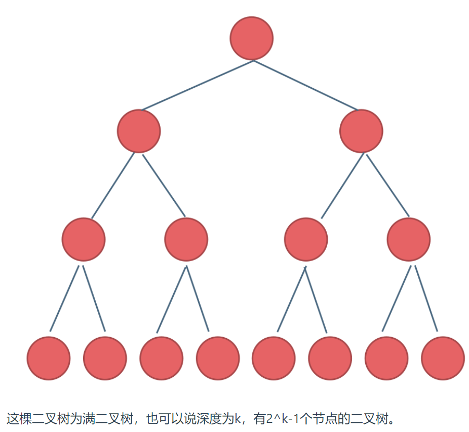
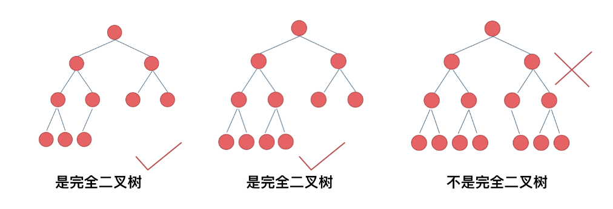

# 滑动窗口

> 关键词：**最大/最小连续，子数组，子字符串**
>
> 解法关键：左右边界双指针

## 剑指 Offer II 016. 不含重复字符的最长子字符串

* 设定左右窗口边界，利用unordered_set作为哈希集存储字母是否在window中，每个左边界都尽力移动右边界去寻找最大字符串，然后删除左边界，左指针右移一格继续查询。

## 209. 长度最小的子数组

* 同上，但是这次维护的是一个双端队列，为每个左边界寻找满足条件的右边界，唯一区别是从子数组中pop元素的时候要记得修改子数组之和sum的数值。

## 2024. 考试的最大困扰度

* 仍是维护左右边界，维护量变为数量少的那个字符的数量不能超过k个，为了简单，直接限定为T或者F，然后取两个函数返回的最大值。

## 424. 替换后的最长重复字符

* 维护一个最多重复字符，这样用长度减去最多重复字符就是需要修改的字符数
* 右指针不断右移，左指针只在子字符串不满足条件的时候左移，保证了right-left是最长的子字符串长度

## 1695. 删除子数组的最大得分

* 维护一个子数组之和变量和哈希表，计算是否出现重复子元素，否则不断右移右指针，有重复元素就左移左指针直至子数组合法

## 2134. 最少交换次数来组合所有的 1 II

* 换个思路，计算区间中所有的0的个数，以数组所有的1的个数作为长度。左右指针同时右移，计算不同位置下所需要交换的0个数，取最小值

## 1208. 尽可能使字符串相等

* 套模板，左指针遍历，对每一个左指针寻找最大右边界，然后超出maxCost再左移左指针
* 这里需要注意边界问题！有可能right == n但是cost在maxCost范围内，这个时候的长度应该是right - left，其他情况才是right处于右边界右边一个，需要用right - left - 1来代表长度

## [剑指 Offer 48. 最长不含重复字符的子字符串](https://leetcode.cn/problems/zui-chang-bu-han-zhong-fu-zi-fu-de-zi-zi-fu-chuan-lcof/submissions/416946058/)

* 经典滑动窗口，但是太久没写，记得**右边界是在左边界循环外面就定义的，每个左边界更新的时候不会重新定义右边界！**

## [438. 找到字符串中所有字母异位词](https://leetcode.cn/problems/find-all-anagrams-in-a-string/description/?favorite=2cktkvj)

* 先滑动到第一个和所求字母等长的位置，观察是否满足条件
* 移动窗口，记录满足条件的个数。当条件满足，插入最左侧索引入答案数组。

> 更简便的方法：
>
> * 我的方法是根据当前字符是否在所需字符串中且数量小于所需数量
> * 答案直接根据满足数量才对valid加一，最后判断满足的valid数和目标字符串的map的size是否相同，记录的时候window内只记录在目标字符串内的字符，其他字符也都不存储。

# 二分查找

关键词：**有序数组，无重复元素**，循环不变量原则，明确区间边界定义

两种写法:

* [left, right): **左闭右开**区间，循环判定条件为`left < right`，如果`nums[middle] > target`则把右边界改为`middle`，因为右边界是开的，不会再扫描到middle，左边界`nums[middle] < target`则需要`middle + 1`来保证middle不会再被扫描到。

  ```cpp
  while (left < right) { // 因为left == right的时候，在[left, right)是无效的空间，所以使用 <
              int middle = left + ((right - left) >> 1);
              if (nums[middle] > target) {
                  right = middle; // target 在左区间，在[left, middle)中
              } else if (nums[middle] < target) {
                  left = middle + 1; // target 在右区间，在[middle + 1, right)中
              } else { // nums[middle] == target
                  return middle; // 数组中找到目标值，直接返回下标
              }
          }
  ```

* [left, right]：**左闭右边闭**区间，循环条件为`left <= right`，因为此时`left == right`有意义。此时因为是左右闭合，所以扫描过middle处元素后，不满足条件无论是左边界还是右边界都不能是middle才能保证middle处的元素不被扫描到。

  ```cpp
   while (left <= right) { // 当left==right，区间[left, right]依然有效，所以用 <=
              int middle = left + ((right - left) / 2);// 防止溢出 等同于(left + right)/2
              if (nums[middle] > target) {
                  right = middle - 1; // target 在左区间，所以[left, middle - 1]
              } else if (nums[middle] < target) {
                  left = middle + 1; // target 在右区间，所以[middle + 1, right]
              } else { // nums[middle] == target
                  return middle; // 数组中找到目标值，直接返回下标
              }
          }
  ```

## [34. 在排序数组中查找元素的第一个和最后一个位置](https://leetcode.cn/problems/find-first-and-last-position-of-element-in-sorted-array/)

* 确定好如何寻找左右边界，利用一个bool变量将左右边界的二分查找集成在一个函数实现

* 注意答案未被赋值的特殊情况，以此确定是否正确找出边界

* 利用以下情况更新左边界：

  ```cpp
  if (nums[middle] >= target) { // 寻找左边界，nums[middle] == target的时候更新right
                  right = middle - 1;
                  leftBorder = right;
              } 
  ```

  更新右边界反之：

  ```cpp
  if (nums[middle] > target) {
                  right = middle - 1;
              } else { // 寻找右边界，nums[middle] == target的时候更新left
                  left = middle + 1;
                  rightBorder = left;
              }
  ```

   **此处的左右边界均为不包含target的下标！！！**

## [33. 搜索旋转排序数组](https://leetcode.cn/problems/search-in-rotated-sorted-array/submissions/422920449/?favorite=2cktkvj)

* 二分查找，判断两种情况：
  1. 当当前值大于target且目标值大于最左侧数值的时候，才选择左半查找，否则选择右半查找
  2. 当前值小于target且target小于最右侧数值的时候，才选择右半查找，否则选择左半查找

## [剑指 Offer 53 - II. 0～n-1中缺失的数字](https://leetcode.cn/problems/que-shi-de-shu-zi-lcof/description/)

* 法一：直接遍历找不同
* 法二：二分查找找不同，最终找到的index就是缺失数字。

## [剑指 Offer 44. 数字序列中某一位的数字](https://leetcode.cn/problems/shu-zi-xu-lie-zhong-mou-yi-wei-de-shu-zi-lcof/?favorite=xb9nqhhg)

* 找数学规律的题目，先看base是10、100、1000，再找这个数是多少，然后再找是这个数的第几位。

# 双指针

## [27. 移除元素](https://leetcode.cn/problems/remove-element/description/)

* 利用快慢指针处理，遍历过去把不是要移除元素的快指针所在的元素赋值给慢指针，然后慢指针自增。

## [19. 删除链表的倒数第 N 个结点](https://leetcode.cn/problems/remove-nth-node-from-end-of-list/)

* 快指针比慢指针多走n+1步，然后共同移动至快指针到达null。此时慢指针在倒数第N个节点前一个节点。

## [206. 反转链表](https://leetcode.cn/problems/reverse-linked-list/)

* 利用快慢指针一前一后，不断调换next的方向，迭代整个链表后实现反转

## [142. 环形链表 II](https://leetcode.cn/problems/linked-list-cycle-ii/)

* 利用快慢指针，快指针一次走两步。相遇则说明有环。然后利用数学原理推导入环位置。
* 一个从头节点出发，一个从相遇节点出发，他们二者同时移动，相遇节点即为环入口节点位置。

## [15. 三数之和](https://leetcode.cn/problems/3sum/description/)

* 利用双指针+排序解题。首先排序，然后固定一个`i`进行遍历，然后对每个遍历的`i`进行`left`和`right`的判断，和小了就右移left，大了左移right。对`i`去重体现在遍历时候若是和前一个数相同跳过该轮，`left`和`right`的去重在判断到为0的时候，在两个指针往里收缩的时候，判断收缩后的数字是否仍是相同的，是的话多收缩一格。

## [18. 四数之和](https://leetcode.cn/problems/4sum/description/)

* 三数之和升级版，多套一层循环
* target不为0，只能根据target和遍历到的元素都大于0的情况下进行剪枝

## [剑指 Offer 05. 替换空格](https://leetcode.cn/problems/ti-huan-kong-ge-lcof/)

* **很多数组填充类的问题，都可以先预先给数组扩容带填充后的大小，然后在从后向前进行操作。**

  > 从前到后的时间复杂度是$O(n^2)$

## [151. 反转字符串中的单词](https://leetcode.cn/problems/reverse-words-in-a-string/)

* 先去除整个字符串中的多余空格：使用双指针法，`fastIndex`只选取非空格位置，若不是第一个单词，要自动在slow处增添空格
* 然后反转整个字符串
* 以空格和字符串的结尾为边界，对每个单词进行反转

## [11. 盛最多水的容器](https://leetcode.cn/problems/container-with-most-water/submissions/422613919/?favorite=2cktkvj)

* 类似接雨水，双指针指向两边，每次移动高度较低的那个边。

## [287. 寻找重复数 ](https://leetcode.cn/problems/find-the-duplicate-number/description/?favorite=2cktkvj)

* 法一：桶排序
* 法二：二分查找
* 法三：**Floyd判圈算法**

## [31. 下一个排列](https://leetcode.cn/problems/next-permutation/submissions/422672197/?favorite=2cktkvj)

* 双指针，一个从尾部开始找到第一个非降序（从左往右看）排列的元素，设为`left`
* 另一个从尾部开始，找到第一个大于前一个指针指向的值的位置（因为都是降序的，所以找到的是恰好大于的最小值）`right`，交换两个元素。
* 把`left`后面的元素都反转成为升序的。

# 字符串

## [剑指 Offer 58 - II. 左旋转字符串](https://leetcode.cn/problems/zuo-xuan-zhuan-zi-fu-chuan-lcof/)

* 先反转整个字符串，然后分别反转两部分字符串

## KMP匹配算法

* `next`前缀表数组中存储的是最长的相同先后缀长度，用于表示可以重复利用的已匹配部分的长度。

  > 我的理解：
  >
  > `aabaaf`的前缀表是[0 1 0 1 2 0]
  >
  > 如果文本串是`aabaabaaf`，则文本匹配到第二个b的时候模板串是f，此时失配，如果是普通算法就要从头开始进行模板串匹配，但是**前缀表记录了后缀和前缀相同部分的最大长度，所以可以重复利用这个长度，让模板串从这个长度之后的第一个开始继续匹配**，此处即重复利用了`aa`从模板串的`b`继续进行匹配。
  >
  > 核心思想：**把失配位置前面的匹配字符串的后缀 当作后续匹配的前缀来用**

### [28. 找出字符串中第一个匹配项的下标](https://leetcode.cn/problems/find-the-index-of-the-first-occurrence-in-a-string/description/)

# 哈希表

关键词：重复出现（一般为隐含条件，重复出现说明无限循环之类的），不重复集合

## [剑指 Offer 35. 复杂链表的复制](https://leetcode.cn/problems/fu-za-lian-biao-de-fu-zhi-lcof/submissions/428505507/?favorite=xb9nqhhg)

* 因为存在乱序指针，所以无法直接一次遍历复制所有链表完成构建
* 利用哈希表作为原链表到新链表节点的映射，遍历一次完成新链表节点的构建
* 再遍历一次完成random和next指针指向的对象的链接。

# 栈和队列

## 单调队列

* 队列里面有序，但是队头pop出来的元素不一定真的是队头元素，因为真的队头可能已经排没了。

### [239. 滑动窗口最大值](https://leetcode.cn/problems/sliding-window-maximum/)

* 创建单调队列，限定pop和push

  `pop(value)`：当且仅当单调队列头部，即当前窗口最大值正好是被pop的那个value的时候，执行`pop_front()`

  `push(value)`：**单调队列的重点：当插入的数值大于队列尾部的数，就把单调队列尾部的数pop出来，直至到达队列头或者队列前面有比value大的数字**

* 本质：**push的时候仅考虑有机会称为最大值的数字**

### [剑指 Offer 59 - II. 队列的最大值](https://leetcode.cn/problems/dui-lie-de-zui-da-zhi-lcof/description/?favorite=xb9nqhhg)

* 构建一个单调队列，递减顺序存储当前元素内的最大值。

## 优先级队列

* 队列变成有序队列

### [347. 前 K 个高频元素](https://leetcode.cn/problems/top-k-frequent-elements/)

* 利用`map`对每个元素的频率进行存储
* 用`priority_queue`保存最高`k`频率的 pair，比较函数自定义

## 单调栈

* 维护栈顶到栈底递增的就是寻找数字右侧第一个比自己大的元素（因为大的都会导致需要pop元素才能入栈，对每个pop出来的元素求解距离等参数）；同理，维护栈顶到栈底递减的就是寻找自己右边第一个比自己小的元素。

### [739. 每日温度 ](https://leetcode.cn/problems/daily-temperatures/)

* 维护一个栈顶到栈底的递增单调栈，栈内元素是索引，只有最新温度高于栈顶才pop元素出来进行答案元组赋值。其他时候都pop新的索引进去。

### [496. 下一个更大元素 I ](https://leetcode.cn/problems/next-greater-element-i/)

* 和上题同理，先构造一个单调栈来记录每个数字对应的下一个最大元素，只不过这次记录的是元素本身值而非下标，然后把`nums1`中的元素直接根据`map`寻找其在`nums2`的下一个最大元素值

### [503. 下一个更大元素 II](https://leetcode.cn/problems/next-greater-element-ii/)

* **关键小妙招：题目中相对于每日温度唯一的区别是改成循环数组了，我们可以通过遍历两倍的长度来实现**

### [42. 接雨水 ](https://leetcode.cn/problems/trapping-rain-water/)

**面试经典常青藤！**

1. 双指针法

   **按列算雨水**，寻找当前位置左右高于本节点柱子高度的第一根柱子。两个柱子的较小值减去本柱子高度，即为该列的雨水数量。

   直接每次遍历寻找复杂度为$O(n^2)$，所以需要用空间换时间，上数组保存每个位置左右第一个高于本柱子高度的柱子，分别从最左边和最右边迭代赋值。

2. 单调栈法

   **按行算雨水**，维护一个栈顶到栈底递增的单调栈，当出现大于栈顶元素的柱子时，说明出现了凹槽。此时栈顶是凹槽底部，栈顶下一个元素是左侧柱子，待插入元素是右侧柱子，计算高度`h = min(left, right) - height[i]`然后计算宽度为左右柱子的索引差**减一**

### [84. 柱状图中最大的矩形](https://leetcode.cn/problems/largest-rectangle-in-histogram/)

* 改找左右侧第一个小于本柱子高度的柱子的**下标**
* 用双指针的话可以利用之前构造好的数组进行跳步遍历
* 用单调栈则维护一个栈顶到栈底递减的栈，寻找到左右第一个小于本柱子的位置，**矩形是以本柱子为最小高度的矩形**

## [155. 最小栈](https://leetcode.cn/problems/min-stack/description/)

* 额外维护一个最小值的栈，存储当前位置到栈底的最小值。
* push和pop都要额外同步一下最小值栈

# 二叉树

* 满二叉树：树中只有**度数为0和度数为2**的结点，且**度为0的结点在同一层上**

  

* 完全二叉树：**除了最后一层可能没填满**，其余每层节点数都达到最大值，并且**最下面一层结点都集中在该层最左边的若干位置**



## 二叉搜索树

* 有数值的二叉树，**二叉搜索树是一个有序树**
* 平衡二叉搜索树：左右子树高度差不超过1

> 红黑树实现容器  VS  哈希表实现容器
>
> set、map、multimap、multiset的底层实现是**平衡二叉树**，所以查找的时间复杂度为$O(logn)$，由于红黑树的平衡性，不会出现最坏情况
>
> unordered set、unordered map的底层实现是**哈希表**，查找时间复杂度是$O(1)$，最坏情况发生很多哈希冲突则时间复杂度变为$O(n)$，且在元素比较少的时候，用哈希表的容器可能比较浪费空间

## 二叉树遍历

迭代法

* 前序遍历：访问结点和处理结点顺序一致

  ```C++
  vector<int> preorderTraversal(TreeNode* root) {
          vector<int> res;
          stack<TreeNode *> st;
          if(root == nullptr)
              return res;
          st.push(root);
          while(!st.empty()){
              TreeNode *t = st.top();
              st.pop();
              res.push_back(t->val);
              if(t->right)
                  st.push(t->right);
              if(t->left)
                  st.push(t->left);
          }
          return res;
      }
  ```

* 中序遍历：访问结点和处理结点不一致

* 后序遍历：把前序遍历的顺序换成中右左，然后**反转结果数组**

  ```c++
  vector<int> inorderTraversal(TreeNode* root) {
          vector<int> res;
          stack<TreeNode *> st;
          TreeNode *cur = root;
          while(!st.empty() || cur != nullptr){
              if(cur != nullptr){
                  st.push(cur);
                  cur = cur -> left;
              }else{
                  cur = st.top();
                  st.pop();
                  res.push_back(cur->val);
                  cur = cur->right;
              }
          }
          return res;
      }
  ```

  ```c++
  vector<int> postorderTraversal(TreeNode* root) {
          vector<int> res;
          stack<TreeNode *> st;
          TreeNode *cur = root;
          if(root == nullptr)
              return res;
          st.push(root);
          while(!st.empty()){
              cur = st.top();
              st.pop();
              res.push_back(cur->val);
              if(cur->left)
                  st.push(cur->left);
              if(cur->right)
                  st.push(cur->right);
          }
          reverse(res.begin(), res.end());
          return res;
      }
  ```

* 层序遍历：利用队列的先进先出来遍历，**每层的size要提前测量固定**

递归法

* 层序遍历：

  ```c++
  void order(TreeNode* cur, vector<vector<int>>& result, int depth)
      {
          if (cur == nullptr) return;
          if (result.size() == depth) result.push_back(vector<int>());
          result[depth].push_back(cur->val);
          order(cur->left, result, depth + 1);
          order(cur->right, result, depth + 1);
      }
      vector<vector<int>> levelOrder(TreeNode* root) {
          vector<vector<int>> result;
          int depth = 0;
          order(root, result, depth);
          return result;
      }
  ```


## [96. 不同的二叉搜索树 ](https://leetcode.cn/problems/unique-binary-search-trees/?favorite=2cktkvj)

* 转换成n个结点的二叉树数目`G(n)`和以`i`为根，序列长度为n的不同二叉树数目的函数`F(i, n)`，数学推导一下得到递归表达式

## [98. 验证二叉搜索树](https://leetcode.cn/problems/validate-binary-search-tree/?favorite=2cktkvj)

* 法一：中序遍历解君愁
* 法二：构造helper function去递归检查上下界是否超出。

## [105. 从前序与中序遍历序列构造二叉树](https://leetcode.cn/problems/construct-binary-tree-from-preorder-and-inorder-traversal/description/?favorite=2cktkvj)

* 前序第一个提出来作为根节点，作为中序的分割index
* 利用分割index获取中序左右子数组，利用左子树数组长度从前序分割出前序的左右子数组
* 迭代根节点左右子树

## [114. 二叉树展开为链表 ](https://leetcode.cn/problems/flatten-binary-tree-to-linked-list/description/?favorite=2cktkvj)

* 原地算法，不消耗额外空间`O(1)`：**左子树最右侧结点是当前右子树的前缀结点**，不断遍历左子树存在的最右结点插队到右子树前面

* 普通算法：用一个vector保存迭代或者递归前序遍历的结果，然后构造个新的树

## [236. 二叉树的最近公共祖先](https://leetcode.cn/problems/lowest-common-ancestor-of-a-binary-tree/?favorite=2cktkvj)

* **自底向上找，后序遍历回溯法**，如果有所求结点在子树中则返回，否则返回空值。若是左右子树返回都不是空的，说明根节点就是最近祖先
* 需要注意一个结点正好是祖先的情况，已经包含在回溯的时候了。

## [235. 二叉搜索树的最近公共祖先](https://leetcode.cn/problems/lowest-common-ancestor-of-a-binary-search-tree/)

* 通解：如上题
* 特解：利用二叉搜索树的特性，**递归到的第一个在p、q之间的结点就是二者的最近公共祖先**

## [337. 打家劫舍 III ](https://leetcode.cn/problems/house-robber-iii/submissions/414440689/?favorite=2cktkvj)

`dfs`、二叉树

* 用map去记录偷和不偷的价值
* 使用`dfs`和后序遍历去递归初始化两个哈希表
* 偷一定带有左右子树不偷，但是**不偷的返回值是左右子树的最大值之和，左右子树不一定要偷**

## [437. 路径总和 III](https://leetcode.cn/problems/path-sum-iii/submissions/414529078/?favorite=2cktkvj)

* 开个**`dfs`**去遍历从某个点开始的能满足目标长度的路径数目
* 主函数也用递归，对所有点都来次`dfs`，最终得到所有点开始的所有能满足路径长度的路径数目

更优解：**前缀和**，时间复杂度`O(n)`

1. 构造前缀和哈希表，存根节点到当前节点的路径上除了当前节点外的所有节点的前缀和
2. 在已经保存的前序结点中招是否存在前缀和等于当前节点到根节点前缀和减去目标路径长度的，有说明在路径中有一点到当前节点的路径长度是目标长度

## [538. 把二叉搜索树转换为累加树](https://leetcode.cn/problems/convert-bst-to-greater-tree/?favorite=2cktkvj)

* 前序遍历一遍，把树和求出来
* 迭代法中序遍历，赋值为和，然后把和减去当前结点的旧值，作为下一次赋值使用。

## [剑指 Offer 32 - III. 从上到下打印二叉树 III](https://leetcode.cn/problems/cong-shang-dao-xia-da-yin-er-cha-shu-iii-lcof/?favorite=xb9nqhhg)

* 相比于普通层序遍历，需要换成之字形遍历
* 增加一个判断层数奇偶性的变量，利用deque双向队列实现不同的push和pop。

## [剑指 Offer 33. 二叉搜索树的后序遍历序列](https://leetcode.cn/problems/er-cha-sou-suo-shu-de-hou-xu-bian-li-xu-lie-lcof/submissions/427020782/?favorite=xb9nqhhg)

* 根据左子树都小于根节点，右子树都大于根节点，根节点在后序遍历序列的最后一个。构建一个递归函数，判断当前是否符合这个定律，然后递归判断左右子树是否满足。

# 动态规划

**穷举（找到状态转移方程）----->聪明地穷举（剪枝，备忘录，dp table），空间换时间降低复杂度**

> `dp`写法：
>
> * 想清楚`dp table`的物理意义
>
> * 先确定base case
> * 然后根据状态转移方程循环迭代

## [5. 最长回文子串](https://leetcode.cn/problems/longest-palindromic-substring/submissions/414744665/?favorite=2cktkvj)

* 法一：普通`dp`，存`dp[i][j]`表示从`i`到`j`是否是回文的。首先长度为1的都是，然后从长度为2开始递推，内循环是左边界枚举。在时空复杂度均为o($n^2$)情况下完成
* 法二：扩散回文中心：即长度为1和2的情况开始不断左右扩散，寻找最大的边界。时间复杂度不变，空间复杂度变为`O(1)`

## [647. 回文子串](https://leetcode.cn/problems/palindromic-substrings/submissions/414749269/?favorite=2cktkvj)

* 和上一题本质一样，都会遍历所有回文子串，这里用法二直接加上一个计数秒了

## [70. 爬楼梯 ](https://leetcode.cn/problems/climbing-stairs/submissions/414753846/?favorite=2cktkvj)

* 别用`dfs`，用滚动数组的方法不断迭代就行。`p, q, r`分别代表`f(x - 2), f(x - 1), f(x)`

##  [64. 最小路径和](https://leetcode.cn/problems/minimum-path-sum/submissions/414769977/?favorite=2cktkvj)

* **别用`DFS`，会超时，用`dp`数组迭代就行，空间换时间**

## [53. 最大子数组和](https://leetcode.cn/problems/maximum-subarray/?favorite=2cktkvj)

* 别用dp数组，会超时

* 法一：用`f(i)`表示以第`i`个数结尾的连续子数组最大和，不断迭代，判断新元素单开比较大还是和旧子数组合并比较大。然后取`f`中最大的那个。迭代可以用**滚动数组**降低空间复杂度。

* 法二：**分治法**，维护区间`[l, r]`内的四个信息量：

  * `lSum`:  以`l`为左端点的最大子段和
  * `rSum`: 以`r`为右端点的最大子段和
  * `mSum`: 区间内最大字段和
  * `iSum`：区间和

  然后就是从l，r最大开始分治，维护四种信息量，回升后得到整个区间内的最大子段和

## [152. 乘积最大子数组](https://leetcode.cn/problems/maximum-product-subarray/solutions/?favorite=2cktkvj)

* 不能按上面那样判断`f[i]`了，因为可以负负得正。
* 需要增添一个最小乘积，用于负负得正
* 迭代维护最大和最小乘积，最终返回最大乘积中的最大值。
* 因为第`i`个状态之和第`i-1`个状态有关，所以可以利用滚动数组的方法，减少空间复杂度。

## [55. 跳跃游戏](https://leetcode.cn/problems/jump-game/description/?favorite=2cktkvj)

* **不要想着纯纯dfs，只会超时爆炸**
* 去求能跳跃到的最远距离，如果被0卡住了就返回false

## [62. 不同路径](https://leetcode.cn/problems/unique-paths/?favorite=2cktkvj)

* **使用纯纯dfs会爆炸**
* 排列组合，高中数学`C(m, n)`，**数据太大仍然爆炸**
* 使用dp数组，空间换时间，继承前面的答案才是真

## [322. 零钱兑换](https://leetcode.cn/problems/coin-change/submissions/417744879/?favorite=2cktkvj)

* 每个dp循环里面对每个零钱种类都循环一次难以避免，需要做的是尽量减少计算。利用**dp数组记录前面的值**，不断迭代。

## [221. 最大正方形 ](https://leetcode.cn/problems/maximal-square/submissions/417762545/?favorite=2cktkvj)

* 照样`dp[i][j]`表示以`(i, j)`为右下角的最大正方形，如果该点是1，则这个点的最大正方形边长取决于**左侧，上侧，左上方**三个点能够构造的正方形的**最小边长**+1

## [22. 括号生成](https://leetcode.cn/problems/generate-parentheses/?favorite=2cktkvj)

* 直接dfs，记录左右括号数目，根据左右括号数目决定后续的dfs分支。

## [416. 分割等和子集 ](https://leetcode.cn/problems/partition-equal-subset-sum/submissions/418077031/?favorite=2cktkvj)

* **不到万不得已，别当🤡再用纯dfs了！**
* 整个集合求出来，和为基数直接返回失败，偶数就除2
* 转换成背包问题`dp[i][j]`，前`i`件物品，背包容量是`j`，能否满足正好装满背包，然后去迭代判断
* 所有的`dp[i][0]=true`，然后判断装不装包。

## [279. 完全平方数 ](https://leetcode.cn/problems/perfect-squares/submissions/418095118/?favorite=2cktkvj)

* `dp[i]`：和为`i`的最小平方和数量
* 复杂度是$O(N*sqrt(N))$

## :star:股票类问题通解

```c++
dp[i][k][0 or 1]: 第i天，交易上限次数为k的情况下，0为不持有股票，1为持有股票

base case：
dp[-1][...][0] = dp[...][0][0] = 0
dp[-1][...][1] = dp[...][0][1] = -infinity
//具体到了题目里面就是，第一天不持有股票就是0，第一天持有股票就是-prices[i]
    
状态转移方程：
//当天不持有股票的利润最大值是前一天也不持有和前一天持有当天卖掉的最大值
dp[i][k][0] = max(dp[i-1][k][0], dp[i-1][k][1] + prices[i])
//当天持有的利润最大值是前一天持有和前一天不持有，今天刚买的最大值（买股票扣除交易次数上限，不能换成卖扣除，会超出交易次数）
dp[i][k][1] = max(dp[i-1][k][1], dp[i-1][k-1][0] - prices[i])

//根据实际情况可以直接把相邻元素降低复杂度，变成四个数。空间复杂度变O（1）
```

### [309. 最佳买卖股票时机含冷冻期 ](https://leetcode.cn/problems/best-time-to-buy-and-sell-stock-with-cooldown/submissions/418121567/?favorite=2cktkvj)

* 没有限制K，所以dp数组可以表达成`dp[i][j]`：第i天，是否持有股票的最大利润
* 因为限制冷冻期，导致持有股票的利润最大值需要修改一下，变成**前两天不持有，今天买入**和前一天持有的最大值

## [494. 目标和](https://leetcode.cn/problems/target-sum/submissions/418125861/?favorite=2cktkvj)

* 传统dp，但是要剪枝。
* 利用当前遍历到的index和remain链接作为key。记录备忘录，下一次遇到该结点直接跳过后续计算。

## [139. 单词拆分 ](https://leetcode.cn/problems/word-break/submissions/420606472/?favorite=2cktkvj)

* 状态方程：遍历当前字典中所有单词看是否有符合前缀的，有则递归去掉前缀后的字符串。
* 利用备忘录记录每个位置是否被计算过，结果如何。减少计算次数。

## [198. 打家劫舍](https://leetcode.cn/problems/house-robber/submissions/420612517/?favorite=2cktkvj)

* 备忘录+dp

## [56. 合并区间](https://leetcode.cn/problems/merge-intervals/?favorite=2cktkvj)

* 先按照区间左侧排序一下，用一个新的数组去存区间。
* 然后遍历后面的所有区间，和答案数组中的最后一个区间对比，如果能合并的合并。不能合并的说明本区间融合满了。将该区间插入答案数组，作为新的区间待融合区间。

## [剑指 Offer 49. 丑数 ](https://leetcode.cn/problems/chou-shu-lcof/submissions/423289795/?favorite=xb9nqhhg)

* 整三个有序链表，然后合并有序链表。因为每个链表只要最新数值，可以用单变量迭代取代链表，节约空间。

## [343. 整数拆分](https://leetcode.cn/problems/integer-break/submissions/423297152/)

* 用`dp[i]`表示数字`i`能拆分的最大乘积，利用备忘录剪枝。
* 状态转移方程进行dp计算

## [剑指 Offer 60. n个骰子的点数](https://leetcode.cn/problems/nge-tou-zi-de-dian-shu-lcof/submissions/425972130/?favorite=xb9nqhhg)

* 找到`dp`数组描述方式：`dp[n][point]`表示n个骰子能得到`point`点数的概率
* 找到状态转移方程：`dp[n][point]`的概率是`n-1`个骰子投出`point - 1/2/3/4/5/6`的概率乘以六分之一的和
* 特判`point`未必大于6，所以遇到减去后的`point`小于等于0的情况跳过

## [剑指 Offer 13. 机器人的运动范围](https://leetcode.cn/problems/ji-qi-ren-de-yun-dong-fan-wei-lcof/submissions/425986583/?favorite=xb9nqhhg)

* 直接递归判断，用备忘录记录访问过的位置，全局变量完成计数即可。

# 排序

## 堆排序

* **用数组表示堆，构造大顶堆，不断移除堆顶，然后重构**
* 构造大顶堆需要**从最后面一个可能包含树的结点开始维护堆**，一直维护到根节点
* 维护堆的函数首先判断左右儿子里面的最大值，如果**发生置换还需要递归**看置换后的节点是否会往下传递。

```c++
void maxHeapify(vector<int> &nums, int i, int len){
        while((i << 1) + 1 <= len){
            int lson = (i << 1) + 1;
            int rson = (i << 1) + 2;
            int large;
            if(lson <= len && nums[lson] > nums[i])
                large = lson;
            else
                large = i;
            if(rson <= len && nums[rson] > nums[large])
                large = rson;
            if(large != i)
            {
                swap(nums[large], nums[i]);
                i = large;//大根堆要递归查子树的
            }else
                break;

        }
    }
        void buildMaxHeap(vector<int> &nums, int len){
            for(int i = len / 2;i >= 0;i--){
                maxHeapify(nums, i, len);
            }
        }
        void heapSort(vector<int> &nums){
            int len = nums.size()  -1;
            buildMaxHeap(nums, len);
            for(int i = len; i >= 1;i--){
                swap(nums[i], nums[0]);//把大顶堆的堆顶，也就是最大元素放到后面去
                len -= 1;
                maxHeapify(nums, 0, len);
            }
        }
```

## 快速排序

* **快速排序是先将一个元素排好序，然后再将剩下的元素排好序**。

* 核心是partition函数，时间复杂度$O(NlogN)$

* 使用**双指针+随机选择基准元素**来实现快速排序，从左开始找大于基准元素的，从右开始找小于基准元素的，找到后交换

  如果基准元素放在最左边，则最后交换找到的最后一个小于基准元素的位置，放最右边反之。

  ```c++
  // 快速排序法
      int random_partition(vector<int> &nums, int left, int right){
          int pos = rand() % (right - left + 1) + left;
          swap(nums[pos], nums[right]);
          int i = left; 
          int j = right - 1;
          while(i <= j){
              while(i <= right - 1 && nums[i] < nums[right])
                  i++;
              while(j >= left && nums[j] > nums[right])
                  j--;
              if(i <= j)
                  swap(nums[i++], nums[j--]);
          }
          swap(nums[i], nums[right]);
          return i;
      }
      void random_quickSort(vector<int> &nums, int left, int right){
          if(left < right)
          {
              int pos = random_partition(nums, left, right);
              random_quickSort(nums, left, pos - 1);
              random_quickSort(nums, pos + 1, right);
          }
      }
  ```

## 归并排序

* **先把左半边数组排好序，再把右半边数组排好序，然后把两半数组合并**

* 核心是merge函数，时间复杂度$O(NlogN)$
* 理解为二叉树的后序遍历，每层都是N个元素进行merge操作，能够进行的merge次数是树的高度，也就是$logN$，所以总复杂度是$O(NlogN)$
* merge操作需要一个辅助数组来进行排序。

## [215. 数组中的第K个最大元素](https://leetcode.cn/problems/kth-largest-element-in-an-array/description/?favorite=2cktkvj)

* 快速选择：利用选择排序找到倒数第K个元素后停止排序。用随机化来降低时间复杂度期望值。
* 堆排序：构造大顶堆，然后不断移出堆顶元素，移到倒数第K个元素在堆顶为止。

## [300. 最长递增子序列](https://leetcode.cn/problems/longest-increasing-subsequence/description/?favorite=2cktkvj)

* 定义`dp[i]`表示以第i个数为结尾的最长递增子序列长度，从第一个开始迭代，对于每个`dp[i]`的求解则依靠遍历前面`i`个`dp`，寻找前面结尾比当前值小的序列，然后更新当前位置的`dp`，`dp[i] = max(dp[j] + 1, dp[i])`，最终返回`dp`中最大值即可

## [88. 合并两个有序数组](https://leetcode.cn/problems/merge-sorted-array/)

* 别从头部进行，会导致数组元素被覆盖，从尾部开始！

## 前缀和

### [238. 除自身以外数组的乘积 ](https://leetcode.cn/problems/product-of-array-except-self/submissions/418491109/?favorite=2cktkvj)

* 不允许使用除法
* `O(n)`空间复杂度解法：用两个数组分别存储前缀和与后缀和，然后遍历答案数据添加乘积
* `O(1)`空间复杂度解法：前缀和直接存储在答案数组中，然后用一个变量存储后缀和，迭代求解答案。

### [560. 和为 K 的子数组](https://leetcode.cn/problems/subarray-sum-equals-k/submissions/418509868/?favorite=2cktkvj)

* 用一个变量存储前缀和，一个哈希表存储前缀和个数
* 遍历数组，查看当前哈希表是否有前缀和正好和当前数字所在前缀和差k的。
* **先计数哈希表中差k的前缀和，再更新当前的前缀和进入哈希表，不然k=0的时候会输出错误，把自身前缀和加入计数**


## [49. 字母异位词分组](https://leetcode.cn/problems/group-anagrams/submissions/420950176/?favorite=2cktkvj)

* 思路：使用某种编码方式，使得所有字母异位词有相同的编码。从而将其分组。
* 排序是一种编码方式，但是有点耗费时间。
* 可以使用哈希表记录每个字母出现的时间，用string组成26个字母出现次数的编码。更加高效。

## [75. 颜色分类](https://leetcode.cn/problems/sort-colors/description/)

* 最简单的解法：用哈希表记录0、1、2个数，重写一遍
* 高效解法：用双指针记录0、1或者0、2的位置，然后一遍遍历解决问题。**0、1的话注意0置换过去覆盖1的情况，0、2的注意2换回来的还是2或者0，不能直接i++跳过**

## [581. 最短无序连续子数组](https://leetcode.cn/problems/shortest-unsorted-continuous-subarray/description/?favorite=2cktkvj)

* 法一：拷贝一个数组，排序找到无序子数组
* 法二：记录前缀最大值和后缀最小值，找到无序子数组边界。

## [148. 排序链表](https://leetcode.cn/problems/sort-list/?favorite=2cktkvj)

* 归并排序，自底向上。自顶向下的空间复杂度是$O(log\ n)$

## [406. 根据身高重建队列](https://leetcode.cn/problems/queue-reconstruction-by-height/description/?favorite=2cktkvj)

* **双维度贪心，先关注一个维度再关注另一个**

* 排序，从高到低排序，身高一样的排第二个元素，前面人少的排前面。
* 一个个直接按照第二个元素中的位置插入答案
* 用vector进行插入需要不断扩容，扩容涉及到拷贝。时间复杂度高。可以用list，底层实现改为链表，插入完了再转换成vector输出，大大提升时间效率。

## [621. 任务调度器](https://leetcode.cn/problems/task-scheduler/submissions/421410769/?favorite=2cktkvj)

* 法一：纯粹模拟，用二元组记录剩余的任务数目和下一次可执行任务的事件，用所有任务的下一次可执行事件加速时间片遍历。跳过待命时间片
* 法二：构造 n + 1 列方格，安置最大执行数量的任务，后续任务都插入方格。超出n + 1 列则无需方格，可以避免所有的CPU待机时间，任务数目即为答案。

## [面试题45. 把数组排成最小的数](https://leetcode.cn/problems/ba-shu-zu-pai-cheng-zui-xiao-de-shu-lcof/submissions/425062148/?favorite=xb9nqhhg)

* 利用字符串的字典序排序，把所有数字转换成字符串，然后根据拼接后的结果来判定大小进行排序，最后把排序号的字符串数组拼接起来。

# 回溯

## [17. 电话号码的字母组合](https://leetcode.cn/problems/letter-combinations-of-a-phone-number/submissions/421623738/?favorite=2cktkvj)

* 存储每个数字对应的字符串，每次遍历到一个数字，把所有的字符一个个插入进去递归。
* 插入新字符，调用递归后，记得**回溯**，去除刚添加的那个字符。

## [79. 单词搜索](https://leetcode.cn/problems/word-search/submissions/421644070/?favorite=2cktkvj)

* 利用数组标记是否访问过，来防止重复访问
* 在递归调用所有相邻位置的函数后，**回溯**，将当前位置置未访问，便于后续其他位置开始的遍历
* 剪枝优化搜索范围：找到了直接范围true，后面都不搜索了。在某个递归中找到了也直接返回true，所有递归都可以停一停了。

## :star:排列-组合-子集问题

* 根据输入元素是否重复，每个元素是否重复可选分为三种类型：

  1. 元素重复，不可重复选

     排列问题，eg：47.全排列 ||

     * 排序一下，相同元素相邻

     * 如果是排列问题，增加剪枝逻辑，**保证相同元素在排列中相对位置保持不变**；\

       ```c++
       // 剪枝逻辑
               if (used[i]) {
                   continue;
               }
               // 剪枝逻辑，固定相同的元素在排列中的相对位置
               if (i > 0 && nums[i] == nums[i - 1] && !used[i - 1]) {
                   continue;
               }
       ```

       如果是组合问题，剪枝逻辑是**跳过值相同的相邻树枝**

       ```c++
       // 剪枝逻辑，跳过值相同的相邻树枝
               if (i > start && nums[i] == nums[i - 1]) {
                   continue;
               }
       ```

     * 例如用`isused`记录前一个相同元素是否使用过。

  2. 元素不重复，可以重复选

     例题：39.组合总和

     * 修改回溯树的选择函数，把每层的`i + 1`改为`i`，保证一个元素可以无限次复用
     * 利用终止条件结束回溯树生长

  3. 元素不重复，不可以重复选

     例题：46.全排列，77.组合，78.子集

     * 遍历回溯树，获取所有节点的值。根据具体情况选择是否加入答案数组。

       ```c++
       // 剪枝逻辑
               if (used[i]) {
                   continue;
               }
       ```

       

## [39. 组合总和](https://leetcode.cn/problems/combination-sum/description/?favorite=2cktkvj)

* 迭代的时候减少使用的参数，减少栈空间损耗。尽可能使用全局变量？
* 为了最终数组的无重复选择，可以记录当前使用的数字index，下一个递归中的start index必须大于等于index，保证了每个数组的唯一性
* 输入数组无重复元素，但是每个元素能无限使用

## [78. 子集](https://leetcode.cn/problems/subsets/submissions/421681110/?favorite=2cktkvj)

* 典型回溯。先加上这个元素递归，然后去掉这个元素递归。用全局变量减少栈空间的使用。
* 递归终止条件，遍历完所有元素。

## [77. 组合](https://leetcode.cn/problems/combinations/description/)

* 类似上题，区别是遍历的时候寻找的是长度一定的子集的组合。

## [46. 全排列](https://leetcode.cn/problems/permutations/description/)

* 和组合的区别是，位置不同也算不同结果。
* 所以需要额外的数组来记录是否使用过该元素。获取回溯树所有叶子节点的数据。

## [47. 全排列 II](https://leetcode.cn/problems/permutations-ii/)

* 比上题增加了一个条件，数组中含有重复元素。需要增加新的剪枝逻辑，**确定相同元素的相对位置**，来保证排列的正确。

## [113. 路径总和 II](https://leetcode.cn/problems/path-sum-ii/submissions/422879112/)

* 典型回溯。

# 矩阵

## [240. 搜索二维矩阵 II](https://leetcode.cn/problems/search-a-2d-matrix-ii/?favorite=2cktkvj)

* 左上两边都递增，只能动态规划穷举。换成右上或者左下，一步增一步减，直接就能找。比如右上只能向下增或者向左减。

## [48. 旋转图像](https://leetcode.cn/problems/rotate-image/?favorite=2cktkvj)

* 将**矩阵按对角线翻转，然后反转每行**即可实现顺时针旋转90度效果。

# 并查集

**路径压缩(用了路径压缩，size数组的平衡优化就没那么必要了)，parent数组模拟森林。**

```c++
class UF {
private:
    // 连通分量个数
    int count;
    // 存储每个节点的父节点
    vector<int> parent;

public:
    // n 为图中节点的个数
    UF(int n) {
        this->count = n;
        parent =  vector<int>(n);
        for (int i = 0; i < n; i++) {
            parent[i] = i;
        }
    }
    
    // 将节点 p 和节点 q 连通
    void union_(int p, int q) {
        int rootP = find(p);
        int rootQ = find(q);
        
        if (rootP == rootQ)
            return;
        
        parent[rootQ] = rootP;
        // 两个连通分量合并成一个连通分量
        count--;
    }

    // 判断节点 p 和节点 q 是否连通
    bool connected(int p, int q) {
        int rootP = find(p);
        int rootQ = find(q);
        return rootP == rootQ;
    }

    int find(int x) {
        if (parent[x] != x) {
            parent[x] = find(parent[x]);
        }
        return parent[x];
    }

    // 返回图中的连通分量个数
    int count_() {
        return count;
    }
};

```

## [990. 等式方程的可满足性](https://leetcode.cn/problems/satisfiability-of-equality-equations/submissions/422404162/)

* 典型并查集，把所有相等的元素连接，然后不等式两侧元素判断是否是同一个集合的。

## [399. 除法求值](https://leetcode.cn/problems/evaluate-division/submissions/422606554/?favorite=2cktkvj)

* 在并查集的基础上，增加一个有向边权重表示两个元素的倍数关系。

# 图论

## [207. 课程表](https://leetcode.cn/problems/course-schedule/?favorite=2cktkvj)

* 找图中有没有回环，利用dfs来寻找。
* 一个bool数组标志走过的路径，一个标志递归的路径，这个需要回溯
* 找到走过路径上的点，说明有环；如果找到的是访问过的，剪枝，说明这里开始的遍历过了。

# 模拟

## [剑指 Offer 31. 栈的压入、弹出序列](https://leetcode.cn/problems/zhan-de-ya-ru-dan-chu-xu-lie-lcof/description/?favorite=xb9nqhhg)

* 美团笔试原题
* 纯碎加一个栈去模拟，栈头不符合弹出序列就不断将压入序列的元素入栈
* 判断是否有某个时刻压入序列全部完成了还是无法满足，则返回错误。

# 深度优先搜索

## [剑指 Offer 26. 树的子结构](https://leetcode.cn/problems/shu-de-zi-jie-gou-lcof/description/?favorite=xb9nqhhg)

* 特别判断空值情况，其他情况递归调用。
* 考虑到仅仅第一个节点相同未必就能一次dfs完成，需要对子树的根节点数值相同的每个A树的节点都进行一次递归判断。

## [剑指 Offer 34. 二叉树中和为某一值的路径 ](https://leetcode.cn/problems/er-cha-shu-zhong-he-wei-mou-yi-zhi-de-lu-jing-lcof/description/?favorite=xb9nqhhg)

* 直接dfs寻找满足条件的路径，加入全局的路径集合中。
* 因为节点值有正负，不能通过target直接剪枝

## [剑指 Offer 36. 二叉搜索树与双向链表](https://leetcode.cn/problems/er-cha-sou-suo-shu-yu-shuang-xiang-lian-biao-lcof/description/?favorite=xb9nqhhg)

* 中序遍历，构造双向链表。

# 数组

## [剑指 Offer 56 - I. 数组中数字出现的次数](https://leetcode.cn/problems/shu-zu-zhong-shu-zi-chu-xian-de-ci-shu-lcof/description/?favorite=xb9nqhhg)

* 若是数组中只有一个数字只出现一次，则所有数字异或即可得到这个数字
* 有两个数字只出现一次，则将所有数字异或，找到某位为1的，以这个位置的0或者1将所有数字分组，进行异或，得到的两个数就是答案。

## [剑指 Offer 56 - II. 数组中数字出现的次数 II](https://leetcode.cn/problems/shu-zu-zhong-shu-zi-chu-xian-de-ci-shu-ii-lcof/submissions/427989828/?favorite=xb9nqhhg)

* 排序，然后看首尾，看中间。

## [剑指 Offer 66. 构建乘积数组](https://leetcode.cn/problems/gou-jian-cheng-ji-shu-zu-lcof/submissions/427993880/?favorite=xb9nqhhg)

* 构建前缀和后缀乘积和，分两次完成每个数组元素的计算。

# 贪心

## [剑指 Offer 14- II. 剪绳子 II ](https://leetcode.cn/problems/jian-sheng-zi-ii-lcof/submissions/428509610/?favorite=xb9nqhhg)

* 因为数据太大，原本剪绳子的动态规划用不了了
* 根据一通数学推导得出剪为3长度的乘积最大，最后小于等于4的时候直接判断。利用贪心思想不断减去三获取最终答案。
